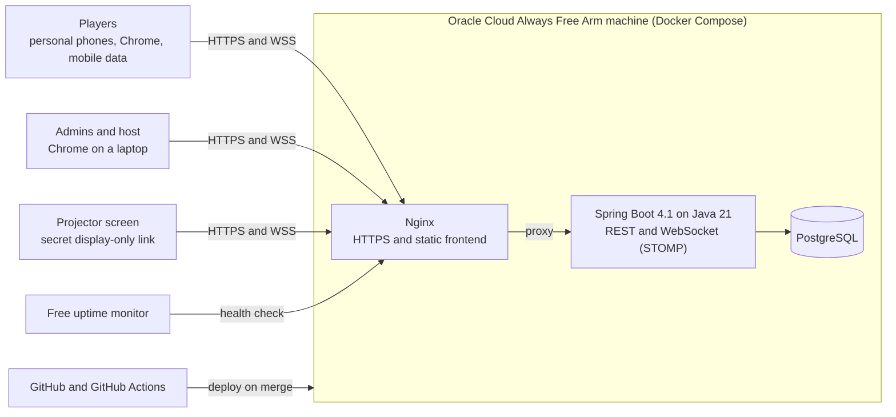
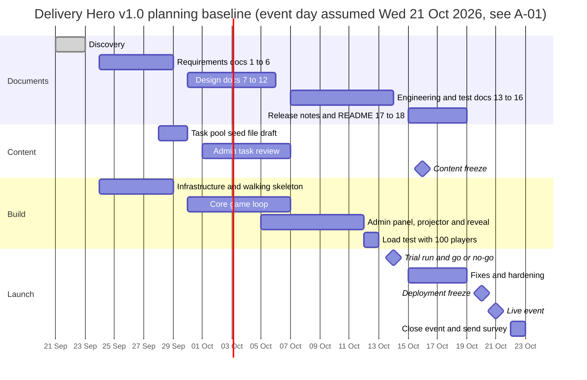

# Delivery Hero — Project Charter

> Document 01 of 18 · Version 1.15 (approved)

## Document control

| Field | Value |
|---|---|
| Project | Delivery Hero |
| Document | 01 — Project Charter |
| Version | 1.15 |
| Status | Approved on 23 September 2026 |
| Owner and approver | [Owner name] — sponsor, host and developer |
| Date | 23 September 2026 |
| Related documents | All other project documents cite this charter and its decision log (Appendix A) |

### Revision history

| Version | Date | Author | Summary of changes |
|---|---|---|---|
| 0.1 | 2026-09-23 | [Owner name] | First draft from discovery |
| 1.0 | 2026-09-23 | [Owner name] | Approved. Editorial fix: the streak definition in section 3 now matches DEC-24 |
| 1.1 | 2026-09-23 | [Owner name] | Added DEC-73 to DEC-93 from the approved PRD; updated the most-missed question definition (DEC-88); marked OI-01 to OI-05 as settled |
| 1.2 | 2026-09-23 | [Owner name] | Added DEC-94 to DEC-119 from the approved SRS; marked OI-06 as settled (DEC-96) |
| 1.3 | 2026-09-23 | [Owner name] | Added DEC-120 to DEC-122 from the approved Acceptance Criteria |
| 1.4 | 2026-09-23 | [Owner name] | Switched the backend to Spring Boot 4.1 (DEC-123): updated C-04, section 7.1, the context diagram and future considerations |
| 1.5 | 2026-09-23 | [Owner name] | Added DEC-124 to DEC-138 from the approved HLD |
| 1.6 | 2026-09-23 | [Owner name] | Added DEC-139 to DEC-146 from the approved LLD |
| 1.7 | 2026-09-23 | [Owner name] | Added DEC-147 to DEC-151 from the approved Software Architecture Document |
| 1.8 | 2026-09-23 | [Owner name] | Added DEC-152 to DEC-158 from the approved Database Design |
| 1.9 | 2026-09-23 | [Owner name] | Added DEC-159 to DEC-165 from the approved API Specification |
| 1.10 | 2026-09-23 | [Owner name] | Added DEC-166 to DEC-174 from the approved UI/UX Wireframes |
| 1.11 | 2026-09-23 | [Owner name] | Added DEC-175 to DEC-184 from the approved Coding Standards and Git Strategy |
| 1.12 | 2026-09-23 | [Owner name] | Added DEC-185 to DEC-194 from the approved Test Plan |
| 1.13 | 2026-09-23 | [Owner name] | Added DEC-195 to DEC-197 from the approved Test Cases; DEC-186 marked as revised by DEC-197 |
| 1.14 | 2026-09-24 | [Owner name] | Added DEC-198 to DEC-206 from the approved Deployment Guide and DEC-207 to DEC-211 from the approved Technical Documentation; marked OI-07 as settled (DEC-200) |
| 1.15 | 2026-09-24 | [Owner name] | Added DEC-212: documents carry no drafting credit. Revised DEC-71 and the wording of DEC-40, section 8, section 11.3 and R-10 to match |

---

## 1. Purpose

This charter authorizes the Delivery Hero project and sets its baseline: why the project exists, what version 1.0 will deliver, how success will be measured, who is involved, and the constraints, risks and milestones that govern delivery.

Every decision taken during discovery is recorded in the decision log (Appendix A) with an ID such as `DEC-23`. The other 17 documents cite these IDs instead of restating decisions, so a change can be traced to every place it matters.

## 2. Scope of this document

This charter covers business objectives, success criteria, product scope, stakeholders, assumptions, constraints, deliverables, milestones, budget, risks and governance for Delivery Hero version 1.0.

It does not define detailed requirements (see the PRD and SRS) or technical design (see the HLD, LLD and Software Architecture Document).

## 3. Definitions

| Term | Meaning |
|---|---|
| Admin | Anyone who logs in to the admin panel with the shared admin password. All admins have the same permissions. |
| Character | One of four fixed roles that "send" tasks: Manager, Business Analyst, Developer and Tester. |
| E | Event day, used as the reference point for milestones. For example, E−7 is one week before the event. |
| Event | One scheduled occasion where a group plays. An event contains one game. |
| Final stretch | The last 20% of the round clock. Visual only (red tint and a pulsing clock); scoring does not change. |
| Game | The live session players join through one link: lobby, practice round, scored round and reveal. Only one game runs at a time. |
| Hero card | A player's end-of-game card with a playful title based on how they played, plus a few stats. |
| Host | The admin running the live game from the admin panel. |
| Leaderboard freeze | The final 30 seconds of the round, when the projector stops showing ranking changes to build suspense. |
| Lockout | A 3-second pause after a wrong answer, during which the player cannot answer. |
| MoSCoW | Priority scheme used in the requirements: Must, Should, Could, Won't. |
| Most-missed question | The task with the highest share of wrong answers among tasks attempted by at least 5 players, shown on the projector at the start of the reveal (DEC-88). |
| p95 | 95th percentile: 95% of measurements are at or below the stated value. |
| Participant wall | The projector grid showing every player as a square that reacts to their activity, without scores. |
| Phase | One of four stages: Planning, Development, Testing and Release. Phases divide the round clock (20/40/20/20%) and group the task list. Each player moves to the next phase's tasks as soon as they finish the current one. |
| Practice round | An unscored warm-up of about 30 seconds before the scored round. |
| Projector screen | The display-only view shown to the room, opened through a secret link created for each game. |
| Readiness check | Admin-panel validation that flags problems in a run plan before a game starts. |
| Reveal | The sequence after the round: most-missed question, top-10 countdown, then the winner. |
| Review screen | A player's end-of-game list of the tasks they missed, with explanations. |
| Round | The scored, timed part of a game. Admins set its length per event: 3 to 10 minutes, 5 by default. |
| Run plan | The admin-defined setup of a game: round length and the ordered tasks within each phase. |
| Sev-1 incident | A special task that interrupts every phone at the same moment, at a random time within the Testing part of the round clock. |
| Streak | Consecutive fully correct answers. After three in a row, each further fully correct answer earns 1.5 times the points until a miss (DEC-24). |
| Task | One question from a character, of one of four types: multiple choice, tap to order, tap the problem words, or yes/no swipe. |

## 4. Background and concept

Delivery Hero is a real-time multiplayer web game for internal team-building events. Around 40 colleagues from different delivery roles (developers, testers and business analysts) sit in the same room, each playing individually on their own phone.

When the host starts the round, one shared clock runs for everyone. Four characters (Manager, Business Analyst, Developer and Tester) send short tasks one after another, and players answer as quickly and accurately as they can. The projector shows a live wall of every player plus the top 10, and the round ends with a reveal that crowns a single winner.

The game is recurring. After the first event, the owner and other admins will run it again, including for other teams.

## 5. Business objectives

| ID | Objective |
|---|---|
| OBJ-1 | Give colleagues from different delivery roles a fun, shared experience that brings them together (team building). |
| OBJ-2 | Run a smooth live event in which nothing breaks or stalls the game. |
| OBJ-3 | Build a game the owner and other admins can reuse for future events and other teams. |

## 6. Success criteria

| ID | Criterion | Target | How it is measured |
|---|---|---|---|
| SC-1 | Game-stopping issues during the first live event | Zero (definition in A-07) | Host observation and server logs |
| SC-2 | Players' fun rating | At least 80% of respondents rate the game 4 or 5 out of 5 | A separate form sent to players after the event (not part of the game) |

Supporting quality targets, detailed in the SRS: answer feedback within 300 ms at p95, the projector no more than 1 second behind, reconnection within 5 seconds, and 100 concurrent players proven by a load test.

## 7. Scope

### 7.1 In scope for version 1.0

**Player experience (phones)**

- Join through a link or QR code by typing a name; duplicate names get a number added (for example, "Rahul 2").
- Lobby, then an unscored practice round of about 30 seconds.
- A scored round using four task types: multiple choice, tap to order, tap the problem words, and yes/no swipe. Tasks can include code snippets.
- Retro arcade screens: the character speaks in a speech bubble and answers use big arcade buttons.
- Four phases, the Sev-1 incident, final-stretch visuals, streaks and lockouts.
- End screen with the player's private rank, review screen and hero card.
- Late joining with the time remaining, and rejoining from the same phone after a disconnect.

**Scoring**

- Server-side scoring, with the rules recorded in DEC-23 to DEC-30.

**Projector screen**

- Participant wall, top-10 sidebar, live feed, phase bar and clock.
- Leaderboard freeze in the final 30 seconds.
- Reveal: most-missed question, top-10 countdown, winner. The host advances with a keyboard or presentation clicker.

**Admin panel**

- Login with the shared admin password.
- Task library, character names and lines, and run plan (round length and task order within each phase).
- Readiness check, plus test play with simulated players.
- Live host controls: open lobby, start practice, start round, void a question, advance the reveal.
- After the event: the top-10 list, and closing the event, which deletes all other player data.

**Platform**

- Spring Boot 4.1 backend on Java 21 with REST and WebSocket (STOMP), PostgreSQL through Spring Data JPA, and Flyway migrations (DEC-123).
- Next.js frontend pre-built into static files and served by Nginx, which also handles HTTPS.
- Docker Compose on one Oracle Cloud Always Free Arm machine, with a free subdomain and a Let's Encrypt certificate.
- GitHub Actions builds and deploys every merge to main; deployments are blocked while a game is live.
- Basic monitoring (health check, logs and a free uptime alert) and database backups stored off the machine.

**Content**

- A drafted pool of 60–80 tasks, delivered as a seed file with a loader script.

**Documentation**

- The 18 documents listed in section 11.2.

### 7.2 Out of scope for version 1.0

| Item | Status |
|---|---|
| Typed answers graded by Jev, or any AI inside the product | Later release |
| Spreadsheet import and export of tasks | Later release |
| Copying run plans | Later release |
| Remote or hybrid players | Later release; version 1.0 must not assume a single room |
| Team or squad play | Excluded: the game is strictly individual |
| Player accounts or history across events | Excluded |
| Individual admin accounts or permission levels | Excluded: one shared password |
| Avatars, image uploads and images in tasks | Excluded |
| Sound | Excluded |
| Larger-text or extra-time options | Not in version 1.0 |
| Several games running at once | Excluded |
| Safari support | Excluded: Chrome only |
| Languages other than English | Excluded |
| In-game fun survey | Excluded: a separate form is used |
| Editable scoring values | Not in version 1.0: fixed in code |
| Escalate skip, category awards and the release health meter | Excluded |
| Staging environment, high availability and automatic crash recovery | Excluded |
| Public or commercial release | Excluded: internal only |

### 7.3 System context

## 8. Stakeholders

| Stakeholder | Role in the project | Responsibilities |
|---|---|---|
| [Owner name] | Sponsor, approver, host, admin and sole developer | Approves documents and scope; builds, tests and deploys; runs the live event |
| Admins (a few colleagues) | Content reviewers and backup hosts | Review the drafted tasks; can edit characters and run plans; can host a game |
| Players (about 40 colleagues) | End users | Join on their phones and play |
| Trial run group (5–10 colleagues) | Testers | Play the trial run a week before the event and report problems |
| Future teams | Future end users | Play in later events |

## 9. Assumptions

| ID | Assumption | If it proves false |
|---|---|---|
| A-01 | Planning baseline: the first event is on Wednesday 21 October 2026 | Shift all milestone dates by the difference |
| A-02 | Every player has a phone with Chrome installed and working mobile data | Lend a spare device, or the player watches as a spectator |
| A-03 | The venue has a 1920×1080 projector and a laptop with Chrome and internet access | Adjust the projector layout; connect the laptop through a phone hotspot |
| A-04 | Oracle Cloud sign-up succeeds (phone number and card verification) and free Arm capacity is available in a nearby region | Use the documented fallback: Render for the backend, Neon for the database |
| A-05 | Admins can review the drafted tasks within a week of receiving them | The owner reviews alone, and the pool is reduced to 60 tasks |
| A-06 | The owner can dedicate enough time over four weeks to review, build and test | Cut Could requirements first, then Should |
| A-07 | Proposed definition: a game-stopping issue is any failure that forces the host to stop or restart the round, or leaves more than 10% of joined players unable to play for more than 30 seconds | The owner redefines SC-1 |
| A-08 | The owner creates and sends the fun survey using an existing free form tool | SC-2 cannot be measured |

## 10. Constraints

| ID | Constraint |
|---|---|
| C-01 | Budget: free tiers only, for a total cost of $0 |
| C-02 | Timeline: about four weeks from discovery to the first event |
| C-03 | Team: one developer, strong in Spring Boot and newer to Next.js |
| C-04 | Fixed technology stack: Next.js (React and TypeScript), Java 21 with Spring Boot 4.1, PostgreSQL, Spring Data JPA (Hibernate) and Spring WebSocket. Changed from Spring Boot 3 by DEC-123 |
| C-05 | Players use Chrome only; supported browser versions go back about 3–4 years |
| C-06 | One production server and no staging environment |

## 11. Deliverables

### 11.1 Software

| Deliverable | Description |
|---|---|
| Player web app | Phone screens for joining, practice, the round and the end screens |
| Projector screen | Display-only view: participant wall, top 10, live feed and reveal |
| Admin panel | Task library, characters, run plan, readiness check, test play and live host controls |
| Backend service | Spring Boot application: game engine, scoring, REST API and WebSocket messaging |
| Database | PostgreSQL schema managed by Flyway |
| Deployment | Docker Compose setup for the Oracle Cloud machine, Nginx with HTTPS, GitHub Actions pipeline, backups and monitoring |

### 11.2 Documentation

| # | Document | File in the repository |
|---|---|---|
| 1 | Project Charter | `docs/01-project-charter.md` |
| 2 | Product Requirements Document (PRD) | `docs/02-prd.md` |
| 3 | Software Requirements Specification (SRS) | `docs/03-srs.md` |
| 4 | User Stories | `docs/04-user-stories.md` |
| 5 | Acceptance Criteria | `docs/05-acceptance-criteria.md` |
| 6 | Use Case Document | `docs/06-use-cases.md` |
| 7 | High-Level Design (HLD) | `docs/07-hld.md` |
| 8 | Low-Level Design (LLD) | `docs/08-lld.md` |
| 9 | Software Architecture Document | `docs/09-software-architecture.md` |
| 10 | Database Design Document (ERD) | `docs/10-database-design.md` |
| 11 | API Specification | `docs/11-api-specification.md` |
| 12 | UI/UX Wireframes | `docs/12-ui-ux-wireframes.md` |
| 13 | Coding Standards and Git Strategy | `docs/13-coding-standards-git-strategy.md` |
| 14 | Test Plan | `docs/14-test-plan.md` |
| 15 | Test Cases | `docs/15-test-cases.md` |
| 16 | Deployment Guide | `docs/16-deployment-guide.md` |
| 17 | Release Notes (v1.0) | `docs/17-release-notes-v1.0.md` |
| 18 | Technical Documentation (README and Setup Guide) | `README.md` and `docs/18-setup-guide.md` |

### 11.3 Content

| Deliverable | Description |
|---|---|
| Task pool seed file | 60–80 tasks (15–20 per character role) across the four task types, each reviewed by the admins |
| Loader script | Loads the seed file into the database; specified in the LLD |

## 12. Milestones and timeline

Dates follow the planning baseline in A-01. If the event date changes, every date shifts by the same amount.

| Milestone | Date | Relative to E |
|---|---|---|
| Discovery complete | Wed 23 Sep 2026 | E−28 |
| Infrastructure ready: Oracle machine, subdomain, HTTPS and a deployed walking skeleton | Tue 29 Sep | E−22 |
| Requirements documents approved (documents 1–6) | Tue 29 Sep | E−22 |
| Task pool seed file delivered for review (after SRS approval) | Wed 30 Sep | E−21 |
| Design documents approved (documents 7–12) | Tue 6 Oct | E−15 |
| Task review complete | Wed 7 Oct | E−14 |
| Feature complete for all Must requirements | Mon 12 Oct | E−9 |
| Load test with 100 simulated players passed | Tue 13 Oct | E−8 |
| Trial run on production, and go/no-go decision | Wed 14 Oct | E−7 |
| Engineering and test documents approved (documents 13–16) | Wed 14 Oct | E−7 |
| Content freeze | Fri 16 Oct | E−5 |
| Release notes and technical documentation (documents 17–18) | Mon 19 Oct | E−2 |
| Deployment freeze and pre-event checks | Tue 20 Oct | E−1 |
| Live event | Wed 21 Oct | E |
| Event closed (player data deleted) and fun survey sent | Thu 22 Oct | E+1 |
| Survey results and lessons learned | Tue 27 Oct | E+6 |

## 13. Budget

| Item | Service | Monthly cost |
|---|---|---|
| Hosting | Oracle Cloud Always Free Arm machine (2 OCPUs, 12 GB memory) | $0 (a card is needed for sign-up verification but isn't charged) |
| Database | PostgreSQL on the same machine | $0 |
| Web address | Free subdomain service | $0 |
| HTTPS certificate | Let's Encrypt | $0 |
| Code hosting and pipelines | GitHub and the GitHub Actions free allowance | $0 |
| Uptime monitoring | Free uptime monitor | $0 |
| Character art | Free pixel-art pack | $0 |
| Fun survey | Existing free form tool | $0 |
| AI (Jev) | Deferred to a later release | $0 |
| **Total** | | **$0** |

## 14. Risks

| ID | Risk | Likelihood | Impact | Mitigation | Owner |
|---|---|---|---|---|---|
| R-01 | Schedule: four weeks, one developer, plus 18 documents | High | High | MoSCoW priorities in the PRD; a deployed walking skeleton in week 1; documents written alongside the build; cut Could, then Should items first | Project owner |
| R-02 | The Oracle free machine is reclaimed when idle, sign-up hits capacity limits, or the free terms change again | Medium | High | Sign up on day 1 in a region with capacity; uptime alert; check and restart before every event; backups stored off the machine; portable Docker Compose setup; documented fallback hosting | Project owner |
| R-03 | A server crash mid-round stops the game, with no automatic recovery | Low | High | Load test with 100 simulated players; trial run; deployments blocked while a game is live; health checks | Project owner |
| R-04 | Identical task order makes copying a neighbor's answer easier | Medium | Low | Fast pacing and lockouts reduce the benefit; host reminder at the start; accepted for a fun event | Host |
| R-05 | Shared admin password: no record of who changed what, and exposure if it spreads | Medium | Medium | Strong password stored as a server secret; rate-limited login over HTTPS only; change it whenever someone leaves the admin group | Project owner |
| R-06 | iPhone players land in Safari after scanning the QR code, but only Chrome is supported | High | Medium | Instructions before the event; a note in the lobby; a Safari notice with a copy-link button | Host |
| R-07 | The company network blocks the free subdomain on the host's laptop | Medium | High | Test during the trial run; fall back to a phone hotspot for the laptop | Host |
| R-08 | Weak mobile signal in the room with every phone connected | Medium | High | Test during the trial run with all phones; small messages; reconnection within 5 seconds; choose a room with good signal | Host |
| R-09 | No staging environment: the trial run is the first full test on production | Medium | Medium | Local Docker Compose mirrors production; automated merge checks; the trial run at E−7 is treated as the final test | Project owner |
| R-10 | Tasks with debatable answers cause arguments or feel unfair | Medium | Medium | Admins review every task; readiness check; void-question control during the game | Admins |
| R-11 | The pixel-art pack's license doesn't permit this use | Low | Medium | Choose a pack with a permissive license, such as CC0, and record any required credit in the README | Project owner |

## 15. Dependencies

- Oracle Cloud account approval and free Arm capacity (A-04)
- A free subdomain service and Let's Encrypt certificates
- The GitHub Actions free allowance
- A free pixel-art pack with a suitable license (R-11)
- Admin availability to review tasks (A-05)
- Players bringing phones with Chrome and mobile data (A-02)

## 16. Governance and change control

**Document approval.** Each document starts at version 0.1, is revised with the owner, and becomes version 1.0 once approved. Documents are produced one at a time, in the order listed in section 11.2.

**Change control.** Any change to a decision is recorded in Appendix A, either by updating the row with the date and reason or by adding a new ID. Every affected document is updated as part of the same change.

**Scope control.** If the schedule slips, Could requirements are cut first, then Should requirements. Must requirements are the minimum needed for the event.

**Go/no-go.** At the trial run (E−7), the owner decides whether the event goes ahead. A "go" requires no open game-stopping bugs, a passed 100-player load test, and a task pool that has been reviewed and loaded.

## 17. Communication plan

| When | What | Audience | Channel |
|---|---|---|---|
| After SRS approval | Task pool seed file for review | Admins | Shared file or pull request |
| E−10 | Invitation to the trial run | 5–10 colleagues and the admins | Team chat or email |
| E−7 | Trial run and go/no-go decision | Trial group and admins | In person |
| E−2 | Player instructions: bring your phone, install Chrome, turn on mobile data | All players | Team chat or email |
| E | Live event | Players | In person |
| E+1 | Fun survey form | All players | Team chat or email |
| E+6 | Survey results and lessons learned | Admins | Short written summary |

## 18. Open items for later documents

These are not critical to the charter. Each will be proposed in the named document for the owner's approval.

| ID | Item | Status |
|---|---|---|
| OI-01 | Practice round tasks | Settled in PRD v1.0 (DEC-73) |
| OI-02 | Default time limit for each task type | Settled in PRD v1.0 (DEC-74) |
| OI-03 | Hero card titles and the rules for awarding them | Settled in PRD v1.0 (DEC-75) |
| OI-04 | How the incident task is written and stored in the run plan | Settled in PRD v1.0 (DEC-76) |
| OI-05 | What happens to a task that is still open when the round ends | Settled in PRD v1.0 (DEC-90) |
| OI-06 | Final tie rule if players match on points, correct answers and average time | Settled in SRS v1.0 (DEC-96) |
| OI-07 | Backup frequency and retention | Settled in Deployment Guide v1.0 (DEC-200) |

## 19. Future considerations

- **Typed answers with Jev.** TypeSafe's direct API currently has a waitlist and no free tier. Revisit budget and access before planning that release.
- **Remote and hybrid play.** Keep the join link and projector screen usable from anywhere, and avoid any logic that assumes a single room.
- **Hosting.** If Oracle changes its free terms again, move the Docker Compose setup to another host using the fallback in the Deployment Guide.
- **Editable scoring values.** All values live in one configuration file, so an admin screen can be added later without reworking the engine.
- **Accessibility options.** Larger text and extra time are candidates for a later release.
- **Framework support.** Spring Boot 4.1's free support ends around July 2027. If the game is still in use, plan the upgrade to the next supported version before then.

## 20. Approval

| Role | Name | Decision | Date |
|---|---|---|---|
| Sponsor and approver | [Owner name] | ☑ Approved | 2026-09-23 |

---

## Appendix A — Decision log

Decisions from the discovery session on 23 September 2026. Later documents cite these IDs.

| ID | Area | Decision |
|---|---|---|
| DEC-01 | Business | The goal is team building and fun. |
| DEC-02 | Business | Success means no game-stopping issues and at least 80% of respondents rating the game 4 or 5 out of 5, collected through a separate form after the event. |
| DEC-03 | Business | The owner is the sponsor, the approver of all documents and the host. |
| DEC-04 | Business | The first live event is within one month; the trial run is about one week before it. |
| DEC-05 | Business | The budget is free tiers only. |
| DEC-06 | Business | Events are recurring, and other teams will play later. |
| DEC-07 | Business | Internal use only; the name stays Delivery Hero. |
| DEC-08 | Users | Play is strictly individual; team and squad play are out of scope. |
| DEC-09 | Users | About 40 players per event, from mixed roles (developers, testers and business analysts). |
| DEC-10 | Users | The owner and a few other admins use the admin panel, all with full permissions (a single admin role). |
| DEC-11 | Users | All players are in the same room for version 1.0. |
| DEC-12 | Game rules | Flow: lobby with QR code and link → join by name → unscored practice of about 30 seconds → one scored round → reveal. |
| DEC-13 | Game rules | Admins set the round length per event, from 3 to 10 minutes; the default is 5. |
| DEC-14 | Game rules | Task types: multiple choice, tap to order, tap the problem words, and yes/no swipe. |
| DEC-15 | Game rules | Four phases (Planning, Development, Testing, Release) divide the round clock 20/40/20/20%. Players move to the next phase's tasks as soon as they finish; anyone who finishes every task is done and watches the projector. |
| DEC-16 | Game rules | The Sev-1 incident hits every phone at once, at a random moment within the Testing part of the clock, chosen by the server once per round. The player's current task and its timer pause, then resume afterward. |
| DEC-17 | Game rules | The final stretch (last 20% of the round) shows a red tint and a pulsing clock; scoring doesn't change. |
| DEC-18 | Game rules | The leaderboard freezes for the final 30 seconds. |
| DEC-19 | Game rules | Version 1.0 extras: review screen, hero cards and the most-missed question on the projector. The Escalate skip is excluded. |
| DEC-20 | Game rules | Everyone gets the same tasks in the same order, with no shuffling of tasks or answer options. |
| DEC-21 | Game rules | Four fixed character roles with fixed pixel-art images; admins can edit names and lines. |
| DEC-22 | Game rules | Tasks contain text and optional code snippets; no images. |
| DEC-23 | Scoring | Correct: 100 points plus up to 50 for speed. Wrong: −40 and a 3-second lockout. No answer in time: 0. Totals can go below zero. |
| DEC-24 | Scoring | After 3 fully correct answers in a row, points are multiplied by 1.5 until a miss. |
| DEC-25 | Scoring | A wrong yes/no swipe costs 100 points plus the lockout. |
| DEC-26 | Scoring | Tap to order and tap the problem words earn partial credit. Under half right counts as wrong; half or more earns that share of the points, speed bonus included. Only fully correct answers count toward streaks. |
| DEC-27 | Scoring | The incident task is worth 200 points plus up to 100 for speed; a wrong answer costs 80 points plus the lockout. |
| DEC-28 | Scoring | Scoring values are fixed in code for version 1.0, kept in one configuration file. |
| DEC-29 | Scoring | Ranking is by total points; ties go to more correct answers, then faster average answer time. |
| DEC-30 | Scoring | There is one winner: the player with the highest total points. No category awards. |
| DEC-31 | Multiplayer | One shared round clock: the host starts the round and everyone finishes together. |
| DEC-32 | Multiplayer | Latecomers can join mid-round with the time left, starting from the first task, until the freeze begins. Rejoining from the same phone and browser keeps the player's score and remaining time. |
| DEC-33 | Multiplayer | One scored run per player per event; no replays. |
| DEC-34 | Multiplayer | Up to 100 players per game, and only one game at a time. |
| DEC-35 | Projector | The projector shows the participant wall (activity only), top-10 sidebar, live feed, phase bar and clock, and freezes for the final 30 seconds. No release health meter. |
| DEC-36 | Projector | Reveal order: most-missed question, top-10 countdown, winner. The host advances with a keyboard or presentation clicker; each player sees their own rank privately on their phone. |
| DEC-37 | Admin | Core admin features: task library (with code snippets, answers, time limits and explanations), character names and lines, run plan, and live host controls (open lobby, start practice, start round, void a question, advance the reveal). |
| DEC-38 | Admin | Version 1.0 also includes the readiness check and test play with simulated players. Spreadsheet import and export and copying run plans come later. |
| DEC-39 | Admin | After an event, admins can see only the top-10 list. |
| DEC-40 | Admin | A pool of 60–80 tasks is drafted and the admins review it. It is delivered as a seed file loaded by script, right after the SRS is approved. |
| DEC-41 | Identity | Players join through the link or QR code and type a name. There are no accounts, duplicate names get a number added, and identity lasts for one event. |
| DEC-42 | Identity | Admins log in with one shared password set in the server configuration. |
| DEC-43 | Identity | Each game gets a secret, display-only link for the projector; controls stay in the admin panel. |
| DEC-44 | Security | Answers are checked on the server only; correct answers are never sent to phones. |
| DEC-45 | Privacy | Player names, answers and scores are deleted when an admin closes the event, except for the top-10 list. |
| DEC-46 | Security | No company approvals are required before launch. |
| DEC-47 | AI | No AI inside the product in version 1.0; typed answers graded by Jev are deferred to a later release. |
| DEC-48 | UI | Delivery Hero's own look: retro arcade style with a dark theme. A pixel font is used for headings, scores and the timer; clear fonts for task text and code. |
| DEC-49 | UI | The phone task screen uses a classic arcade layout: the character with a speech bubble and big arcade buttons. |
| DEC-50 | UI | Character art comes from a free pixel-art pack whose license has been checked. |
| DEC-51 | UI | English only, with a playful tone. |
| DEC-52 | UI | No sound anywhere. |
| DEC-53 | Accessibility | Target WCAG 2.2 AA. No larger-text or extra-time options in version 1.0; screens must still work with the phone's own text size and zoom. |
| DEC-54 | Devices | Players use personal phones (Android and iPhone) with Chrome only, supporting browser versions up to about 3–4 years old. Visitors using Safari see a "switch to Chrome" notice with a copy-link button. |
| DEC-55 | Devices | The admin panel and projector run in Chrome on a laptop; the projector is 1920×1080. |
| DEC-56 | Performance | Targets: answer feedback within 300 ms at p95, projector no more than 1 second behind, reconnection within 5 seconds. |
| DEC-57 | Performance | A single server; if it crashes mid-round, the game stops (no automatic recovery). |
| DEC-58 | Deployment | Hosting on one Oracle Cloud Always Free Arm machine (2 OCPUs, 12 GB memory) in the region nearest the office, with everything running in Docker Compose and database backups stored off the machine. |
| DEC-59 | Deployment | Environments: local and production only. The trial run on production is treated as the final test. |
| DEC-60 | Deployment | A free subdomain with a Let's Encrypt HTTPS certificate. |
| DEC-61 | Deployment | GitHub Actions builds and deploys every merge to main; deployments are blocked while a game is live. |
| DEC-62 | Deployment | Monitoring: health check, logs and a free uptime alert. |
| DEC-63 | Deployment | Players use their own mobile data; no fallback connection method is needed. |
| DEC-64 | Engineering | One developer (the owner), strong in Spring Boot and newer to Next.js. |
| DEC-65 | Engineering | GitHub, with one repository for frontend, backend and docs, and short-lived branches merged into main. |
| DEC-66 | Engineering | Tools: Maven, Flyway and STOMP over WebSocket on the backend; npm and Tailwind CSS on the frontend; JUnit 5 with Testcontainers, Vitest, Playwright and k6 for testing. |
| DEC-67 | Engineering | The Next.js frontend is pre-built into static files. Nginx serves them, handles HTTPS and forwards game traffic to Spring Boot. |
| DEC-68 | Engineering | Before merging into main, tests, formatting and code analysis must pass, with at least 80% coverage on scoring and game logic. |
| DEC-69 | Engineering | Every requirement gets a MoSCoW priority (Must, Should, Could, Won't). |
| DEC-70 | Documentation | Documents are Markdown files in the repository's `docs` folder, with Mermaid diagrams. |
| DEC-71 | Documentation | Document control lists the owner as owner and approver and uses versions from 0.1 (draft) to 1.0 (approved). Revised on 2026-09-24 by DEC-212: documents carry no drafting credit. |
| DEC-72 | Roadmap | Later releases: typed answers with Jev, spreadsheet import and export, copying run plans, and support for remote or hybrid players. |
| DEC-73 | Game rules | Practice round: the host starts it; a shared 30-second timer; it uses the run plan's practice tasks (the seed has one per task type); unscored, with feedback; the host can skip it. (PRD PD-01) |
| DEC-74 | Game rules | Default time limits: multiple choice 15 s, yes/no swipe 8 s, tap to order 25 s, tap the problem words 20 s, incident 20 s. Admins can set any task to 5–60 s. (PD-02) |
| DEC-75 | Game rules | Hero card titles and rules as defined in PRD section 8.10. (PD-03) |
| DEC-76 | Game rules | One incident task per run plan, multiple choice only, flagged in the task library. It fires between 10% and 90% of the Testing window and reaches done and locked-out players; late arrivals get it only while it is still running. (PD-04) |
| DEC-77 | Game rules | Phones show each player's rank, review screen and hero card only after the winner is revealed. (PD-05) |
| DEC-78 | Accessibility | Yes/no swipe tasks also offer Yes and No buttons. (PD-06) |
| DEC-79 | Privacy | An event closes automatically 24 hours after the round ends if no admin closes it. (PD-07) |
| DEC-80 | Scoring | Voiding a task removes its points (gains and penalties) for every player. Streak bonuses earned on other tasks stay, lockout time isn't refunded, and voided tasks are excluded from the review screen and the most-missed calculation. (PD-08) |
| DEC-81 | Admin | The host can rename or remove a player in the lobby (Could priority). (PD-09) |
| DEC-82 | Admin | Readiness check errors and warnings as defined in PRD PD-10. (PD-10) |
| DEC-83 | Accessibility | No visual effect flashes more than three times per second. (PD-11) |
| DEC-84 | Game rules | Each character has a display name, an intro line, and three correct and three wrong reaction lines chosen at random. Seed defaults: Maya (Manager), Ben (Business Analyst), Dev (Developer), Tess (Tester). (PD-12) |
| DEC-85 | Scoring | Any answer that isn't fully correct (wrong, partly correct or timed out) ends a streak. The 1.5 multiplier applies from the fourth fully correct answer in a row. (PD-13) |
| DEC-86 | Scoring | The incident task neither extends nor ends a streak. (PD-14) |
| DEC-87 | Admin | Admins can cancel a game at any point before the results; cancelling deletes its player data immediately. (PD-15) |
| DEC-88 | Game rules | The most-missed question is the task with the highest share of wrong answers among tasks attempted by at least 5 players. Ties go to more attempts; voided tasks are excluded. (PD-16) |
| DEC-89 | Multiplayer | A task's timer keeps running while a player is disconnected. On reconnecting, the player returns to the current task if it still has time, otherwise the next. (PD-17) |
| DEC-90 | Scoring | A task still open when the round ends scores 0, like a timeout. Settles OI-05. (PD-18) |
| DEC-91 | Scoring | Points for each task are rounded to the nearest whole number, with halves rounded up. (PD-19) |
| DEC-92 | Usability | Target: a player can join within 30 seconds of scanning the QR code. (PD-20) |
| DEC-93 | Game rules | The round starts with a 5-second countdown on the projector and every phone. (PD-21) |
| DEC-94 | Scoring | Answer time is measured on the server, from issue to receipt, with a 500 ms grace period after each deadline. (SRS SD-01) |
| DEC-95 | Multiplayer | Devices estimate their server time offset on connecting and every 60 seconds, keeping the fastest of three exchanges; displayed clocks stay within 250 ms of the server. (SRS SD-02) |
| DEC-96 | Scoring | Final tie rule: after points, fully correct answers and average answer time, the player whose total stopped changing earliest ranks higher; anyone still tied shares the rank. Settles OI-06. (SRS SD-03) |
| DEC-97 | Security | Admin sessions last 12 hours in a secure cookie; logout ends them. (SRS SD-04) |
| DEC-98 | Security | The shared admin password is configured as a bcrypt hash, never as plain text. (SRS SD-05) |
| DEC-99 | Identity | Game codes use 6 unambiguous characters; join links are `/join?code=`, projector links `/screen?key=` with a 128-bit key. (SRS SD-06) |
| DEC-100 | Admin | Each game takes a snapshot of its run plan and tasks when created. (SRS SD-07) |
| DEC-101 | Multiplayer | Only one game, real or test, may exist outside Closed and Cancelled at a time. (SRS SD-08) |
| DEC-102 | Reliability | On startup, games left in progress are cancelled and their player data deleted. (SRS SD-09) |
| DEC-103 | Deployment | The deploy lock is active from Lobby through Reveal. (SRS SD-10) |
| DEC-104 | Privacy | Logs never contain names, answers or the password, and are kept 7 days. (SRS SD-11) |
| DEC-105 | Admin | Test games show "TEST" everywhere and are deleted when closed or 2 hours after Results; bots are named "Bot 01" to "Bot 100". (SRS SD-12) |
| DEC-106 | Devices | Non-Chrome browsers see a switch-to-Chrome notice with a copy-link button and a "Continue anyway (not supported)" link. (SRS SD-13) |
| DEC-107 | Privacy | All fonts, images and scripts are self-hosted; there are no runtime requests to third parties. (SRS SD-14) |
| DEC-108 | Security | Rate limits: 5 failed logins per IP per 15 minutes; 120 joins per IP per minute; 5 answers per second per player. (SRS SD-15) |
| DEC-109 | Security | Player tokens are stored only as hashes; projector keys are revoked at close or cancel. (SRS SD-16) |
| DEC-110 | Devices | Phones request a screen wake lock during practice and the round, where supported. (SRS SD-17) |
| DEC-111 | Devices | Minimum browsers: Chrome 107 or later on Android, and Chrome on iOS 16 or later. (SRS SD-18) |
| DEC-112 | Projector | Reveal keyboard shortcuts are handled by the admin panel's live control screen; the projector stays display-only. (SRS SD-19) |
| DEC-113 | Accessibility | Reduced-motion settings simplify non-essential animation to fades. (SRS SD-20) |
| DEC-114 | Scoring | "Correct answers" in tiebreaks and hero cards means fully correct answers only. (SRS SD-21) |
| DEC-115 | Game rules | Players who join during practice wait in the lobby and skip practice. (SRS SD-22) |
| DEC-116 | Scoring | Voiding is allowed from Live until the reveal starts; players who haven't reached a voided task skip it. (SRS SD-23) |
| DEC-117 | Content | The seed file format in section 7.4, including `{{ }}` markers for problem words and an explicit display order for options and items. (SRS SD-24) |
| DEC-118 | UI | Code snippets are shown as plain monospace text in version 1.0; the language is stored for future highlighting. (SRS SD-25) |
| DEC-119 | Game rules | If no role has positive points, the hero card shows "Still warming up" instead of a strongest role. (SRS SD-26) |
| DEC-120 | Identity | Names are normalized to Unicode NFC before validation and duplicate checks, and "letters" include the combining marks some scripts need. (Acceptance Criteria CL-01) |
| DEC-121 | Projector | If the live feed isn't built, the first correct incident answer is announced in a banner on the projector. (Acceptance Criteria CL-02) |
| DEC-122 | Projector | A player shows as offline on the wall as soon as their connection closes, or at most 20 seconds after their last heartbeat. (Acceptance Criteria CL-03) |
| DEC-123 | Engineering | The backend uses Spring Boot 4.1 instead of Spring Boot 3: every 3.x release lost free security support on 30 June 2026, while 4.1 is supported until about July 2027. Changes constraint C-04. (Found while preparing the HLD) |
| DEC-124 | Architecture | Live game data (players, tokens, answers, scores) is held only in the backend's memory; the database stores content, game records and top-10 lists (HLD HD-01) |
| DEC-125 | Architecture | Each live game runs on its own single-threaded command queue (HLD HD-02) |
| DEC-126 | Architecture | All timers are commands in the game's queue, tagged so stale ones are ignored (HLD HD-03) |
| DEC-127 | Real-time | Spring's built-in simple STOMP broker over plain WebSocket (no SockJS), with game-scoped destinations (HLD HD-04) |
| DEC-128 | Real-time | Projector and admin updates are batched every 500 ms, with a full snapshot on every (re)connect (HLD HD-05) |
| DEC-129 | Real-time | Clock synchronization uses a STOMP request and reply; every deadline is sent as server time (HLD HD-06) |
| DEC-130 | Security | Tasks leave the engine only through a public view with no answer fields, checked by an automated test (HLD HD-07) |
| DEC-131 | Data | Type-specific task data and game snapshots are stored as JSON columns in PostgreSQL (HLD HD-08) |
| DEC-132 | Security | Admin login uses Spring Security sessions against the bcrypt hash in configuration, CSRF protection with a cookie-to-header token, and in-process rate limiting (HLD HD-09) |
| DEC-133 | Security | Player tokens and projector keys travel in STOMP CONNECT headers, checked by a channel interceptor that also enforces the destination rules in section 11 (HLD HD-10) |
| DEC-134 | Frontend | One Next.js static export (App Router) with three areas; `@stomp/stompjs` for messaging, Zustand for state, a browser-side QR code library, and Tailwind CSS (HLD HD-11) |
| DEC-135 | Security | The content security policy allows only the site's own scripts plus build-time hashes of the inline scripts Next.js generates, with no `'unsafe-inline'` for scripts. If generating the hashes proves unworkable in Sprint 0, falling back to `'unsafe-inline'` needs the owner's approval (HLD HD-12) |
| DEC-136 | Content | The seed loader is a one-off command of the backend image: `docker compose run --rm backend seed <file>` (HLD HD-13) |
| DEC-137 | Deployment | GitHub Actions builds and tests, then deploys over SSH; images are built on the machine from official arm64 bases; the deploy script checks the deploy lock locally; only `/health` is public (HLD HD-14) |
| DEC-138 | Admin | Bots in test games run inside the engine as in-process players (HLD HD-15) |
| DEC-139 | Multiplayer | Tasks are issued only to connected players. A disconnected player's open task keeps its timer, but no new task is issued until they reconnect (LLD LD-01) |
| DEC-140 | Projector | Projector connections may send only time-sync requests, which change nothing; every other send is rejected (LLD LD-02) |
| DEC-141 | Reveal | Players tied at a place in the final ranking are revealed together, in one countdown step (LLD LD-03) |
| DEC-142 | Reliability | After a restart during Results, returning phones show "This game has finished.", and the admin panel labels the game "Results (live details lost after restart)" (LLD LD-04) |
| DEC-143 | Data | Every game state change is written to the database asynchronously, in order (LLD LD-05) |
| DEC-144 | API | REST errors use RFC 9457 Problem Details with a stable `code`; the frontend maps codes to the SRS messages (LLD LD-06) |
| DEC-145 | Engineering | The root Java package is `app.deliveryhero`, with one sub-package per HLD component (LLD LD-07) |
| DEC-146 | Real-time | A client's full initial state is sent once its subscription is confirmed, not at connection time (LLD LD-08) |
| DEC-147 | Technology | Technology lines as in section 9: Ubuntu 24.04 LTS on the server, Java 21 (Temurin), Spring Boot 4.1.x, PostgreSQL 18, Node.js 24 LTS for builds, Next.js 16 with React 19, Tailwind CSS 4, `@stomp/stompjs` 7, Zustand 5; backend libraries at the versions Spring Boot 4.1 manages (SAD AD-01) |
| DEC-148 | Technology | The version policy in section 9.1 (SAD AD-02) |
| DEC-149 | Engineering | ArchUnit architecture tests enforce the package rules and the no-I/O rule for session threads (SAD AD-03) |
| DEC-150 | Deployment | The resource budget in section 8.4, including a 2 GB backend container with a heap of 50% of it (SAD AD-04) |
| DEC-151 | Deployment | All images come from official multi-architecture sources (`eclipse-temurin:21-jre`, `postgres:18`, `nginx` stable, `certbot/certbot`) and are pinned by digest in `docker-compose.yml` (SAD AD-05) |
| DEC-152 | Data | The database itself enforces "at most one open game" with a partial unique index, and requires the projector key to exist while a game is open and be cleared once it's closed or cancelled (Database Design DB-01) |
| DEC-153 | Data | Primary keys are UUIDs assigned by the application, with unique natural keys (`task_key`, `plan_key`, `role`) (Database Design DB-02) |
| DEC-154 | Data | Migration V2 creates the four default characters, so tasks can reference them before any seed import (Database Design DB-03) |
| DEC-155 | Data | The top-10 list keeps every player ranked 1st to 10th, with a separate display order; a tie at 10th can make it longer than 10 (Database Design DB-04) |
| DEC-156 | Data | All writes to game rows go through the state recorder's single thread as compare-and-set updates on the expected state (Database Design DB-05) |
| DEC-157 | Data | Flyway owns all schema changes; Hibernate only validates (`ddl-auto=validate`); problem-word content uses a `monospace` flag (the LLD's `ProblemWordsContent.code` field is renamed `monospace` to match) (Database Design DB-06) |
| DEC-158 | Data | One least-privilege database role, not a superuser, owns the schema; the database is reachable only inside the Compose network (Database Design DB-07) |
| DEC-159 | API | API paths are unversioned; breaking changes happen only in a release that updates frontend and backend together (API Specification AP-01) |
| DEC-160 | API | All host actions go through `POST /api/admin/games/{id}/actions` with an action name; `CANCEL` and `CLOSE` also require `"confirm": true` (API Specification AP-02) |
| DEC-161 | Real-time | A new player message, ANSWER_REJECTED, tells the phone why an answer wasn't accepted; the SRS message catalog (section 6.2) gains it (API Specification AP-03) |
| DEC-162 | Real-time | Every real-time message carries `type` and `serverTime`; clients ignore unknown fields (API Specification AP-04) |
| DEC-163 | Admin | `POST /api/admin/tasks/public-view` returns the exact public view of unsaved task input (API Specification AP-05) |
| DEC-164 | Security | The session cookie is named `DH_SESSION`; CSRF uses the `XSRF-TOKEN` cookie and `X-XSRF-TOKEN` header, bootstrapped by `GET /api/admin/session` (API Specification AP-06) |
| DEC-165 | Game rules | Reaction lines: fully correct answers use the character's correct-answer lines; partly correct, wrong and timed-out answers use its wrong-answer lines (API Specification AP-07) |
| DEC-166 | Accessibility | The color tokens in section 5.2, all verified against WCAG 2.2 AA; text is never placed on the bright red token (UI/UX Wireframes UX-01) |
| DEC-167 | UI | Fonts: "Press Start 2P" (SIL Open Font License), self-hosted, for display text only at 16 px or larger; the system UI font stack for text; the system monospace stack for code (UI/UX Wireframes UX-02) |
| DEC-168 | UI | Interface icons come from an open-licensed pixel icon set such as Pixelarticons, with the license confirmed when chosen and recorded in the README; every icon has text or an accessible label (UI/UX Wireframes UX-03) |
| DEC-169 | UI | Multiple-choice buttons show letters A–D; the task timer shows the seconds as well as the bar, turning amber at 5 s and red at 3 s (UI/UX Wireframes UX-04) |
| DEC-170 | UI | The projector shows the QR code only once the lobby is open; before that it shows "Getting ready…" (UI/UX Wireframes UX-05) |
| DEC-171 | UI | Phones in landscape get a small, non-blocking hint to turn upright (UI/UX Wireframes UX-06) |
| DEC-172 | Content | The "New" strings in the copy deck become the product's wording (UI/UX Wireframes UX-07) |
| DEC-173 | UI | After correct, partly correct or timed-out answers, feedback is a non-blocking banner for about 1 second while the next task is already answerable; only wrong answers block, with the 3-second lockout (UI/UX Wireframes UX-08) |
| DEC-174 | Accessibility | Admin reordering uses ↑/↓ buttons, with drag-and-drop only as an optional extra (UI/UX Wireframes UX-09) |
| DEC-175 | Engineering | Backend checks: Spotless with palantir-java-format; Error Prone; NullAway with JSpecify in `engine` and `scoring`; ArchUnit rules in section 6.4; JaCoCo at 80% line coverage for `engine` and `scoring`; springdoc-openapi with a committed `docs/openapi.json` compared in tests (Coding Standards CS-01) |
| DEC-176 | Engineering | Frontend checks: Prettier with Tailwind class ordering; ESLint flat config with the Next.js, TypeScript, typescript-eslint type-aware and jsx-a11y rules plus section 7.5; strict `tsc`; Vitest at 80% line coverage for `src/time` and the stores; Playwright with axe-core (Coding Standards CS-02) |
| DEC-177 | Engineering | Repository checks: gitleaks, ShellCheck, actionlint, markdownlint-cli2 and a raw-hex-color search; Dependabot for Maven, npm, GitHub Actions and Docker; third-party actions pinned by commit SHA (Coding Standards CS-03) |
| DEC-178 | Engineering | Rules enforced by tooling: time and randomness only through injected sources; no `style` prop, `dangerouslySetInnerHTML`, stray `Date.now` or stray `fetch` in the frontend (Coding Standards CS-04) |
| DEC-179 | Content | All user-facing strings live in `src/copy.ts`, matching document 12's copy deck (Coding Standards CS-05) |
| DEC-180 | Engineering | Contract fixtures: the backend writes one JSON example of every message and response to `contracts/`, and the frontend's tests read them (Coding Standards CS-06) |
| DEC-181 | Engineering | The repository is private. The merge gate is CI on every pull request, plus merging only when green and up to date, plus re-verification in the deploy workflow. A ruleset enforces it if the plan ever allows (Git Strategy GS-01) |
| DEC-182 | Engineering | Trunk-based development: branches of at most two days named `<type>/<story>-<description>`, Conventional Commit messages and pull request titles (checked in CI), squash merges only, no direct pushes to `main` (Git Strategy GS-02) |
| DEC-183 | Engineering | CI minutes budget: path-filtered jobs, cancelled superseded runs, caching, no deploys for documentation-only merges, a weekly usage check, and end-to-end tests run only on demand if usage passes 75% (Git Strategy GS-03) |
| DEC-184 | Engineering | Semantic Versioning, with `v1.0.0` tagged at the deployment freeze; version and commit shown in the admin footer; the freeze rules in section 9.6 (Git Strategy GS-04) |
| DEC-185 | Testing | Test tooling additions, all free: Testing Library with jsdom for frontend component tests; Spring's STOMP client for integration tests; Playwright's clock, network and reduced-motion emulation; an OWASP ZAP baseline (passive) scan of production before the trial run (Test Plan TP-01) |
| DEC-186 | Testing | An `e2e` profile, used only by end-to-end tests, allows rounds from 30 seconds and fixes the random seed. Production validation stays at 3–10 minutes, and a test proves the production profile rejects shorter rounds. Complete 5-minute games are covered by the load test and trial run (Test Plan TP-02). Revised on 2026-09-23 by DEC-197: rounds from 60 seconds, with a 10-second freeze window and 10-second practice. |
| DEC-187 | Testing | Load test: k6 with 100 virtual players, one projector and two admin connections in a test game on production, from a temporary second Always Free Arm instance in the same region; the owner's laptop as fallback. Two passing 100-player runs, one 150-player headroom run, and three back-to-back games checking memory (Test Plan TP-03) |
| DEC-188 | Testing | Automated leak and privacy checks: record everything a phone receives during a round and fail on any answer data before it ends; scan the static build for task content and answer fields; scan backend logs from end-to-end runs for test names and answers; fail on any outside request (Test Plan TP-04) |
| DEC-189 | Testing | A coverage report matches criterion IDs in test names and manual results against document 05, in CI as a report. Target: at least 80% of Must criteria automated; a go requires every Must criterion passed (Test Plan TP-05) |
| DEC-190 | Testing | Defect severities Sev-1 to Sev-4 as in section 12; Sev-1 and Sev-2 block a go; fixed defects get regression tests where practical (Test Plan TP-06) |
| DEC-191 | Release | The go/no-go criteria in section 11, extending the Charter's three conditions, decided at the trial run; a re-check on Mon 19 Oct after a no-go; the event date moves (A-01) if that fails (Test Plan TP-07) |
| DEC-192 | Testing | Playwright retries a failed test once in CI; any test that needed a retry is reported; a flaky test is fixed or quarantined with an issue within one working day; scoring, leak and privacy tests are never quarantined (Test Plan TP-08) |
| DEC-193 | Testing | Trial run format (Appendix C): a test game on the Default 5-minute plan with real phones plus bots filling the room, then a short real game on the Quick 3-minute plan covering closing, the top 10 and past games (Test Plan TP-09) |
| DEC-194 | Real-time | Message sizes: the 4 KB limit applies to player messages during the round; the one-time RESULTS message may be up to 32 KB. SRS section 6.3 is updated on approval (Test Plan TP-10) |
| DEC-195 | Testing | Test case IDs mirror criterion IDs (TC-US28-01 tests AC-US28-01), and expected results live only in document 05 (Test Cases TC-01) |
| DEC-196 | Testing | Test reports carry criterion IDs: Surefire and Failsafe write display names into their XML reports, and Vitest and Playwright use JUnit reporters; `tools/ac_coverage.py` reads them (Test Cases TC-02) |
| DEC-197 | Testing | The end-to-end profile, revising DEC-186: rounds from 60 seconds, a 10-second freeze and joining window, and 10-second practice; countdown, lockout, time limits and scoring unchanged; fixed seed; the `e2e-mini` plan (DS-03) created through the admin API (Test Cases TC-03) |
| DEC-198 | Deployment | The free subdomain comes from DuckDNS, with a job that re-sends the machine's address every 5 minutes (Deployment Guide DG-01) |
| DEC-199 | Deployment | Upgrade the Oracle account to Pay As You Go, stay within Always Free limits, and set a $1 budget alert (Deployment Guide DG-02) |
| DEC-200 | Deployment | Backups: a nightly and pre-deploy `pg_dump`, checked by reading it back, copied with rclone to a private Oracle Object Storage bucket using instance principal authentication, kept 14 days; restores rehearsed with `restore.sh`. Settles OI-07 (Deployment Guide DG-03) |
| DEC-201 | Privacy | Containers log to the system journal with 7-day retention and a 2 GB cap; Nginx logs paths without query strings (Deployment Guide DG-04) |
| DEC-202 | Data | PostgreSQL: the image's superuser for administration only; an init script creates the application's non-superuser role, which owns the database; the volume is mounted at `/var/lib/postgresql` for PostgreSQL 18 (Deployment Guide DG-05) |
| DEC-203 | Deployment | The deploy script refuses unpinned images, checks the deploy lock before building and again before restarting, backs up first, keeps the previous release, verifies health and rolls back automatically; migrations stay compatible with the previous release (Deployment Guide DG-06) |
| DEC-204 | Deployment | Monitoring: an external check of `/health` every 5 minutes with email alerts, from a service whose free terms allow internal company use; optional heartbeat for the nightly backup and a free certificate-expiry monitor (Deployment Guide DG-07) |
| DEC-205 | Security | SSH: keys only, no root or password login, a dedicated `deploy` user and key for GitHub Actions with forwarding disabled, and the host key pinned in GitHub secrets; port 22 stays open because GitHub's runner addresses change (Deployment Guide DG-08) |
| DEC-206 | Reliability | Recovery: rebuild on a new Oracle instance from the Deployment Guide and the latest backup (target about 2 hours), or on any Docker host; keep `.env`, the admin password and the deploy key in a password manager (Deployment Guide DG-09) |
| DEC-207 | Engineering | One local Compose stack, `deploy/docker-compose.local.yml`, builds everything from source. It's both the documented start command and the CI end-to-end stack, which selects the `e2e` profile with `DH_PROFILE=e2e`. It replaces the planned `docker-compose.ci.yml` (Setup Guide SG-01) |
| DEC-208 | Security | Local-only credentials are fixed and public, and every local port listens on `127.0.0.1` only (Setup Guide SG-02) |
| DEC-209 | Engineering | Live-reload development runs the backend (port 8081) and the Next.js dev server (port 3000) on the host, behind an Nginx dev proxy at `http://localhost:8080` (Setup Guide SG-03) |
| DEC-210 | Engineering | Four profiles: `dev` (with public local defaults in `application-dev.yml`), `test`, `e2e` and `prod`. The local stack forces port 8080 with `SERVER_PORT` (Setup Guide SG-04) |
| DEC-211 | Testing | Test tooling conventions: Playwright reads `E2E_BASE_URL` and `E2E_ADMIN_PASSWORD`, defaulting to the local stack; the OpenAPI test writes the generated document to `backend/target/openapi.json` when it differs (Setup Guide SG-05) |
| DEC-212 | Documentation | Documents carry no drafting credit. Document control, revision history, stakeholder and role tables name only people. Revises DEC-71 |
