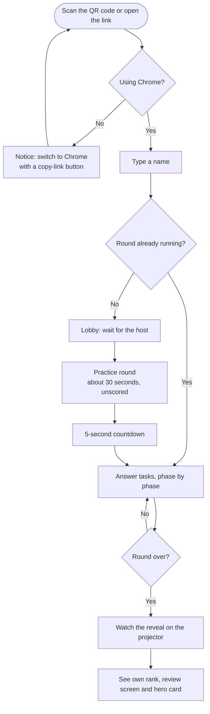
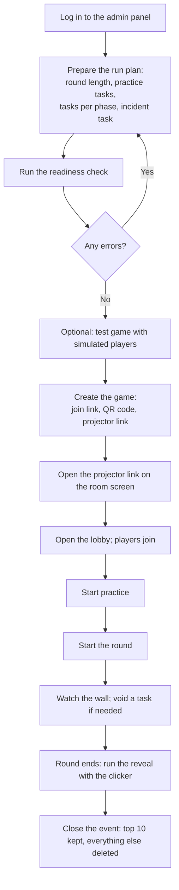
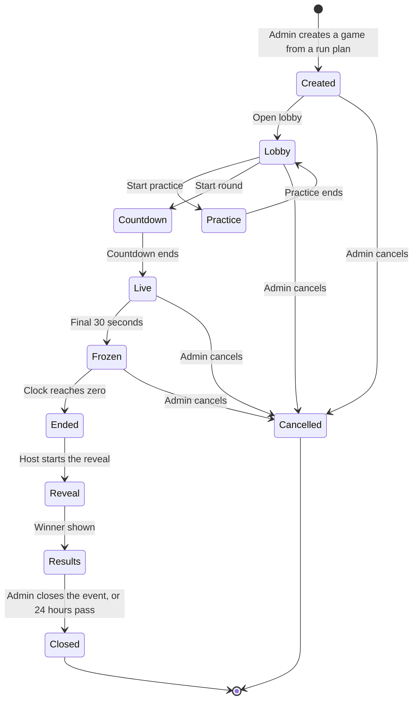
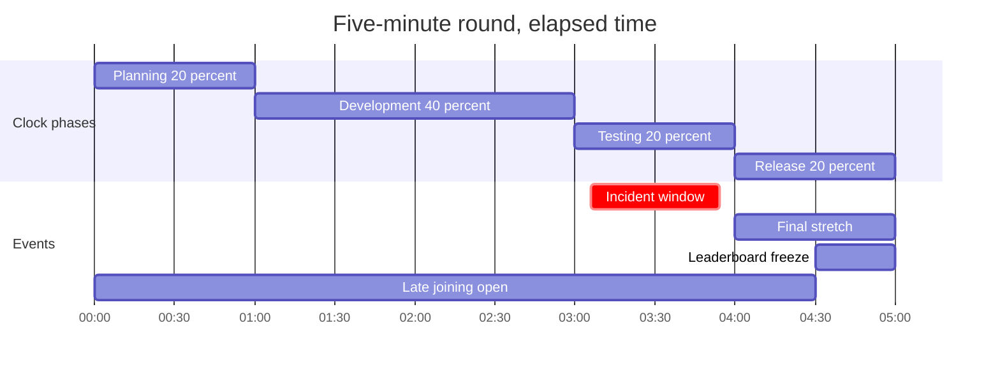

# Delivery Hero — Product Requirements Document (PRD)

> Document 02 of 18 · Version 1.2 (approved)

## Document control

| Field | Value |
|---|---|
| Project | Delivery Hero |
| Document | 02 — Product Requirements Document (PRD) |
| Version | 1.2 |
| Status | Approved on 23 September 2026 |
| Owner and approver | [Owner name] |
| Date | 23 September 2026 |
| Depends on | 01 — Project Charter v1.0 (decision log DEC-01 to DEC-72) |
| Feeds into | 03 — SRS, 04 — User Stories, 05 — Acceptance Criteria, 12 — UI/UX Wireframes |

### Revision history

| Version | Date | Author | Summary of changes |
|---|---|---|---|
| 0.1 | 2026-09-23 | [Owner name] | First draft |
| 1.0 | 2026-09-23 | [Owner name] | Approved. Proposed decisions PD-01 to PD-21 recorded as DEC-73 to DEC-93 in the Charter (v1.1) |
| 1.1 | 2026-09-23 | [Owner name] | Editorial correction found while writing acceptance criteria: worked example 3 and the "share correct" definition used 3 of 4 items in the right position, which is impossible; both now use 2 of 4. No rule changed |
| 1.2 | 2026-09-23 | [Owner name] | Worked example 1 now uses the task's actual 20-second limit from the seed (4 s of 20 s, still 140 points). No rule changed |

---

## 1. Purpose

This PRD describes what Delivery Hero version 1.0 must do from the point of view of its users: players, the host and admins. It turns the decisions in the Project Charter into product behavior, game rules and prioritized features, so that the SRS can specify them precisely and the design documents can implement them.

It also settles the open items OI-01 to OI-04 from the Charter and proposes a small number of new product decisions (section 14) for the owner's approval.

## 2. Scope

**In scope:** product vision and goals, personas, user journeys, the complete game design (round structure, task types, scoring, timed events, reveal, end-of-game screens), prioritized feature requirements for all three surfaces (phones, projector, admin panel), content requirements for the task pool, and a summary of non-functional requirements.

**Out of scope:** detailed functional and non-functional specifications (SRS), technical design (HLD, LLD, Software Architecture Document), data model (Database Design Document), and visual layouts (UI/UX Wireframes).

## 3. Definitions

All terms in section 3 of the Project Charter apply. This PRD adds:

| Term | Meaning |
|---|---|
| Accuracy | Share of a player's answered tasks that were fully correct. Timeouts don't count as answered. Used for hero card titles. |
| Answer time | Time from the moment a task appears on the player's phone to the moment their answer is submitted. The SRS defines how it is measured. |
| Done | A player who has answered or timed out on every task in the run plan before the round ends. |
| Incident task | The single multiple-choice task used for the Sev-1 incident. |
| Practice task | One of the unscored tasks used in the practice round. |
| Reaction line | A short line a character says after a player answers, chosen at random from that character's correct or wrong lines. |
| Share correct | For partial-credit tasks, the fraction of the answer that is right (for example, 2 of 4 items in the right position is 50%). Because an order can never have exactly one item out of place, the only partial result on a 4-item ordering task is 2 of 4, and 3-item ordering tasks are effectively all or nothing. |
| Simulated player | A computer-controlled player used in test games. |
| Speed bonus | Extra points for answering quickly: the maximum bonus multiplied by the share of the time limit still remaining. |
| Test game | A game started from the admin panel for rehearsal, optionally with simulated players. It is never counted as an event and its data is discarded. |
| Time limit | The seconds a player has to answer a task before it times out. |
| Void | A host action that cancels a task's scoring for every player. |

## 4. Assumptions and constraints

Charter assumptions A-01 to A-08 and constraints C-01 to C-06 apply. This PRD also assumes:

| ID | Assumption |
|---|---|
| A-09 | Players read English comfortably; task text avoids jargon that only one role would know. |
| A-10 | Every task, except its code snippet, fits on a phone screen without scrolling. |
| A-11 | The host runs the admin panel and the projector screen from the same laptop, in two browser windows or on an extended display. |

## 5. Product vision and goals

### 5.1 Vision

For colleagues across delivery roles who want a fun break together, Delivery Hero is a five-minute live arcade game that turns everyday delivery decisions into a room-wide race. There's nothing to install and no account to create: just a phone, Chrome and a name.

### 5.2 Goals and measures

| Goal | Measure | Target | Source |
|---|---|---|---|
| A fun team-building experience | Share of survey respondents rating the game 4 or 5 out of 5 | At least 80% | OBJ-1, SC-2 |
| A smooth live event | Game-stopping issues during the event | Zero | OBJ-2, SC-1 |
| A reusable game | An admin other than the owner can prepare and run a game using only the admin panel and the Setup Guide | Before the second event | OBJ-3 |

### 5.3 Non-goals

- Assessing or training people. There is no individual performance tracking, and only the top 10 survive the event.
- Team play of any kind (DEC-08).
- Analytics, tracking or cookies beyond what the game needs to run.
- Public or commercial use (DEC-07).

## 6. Personas

| Persona | Who they are | Needs | Frustrations to avoid |
|---|---|---|---|
| Sam, Developer (player) | Competitive and fast, Android phone with Chrome | Join in seconds, fair scoring, seeing their name climb the top 10 | Lag, questions that feel unfair |
| Priya, Tester (player) | Careful and detail-oriented, iPhone whose camera opens links in Safari | Clear instructions, readable text, no surprises | Being blocked by a browser problem before the game starts |
| Arjun, Business Analyst (player) | Not a gamer, a bit shy, might arrive late | Simple rules, a practice round, no public embarrassment | Seeing a low rank on the big screen |
| The host (the owner) | Runs the event from a laptop connected to the projector | Confidence that nothing breaks, simple controls, a clicker-driven reveal, a way to rehearse | Fiddly controls mid-event, surprises on the day |
| A colleague admin | Reviews tasks, edits character lines, may host a future event | An admin panel that doesn't need a developer | Unclear errors, losing work |

## 7. Key user journeys

### 7.1 Player journey

### 7.2 Host journey

### 7.3 Game lifecycle

## 8. Game design

### 8.1 Round structure

The round clock is shared by everyone (DEC-31). It is split into four phases in fixed proportions (DEC-15), and each timed event is tied to the clock rather than to any player's progress.

| Round length | Planning (20%) | Development (40%) | Testing (20%) | Release and final stretch (20%) | Leaderboard freeze |
|---|---|---|---|---|---|
| 3 minutes | 0:00–0:36 | 0:36–1:48 | 1:48–2:24 | 2:24–3:00 | 2:30–3:00 |
| 5 minutes (default) | 0:00–1:00 | 1:00–3:00 | 3:00–4:00 | 4:00–5:00 | 4:30–5:00 |
| 10 minutes | 0:00–2:00 | 2:00–6:00 | 6:00–8:00 | 8:00–10:00 | 9:30–10:00 |

Times are elapsed from the start of the round; the clock on screen counts down. For a 5-minute round:

**Task progression.** Everyone works through the same ordered task list (DEC-20). The list is grouped by phase, and each player moves to the next phase's tasks as soon as they finish the current phase, even if the clock is still in an earlier phase. So a fast player can be answering Testing tasks while the clock is still in Development. A player who finishes every task is done and watches the projector (DEC-15).

### 8.2 Task types

| Type | What the player does | Answer rules | Default time limit | Partial credit | Wrong answer |
|---|---|---|---|---|---|
| Multiple choice | Taps one of 2–4 big arcade buttons | Exactly one correct option | 15 s | No | −40 and lockout |
| Yes/no swipe | Swipes right for yes or left for no, or taps the Yes or No button | The statement is either true (yes) or false (no) | 8 s | No | −100 and lockout |
| Tap to order | Taps 3–5 items in order; each tap numbers the item; can undo the last tap; then submits | One correct order | 25 s | Yes: share of items in the correct position | −40 and lockout if under half right |
| Tap the problem words | Taps words in a sentence or line of code, then submits | 1–4 correct words; share correct = (correct taps − wrong taps) ÷ number of correct words, never below zero | 20 s | Yes | −40 and lockout if under half right |
| Incident (multiple choice) | Same as multiple choice, but interrupts every phone at once | Exactly one correct option | 20 s | No | −80 and lockout |

Admins can change any task's time limit to between 5 and 60 seconds. Tasks with a code snippet should get about 5 extra seconds.

### 8.3 Scoring

Points for a task are calculated on the server (DEC-44):

**points = (base + speed bonus) × share correct × streak multiplier**, rounded to the nearest whole number (halves round up).

| Element | Normal task | Incident task |
|---|---|---|
| Base | 100 | 200 |
| Maximum speed bonus | 50 | 100 |
| Speed bonus | Maximum bonus × time left ÷ time limit | Same |
| Share correct | 1 for fully correct; the partial share for ordering and problem-word tasks | 1 |
| Streak multiplier | 1.5 from the fourth fully correct answer in a row, otherwise 1 | Not applied |
| Wrong answer | −40 (yes/no swipe: −100) and a 3-second lockout | −80 and a 3-second lockout |
| No answer before the time limit | 0, no lockout | 0, no lockout |

Scores can go below zero (DEC-23). All values are fixed in one configuration file for version 1.0 (DEC-28).

**Worked examples**

| # | Situation | Calculation | Points |
|---|---|---|---|
| 1 | Sam answers a Manager task correctly after 4 s of 20 s: "The client wants a 'small' new feature two days before release. Your first move?" | 100 + 50 × 16/20 = 140 | 140 |
| 2 | The same answer, but it's Sam's fourth fully correct answer in a row | 140 × 1.5 | 210 |
| 3 | Priya orders four bugs by severity and gets two in the right position after 9.5 s of 25 s | (100 + 50 × 15.5/25) × 0.5 = 131 × 0.5 = 65.5 | 66 (halves round up; streak ends) |
| 4 | Arjun taps "fast" and "system" in "The system should load fast and be user-friendly for most users" (the problem words are fast, user-friendly and most) | (1 correct − 1 wrong) ÷ 3 = 0%, which is under half | −40 and lockout |
| 5 | A player taps "fast" and "most" in the same sentence after 8 s of 20 s | (100 + 50 × 12/20) × 2/3 = 130 × 0.667 | 87 |
| 6 | A player swipes "yes" on "A misaligned login button is a release blocker" | Wrong yes/no swipe | −100 and lockout |
| 7 | Priya answers the incident correctly after 5 s of 20 s | 200 + 100 × 15/20 | 275 |

**Ranking** is by total points. Ties go to the player with more correct answers, then the faster average answer time (DEC-29). The single winner is the top-ranked player (DEC-30).

### 8.4 Streaks and lockouts

- A streak counts consecutive fully correct answers. Any other outcome (a wrong answer, a partly correct answer or a timeout) ends the streak.
- From the fourth fully correct answer in a row, points are multiplied by 1.5 until the streak ends (DEC-24).
- The incident task neither extends nor ends a streak.
- After an answer that counts as wrong, the player is locked out for 3 seconds. The next task appears when the lockout ends, and its timer starts then.
- The phone always shows the current streak and, during a lockout, a short countdown.

### 8.5 Sev-1 incident

- Each run plan has one incident task: a multiple-choice task flagged as the incident in the task library.
- When the round starts, the server picks a random moment between 10% and 90% of the Testing window (for a 5-minute round, between 3:06 and 3:54).
- At that moment, every connected player receives the incident at once, including players who are done or in a lockout. Their current task timer and any lockout pause, then resume after the incident.
- Players who join or reconnect while the incident is still running get it with its remaining time; after that, it is skipped for them.
- On the projector, every square on the wall turns red and flips back as each player answers. The live feed names the first player to fix it, with their time.

### 8.6 Final stretch and leaderboard freeze

- The final stretch is the Release part of the clock (the last 20%). Phones and the projector show a red tint and a pulsing clock. Nothing else changes (DEC-17).
- The leaderboard freezes for the final 30 seconds (DEC-18). The top-10 sidebar shows "Frozen" and stops updating, while the wall keeps showing activity and phones keep showing each player's own score.
- Joining closes when the freeze begins (DEC-32).
- No visual effect flashes more than three times per second (WCAG 2.2, success criterion 2.3.1).

### 8.7 Practice round (settles OI-01)

- The host starts practice from the lobby, and a shared 30-second timer runs for everyone.
- Practice uses the run plan's practice tasks. The seed file includes four, one per task type, and admins can edit them.
- Practice is unscored. Players see right or wrong feedback, including a lockout, so they learn how everything works, but nothing is recorded.
- Players who finish early see "Ready!", and the projector shows how many players have finished.
- The host can skip practice.

### 8.8 Joining late, disconnecting and finishing early

- **Late joining.** From the countdown until the freeze, a new player starts at the first task with whatever time is left on the clock. They skip practice.
- **Disconnecting.** The task timer keeps running while a player is disconnected. When they reconnect from the same phone and browser, they return to the current task if it still has time, or move to the next one.
- **Finishing early.** A player who finishes every task sees "Done! Watch the screen", and their square on the wall shows a done mark. They still receive the incident if it hasn't happened yet.
- **Round ends mid-task.** A task still open when the clock reaches zero scores 0, like a timeout.

### 8.9 End of round and the reveal

1. At 0:00, phones show "Time's up! Eyes on the screen." Each player's rank stays hidden, so the reveal isn't spoiled.
2. The host starts the reveal and moves through it with a keyboard or presentation clicker (DEC-36):
   - **Most-missed question:** the task, its correct answer, the share of players who got it wrong, and the explanation. This is the moment for a short discussion.
   - **Top-10 countdown:** from 10th place to 2nd, one per click, showing name and points.
   - **Winner:** 1st place, shown with a pixel celebration animation and the title "Delivery Hero".
3. Once the winner appears, each phone shows the player's rank and points (for example, "You finished 17th of 42"), their review screen and their hero card.

### 8.10 Hero cards (settles OI-03)

The first rule that matches decides the title:

| Order | Rule | Title | Flavor text |
|---|---|---|---|
| 1 | The winner | Delivery Hero | Top of the board. The release is safe with you. |
| 2 | Fastest correct answer to the incident | Incident Commander | First to the fire, first to fix it. |
| 3 | Fewer than 3 tasks answered | Mystery Guest | Arrived like a legend, left us wanting more. |
| 4 | Fast and accurate | Firefighter | Fast hands, cool head. |
| 5 | Careful and accurate | Auditor | Measured twice, deployed once. |
| 6 | Fast and less accurate | Cowboy | Ship first, ask questions later. |
| 7 | Careful and less accurate | Philosopher | Deep thoughts, bold answers. |

"Fast" means the player used less than half of each task's time limit on average. "Accurate" means accuracy of 75% or more.

The card also shows the player's strongest role (the character role where they earned the most points) with a playful label: Manager's Favorite (Manager), Requirements Whisperer (Business Analyst), 10x Dev (Developer) or Bug Hunter (Tester). It also shows total points, rank, correct answers, best streak and average answer time.

### 8.11 Review screen and most-missed question

- The review screen lists every task the player got wrong, partly right or didn't answer: the prompt, their answer, the correct answer and the explanation. Voided tasks are left out.
- Correct answers only leave the server after the round ends, so the review screen appears after the reveal (DEC-44).
- The most-missed question is the task with the highest share of wrong answers among tasks attempted by at least 5 players. Ties go to the task with more attempts, and voided tasks are excluded.

### 8.12 Characters and reaction lines

- The four roles and their pixel-art images are fixed (DEC-21). For each character, admins can edit a display name, an intro line, three lines for correct answers and three for wrong answers.
- After each answer, the character shows one of its lines at random for about a second.
- Seed defaults:

| Role | Name | Intro line | Correct answer (example) | Wrong answer (example) |
|---|---|---|---|---|
| Manager | Maya | Quick one! | Client's happy. You're a legend. | That's going in my status report. |
| Business Analyst | Ben | What exactly do we mean by "fast"? | Crystal-clear requirements. | Hmm, that's not what the user story says. |
| Developer | Dev | Works on my machine. | Merged. No conflicts. | That broke the build. |
| Tester | Tess | Found another one! | Bug squashed! | That bug just reached production. |

## 9. Feature requirements

Priorities use MoSCoW (DEC-69). If time runs short, Could features are cut first, then Should (Charter section 16). Every feature is detailed in the SRS.

### EP-01 Joining and lobby

| ID | Feature | Priority | Source |
|---|---|---|---|
| F-01 | Join through a link or QR code that identifies the game | Must | DEC-12, DEC-41 |
| F-02 | Name entry (1–20 characters); duplicate names get a number added | Must | DEC-41 |
| F-03 | Browsers other than Chrome see a "switch to Chrome" notice with a copy-link button | Should | DEC-54 |
| F-04 | Lobby screen on the phone while waiting for the host | Must | DEC-12 |
| F-05 | A privacy note on the join screen: "Your name and answers are deleted after the event" | Should | DEC-45 |
| F-06 | Rejoining from the same phone and browser keeps the player's score and place | Must | DEC-32 |
| F-07 | Late joining with the time left, until the freeze | Should | DEC-32 |
| F-08 | The host can rename or remove a player in the lobby | Could | PD-09 |

### EP-02 Practice round

| ID | Feature | Priority | Source |
|---|---|---|---|
| F-09 | Host-started, 30-second, unscored practice round using the run plan's practice tasks | Should | DEC-12, PD-01 |
| F-10 | The projector shows how many players have finished practice | Could | PD-01 |

### EP-03 Round engine

| ID | Feature | Priority | Source |
|---|---|---|---|
| F-11 | One shared round clock, started with a 5-second countdown | Must | DEC-31, PD-21 |
| F-12 | Four phases on the clock (20/40/20/20%), with each player progressing through the task list at their own pace | Must | DEC-15 |
| F-13 | A time limit on every task, with timeouts | Must | PD-02 |
| F-14 | A done state for players who finish every task | Must | DEC-15 |
| F-15 | Round length set per game, from 3 to 10 minutes | Must | DEC-13 |

### EP-04 Task types

| ID | Feature | Priority | Source |
|---|---|---|---|
| F-16 | Multiple choice | Must | DEC-14 |
| F-17 | Yes/no swipe, with Yes and No buttons as an alternative to swiping | Must | DEC-14, PD-06 |
| F-18 | Tap to order | Should | DEC-14 |
| F-19 | Tap the problem words | Should | DEC-14 |
| F-20 | Code snippets in tasks, in a monospace font that scrolls sideways | Should | DEC-22 |

### EP-05 Scoring and feedback

| ID | Feature | Priority | Source |
|---|---|---|---|
| F-21 | Answers checked and scored on the server only | Must | DEC-44 |
| F-22 | Base points, speed bonus, wrong-answer penalties, lockout and timeouts | Must | DEC-23, DEC-25 |
| F-23 | Partial credit for ordering and problem-word tasks | Should | DEC-26 |
| F-24 | Streak multiplier, with the streak shown on the phone | Should | DEC-24, PD-13 |
| F-25 | Instant right or wrong feedback with a character reaction line | Must | PD-12 |
| F-26 | The player's own score shown on the phone during the round | Must | DEC-36 |

### EP-06 Timed events

| ID | Feature | Priority | Source |
|---|---|---|---|
| F-27 | Sev-1 incident | Should | DEC-16, DEC-27, PD-04 |
| F-28 | Final-stretch visuals: red tint and a pulsing clock | Could | DEC-17 |
| F-29 | Leaderboard freeze in the final 30 seconds | Should | DEC-18 |

### EP-07 Projector screen

| ID | Feature | Priority | Source |
|---|---|---|---|
| F-30 | Lobby view: QR code, link, "open in Chrome" note, joined count and names | Must | DEC-12 |
| F-31 | Countdown clock and phase bar | Must | DEC-35 |
| F-32 | Live top-10 sidebar | Must | DEC-35 |
| F-33 | Participant wall showing each player's activity, without scores | Must | DEC-35 |
| F-34 | Live feed of notable moments | Could | DEC-35 |
| F-35 | Secret, display-only projector link for each game | Must | DEC-43 |

### EP-08 Reveal and results

| ID | Feature | Priority | Source |
|---|---|---|---|
| F-36 | Host-driven reveal, advanced with a keyboard or presentation clicker | Must | DEC-36 |
| F-37 | Top-10 countdown ending with the winner | Must | DEC-30, DEC-36 |
| F-38 | Most-missed question screen | Should | DEC-19, PD-16 |
| F-39 | Each phone shows the player's rank and points once the winner appears | Must | PD-05 |
| F-40 | Review screen | Should | DEC-19 |
| F-41 | Hero card | Could | DEC-19, PD-03 |

### EP-09 Admin: access and content

| ID | Feature | Priority | Source |
|---|---|---|---|
| F-42 | Login with the shared admin password, with limited login attempts | Must | DEC-42 |
| F-43 | Task library: create, edit, delete and preview tasks; filter by role, phase and type | Must | DEC-37 |
| F-44 | Character settings: names and lines | Should | DEC-21, PD-12 |
| F-45 | Loader script for the task pool seed file | Must | DEC-40 |

### EP-10 Admin: run plans and games

| ID | Feature | Priority | Source |
|---|---|---|---|
| F-46 | Run plan: round length, practice tasks, ordered tasks for each phase, incident task | Must | DEC-37 |
| F-47 | Readiness check | Should | DEC-38, PD-10 |
| F-48 | Create a game from a run plan, producing the join link, QR code and projector link | Must | DEC-37 |
| F-49 | Live host controls: open lobby, start practice, start round, advance the reveal | Must | DEC-37 |
| F-50 | Void a task | Should | DEC-37, PD-08 |
| F-51 | Cancel a game | Should | PD-15 |
| F-52 | Test game with 0–100 simulated players | Should | DEC-38 |

### EP-11 After the event

| ID | Feature | Priority | Source |
|---|---|---|---|
| F-53 | Past games list showing each game's top 10 | Must | DEC-39 |
| F-54 | Close the event: delete all player data except the top 10 | Must | DEC-45 |
| F-55 | Close the event automatically 24 hours after the round ends | Should | PD-07 |

### EP-12 Operations

| ID | Feature | Priority | Source |
|---|---|---|---|
| F-56 | Deployments blocked while a game is live | Must | DEC-61 |
| F-57 | Health check, logs and a free uptime alert | Must | DEC-62 |
| F-58 | Database backups stored off the machine | Must | DEC-58 |

## 10. Screens overview

Layouts are specified in document 12 (UI/UX Wireframes).

| Surface | Screens |
|---|---|
| Phone | Switch-to-Chrome notice · Join (name) · Lobby · Practice task · Countdown · Task screen for each task type · Lockout · Incident alert · Done · Time's up · Results (rank and points) · Review · Hero card |
| Projector | Lobby with QR code · Practice progress · Countdown · Live (wall, top 10, feed, phase bar, clock) · Frozen · Most-missed question · Top-10 countdown · Winner |
| Admin panel | Login · Dashboard · Task library and task editor with preview · Characters · Run plans with readiness check · Games (create, live control panel) · Test game · Past games |

## 11. Content requirements

### 11.1 Task pool

| Item | Requirement |
|---|---|
| Size | 60–80 scored tasks, 15–20 per character role, plus 4 practice tasks and 2 incident tasks (so admins can choose) |
| Phase mix | Planning: mostly Manager and Business Analyst. Development: mostly Developer. Testing: mostly Tester. Release: all roles |
| Type mix | About half multiple choice, 20% yes/no swipe, 15% tap to order, 15% tap the problem words |
| Delivery | A seed file in the format defined by the SRS, delivered right after the SRS is approved (DEC-40) |

### 11.2 Writing rules

- Test judgment, not trivia. Anyone in a delivery role should be able to answer.
- Every task has one clearly best answer. Two admins should independently pick it within about 10 seconds; if they can't, rewrite or cut the task.
- Prompts are 25 words or fewer. Code snippets are 12 lines or fewer.
- Every task has a one- or two-sentence explanation for the review screen.
- Keep the tone playful, and never name real colleagues or clients.

### 11.3 Examples

| Type and role | Prompt | Answer | Explanation |
|---|---|---|---|
| Multiple choice, Manager, Planning | The client wants a "small" new feature two days before release. Your first move? A) Say yes to keep them happy B) Estimate the impact, then agree a date with the client C) Quietly add it to the sprint D) Refuse | B | Surprise scope is risky; assess the impact and agree before committing. |
| Yes/no swipe, Tester, Testing | "A login button that's two pixels off is a release blocker." | No | Cosmetic issues rarely block a release. |
| Tap to order, Tester, Testing | Order these bugs from most to least severe: checkout fails for every user · export fails in Firefox but works in Chrome · profile photo upload is slow · typo in the footer | Checkout, export, upload, typo | A blocker beats a broken feature with a workaround, which beats slowness, which beats a cosmetic issue. |
| Tap the problem words, Business Analyst, Planning | The system should load fast and be user-friendly for most users. | fast, user-friendly, most | None of these can be tested without a measurable definition. |
| Incident, Developer | Production is down after the 5 pm deploy. What do you do first? A) Roll back to the last good release B) Debug directly in production C) Wait for more user reports D) Push a quick patch | A | Restore service first, investigate afterward. |
| Practice, problem words | Tap the two fruits: The developer ate an apple and a banana before standup. | apple, banana | Just practice! |

## 12. Non-functional requirements summary

Full, testable versions are in the SRS.

| Area | Requirement | Source |
|---|---|---|
| Performance | Answer feedback within 300 ms at p95; projector no more than 1 second behind; reconnection within 5 seconds; 100 concurrent players | DEC-56, DEC-34 |
| Reliability | One server, and a crash stops the game; no deployments while a game is live; health check and uptime alert | DEC-57, DEC-61, DEC-62 |
| Security | HTTPS only; answers checked on the server; correct answers never sent to phones before the round ends; shared admin password kept as a server secret with limited login attempts; secret projector link | DEC-42 to DEC-44 |
| Privacy | Only typed names, answers and scores are stored; everything but the top 10 is deleted at close; no analytics or tracking | DEC-45 |
| Accessibility | WCAG 2.2 AA; right and wrong never shown by color alone; touch targets at least 24 × 24 CSS pixels (arcade buttons are far larger); swipes have a button alternative; nothing flashes more than three times per second; screens work with the phone's own text size and zoom. Time limits are essential to the game, which WCAG allows | DEC-53, PD-06, PD-11 |
| Compatibility | Chrome on Android and iPhone, going back about 3–4 years; admin panel and projector in Chrome on a laptop at 1920 × 1080 | DEC-54, DEC-55 |
| Usability | A player can join within 30 seconds of scanning the QR code | PD-20 |
| Maintainability | Scoring values in one configuration file; at least 80% test coverage on scoring and game logic | DEC-28, DEC-68 |

## 13. Release plan

**Version 1.0 (first event).** All 34 Must features, then as many of the 19 Should features as time allows. The 5 Could features are built only if the schedule is ahead.

A Must-only build is still a complete event: joining, a round with multiple-choice and yes/no tasks, scoring, the projector's wall, top 10 and clock, the reveal of the top 10 and winner, the admin task library, run plans, host controls, and closing the event.

| Priority | Count | Features |
|---|---|---|
| Must | 34 | F-01, F-02, F-04, F-06, F-11 to F-17, F-21, F-22, F-25, F-26, F-30 to F-33, F-35 to F-37, F-39, F-42, F-43, F-45, F-46, F-48, F-49, F-53, F-54, F-56 to F-58 |
| Should | 19 | F-03, F-05, F-07, F-09, F-18 to F-20, F-23, F-24, F-27, F-29, F-38, F-40, F-44, F-47, F-50 to F-52, F-55 |
| Could | 5 | F-08, F-10, F-28, F-34, F-41 |

**Later releases** (DEC-72): typed answers graded by Jev, spreadsheet import and export of tasks, copying run plans, and remote or hybrid players.

## 14. Product decisions proposed in this PRD

These were approved with this PRD and are recorded as DEC-73 to DEC-93 in the Charter's decision log (Charter version 1.1).

| ID | Proposed decision |
|---|---|
| PD-01 | Practice round: the host starts it; a shared 30-second timer; the run plan's practice tasks (the seed has one per task type); unscored, with feedback; the host can skip it. |
| PD-02 | Default time limits: multiple choice 15 s, yes/no swipe 8 s, tap to order 25 s, tap the problem words 20 s, incident 20 s. Admins can set any task to 5–60 s. |
| PD-03 | Hero card titles and rules as in section 8.10. |
| PD-04 | Incident: one per run plan, multiple choice only, flagged in the task library. It fires between 10% and 90% of the Testing window and reaches done and locked-out players too. Late arrivals get it only while its time is still running. |
| PD-05 | Phones show each player's rank, review screen and hero card only once the winner has been revealed. |
| PD-06 | Yes/no swipe tasks also offer Yes and No buttons. |
| PD-07 | An event closes automatically 24 hours after the round ends if no admin closes it. |
| PD-08 | Voiding a task removes its points (gains and penalties) for every player. Streak bonuses earned on other tasks stay, lockout time isn't refunded, and voided tasks drop out of the review screen and the most-missed calculation. |
| PD-09 | The host can rename or remove a player in the lobby (Could). |
| PD-10 | Readiness check. Errors that block starting a game: an empty phase, a task without a correct answer, a round length outside 3–10 minutes, more than one incident task. Warnings: fewer tasks than the round length in seconds ÷ 6 (50 tasks for 5 minutes), no incident task, a missing explanation, a prompt over 25 words, a code snippet over 12 lines, fewer than 4 practice tasks. |
| PD-11 | No visual effect flashes more than three times per second. |
| PD-12 | Each character has a display name, an intro line, and three correct and three wrong reaction lines, chosen at random. Seed defaults: Maya (Manager), Ben (Business Analyst), Dev (Developer) and Tess (Tester). |
| PD-13 | Any answer that isn't fully correct (wrong, partly correct or timed out) ends a streak. The 1.5 multiplier applies from the fourth fully correct answer in a row. |
| PD-14 | The incident task neither extends nor ends a streak. |
| PD-15 | An admin can cancel a game at any point before the results. Cancelling deletes all its player data immediately. |
| PD-16 | The most-missed question is the task with the highest share of wrong answers among tasks attempted by at least 5 players. Ties go to more attempts; voided tasks are excluded. (This refines the Charter's definition, which would be updated to match.) |
| PD-17 | A task's timer keeps running while a player is disconnected. On reconnecting, the player returns to the current task if it still has time, or moves to the next. |
| PD-18 | A task still open when the round ends scores 0, like a timeout. This settles OI-05. |
| PD-19 | Points for each task are rounded to the nearest whole number, with halves rounded up. |
| PD-20 | Usability target: a player can join within 30 seconds of scanning the QR code. |
| PD-21 | The round starts with a 5-second countdown on the projector and every phone. |

## 15. Dependencies and risks

Charter dependencies (section 15) and risks R-01 to R-11 (section 14) apply. Two points are specific to this PRD:

- **R-01 (schedule):** the MoSCoW split in section 13 is the main control. The Must set alone produces a complete event.
- **R-10 (task quality):** the writing rules in section 11.2 and the readiness check (PD-10) are the controls.

## 16. Future considerations

- **Typed answers (Jev).** A later release adds a fifth task type. Keep the task model open to new types so this doesn't require reworking existing ones.
- **Editable scoring values.** Values already live in one configuration file, so an admin screen can come later.
- **Remote and hybrid play.** Nothing in version 1.0 may assume a shared room: the join link and projector screen must work from anywhere.
- **Spreadsheet import/export and copying run plans** are planned for later releases.
- **Accessibility options** (larger text, extra time) are candidates for a later release.

## 17. Approval

| Role | Name | Decision | Date |
|---|---|---|---|
| Owner and approver | [Owner name] | ☑ Approved | 2026-09-23 |
