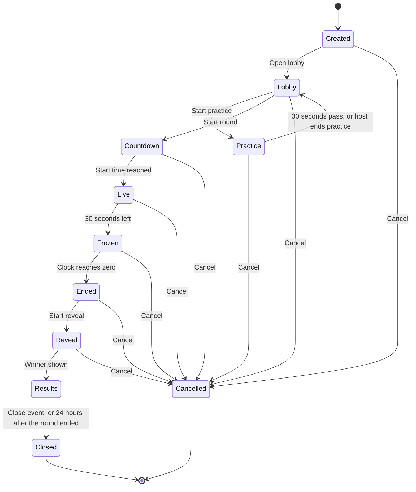
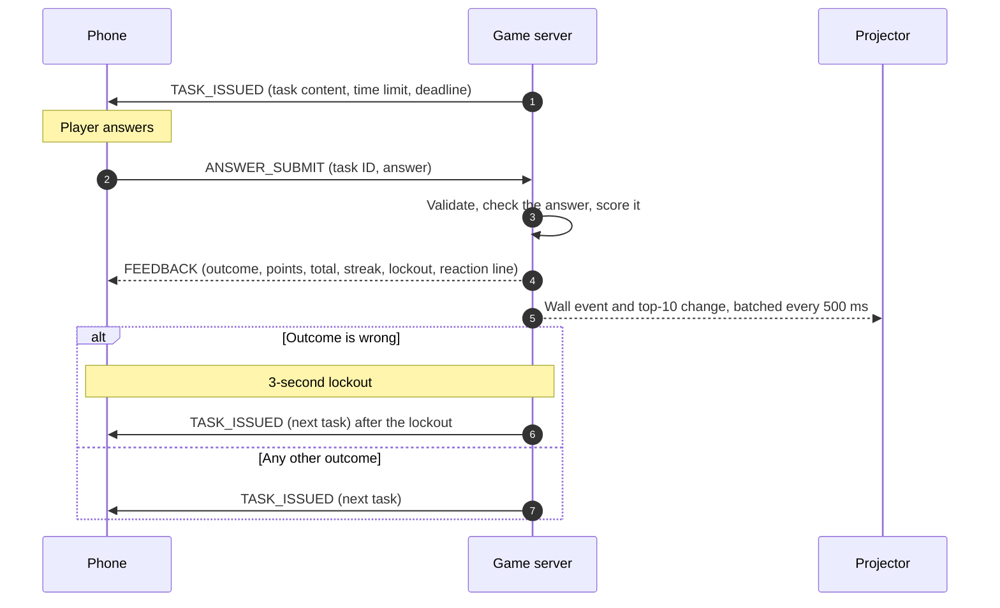
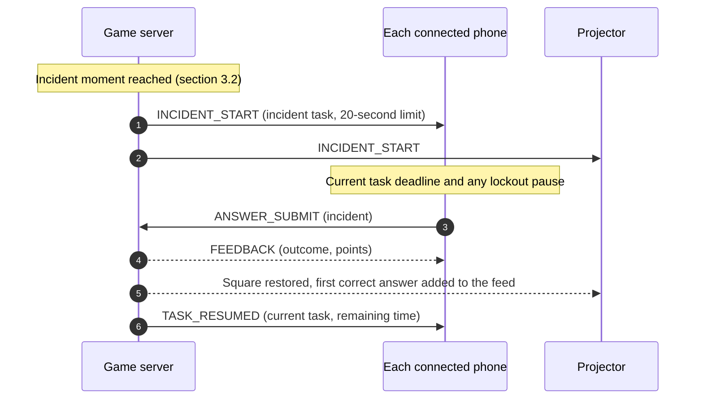

# Delivery Hero — Software Requirements Specification (SRS)

> Document 03 of 18 · Version 1.4 (approved)

## Document control

| Field | Value |
|---|---|
| Project | Delivery Hero |
| Document | 03 — Software Requirements Specification (SRS) |
| Version | 1.4 |
| Status | Approved on 23 September 2026 |
| Owner and approver | [Owner name] |
| Date | 23 September 2026 |
| Depends on | 01 — Project Charter v1.1 (DEC-01 to DEC-93) · 02 — PRD v1.0 (features F-01 to F-58) |
| Feeds into | 04 User Stories · 05 Acceptance Criteria · 06 Use Cases · 07 HLD · 08 LLD · 09 Architecture · 10 Database Design · 11 API Specification · 14 Test Plan · 15 Test Cases |

### Revision history

| Version | Date | Author | Summary of changes |
|---|---|---|---|
| 0.1 | 2026-09-23 | [Owner name] | First draft |
| 1.0 | 2026-09-23 | [Owner name] | Approved. Proposed decisions SD-01 to SD-26 recorded as DEC-94 to DEC-119 in the Charter (v1.2) |
| 1.1 | 2026-09-23 | [Owner name] | Applied clarifications approved with the Acceptance Criteria: BR-16 name normalization (DEC-120), FR-048 banner fallback (DEC-121), FR-056 offline timing (DEC-122) |
| 1.2 | 2026-09-23 | [Owner name] | Named the problem-word flag `monospace` in FR-034 and section 7.3 (DEC-157) |
| 1.3 | 2026-09-23 | [Owner name] | Added ANSWER_REJECTED to the real-time message catalog (DEC-161) |
| 1.4 | 2026-09-23 | [Owner name] | Section 6.3: the 4 KB limit applies to player messages during the round; RESULTS may be up to 32 KB (DEC-194) |

---

## 1. Introduction

### 1.1 Purpose

This SRS specifies, precisely and testably, what Delivery Hero version 1.0 must do. It turns every PRD feature (F-01 to F-58) into functional requirements, business rules, interface requirements, data requirements and non-functional requirements that a developer can build and a tester can verify.

### 1.2 Scope

The system has three client surfaces and one backend:

- **Player app:** phone screens in Chrome for joining, practice, the round and results.
- **Projector screen:** a display-only view for the room.
- **Admin panel:** content management, run plans, games and live host controls.
- **Backend:** a Spring Boot service with PostgreSQL that runs the game engine, scoring and real-time messaging.

Out of scope for version 1.0 is everything listed in Charter section 7.2.

### 1.3 Definitions

All definitions in Charter section 3 and PRD section 3 apply. This SRS adds:

| Term | Meaning |
|---|---|
| Attempt | A task for which the server accepted an answer from the player. Timeouts are not attempts. |
| Deadline | The server time by which a task must be answered: its issue time plus its time limit, plus any time paused by the incident. |
| Deploy lock | A status exposed by the backend that is active while a game is in progress. The deployment pipeline must not deploy while it is active. |
| Game code | The 6-character code that identifies a game in its join link. |
| Grace period | 500 ms after a deadline during which an answer in transit is still accepted. |
| Issue time | The server time at which a task is sent to a player. |
| Outcome | The result of a task for a player: fully correct, partly correct, wrong or timeout (BR-01). |
| Player token | A secret, random value that identifies a player's phone for rejoining. |
| Projector key | The secret, random value in a game's projector link. |
| Server time offset | The difference between a device's clock and the server's clock, estimated by the device so that countdowns match the server. |
| Snapshot | The copy of a run plan and its tasks that a game takes when it is created (SD-07). |

### 1.4 References

| Reference | Title |
|---|---|
| Charter | 01 — Project Charter v1.1, including the decision log (DEC-01 to DEC-93) |
| PRD | 02 — Product Requirements Document v1.0 |
| WCAG 2.2 | W3C Web Content Accessibility Guidelines 2.2, conformance level AA |
| STOMP 1.2 | Simple Text Oriented Messaging Protocol, version 1.2 |

### 1.5 Conventions

- **IDs.** Functional requirements are FR-nnn, non-functional requirements NFR-nn, business rules BR-nn, and decisions proposed in this SRS SD-nn.
- **Wording.** "Shall" marks a mandatory requirement. Quoted text in double quotes is the exact wording shown to users, unless marked as an example.
- **Priority.** Each functional requirement inherits the MoSCoW priority of its PRD feature, unless it is an optional enhancement given a lower priority (FR-028, the screen wake lock, is Should within a Must feature).
- **Verification.** T = automated or manual test, D = demonstration, I = inspection, A = analysis.

## 2. Overall description

### 2.1 Product perspective

Delivery Hero is a new, self-contained system. The system context is shown in Charter section 7.3. All three client surfaces are static web pages served by Nginx, and they talk to one Spring Boot backend over HTTPS (REST) and WSS (STOMP over WebSocket). The backend stores data in PostgreSQL on the same machine.

### 2.2 Product functions

- Players join by name, practice, play a timed round of tasks and see their results.
- The server runs the round clock, issues tasks, checks answers, scores them and fires timed events.
- The projector shows the lobby, the live wall and top 10, and the reveal.
- Admins manage tasks, characters and run plans, create and host games, and close events.
- Operations: deploy lock, health check, logging and backups.

### 2.3 User classes

| User class | Description | Access |
|---|---|---|
| Player | Anyone with the join link; about 40 per event, up to 100 | Join link and player token |
| Admin (including the host) | The owner and a few colleagues, all with the same permissions | Shared admin password |
| Room audience | Everyone watching the projector | Projector link (display only) |
| Simulated player | A server-controlled player in test games | None (internal) |

### 2.4 Operating environment

| Component | Environment |
|---|---|
| Server | One Oracle Cloud Always Free Arm machine (2 OCPUs, 12 GB memory) running Docker Compose: Nginx, the Spring Boot backend (Java 21) and PostgreSQL (DEC-58) |
| Player phones | Chrome on Android and on iPhone, in portrait orientation, over the players' own mobile data (DEC-54, DEC-63). Minimum versions in SD-18 |
| Admin panel and projector | Chrome on a laptop; projector at 1920×1080 (DEC-55) |

### 2.5 Design and implementation constraints

- The technology stack is fixed (Charter C-04). The Next.js frontend is exported as static files (DEC-67).
- One production server, no staging environment, and no automatic recovery after a crash (DEC-57, DEC-59).
- Free tiers only (DEC-05). The system makes no requests to third-party services at runtime (SD-14).
- All answer checking and scoring happens on the server (DEC-44).
- Scoring values live in one configuration file (DEC-28).

### 2.6 Assumptions and dependencies

Charter assumptions A-01 to A-08, PRD assumptions A-09 to A-11, and the dependencies in Charter section 15 apply.

## 3. Game model

### 3.1 Game states



| State | New players can join | Host actions | Phones show | Projector shows |
|---|---|---|---|---|
| Created | No | Open lobby, cancel | "The lobby isn't open yet. Hang tight!" | Waiting screen |
| Lobby | Yes | Start practice, start round, rename or remove a player, cancel | Lobby | QR code, link and joined names |
| Practice | Yes; new players wait in the lobby and skip practice (SD-22) | End practice, cancel | Practice tasks | Practice progress |
| Countdown | Yes | Cancel | 5-second countdown | Countdown |
| Live | Yes, until the freeze | Void a task, cancel | Tasks | Wall, top 10, feed, phase bar and clock |
| Frozen | No | Void a task, cancel | Tasks | The same, with the top 10 frozen |
| Ended | No | Start reveal, void a task, cancel | "Time's up! Eyes on the screen." | "Time's up!" |
| Reveal | No | Next, back, cancel | "Time's up! Eyes on the screen." | The current reveal step |
| Results | No | Close event | Rank, points, review and hero card | The winner |
| Closed | No | None | "This game has finished." | "This game has finished." |
| Cancelled | No | None | "The host ended this game." | "The host ended this game." |

### 3.2 Round timing

Let L be the round length in seconds (180 to 600). All times are measured from the round's start time. Boundaries are rounded down to whole seconds.

| Item | Formula |
|---|---|
| Planning window | 0 to floor(0.2 × L) |
| Development window | floor(0.2 × L) to floor(0.6 × L) |
| Testing window | floor(0.6 × L) to floor(0.8 × L); call its length W |
| Release window (final stretch) | floor(0.8 × L) to L |
| Incident moment | Start of the Testing window plus a random whole number of seconds between ceil(0.1 × W) and floor(0.9 × W), chosen once when the round starts |
| Freeze and joining cutoff | L − 30 to L |

| Round length | Testing window | Incident range | Freeze starts |
|---|---|---|---|
| 3 minutes | 1:48–2:24 | 1:52–2:20 | 2:30 |
| 5 minutes | 3:00–4:00 | 3:06–3:54 | 4:30 |
| 10 minutes | 6:00–8:00 | 6:12–7:48 | 9:30 |

The incident always ends before the freeze for every allowed round length, because the Testing window ends at 80% of the round.

### 3.3 Task lifecycle

1. **Issue.** The server sends the player's next task with its time limit and deadline. The message contains no answer key.
2. **Answer.** The player submits once. The server accepts an answer received up to 500 ms after the deadline (the grace period); answer time is capped at the time limit.
3. **Timeout.** If nothing is accepted by the deadline plus the grace period, the outcome is timeout and the next task is issued immediately.
4. **Feedback.** The server replies with the outcome and points. After a wrong outcome, the next task is issued 3 seconds later (lockout); otherwise it is issued immediately.
5. **Pause.** While the incident is open for the player, the current task's deadline and any lockout are paused, then extended by the paused time.
6. **Disconnection.** Deadlines keep running while a player is disconnected (DEC-89).
7. **Round end.** When the clock reaches zero, no more answers are accepted, and any open task is recorded as a timeout with 0 points (DEC-90).



### 3.4 Incident sequence



### 3.5 Clock synchronization

Every phone and the projector estimate their server time offset when they connect and every 60 seconds afterward. Each estimate uses three request-and-reply exchanges and keeps the one with the shortest round trip. Countdowns are drawn from server timestamps adjusted by the offset, so the displayed clock is within 250 ms of the server's clock (SD-02). The server alone decides when tasks expire and when the round ends.

## 4. Functional requirements

### 4.1 Joining and lobby (EP-01)

| ID | Requirement | Priority | Source | Verify |
|---|---|---|---|---|
| FR-001 | Each game shall have a join URL of the form `https://<host>/join?code=<CODE>`, where CODE is the game code (BR-17). | Must | F-01 | T |
| FR-002 | Opening a join URL whose code doesn't belong to a game in Created through Frozen shall show "This game link isn't active. Ask the host for the current link." | Must | F-01 | T |
| FR-003 | The join screen shall ask for a name. Names shall be validated and normalized per BR-16; an invalid name shall show "Names can use letters, numbers, spaces, hyphens, apostrophes and full stops, up to 20 characters." | Must | F-02 | T |
| FR-004 | If a normalized name matches an existing player's name in the game, ignoring case, the system shall add a number per BR-16 and show the player their final name. | Must | F-02 | T |
| FR-005 | Joining shall be allowed in Lobby and Practice. In Created, the phone shall show "The lobby isn't open yet. Hang tight!" From the freeze onward, it shall show "Joining has closed for this round. Enjoy the show on the big screen!" | Must | F-01, F-02 | T |
| FR-006 | When a game already has 100 players, further joins shall be refused with "This game is full." | Must | F-02, DEC-34 | T |
| FR-007 | On a successful join, the server shall issue a player token (BR-17), which the phone keeps in local storage for that game. | Must | F-06 | T |
| FR-008 | When a phone reconnects or reopens the join URL with a valid token for the current game, the system shall restore the player (name, total, streak, current task) without asking for the name again. | Must | F-06, DEC-89 | T |
| FR-009 | If the browser isn't Chrome (BR-19), the phone shall show "Delivery Hero works best in Chrome. Copy the link and open it in Chrome." with a copy-link button and a "Continue anyway (not supported)" link, instead of the join form. | Should | F-03, SD-13 | T |
| FR-010 | After joining, the phone shall show the lobby screen with the player's final name and "Waiting for the host to start…", and shall switch automatically when practice or the round starts. | Must | F-04 | T |
| FR-011 | The join screen shall show "Your name and answers are deleted after the event." | Should | F-05 | I |
| FR-012 | In Countdown and Live until the freeze, a new player shall join with the round's remaining time, skip practice, and start at the first scored task. | Should | F-07, DEC-32 | T |
| FR-013 | In Lobby, an admin shall be able to rename a player (subject to BR-16) or remove them. A removed player's phone shall show "The host removed you from this game." and their token shall stop working. | Could | F-08, DEC-81 | T |

### 4.2 Practice round (EP-02)

| ID | Requirement | Priority | Source | Verify |
|---|---|---|---|---|
| FR-014 | In Lobby, the host shall be able to start practice, which gives every joined player the snapshot's practice tasks in order with one shared 30-second timer. "Start practice" shall be disabled when the snapshot has no practice tasks. | Should | F-09, DEC-73 | T |
| FR-015 | Practice answers shall be checked on the server and show feedback, including a lockout, but no points, streaks or answers shall be stored. | Should | F-09 | T |
| FR-016 | Practice shall end when its 30 seconds elapse or the host ends it, returning the game to Lobby. A player who finishes every practice task early shall see "Ready!". | Should | F-09 | T |
| FR-017 | During practice, the projector shall show "N of M finished practice". | Could | F-10 | D |

### 4.3 Round engine (EP-03)

| ID | Requirement | Priority | Source | Verify |
|---|---|---|---|---|
| FR-018 | The round length shall come from the game's snapshot: a whole number of minutes from 3 to 10. | Must | F-15, DEC-13 | T |
| FR-019 | "Start round" shall require at least one player (real or simulated). Starting shall set the round start time to 5 seconds later and broadcast it, and every phone and the projector shall show the countdown. | Must | F-11, DEC-93 | T |
| FR-020 | Phones and the projector shall show the time remaining (m:ss) within 250 ms of the server clock (section 3.5). | Must | F-11, SD-02 | T |
| FR-021 | The server shall compute the phase windows, incident moment and freeze start as in section 3.2. | Must | F-12, DEC-15 | T |
| FR-022 | Each player shall receive the snapshot's scored tasks in order (all Planning tasks, then Development, Testing and Release), independent of the clock's phase. | Must | F-12, DEC-15 | T |
| FR-023 | The projector's phase bar shall show the clock's phase, not any player's progress. | Must | F-12 | D |
| FR-024 | The server shall issue one task at a time to each player, with the deadline defined in section 3.3. | Must | F-13 | T |
| FR-025 | If no answer is accepted by the deadline plus the grace period, the server shall record a timeout (0 points, streak ended, no lockout) and issue the next task immediately. | Must | F-13 | T |
| FR-026 | When a player has no tasks left, their phone shall show "Done! Watch the screen" and their wall square shall show the done state. | Must | F-14 | T |
| FR-027 | When the clock reaches zero, the server shall accept no further answers and record any open task as a timeout with 0 points. Phones shall show "Time's up! Eyes on the screen." | Must | F-11, DEC-90 | T |
| FR-028 | During Practice, Countdown, Live and Frozen, the phone shall ask the browser to keep the screen awake where supported, with no error shown if it isn't. | Should | F-11, SD-17 | T |

### 4.4 Task types (EP-04)

| ID | Requirement | Priority | Source | Verify |
|---|---|---|---|---|
| FR-029 | A multiple-choice task shall show its 2–4 options as large buttons in the order stored in the task. A single tap shall submit. | Must | F-16 | T |
| FR-030 | A yes/no task shall submit on a horizontal swipe of at least 25% of the screen width (right = yes, left = no) or a tap on the Yes or No button. | Must | F-17, DEC-78 | T |
| FR-031 | A tap-to-order task shall show its 3–5 items in the stored display order. Each tap on an unnumbered item shall give it the next number, Undo shall remove the last number, and Submit shall be enabled once every item is numbered. | Should | F-18 | T |
| FR-032 | A problem-word task shall show its text split into tappable words at whitespace. Tapping a word shall toggle its selection, and Submit shall be enabled once at least one word is selected. | Should | F-19 | T |
| FR-033 | A task with a code snippet shall show it as plain text in a monospace font, preserving whitespace, with horizontal scrolling inside the snippet area only. The page itself shall never scroll sideways. | Should | F-20, SD-25 | T |
| FR-034 | A problem-word task with its `monospace` flag set shall show its text in the monospace style. | Should | F-19 | T |

### 4.5 Scoring and feedback (EP-05)

| ID | Requirement | Priority | Source | Verify |
|---|---|---|---|---|
| FR-035 | The server shall check every answer and compute points per BR-01 to BR-09. No correct answer or answer key shall reach any phone before the round ends (NFR-12). | Must | F-21, DEC-44 | T, I |
| FR-036 | The server shall accept at most one answer per player per task. It shall reject, without changing any score, answers for a task other than the player's current task, duplicate answers, and answers sent during a lockout. | Must | F-21 | T |
| FR-037 | Answer time shall be measured on the server, from issue to receipt, excluding paused time (BR-02, SD-01). | Must | F-22 | T |
| FR-038 | After a wrong outcome, the server shall issue the next task 3 seconds after sending the feedback (BR-08). | Must | F-22 | T |
| FR-039 | Ordering and problem-word tasks shall earn partial credit per BR-05 and BR-06. | Should | F-23, DEC-26 | T |
| FR-040 | Streaks shall follow BR-07. The phone shall show the streak count from 2 and a "×1.5" badge whenever the next fully correct answer will be multiplied. | Should | F-24, DEC-85 | T |
| FR-041 | For 95% of answers, the phone shall receive feedback within 300 ms of sending (NFR-01): the outcome, points for the task, the new total, the streak, any lockout duration, and a reaction line from the task's character (DEC-84). Feedback shall not reveal the correct answer. | Must | F-25 | T |
| FR-042 | The phone shall show the player's total points throughout the round. | Must | F-26 | T |

### 4.6 Timed events (EP-06)

| ID | Requirement | Priority | Source | Verify |
|---|---|---|---|---|
| FR-043 | When the round starts, if the snapshot has an incident task, the server shall choose the incident moment (section 3.2) and shall not reveal it to any client in advance. | Should | F-27, DEC-76 | T |
| FR-044 | At the incident moment, the server shall send the incident task to every connected player, including players who are done or locked out, and pause each player's current deadline and lockout (section 3.3). | Should | F-27, DEC-16 | T |
| FR-045 | When a player answers the incident or its time runs out, their paused task and lockout shall resume with the time they had left. | Should | F-27, DEC-16 | T |
| FR-046 | A player who joins or reconnects while the incident's time is still running shall receive it with its remaining time; afterward it shall be skipped for them. | Should | F-27, DEC-76 | T |
| FR-047 | The incident shall be scored per BR-08 and shall not change any streak (DEC-86). | Should | F-27, DEC-27 | T |
| FR-048 | When the incident starts, every wall square shall turn red, and each shall return to normal when that player answers or times out. The live feed shall show the first player to answer correctly, with their answer time to one decimal place; if the live feed isn't built, a banner on the projector shall show it instead (DEC-121). | Should | F-27 | D |
| FR-049 | During the Release window, phones and the projector shall show a red tint and a pulsing clock that pulses at most once per second. | Could | F-28, DEC-17 | D |
| FR-050 | During the freeze, the projector's top-10 sidebar shall show "Frozen" and shall not change until the reveal. Phones shall keep showing the player's own total. | Should | F-29, DEC-18 | T |
| FR-051 | Joining shall close when the freeze begins. | Should | F-29, DEC-32 | T |

### 4.7 Projector screen (EP-07)

| ID | Requirement | Priority | Source | Verify |
|---|---|---|---|---|
| FR-052 | Each game shall have a projector URL of the form `https://<host>/screen?key=<KEY>` (BR-17). The URL shall be shown only in the admin panel, shall accept no commands, and shall stop working when the game is closed or cancelled. | Must | F-35, DEC-43 | T |
| FR-053 | The lobby view shall show a QR code of the join URL, the URL as text, the note "Open this link in Chrome", the number of players joined, and their names, newest first. | Must | F-30 | D |
| FR-054 | The projector shall show the countdown before the round and, during it, the time remaining and the phase bar. | Must | F-31 | D |
| FR-055 | The top-10 sidebar shall show rank, name and points ordered by BR-09. It shall update no more often than every 500 ms and never lag the server by more than 1 second. | Must | F-32 | T |
| FR-056 | The wall shall show one square per player (up to 100, fitting 1920×1080 without scrolling) with the player's initials and first name. States: answering (neutral), correct (brief green highlight with a check icon), wrong (brief shake with a cross icon), lockout (lock icon), streak of 3 or more (flame icon), offline (grayed with a no-signal icon), done (check-mark badge) and incident (red). A player shows as offline as soon as their connection closes, or at most 20 seconds after their last heartbeat (DEC-122). The wall shall never show scores. | Must | F-33, DEC-35 | D |
| FR-057 | The live feed shall show the four most recent notable events: a player reaching a streak of 5, 10, 15 and so on, the first correct incident answer, a late join, a player going offline or coming back, a phase change, and the freeze starting. | Could | F-34 | D |
| FR-058 | If the projector loses its connection, it shall reconnect automatically and redraw the full current state. | Must | F-31 | T |

### 4.8 Reveal and results (EP-08)

| ID | Requirement | Priority | Source | Verify |
|---|---|---|---|---|
| FR-059 | In Ended, the host shall start the reveal and move through its steps with Next and Back buttons in the admin panel's live control screen, which shall also accept these keys: Next = Right arrow, Down arrow, Page Down, Space or Enter; Back = Left arrow, Up arrow or Page Up (SD-19). | Must | F-36, DEC-36 | T |
| FR-060 | The first reveal step shall show the most-missed question (BR-10): prompt, code if any, correct answer, the share of answers that were wrong, and the explanation. The step shall be skipped if no task qualifies. | Should | F-38, DEC-88 | T |
| FR-061 | The top-10 countdown shall show one place per Next, from 10th (or the lowest place when there are fewer than 10 players) up to 2nd, with name and points. | Must | F-37 | T |
| FR-062 | The final step shall show the winner with a pixel celebration animation and the title "Delivery Hero", and move the game to Results. | Must | F-37, DEC-30 | D |
| FR-063 | Back shall be available until the winner is shown, and not afterward. | Must | F-36 | T |
| FR-064 | When the winner is shown, each phone shall show the player's rank and total, for example "You finished 17th of 42". Until then, phones shall show only "Time's up! Eyes on the screen." | Must | F-39, DEC-77 | T |
| FR-065 | After the winner is shown, each phone shall offer the review screen (BR-11). | Should | F-40 | T |
| FR-066 | After the winner is shown, each phone shall show the hero card (BR-12). | Could | F-41, DEC-75 | T |

### 4.9 Admin access and content (EP-09)

| ID | Requirement | Priority | Source | Verify |
|---|---|---|---|---|
| FR-067 | The admin panel shall require the shared admin password. A successful login shall create a session that lasts 12 hours or until logout (SD-04). | Must | F-42, DEC-42 | T |
| FR-068 | After 5 failed logins from one IP address within 15 minutes, the system shall refuse further attempts from that address for 15 minutes. | Must | F-42, SD-15 | T |
| FR-069 | Admins shall be able to create, edit, delete and preview tasks with the fields and limits in section 7.3. The preview shall render the task as a phone would, inside a phone-sized frame. | Must | F-43 | T |
| FR-070 | The task library shall be filterable by role, phase, kind and type, and searchable by prompt text. | Must | F-43 | T |
| FR-071 | A task used in any run plan shall not be deletable; the admin panel shall name the run plans that use it. | Must | F-43 | T |
| FR-072 | Creating a game shall take a snapshot of its run plan and tasks. Later edits to tasks, characters or the run plan shall affect only games created afterward (SD-07). | Must | F-43 | T |
| FR-073 | If an admin saves a task, character or run plan that another admin changed after it was opened, the save shall be refused with "Someone else changed this since you opened it. Reload to see their changes." | Must | F-43 | T |
| FR-074 | Admins shall be able to edit each character's display name (1–20 characters), intro line, and three correct and three wrong reaction lines (1–80 characters each). | Should | F-44, DEC-84 | T |
| FR-075 | A loader shall import a seed file in the format of section 7.4. It shall validate the entire file first and report every error with its key, then import everything in one transaction or nothing. Re-importing a key shall update the existing item instead of duplicating it. The loader shall refuse to run while the deploy lock is active. | Must | F-45, DEC-40 | T |

### 4.10 Run plans and games (EP-10)

| ID | Requirement | Priority | Source | Verify |
|---|---|---|---|---|
| FR-076 | Admins shall be able to create and edit run plans with a name, a round length (3–10 minutes), an ordered list of practice tasks, an optional incident task, and an ordered list of scored tasks for each phase. A phase list shall accept only scored tasks whose phase matches, and a task shall appear at most once per run plan. | Must | F-46 | T |
| FR-077 | The system shall refuse to create a game from a run plan that has an empty phase, a task without a valid correct answer, or a round length outside 3–10 minutes. | Must | F-48 | T |
| FR-078 | The readiness check shall evaluate a run plan per BR-13 and list its errors and warnings. Errors shall prevent creating a game; warnings shall not. | Should | F-47, DEC-82 | T |
| FR-079 | Creating a game from a run plan shall generate the game code, join URL, QR code and projector URL, and put the game in Created. Only one game, real or test, may exist outside Closed and Cancelled at a time (SD-08). | Must | F-48, DEC-34 | T |
| FR-080 | The live control screen shall offer exactly the host actions allowed in the current state (section 3.1). Cancel and close shall ask for confirmation. | Must | F-49 | T |
| FR-081 | Host actions shall be idempotent. If two admins trigger the same action, it shall apply once; if an action no longer applies to the current state, the panel shall refresh to the current state. | Must | F-49 | T |
| FR-082 | The live control screen shall show the state, the time remaining, players joined and connected, players done, the incident status, and for each scored task the number of answers and the share wrong. | Must | F-49 | D |
| FR-083 | From Live until the reveal starts, an admin shall be able to void a scored task (BR-14, SD-23). Totals and the top 10 shall be recalculated within 1 second. | Should | F-50, DEC-80 | T |
| FR-084 | In any state before Results, an admin shall be able to cancel the game. Cancelling shall delete its players, answers and tokens immediately, and phones and the projector shall show "The host ended this game." | Should | F-51, DEC-87 | T |
| FR-085 | An admin shall be able to create a test game from a run plan with 0–100 simulated players (BR-15). Test games follow the normal flow, show "TEST" on every screen, never appear in past games, and are deleted entirely when closed or 2 hours after reaching Results (SD-12). | Should | F-52, DEC-38 | T |

### 4.11 After the event (EP-11)

| ID | Requirement | Priority | Source | Verify |
|---|---|---|---|---|
| FR-086 | The past games list shall show each closed real game's date, run plan name, number of players, and top 10 (rank, name and points). | Must | F-53, DEC-39 | T |
| FR-087 | In Results, an admin shall be able to close the game after confirming. Closing shall permanently delete its players, answers and tokens, keep only the game summary and top 10, and stop its join and projector URLs from working. | Must | F-54, DEC-45 | T |
| FR-088 | A game still in Results 24 hours after its round ended shall be closed automatically as in FR-087. | Should | F-55, DEC-79 | T |
| FR-089 | When the backend starts, any game in Lobby through Reveal shall be set to Cancelled and its player data deleted (SD-09). | Must | F-54, DEC-57 | T |

### 4.12 Operations (EP-12)

| ID | Requirement | Priority | Source | Verify |
|---|---|---|---|---|
| FR-090 | The backend shall expose the deploy-lock status, active whenever a game is in Lobby through Reveal (SD-10). The deployment pipeline shall check it and stop without deploying while it is active. | Must | F-56, DEC-61 | T |
| FR-091 | The backend shall expose a health endpoint that reports UP when the application and database are reachable. An external uptime monitor shall check it every 5 minutes and email the owner after 2 consecutive failures. | Must | F-57, DEC-62 | T |
| FR-092 | Logs shall include a timestamp, game ID, player ID (where relevant) and event type, and shall never include player names, answers or the admin password. Logs shall rotate and be kept for 7 days (SD-11). | Must | F-57 | I |
| FR-093 | The database shall be backed up automatically to storage outside the machine, as specified in the Deployment Guide (OI-07), and a restore shall be tested before the trial run. | Must | F-58, DEC-58 | T |

## 5. Business rules

| ID | Rule |
|---|---|
| BR-01 | **Outcomes.** Every scored or incident task ends with exactly one outcome for a player: *fully correct* (share correct = 1), *partly correct* (share from 0.5 up to but not including 1; ordering and problem-word tasks only), *wrong* (share below 0.5, or a wrong option or swipe) or *timeout* (no answer accepted by the deadline plus the grace period, or still open when the round ends). |
| BR-02 | **Answer time.** t = time received − time issued − time paused, in milliseconds, limited to between 0 and the task's time limit T. |
| BR-03 | **Speed bonus.** B × (T − t) ÷ T, where B is 50 for scored tasks and 100 for the incident. |
| BR-04 | **Points.** Fully or partly correct: (base + speed bonus) × share correct × m, where base is 100 (incident 200) and m is 1.5 when the answer is fully correct, the task is scored (not the incident), and the player's streak before this answer is 3 or more; otherwise m is 1. Wrong: −40, or −100 for yes/no swipes and −80 for the incident. Timeout: 0. Each task's points are rounded to the nearest whole number, halves up (DEC-91). |
| BR-05 | **Ordering share.** Items in their correct position ÷ number of items. |
| BR-06 | **Problem-word share.** The smaller of 1 and max(0, c − w) ÷ k, where c is the number of selected problem words, w the number of selected other words, and k the number of problem words. |
| BR-07 | **Streaks.** A fully correct scored task adds 1 to the streak; any other outcome on a scored task resets it to 0. The incident doesn't change it. The system tracks each player's best streak. |
| BR-08 | **Lockout.** 3 seconds after any wrong outcome, including on the incident and in practice. There is no lockout after a timeout. |
| BR-09 | **Ranking.** Players are ordered by: (1) total points, highest first; (2) fully correct answers, most first (SD-21); (3) average answer time over their attempts, lowest first, with players who have no attempts placed after those who do; (4) the time their total last changed, earliest first (SD-03). Players still tied share the rank. Removed players and voided tasks are excluded. |
| BR-10 | **Most-missed question.** Among non-voided scored tasks with at least 5 attempts, the one with the highest share of wrong outcomes among its attempts. Ties go to more attempts, then to the task that comes earlier in the run plan. |
| BR-11 | **Review screen.** Lists the player's non-voided tasks with outcome wrong, partly correct or timeout, in the order played. Each entry shows the prompt, the code if any, the player's answer (or "No answer"), the correct answer and the explanation. Tasks the player never reached are not listed. |
| BR-12 | **Hero card.** Attempts are the player's non-voided scored tasks with an accepted answer. *Fast* means the average of t ÷ T over attempts is below 0.5; *accurate* means fully correct attempts ÷ attempts is at least 0.75. The first matching rule gives the title: winner → Delivery Hero; fastest fully correct incident answer (ties go to the answer received first) → Incident Commander; fewer than 3 attempts → Mystery Guest; then Firefighter, Auditor, Cowboy or Philosopher from fast and accurate (PRD section 8.10). *Strongest role* is the role with the highest points over scored tasks; ties go to more fully correct answers in that role, then the order Manager, Business Analyst, Developer, Tester. If no role has positive points, the card shows "Still warming up" (SD-26). The card also shows total points, rank, fully correct answers, best streak and average answer time in seconds to one decimal place. |
| BR-13 | **Readiness check.** *Errors:* an empty phase; a task without a valid correct answer (section 7.3); a round length outside 3–10 minutes; an incident task that isn't multiple choice or isn't of kind incident; a task listed twice; a phase list containing a task from another phase; a practice list containing non-practice tasks. *Warnings:* fewer scored tasks than L ÷ 6 (50 for 5 minutes); no incident task; a scored or incident task without an explanation; a prompt over 25 words; a code snippet over 12 lines; fewer than 4 practice tasks; practice not covering every task type used in the phases. |
| BR-14 | **Voiding.** Removes the task's points, positive or negative, from every player's total. Streak multipliers earned on other tasks stay, and lockout time isn't refunded. Voided tasks are excluded from attempts, rankings' counts, the review screen, the most-missed question and hero card statistics. Players who haven't reached the task skip it; a player currently on it gets 0 for it and moves to the next task immediately. |
| BR-15 | **Simulated players.** Named "Bot 01" to "Bot 100". Each gets a random accuracy between 0.60 and 0.95 and a random pace between 0.20 and 0.80. For each task, a bot answers after pace × T × a random factor between 0.8 and 1.2 (at most 0.95 × T), correctly with probability equal to its accuracy. On partial-credit tasks, a correct bot scores a random share from 0.5 to 1 and an incorrect one from 0 to 0.49. Bots answer the incident, never disconnect, and join when the lobby opens. |
| BR-16 | **Names.** The name is first normalized to Unicode NFC. Leading and trailing spaces are removed and runs of spaces become one space. The result must be 1–20 characters, using only letters (any language, including the combining marks some scripts need), digits, spaces, hyphens, apostrophes and full stops (DEC-120). If it matches an existing name in the game ignoring case, " 2" is added, or the lowest free number from 2 upward; the base name is shortened if needed so the result fits in 20 characters. |
| BR-17 | **Identifiers.** A game code is 6 characters drawn from ABCDEFGHJKLMNPQRSTUVWXYZ23456789 (no I, O, 0 or 1). Player tokens and projector keys are 128-bit values from a cryptographically secure random generator, written in URL-safe Base64 (22 characters). |
| BR-18 | **Timing.** Phase windows, the incident moment, the freeze and the joining cutoff follow section 3.2. Default time limits follow DEC-74; admins can set 5–60 seconds per task. |
| BR-19 | **Supported browser detection.** Chrome on Android is identified by "Chrome/" in the user agent without "EdgA/", "OPR/" or "SamsungBrowser/". Chrome on iPhone is identified by "CriOS/". Anything else counts as unsupported. |

## 6. External interface requirements

### 6.1 User interfaces

Layouts are specified in document 12 (UI/UX Wireframes). The following apply to every screen.

| Surface | Requirements |
|---|---|
| All | Dark retro arcade theme (DEC-48). A pixel font for headings, scores and the timer; a clear sans-serif font for task text; a monospace font for code. All fonts self-hosted (SD-14). No sound (DEC-52). |
| Phone | Portrait, 320–480 CSS pixels wide. A top bar with the time remaining, total points and streak. The character's image with the task in a speech bubble (DEC-49). Answer controls in the lower half of the screen, each at least 48 px tall. Feedback shows for about 1 second; a lockout shows a 3-second countdown; the incident takes over the whole screen in red. |
| Projector | Designed for 1920×1080 and usable at 1280×720. A header with the phase bar and clock; the wall on the left, about 70% of the width; the top 10 and live feed on the right. The lobby shows a QR code at least 400 × 400 pixels. Reveal steps use the full screen. |
| Admin panel | Desktop, at least 1280 px wide. Navigation: Tasks, Characters, Run plans, Games, Past games. The live control screen has large action buttons and the keyboard shortcuts in FR-059. |

### 6.2 Software interfaces

Full request and message schemas are specified in document 11 (API Specification). This section fixes the overall shape.

| Interface | Summary |
|---|---|
| REST API | JSON over HTTPS under `/api`. Public endpoints for game information and joining; admin endpoints under `/api/admin` (login, tasks, characters, run plans, games and host actions), protected by the admin session and CSRF protection; `/api/ops/deploy-lock` for the pipeline; `/actuator/health` for monitoring. Timestamps in ISO 8601 UTC; JSON properties in camelCase. |
| Real-time | STOMP 1.2 over WebSocket at `/ws`. Players authenticate with their player token, the projector with its key, and the admin live screen with the admin session. Real-time timestamps are epoch milliseconds (UTC). |

**Real-time message catalog**

| Direction | Message | Purpose |
|---|---|---|
| Server → player | GAME_STATE | Current state, round start time and deadlines; sent on connect and on every change |
| Server → player | TASK_ISSUED | The next task without its answer key, with time limit and deadline |
| Server → player | FEEDBACK | Outcome, points, total, streak, lockout and reaction line |
| Server → player | INCIDENT_START, TASK_RESUMED | Incident delivery, and resuming the paused task |
| Server → player | RESULTS | Rank, total, review entries and hero card, sent when the winner is shown |
| Server → player | REMOVED, GAME_ENDED | The player was removed; the game was cancelled or closed |
| Server → player | ANSWER_REJECTED | Why an answer couldn't be accepted, so the phone stays in sync (DEC-161) |
| Player → server | ANSWER_SUBMIT | An answer for the current task (scored, practice or incident) |
| Both directions | TIME_SYNC | Clock-offset estimation (section 3.5) |
| Server → projector | SCREEN_STATE | Full state on connect or reconnect |
| Server → projector | WALL_EVENTS, TOP10, FEED_EVENT | Batched live updates, at most every 500 ms |
| Server → projector | INCIDENT_START, REVEAL_STEP | Incident visuals and the current reveal step |
| Server → admin | LIVE_STATS | The figures in FR-082 |

### 6.3 Communication interfaces

- HTTPS and WSS only, with TLS 1.2 or later. Plain HTTP redirects to HTTPS (NFR-11).
- STOMP heartbeats every 10 seconds in both directions.
- Clients reconnect after 0.5 s, 1 s and 2 s, then every 2 seconds, showing "Reconnecting…" after the first failed attempt.
- Each message to a player during the round is at most 4 KB. The one-time RESULTS message is at most 32 KB, because it carries the player's review list (DEC-194). Each projector batch is at most 32 KB.

## 7. Data requirements

### 7.1 Logical data entities

The physical design is in document 10 (Database Design).

| Entity | Purpose | Main attributes |
|---|---|---|
| Character | The four fixed roles | Role, display name, intro line, three correct lines, three wrong lines, version |
| Task | A library item | Key, role, kind (scored, practice or incident), phase (scored tasks only), type, prompt, optional code, time limit, explanation, answer data for its type, version |
| Run plan | A game template | Key, name, round length, practice list, incident task, ordered list for each phase, version |
| Game | One session | Code, projector key, state, test flag, snapshot, created, round start, incident moment, round end and closed times, summary (run plan name, player count) |
| Player | A joined person or bot | Game, name, token hash, joined time, total, streak, best streak, progress, removed flag, simulated flag |
| Answer | One task outcome | Game, player, task, submitted answer, outcome, share correct, points, answer time, issue and receipt times, voided flag |
| Top-10 entry | The result kept after closing | Game, rank, name, points |

### 7.2 Retention and deletion

| Data | Kept until |
|---|---|
| Characters, tasks and run plans | An admin deletes them (tasks only when unused, FR-071) |
| Players, answers and tokens of a real game | The game is closed (manually or after 24 hours) or cancelled, or the backend restarts mid-game (FR-084, FR-087 to FR-089) |
| Game summary and top-10 entries | Kept |
| Everything belonging to a test game | Closed, or 2 hours after reaching Results (FR-085) |
| Application logs | 7 days (FR-092) |
| Database backups | As set in the Deployment Guide (OI-07). Backups should be kept no longer than 7 days, so deleted player data doesn't linger |

### 7.3 Field rules and limits

| Field | Rule |
|---|---|
| Task key | 1–40 characters: lowercase letters, digits and hyphens; unique |
| Prompt | 1–200 characters; warning above 25 words |
| Code snippet | Optional; up to 2,000 characters and 30 lines; warning above 12 lines. Language label from: text, java, javascript, typescript, sql, json, python, shell (stored for future highlighting, SD-25) |
| Multiple choice | 2–4 options of 1–80 characters, exactly one correct, displayed in stored order |
| Yes/no | Statement in the prompt; answer YES or NO |
| Tap to order | 3–5 items of 1–60 characters, each with a unique correct position from 1 to the number of items. The stored display order must differ from the correct order |
| Problem words | Text of 1–200 characters with 1–4 problem words marked `{{like this}}`; each marker wraps exactly one whole word. Optional `monospace` flag (true or false) for the code style |
| Time limit | 5–60 seconds; defaults by type per DEC-74 |
| Explanation | Up to 300 characters; required for scored and incident tasks in the seed file, and a readiness warning if missing in the admin panel |
| Kind and phase | Scored tasks need a phase. Practice and incident tasks have none. Incident tasks must be multiple choice |
| Character fields | Display name 1–20 characters; intro line and each reaction line 1–80 characters |
| Run plan | Key rules as for tasks; name 1–60 characters; round length 3–10 whole minutes |

### 7.4 Task seed file format

The seed file is UTF-8 JSON with four top-level properties: `formatVersion` (1), `characters`, `tasks` and `runPlans`. Roles are `MANAGER`, `BUSINESS_ANALYST`, `DEVELOPER` and `TESTER`. Phases are `PLANNING`, `DEVELOPMENT`, `TESTING` and `RELEASE`. Kinds are `SCORED`, `PRACTICE` and `INCIDENT`. Types are `MULTIPLE_CHOICE`, `YES_NO`, `ORDER` and `PROBLEM_WORDS`. Options and items are listed in the order players see them. A shortened example (the real file has 60–80 scored tasks):

```json
{
  "formatVersion": 1,
  "characters": [
    {
      "role": "MANAGER",
      "displayName": "Maya",
      "introLine": "Quick one!",
      "correctLines": ["Client's happy. You're a legend.", "That's going in my good-news update.", "Nailed it. Coffee's on me."],
      "wrongLines": ["That's going in my status report.", "The client just called. Again.", "Let's take that one offline."]
    }
  ],
  "tasks": [
    {
      "key": "mgr-plan-001",
      "role": "MANAGER",
      "kind": "SCORED",
      "phase": "PLANNING",
      "type": "MULTIPLE_CHOICE",
      "prompt": "The client wants a \"small\" new feature two days before release. Your first move?",
      "options": [
        { "text": "Say yes to keep them happy", "correct": false },
        { "text": "Estimate the impact, then agree a date with the client", "correct": true },
        { "text": "Quietly add it to the sprint", "correct": false },
        { "text": "Refuse", "correct": false }
      ],
      "explanation": "Surprise scope is risky; assess the impact and agree before committing."
    },
    {
      "key": "ba-plan-001",
      "role": "BUSINESS_ANALYST",
      "kind": "SCORED",
      "phase": "PLANNING",
      "type": "PROBLEM_WORDS",
      "prompt": "Tap the words that make this requirement untestable.",
      "text": "The system should load {{fast}} and be {{user-friendly}} for {{most}} users.",
      "explanation": "None of these can be tested without a measurable definition."
    },
    {
      "key": "dev-dev-001",
      "role": "DEVELOPER",
      "kind": "SCORED",
      "phase": "DEVELOPMENT",
      "type": "MULTIPLE_CHOICE",
      "prompt": "Users aged 18 or over may sign up. What's wrong with this check?",
      "code": { "language": "java", "text": "if (age > 18) {\n    allowSignup();\n}" },
      "timeLimitSeconds": 20,
      "options": [
        { "text": "It blocks 18-year-olds", "correct": true },
        { "text": "It lets 17-year-olds in", "correct": false },
        { "text": "Nothing, it's correct", "correct": false },
        { "text": "It should use age < 18", "correct": false }
      ],
      "explanation": "The > sign excludes exactly 18; the check needs >=."
    },
    {
      "key": "tst-test-001",
      "role": "TESTER",
      "kind": "SCORED",
      "phase": "TESTING",
      "type": "ORDER",
      "prompt": "Order these bugs from most to least severe.",
      "items": [
        { "text": "Profile photo upload is slow", "correctPosition": 3 },
        { "text": "Checkout fails for every user", "correctPosition": 1 },
        { "text": "Typo in the footer", "correctPosition": 4 },
        { "text": "Export fails in Firefox, works in Chrome", "correctPosition": 2 }
      ],
      "explanation": "A blocker beats a broken feature with a workaround, which beats slowness, which beats a cosmetic issue."
    },
    {
      "key": "mgr-rel-001",
      "role": "MANAGER",
      "kind": "SCORED",
      "phase": "RELEASE",
      "type": "YES_NO",
      "prompt": "Release notes should list the known issues that are still open.",
      "answer": "YES",
      "explanation": "Being upfront about known issues builds trust and saves support time."
    },
    {
      "key": "incident-001",
      "role": "DEVELOPER",
      "kind": "INCIDENT",
      "type": "MULTIPLE_CHOICE",
      "prompt": "Production is down after the 5 pm deploy. What do you do first?",
      "options": [
        { "text": "Roll back to the last good release", "correct": true },
        { "text": "Debug directly in production", "correct": false },
        { "text": "Wait for more user reports", "correct": false },
        { "text": "Push a quick patch", "correct": false }
      ],
      "explanation": "Restore service first, investigate afterward."
    },
    {
      "key": "practice-words",
      "role": "TESTER",
      "kind": "PRACTICE",
      "type": "PROBLEM_WORDS",
      "prompt": "Warm-up: tap the two fruits.",
      "text": "The developer ate an {{apple}} and a {{banana}} before standup.",
      "explanation": "Just practice!"
    }
  ],
  "runPlans": [
    {
      "key": "default-5min",
      "name": "Default 5-minute plan",
      "roundLengthMinutes": 5,
      "practice": ["practice-words"],
      "incident": "incident-001",
      "phases": {
        "PLANNING": ["mgr-plan-001", "ba-plan-001"],
        "DEVELOPMENT": ["dev-dev-001"],
        "TESTING": ["tst-test-001"],
        "RELEASE": ["mgr-rel-001"]
      }
    }
  ]
}
```

Loader rules: every rule in section 7.3 applies; every key referenced by a run plan must exist in the file or the database; the whole file is validated before anything is written (FR-075). The example above passes validation but produces readiness warnings (too few tasks and practice tasks).

## 8. Non-functional requirements

### 8.1 Performance

| ID | Requirement | Verify |
|---|---|---|
| NFR-01 | With 100 players connected, 95% of answers receive feedback within 300 ms of being sent, measured by the load test from a client in the server's cloud region and spot-checked on 4G phones in the trial run (DEC-56). | T |
| NFR-02 | Wall events and top-10 changes appear on the projector within 1 second of the server processing them. | T |
| NFR-03 | After losing the network for up to 60 seconds, a phone reconnects and resumes within 5 seconds of the network returning. | T |
| NFR-04 | One game with 100 players, one projector and two admin screens runs with server CPU below 70% and memory below 4 GB on the production machine. | T |
| NFR-05 | On a typical 4G connection, the player app shows the join screen within 3 seconds, and the first load transfers less than 1 MB. | T |
| NFR-06 | Message sizes stay within the limits in section 6.3. | A |

### 8.2 Reliability and operability

| ID | Requirement | Verify |
|---|---|---|
| NFR-07 | No deployment can happen while the deploy lock is active (FR-090). | T |
| NFR-08 | The health endpoint responds within 1 second. | T |
| NFR-09 | After any restart, no game is left in an in-progress state (FR-089). | T |
| NFR-10 | Backups run daily and a restore has been rehearsed before the trial run (FR-093). | D |
| NFR-11 | Logs are written as structured JSON with game and player IDs for correlation. | I |

### 8.3 Security

| ID | Requirement | Verify |
|---|---|---|
| NFR-12 | No message, API response or static file available to phones contains a correct answer or answer key before the round ends. | T, I |
| NFR-13 | HTTPS and WSS only: HTTP redirects to HTTPS, and HSTS is enabled once the certificate setup is proven. | T |
| NFR-14 | The admin password is stored only as a bcrypt hash (cost 12 or more) in server configuration, and is never logged (SD-05). | I |
| NFR-15 | Admin sessions use a cookie marked HttpOnly, Secure and SameSite=Strict that expires after 12 hours; logging out invalidates it (SD-04). | T |
| NFR-16 | Every state-changing admin request is protected against cross-site request forgery. | T |
| NFR-17 | Rate limits: failed admin logins (FR-068); joins at 120 per minute per IP address, set high because many phones on one mobile network share an IP address; answers at 5 per second per player (SD-15). | T |
| NFR-18 | Player tokens and projector keys follow BR-17. Player tokens are stored only as hashes; projector keys stop working when the game is closed or cancelled (SD-16). | T, I |
| NFR-19 | Names, task text, reaction lines and code are always rendered as text, never as HTML. A content security policy allows only the site's own scripts, styles, fonts and connections. | T |
| NFR-20 | Responses include `X-Content-Type-Options: nosniff`, `Referrer-Policy: no-referrer` (the join code and projector key are in URLs) and `frame-ancestors 'none'`. | T |
| NFR-21 | Automated dependency vulnerability alerts are enabled in GitHub, and no known critical vulnerability is open at release. | I |

### 8.4 Privacy

| ID | Requirement | Verify |
|---|---|---|
| NFR-22 | The only personal data stored is each player's typed name with their answers and scores. IP addresses are used only in memory for rate limiting and in web server logs, which are kept 7 days. | I |
| NFR-23 | After a game is closed or cancelled, no player, answer or token record for it remains in the database; only the summary and top 10 remain. | T |
| NFR-24 | The system makes no requests to third parties at runtime: no analytics, no externally hosted fonts, scripts or images (SD-14). | T |

### 8.5 Accessibility (WCAG 2.2 AA)

| ID | Requirement | WCAG | Verify |
|---|---|---|---|
| NFR-25 | Text contrast at least 4.5:1 (3:1 for large text); icons, state indicators and control borders at least 3:1. | 1.4.3, 1.4.11 | T |
| NFR-26 | Right, wrong and every wall state use an icon or text as well as color. | 1.4.1 | I |
| NFR-27 | Touch targets at least 24 × 24 CSS pixels; answer buttons at least 48 px tall. | 2.5.8 | I |
| NFR-28 | Every swipe has a button alternative (FR-030), and ordering uses taps, never dragging (FR-031). | 2.5.1, 2.5.7 | T |
| NFR-29 | Nothing flashes more than three times per second (DEC-83). | 2.3.1 | I |
| NFR-30 | Phone screens work at 200% text size and at 320 CSS pixels wide without losing content. | 1.4.4, 1.4.10 | T |
| NFR-31 | Every control has an accessible name, and feedback and the timer are exposed through live regions. | 4.1.2, 4.1.3 | T |
| NFR-32 | The admin panel is fully usable with a keyboard, with a visible focus indicator. | 2.1.1, 2.4.7 | T |
| NFR-33 | Time limits are essential to the game, which WCAG allows; this is stated in the accessibility statement in the README. | 2.2.1 | I |
| NFR-34 | When the device asks for reduced motion, non-essential animation (highlights, shakes and the celebration) becomes a simple fade (SD-20). | Good practice | T |

### 8.6 Compatibility

| ID | Requirement | Verify |
|---|---|---|
| NFR-35 | Phones: Chrome 107 or later on Android, and Chrome on iOS 16 or later (SD-18), in portrait orientation. | T |
| NFR-36 | Admin panel and projector: the current and previous major versions of Chrome on desktop; projector at 1920×1080, and usable at 1280×720. | T |
| NFR-37 | Missing optional browser features (screen wake lock, clipboard access) never block play. | T |

### 8.7 Usability

| ID | Requirement | Verify |
|---|---|---|
| NFR-38 | At least 90% of trial-run players join within 30 seconds of scanning the QR code (DEC-92). | D |
| NFR-39 | Every error message says what happened and what to do next, in plain, friendly English, with no error codes. | I |

### 8.8 Maintainability

| ID | Requirement | Verify |
|---|---|---|
| NFR-40 | Every scoring value lives in one configuration file (DEC-28). | I |
| NFR-41 | Scoring and game-engine code has at least 80% line coverage, enforced by the merge checks (DEC-68). | T |
| NFR-42 | Database changes are made only through Flyway migrations. | I |
| NFR-43 | Formatting and static analysis run on every pull request (tools in document 13). | I |
| NFR-44 | The REST API is described by an OpenAPI 3 document generated from the code, and the real-time messages are catalogued in document 11. | I |

## 9. Specification decisions proposed in this SRS

These were approved with this SRS and are recorded as DEC-94 to DEC-119 in the Charter's decision log (Charter version 1.2).

| ID | Proposed decision | Rationale |
|---|---|---|
| SD-01 | Answer time is measured on the server, from issue to receipt, with a 500 ms grace period after each deadline. | It matches server-only checking (DEC-44) and can't be faked. Mobile network delay of about 100 ms costs under one point of speed bonus on a 15-second task. |
| SD-02 | Devices estimate their server time offset on connecting and every 60 seconds, keeping the fastest of three exchanges; displayed clocks stay within 250 ms of the server. | A standard approach that keeps every screen's countdown in step. |
| SD-03 | Final tie rule: after points, fully correct answers and average answer time, the player whose total stopped changing earliest ranks higher; anyone still tied shares the rank. Settles OI-06. | Rewards reaching the score first; exact ties are then practically impossible. |
| SD-04 | Admin sessions last 12 hours in a secure cookie; logout ends them. | Covers a full event day without repeated logins. |
| SD-05 | The shared admin password is configured as a bcrypt hash, never as plain text. | Protects the password if the configuration leaks. |
| SD-06 | Game codes use 6 unambiguous characters; join links are `/join?code=`, projector links `/screen?key=` with a 128-bit key. | Easy to read aloud, hard to guess. |
| SD-07 | Each game takes a snapshot of its run plan and tasks when created. | Edits during an event can't change a running game, and past results stay consistent. |
| SD-08 | Only one game, real or test, may exist outside Closed and Cancelled at a time. | Implements "one game at a time" (DEC-34) simply. |
| SD-09 | On startup, games left in progress are cancelled and their player data deleted. | There's no automatic recovery (DEC-57), and deletion protects privacy. |
| SD-10 | The deploy lock is active from Lobby through Reveal. | Any restart while players are connected would stop the game. |
| SD-11 | Logs never contain names, answers or the password, and are kept 7 days. | Keeps logs consistent with deleting player data after the event. |
| SD-12 | Test games show "TEST" everywhere and are deleted when closed or 2 hours after Results; bots are named "Bot 01" to "Bot 100". | Rehearsals never mix with real results. |
| SD-13 | Non-Chrome browsers see a switch-to-Chrome notice with a copy-link button and a "Continue anyway (not supported)" link. | Guides players to Chrome without locking anyone out. |
| SD-14 | All fonts, images and scripts are self-hosted; there are no runtime requests to third parties. | Privacy, reliability and a simpler security policy. |
| SD-15 | Rate limits: 5 failed logins per IP per 15 minutes; 120 joins per IP per minute; 5 answers per second per player. | Blocks abuse without blocking players who share a mobile network's IP address. |
| SD-16 | Player tokens are stored only as hashes; projector keys are revoked at close or cancel. | Limits damage from a database leak or an old link. |
| SD-17 | Phones request a screen wake lock during practice and the round, where supported. | Prevents screens sleeping mid-round. |
| SD-18 | Minimum browsers: Chrome 107 or later on Android, and Chrome on iOS 16 or later. | Both date from late 2022, matching "about 3–4 years old" (DEC-54). |
| SD-19 | Reveal keyboard shortcuts are handled by the admin panel's live control screen; the projector stays display-only. | Keeps the projector link command-free (DEC-43) while supporting a clicker. |
| SD-20 | Reduced-motion settings simplify non-essential animation to fades. | Comfort for motion-sensitive players at no real cost. |
| SD-21 | "Correct answers" in tiebreaks and hero cards means fully correct answers only. | Removes ambiguity about partial credit. |
| SD-22 | Players who join during practice wait in the lobby and skip practice. | Keeps the shared 30-second practice simple. |
| SD-23 | Voiding is allowed from Live until the reveal starts; players who haven't reached a voided task skip it. | Prevents results changing mid-reveal. |
| SD-24 | The seed file format in section 7.4, including `{{ }}` markers for problem words and an explicit display order for options and items. | Readable for admin review, and consistent with no shuffling (DEC-20). |
| SD-25 | Code snippets are shown as plain monospace text in version 1.0; the language is stored for future highlighting. | Keeps the phone bundle small. |
| SD-26 | If no role has positive points, the hero card shows "Still warming up" instead of a strongest role. | Keeps the card friendly for everyone. |

## 10. Traceability

Every PRD feature maps to at least one functional requirement:

| PRD feature | Priority | Functional requirements |
|---|---|---|
| F-01 | Must | FR-001, FR-002, FR-005 |
| F-02 | Must | FR-003, FR-004, FR-005, FR-006 |
| F-03 | Should | FR-009 |
| F-04 | Must | FR-010 |
| F-05 | Should | FR-011 |
| F-06 | Must | FR-007, FR-008 |
| F-07 | Should | FR-012 |
| F-08 | Could | FR-013 |
| F-09 | Should | FR-014, FR-015, FR-016 |
| F-10 | Could | FR-017 |
| F-11 | Must | FR-019, FR-020, FR-027, FR-028 |
| F-12 | Must | FR-021, FR-022, FR-023 |
| F-13 | Must | FR-024, FR-025 |
| F-14 | Must | FR-026 |
| F-15 | Must | FR-018 |
| F-16 | Must | FR-029 |
| F-17 | Must | FR-030 |
| F-18 | Should | FR-031 |
| F-19 | Should | FR-032, FR-034 |
| F-20 | Should | FR-033 |
| F-21 | Must | FR-035, FR-036 |
| F-22 | Must | FR-037, FR-038 |
| F-23 | Should | FR-039 |
| F-24 | Should | FR-040 |
| F-25 | Must | FR-041 |
| F-26 | Must | FR-042 |
| F-27 | Should | FR-043, FR-044, FR-045, FR-046, FR-047, FR-048 |
| F-28 | Could | FR-049 |
| F-29 | Should | FR-050, FR-051 |
| F-30 | Must | FR-053 |
| F-31 | Must | FR-054, FR-058 |
| F-32 | Must | FR-055 |
| F-33 | Must | FR-056 |
| F-34 | Could | FR-057 |
| F-35 | Must | FR-052 |
| F-36 | Must | FR-059, FR-063 |
| F-37 | Must | FR-061, FR-062 |
| F-38 | Should | FR-060 |
| F-39 | Must | FR-064 |
| F-40 | Should | FR-065 |
| F-41 | Could | FR-066 |
| F-42 | Must | FR-067, FR-068 |
| F-43 | Must | FR-069, FR-070, FR-071, FR-072, FR-073 |
| F-44 | Should | FR-074 |
| F-45 | Must | FR-075 |
| F-46 | Must | FR-076 |
| F-47 | Should | FR-078 |
| F-48 | Must | FR-077, FR-079 |
| F-49 | Must | FR-080, FR-081, FR-082 |
| F-50 | Should | FR-083 |
| F-51 | Should | FR-084 |
| F-52 | Should | FR-085 |
| F-53 | Must | FR-086 |
| F-54 | Must | FR-087, FR-089 |
| F-55 | Should | FR-088 |
| F-56 | Must | FR-090 |
| F-57 | Must | FR-091, FR-092 |
| F-58 | Must | FR-093 |

## 11. Future considerations

- **Typed answers (Jev).** A fifth task type would add a new outcome path. BR-01 and the seed format are versioned (`formatVersion`) so it can be added without breaking existing tasks.
- **Editable scoring values.** BR-01 to BR-08 read from one configuration file (NFR-40), ready for an admin screen.
- **Remote and hybrid play.** Nothing here assumes one room; the projector link could be opened by remote viewers in a later release.
- **Several games at once.** SD-08 limits version 1.0 to one game; removing that limit would require game-scoped real-time topics, which the API Specification should use from the start.

## 12. Approval

| Role | Name | Decision | Date |
|---|---|---|---|
| Owner and approver | [Owner name] | ☑ Approved | 2026-09-23 |
