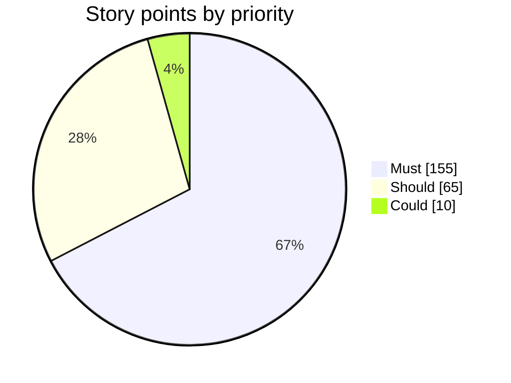
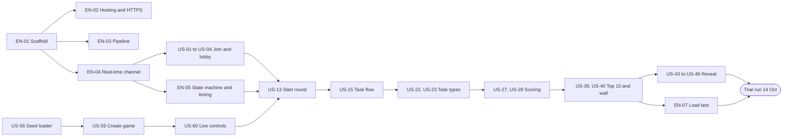

# Delivery Hero — User Stories

> Document 04 of 18 · Version 1.0 (approved)

## Document control

| Field | Value |
|---|---|
| Project | Delivery Hero |
| Document | 04 — User Stories |
| Version | 1.0 |
| Status | Approved on 23 September 2026 |
| Owner and approver | [Owner name] |
| Date | 23 September 2026 |
| Depends on | 01 — Charter v1.2 · 02 — PRD v1.0 (F-01 to F-58) · 03 — SRS v1.0 (FR-001 to FR-093) |
| Feeds into | 05 — Acceptance Criteria (one set per story) · 14 — Test Plan · 15 — Test Cases |
| New decisions | None. This document plans delivery; it doesn't change product behavior |

### Revision history

| Version | Date | Author | Summary of changes |
|---|---|---|---|
| 0.1 | 2026-09-23 | [Owner name] | First draft |
| 1.0 | 2026-09-23 | [Owner name] | Approved |

---

## 1. Purpose

This document breaks Delivery Hero version 1.0 into user stories: small, valuable, testable slices of work, each written from the point of view of the person who benefits. It sizes them, orders them into sprints that meet the Charter's milestones, and says what to cut first if time runs short.

## 2. Scope

The backlog covers every PRD feature (F-01 to F-58) and every SRS functional requirement (FR-001 to FR-093), plus the technical enabler stories needed to build them. Detailed Given/When/Then acceptance criteria for each story are in document 05. Stories for later releases are listed in section 10 as "Won't (v1.0)".

## 3. Definitions

| Term | Meaning |
|---|---|
| Epic | A large body of work grouping related stories. The epics match the PRD (EP-01 to EP-12). |
| User story | A small slice of value in the form "As a *who*, I want *what*, so that *why*". IDs are US-nn. |
| Enabler story | Technical groundwork that no user sees directly but that other stories need. IDs are EN-nn. |
| Story points | Relative size on the scale 1, 2, 3, 5, 8, comparing effort and uncertainty between stories. They are not hours. |
| Velocity | Story points completed per sprint, measured after each sprint to check the plan. |
| INVEST | Quality checklist for stories: Independent, Negotiable, Valuable, Estimable, Small, Testable. |
| Definition of Ready | The conditions a story must meet before work starts (section 5). |
| Definition of Done | The conditions a story must meet to count as finished (section 5). |

## 4. Assumptions

- Charter assumptions A-01 to A-08 and PRD assumptions A-09 to A-11 apply.
- Story points are initial estimates by the drafter; the owner adjusts them at sprint planning, and Sprint 0's actual pace calibrates the rest of the plan.
- Until the run plan editor (US-57) is built, games use the run plans from the seed file (US-56), so the core game loop can be tested early with real content.

## 5. Working agreements

### 5.1 Story roles

| Role in stories | Who it is (PRD personas) |
|---|---|
| Player | Sam (developer), Priya (tester), Arjun (business analyst) |
| Latecomer, iPhone player | Specific player situations |
| Host | The admin running the live game (the owner) |
| Admin | Anyone with the shared admin password |
| Room audience | Everyone watching the projector |
| Owner | The owner in their developer and operator role |

### 5.2 Definition of Ready

- The story has an ID, a clear "As a… I want… so that…", a priority and points.
- Its acceptance criteria are written in document 05.
- Its dependencies are done or planned earlier in the same sprint.
- If it has a screen, the screen is covered by document 12 (UI/UX Wireframes).
- It's 8 points or smaller; anything bigger is split.

### 5.3 Definition of Done

- Merged into main through a pull request with every merge check green: tests, formatting, code analysis, and at least 80% coverage on scoring and game logic (DEC-68).
- Every acceptance criterion in document 05 passes, with automated tests for each business rule it touches.
- Deployed to production by the pipeline and smoke-checked.
- Meets the relevant non-functional requirements, including no new accessibility problems (WCAG 2.2 AA) and no personal data in logs.
- Documentation updated if the story changed behavior or an interface.

## 6. Backlog

Priorities come from the PRD features each story delivers. Sprints: **S0** Foundations, **S1** Core game loop, **S2** Projector, reveal and admin, **H** Hardening (section 8).

### 6.1 Enabler stories

| ID | Story | Priority | Points | Traces to | Sprint |
|---|---|---|---|---|---|
| EN-01 | As the owner, I want the repository scaffold (Next.js static export, Spring Boot on Java 21, PostgreSQL with Flyway) running locally in Docker Compose, so that development can start on day one. | Must | 3 | DEC-65, DEC-66, DEC-67, NFR-42 | S0 |
| EN-02 | As the owner, I want the Oracle Cloud machine provisioned with Docker, Nginx and HTTPS on the free subdomain, serving a deployed walking skeleton, so that hosting risks surface in the first week. | Must | 5 | DEC-58, DEC-60, R-02, NFR-13 | S0 |
| EN-03 | As the owner, I want a GitHub Actions pipeline that runs the merge checks and deploys every merge to production, so that everything shipped is tested. | Must | 3 | DEC-61, DEC-68, NFR-41, NFR-43 | S0 |
| EN-04 | As the owner, I want a STOMP-over-WebSocket foundation with token-based connections for players, the projector and admins, plus heartbeats and automatic reconnection, so that every live feature shares one reliable channel. | Must | 5 | SRS 6.2, SRS 6.3, NFR-03 | S0 |
| EN-05 | As the owner, I want a server-side game state machine and scheduler that drive the countdown, phases, incident moment, freeze and round end, so that all timing is consistent and decided in one place. | Must | 5 | SRS 3.1, SRS 3.2, FR-021 | S1 |
| EN-06 | As the owner, I want security basics in place (HTTPS redirect, security headers, content security policy, rate limits and CSRF protection), so that the app is safe by default. | Must | 3 | NFR-13, NFR-16, NFR-17, NFR-19, NFR-20 | S1 |
| EN-07 | As the owner, I want a k6 load test that simulates 100 players through a full round, so that I know the server meets its performance targets before the trial run. | Must | 3 | NFR-01, NFR-02, NFR-04 | S2 |
| EN-08 | As a player, I want the retro arcade theme and screen shells (self-hosted fonts, colors, layouts) in place, so that every feature looks consistent from the start. | Must | 3 | DEC-48, DEC-49, NFR-24, NFR-25 | S0 |
| EN-09 | As the owner, I want accessibility checks (contrast, target size, zoom, keyboard use, reduced motion) built into testing, so that the game meets WCAG 2.2 AA. | Should | 2 | NFR-25 to NFR-34 | S2 |

### 6.2 EP-01 Joining and lobby

| ID | Story | Priority | Points | Traces to | Sprint |
|---|---|---|---|---|---|
| US-01 | As a player, I want to join by scanning the QR code or opening the link, so that I'm in the game within seconds. | Must | 3 | F-01, FR-001, FR-002 | S0 |
| US-02 | As a player, I want to type a name and get a unique display name, so that everyone can recognize me on the big screen. | Must | 2 | F-02, FR-003, FR-004, FR-006 | S0 |
| US-03 | As a player, I want a clear message when I can't join (lobby not open, game full, joining closed or an old link), so that I know what to do next. | Must | 2 | F-01, F-02, FR-002, FR-005, FR-006 | S1 |
| US-04 | As a player, I want a lobby screen that switches by itself when the host starts, so that I never miss the beginning. | Must | 2 | F-04, FR-010 | S0 |
| US-05 | As a player whose connection dropped, I want to rejoin from the same phone and keep my score and place, so that a network blip doesn't ruin my game. | Must | 5 | F-06, FR-007, FR-008, NFR-03 | S1 |
| US-06 | As an iPhone player who opened the link in Safari, I want a notice with a copy-link button, so that I can switch to Chrome quickly. | Should | 2 | F-03, FR-009 | S2 |
| US-07 | As a player, I want to see that my name and answers are deleted after the event, so that I feel comfortable joining. | Should | 1 | F-05, FR-011 | S2 |
| US-08 | As a latecomer, I want to join a round that's already running and play with the time left, so that arriving late doesn't mean missing out. | Should | 3 | F-07, FR-012, FR-051 | S2 |
| US-09 | As a host, I want to rename or remove a player in the lobby, so that mistaken or unsuitable names never reach the big screen. | Could | 2 | F-08, FR-013 | H |

### 6.3 EP-02 Practice round

| ID | Story | Priority | Points | Traces to | Sprint |
|---|---|---|---|---|---|
| US-10 | As a player, I want a 30-second practice round with one task of each type, so that I learn the controls before points count. | Should | 3 | F-09, FR-014, FR-015, FR-016 | S2 |
| US-11 | As a host, I want to start practice and end it early if the room is ready, so that I control the pace of the session. | Should | 1 | F-09, FR-014, FR-016 | S2 |
| US-12 | As a host, I want the projector to show how many players have finished practice, so that I know when to start the round. | Could | 1 | F-10, FR-017 | H |

### 6.4 EP-03 Round engine

| ID | Story | Priority | Points | Traces to | Sprint |
|---|---|---|---|---|---|
| US-13 | As a host, I want to start the round with a 5-second countdown on every screen, so that everyone begins at the same moment. | Must | 3 | F-11, F-31, FR-019, FR-054 | S1 |
| US-14 | As a player, I want my phone's clock to match the projector's, so that the race feels fair. | Must | 3 | F-11, FR-020 | S1 |
| US-15 | As a player, I want tasks one at a time in the planned order, moving to the next phase's tasks as soon as I finish a phase, so that I'm never held back. | Must | 5 | F-12, FR-021, FR-022 | S1 |
| US-16 | As a player, I want every task to show a timer and move me on when it runs out, so that the game keeps its pace. | Must | 3 | F-13, FR-024, FR-025 | S1 |
| US-17 | As a player who has finished every task, I want a clear "done" screen, so that I know to watch the projector. | Must | 1 | F-14, FR-026 | S1 |
| US-18 | As a player, I want the round to end for everyone at zero with a "Time's up" screen, so that the ending is fair and clear. | Must | 2 | F-11, FR-027 | S1 |
| US-19 | As an admin, I want each run plan to set the round length between 3 and 10 minutes, so that the game fits the event's agenda. | Must | 1 | F-15, FR-018 | S1 |
| US-20 | As a player, I want my screen to stay awake during the round, so that my phone doesn't lock mid-task. | Should | 1 | F-11, FR-028 | S2 |
| US-21 | As the room audience, I want the projector to show the time remaining and a phase bar that follows the clock, so that we can follow the story of the sprint. | Must | 2 | F-12, F-31, FR-023, FR-054 | S1 |

### 6.5 EP-04 Task types

| ID | Story | Priority | Points | Traces to | Sprint |
|---|---|---|---|---|---|
| US-22 | As a player, I want to answer multiple-choice tasks with one tap on big arcade buttons, so that I can answer quickly and accurately. | Must | 3 | F-16, FR-029 | S1 |
| US-23 | As a player, I want to answer yes/no tasks by swiping or by tapping Yes or No, so that I can answer the way that suits me. | Must | 3 | F-17, FR-030 | S1 |
| US-24 | As a player, I want to put items in order by tapping them in sequence, with an undo, so that I can rank things on a small screen without dragging. | Should | 5 | F-18, FR-031 | S2 |
| US-25 | As a player, I want to tap the problem words in a sentence and submit, so that I can spot vague requirements and fuzzy bug reports. | Should | 5 | F-19, FR-032, FR-034 | S2 |
| US-26 | As a player, I want code shown in a readable monospace block that scrolls sideways, so that I can read it on my phone. | Should | 2 | F-20, FR-033 | S2 |

### 6.6 EP-05 Scoring and feedback

| ID | Story | Priority | Points | Traces to | Sprint |
|---|---|---|---|---|---|
| US-27 | As a player, I want answers checked on the server so that no one can cheat by reading the page's code, so that the leaderboard is fair. | Must | 5 | F-21, FR-035, FR-036, NFR-12 | S1 |
| US-28 | As a player, I want points for correct answers plus a speed bonus, and a penalty with a short lockout for wrong ones, so that both speed and accuracy matter. | Must | 5 | F-22, FR-037, FR-038 | S1 |
| US-29 | As a player, I want partial credit when I get most of an ordering or problem-word task right, so that near-misses still count. | Should | 3 | F-23, FR-039 | S2 |
| US-30 | As a player, I want a streak bonus after three fully correct answers in a row, so that consistency is rewarded. | Should | 2 | F-24, FR-040 | S2 |
| US-31 | As a player, I want instant feedback with the character's reaction after each answer, so that the game feels alive. | Must | 3 | F-25, FR-041 | S1 |
| US-32 | As a player, I want to see my total score throughout the round, so that I always know how I'm doing. | Must | 1 | F-26, FR-042 | S1 |

### 6.7 EP-06 Timed events

| ID | Story | Priority | Points | Traces to | Sprint |
|---|---|---|---|---|---|
| US-33 | As a player, I want a surprise Sev-1 incident to hit every phone at once and pause my current task, so that the whole room shares a dramatic moment. | Should | 8 | F-27, FR-043, FR-044, FR-045, FR-046, FR-047 | S2 |
| US-34 | As the room audience, I want the wall to turn red during the incident and flip back as people fix it, with the fastest fixer named, so that we can cheer them on. | Should | 3 | F-27, FR-048 | S2 |
| US-35 | As the room audience, I want the final stretch to show a red tint and a pulsing clock, so that the ending feels tense. | Could | 2 | F-28, FR-049 | H |
| US-36 | As the room audience, I want the leaderboard to freeze for the last 30 seconds, and joining to close then, so that the result stays a surprise. | Should | 2 | F-29, FR-050, FR-051 | S2 |

### 6.8 EP-07 Projector screen

| ID | Story | Priority | Points | Traces to | Sprint |
|---|---|---|---|---|---|
| US-37 | As a host, I want a secret projector link for each game that can only display, so that nobody can control the game from it. | Must | 2 | F-35, FR-052 | S1 |
| US-38 | As the room audience, I want the lobby to show a big QR code, the link and the names of players who have joined, so that joining is easy and exciting. | Must | 2 | F-30, FR-053 | S1 |
| US-39 | As the room audience, I want a live top 10 that updates smoothly, so that we can watch the race unfold. | Must | 3 | F-32, FR-055 | S2 |
| US-40 | As the room audience, I want a wall showing every player's activity but no scores, so that everyone sees themselves in the game without being ranked publicly. | Must | 5 | F-33, FR-056 | S2 |
| US-41 | As the room audience, I want a live feed of notable moments, so that highlights don't go unnoticed. | Could | 2 | F-34, FR-057 | H |
| US-42 | As a host, I want the projector to reconnect and redraw itself after a network drop, so that a blip never blanks the big screen. | Must | 2 | F-31, FR-058 | S2 |

### 6.9 EP-08 Reveal and results

| ID | Story | Priority | Points | Traces to | Sprint |
|---|---|---|---|---|---|
| US-43 | As a host, I want to move through the reveal step by step with a clicker or keyboard, so that I can build suspense at my own pace. | Must | 3 | F-36, FR-059, FR-063 | S2 |
| US-44 | As the room audience, I want to see the most-missed question with its answer and explanation, so that we can laugh and learn together. | Should | 3 | F-38, FR-060 | S2 |
| US-45 | As the room audience, I want the top 10 revealed from 10th to 2nd, then the winner with a celebration, so that the ending is dramatic. | Must | 3 | F-37, FR-061, FR-062 | S2 |
| US-46 | As a player, I want to see my rank and total on my phone only once the winner is shown, so that the reveal isn't spoiled. | Must | 2 | F-39, FR-064 | S2 |
| US-47 | As a player, I want to review the tasks I missed, with the correct answers and explanations, so that I learn something from the game. | Should | 3 | F-40, FR-065 | S2 |
| US-48 | As a player, I want a hero card with a fun title, my strongest role and my stats, so that I have something to screenshot and share. | Could | 3 | F-41, FR-066 | H |

### 6.10 EP-09 Admin access and content

| ID | Story | Priority | Points | Traces to | Sprint |
|---|---|---|---|---|---|
| US-49 | As an admin, I want to log in with the shared password and stay logged in for the event day, so that the panel is protected but convenient. | Must | 3 | F-42, FR-067 | S1 |
| US-50 | As the owner, I want repeated failed logins blocked for a while, so that nobody can guess the admin password. | Must | 1 | F-42, FR-068 | S1 |
| US-51 | As an admin, I want to create, edit, delete and preview tasks of every type, so that I can prepare content without a developer. | Must | 8 | F-43, FR-069, FR-071 | S2 |
| US-52 | As an admin, I want to filter and search the task library, so that I can find a task quickly among dozens. | Must | 2 | F-43, FR-070 | S2 |
| US-53 | As an admin, I want my saves protected from overwriting another admin's changes, so that we never lose each other's work. | Must | 2 | F-43, FR-073 | S2 |
| US-54 | As an admin, I want each game to keep its own copy of tasks when it's created, so that editing during an event can't break a running game. | Must | 3 | F-43, FR-072 | S1 |
| US-55 | As an admin, I want to edit each character's name and lines, so that the humor fits our team. | Should | 2 | F-44, FR-074 | S2 |
| US-56 | As the owner, I want to load the task pool from the seed file in one step, so that nobody types more than 70 tasks by hand. | Must | 3 | F-45, FR-075 | S1 |

### 6.11 EP-10 Run plans and games

| ID | Story | Priority | Points | Traces to | Sprint |
|---|---|---|---|---|---|
| US-57 | As an admin, I want to build a run plan with a round length, practice tasks, an incident task and ordered tasks for each phase, so that each event plays the way we designed it. | Must | 5 | F-46, FR-076 | S2 |
| US-58 | As an admin, I want a readiness check that lists errors and warnings for a run plan, so that I catch problems before the event. | Should | 3 | F-47, FR-078 | S2 |
| US-59 | As a host, I want to create a game from a run plan and get its join link, QR code and projector link, with broken plans refused, so that setting up takes a minute. | Must | 3 | F-48, FR-077, FR-079 | S1 |
| US-60 | As a host, I want a live control screen showing only the actions valid right now, plus live stats, so that I can run the event confidently. | Must | 5 | F-49, FR-080, FR-081, FR-082 | S1 |
| US-61 | As a host, I want to void a task during the round, so that a flawed question never decides the winner. | Should | 3 | F-50, FR-083 | S2 |
| US-62 | As a host, I want to cancel a game if something goes wrong, so that I can start over cleanly. | Should | 2 | F-51, FR-084 | S2 |
| US-63 | As a host, I want a test game with up to 100 simulated players, so that I can rehearse and check the projector before the event. | Should | 5 | F-52, FR-085 | S2 |

### 6.12 EP-11 After the event

| ID | Story | Priority | Points | Traces to | Sprint |
|---|---|---|---|---|---|
| US-64 | As an admin, I want a list of past games with each one's top 10, so that we remember our winners. | Must | 2 | F-53, FR-086 | S2 |
| US-65 | As a host, I want to close the event and have all other player data deleted, so that we keep our privacy promise. | Must | 2 | F-54, FR-087 | S2 |
| US-66 | As a player, I want my data deleted automatically if nobody closes the event within a day, so that the promise holds even if the host forgets. | Should | 1 | F-55, FR-088 | S2 |
| US-67 | As the owner, I want games left unfinished by a server restart to be cancelled and cleaned up, so that no half-finished game lingers. | Must | 2 | F-54, FR-089 | S2 |

### 6.13 EP-12 Operations

| ID | Story | Priority | Points | Traces to | Sprint |
|---|---|---|---|---|---|
| US-68 | As the owner, I want deployments blocked while a game is in progress, so that an automatic deploy can never stop a round. | Must | 2 | F-56, FR-090 | S2 |
| US-69 | As the owner, I want a health check with an uptime alert by email, so that I find out quickly if the server stops (for example, if Oracle reclaims the machine). | Must | 2 | F-57, FR-091 | S1 |
| US-70 | As the owner, I want logs without personal data, kept for 7 days, so that I can debug without breaking the privacy promise. | Must | 1 | F-57, FR-092 | S1 |
| US-71 | As the owner, I want automatic backups stored off the machine, with a rehearsed restore, so that tasks and results survive losing the machine. | Must | 3 | F-58, FR-093 | S2 |

## 7. Backlog summary

| Priority | Stories | Points | Share of points |
|---|---|---|---|
| Must | 52 | 155 | 67% |
| Should | 23 | 65 | 28% |
| Could | 5 | 10 | 4% |
| **Total** | **80** | **230** | 100% |

| Epic | Stories | Points | Must points |
|---|---|---|---|
| Enabler stories | 9 | 32 | 30 |
| EP-01 Joining and lobby | 9 | 22 | 14 |
| EP-02 Practice round | 3 | 5 | 0 |
| EP-03 Round engine | 9 | 21 | 20 |
| EP-04 Task types | 5 | 18 | 6 |
| EP-05 Scoring and feedback | 6 | 19 | 14 |
| EP-06 Timed events | 4 | 15 | 0 |
| EP-07 Projector screen | 6 | 16 | 14 |
| EP-08 Reveal and results | 6 | 17 | 8 |
| EP-09 Admin access and content | 8 | 24 | 22 |
| EP-10 Run plans and games | 7 | 26 | 13 |
| EP-11 After the event | 4 | 7 | 6 |
| EP-12 Operations | 4 | 8 | 8 |

## 8. Sprint plan

The sprints refine the build timeline in Charter section 12 and keep its milestones: walking skeleton by Tue 29 Sep, load test by Tue 13 Oct, trial run on Wed 14 Oct.

| Sprint | Dates | Goal | Stories | Points (Must / Should / Could) |
|---|---|---|---|---|
| S0 | Thu 24 Sep – Tue 29 Sep | Walking skeleton: a phone joins a game on production and sees the lobby update live | EN-01, EN-02, EN-03, EN-04, EN-08, US-01, US-02, US-04 | 26 (26 / 0 / 0) |
| S1 | Wed 30 Sep – Tue 6 Oct | A full round plays end to end with multiple-choice and yes/no tasks, scoring and host controls, using the seed content | EN-05, EN-06, US-03, US-05, US-13, US-14, US-15, US-16, US-17, US-18, US-19, US-21, US-22, US-23, US-27, US-28, US-31, US-32, US-37, US-38, US-49, US-50, US-54, US-56, US-59, US-60, US-69, US-70 | 80 (80 / 0 / 0) |
| S2 | Wed 7 Oct – Tue 13 Oct | Projector, reveal, admin panel and operations complete; load test passed; Should stories in build order as time allows | EN-07, EN-09, US-06, US-07, US-08, US-10, US-11, US-20, US-24, US-25, US-26, US-29, US-30, US-33, US-34, US-36, US-39, US-40, US-42, US-43, US-44, US-45, US-46, US-47, US-51, US-52, US-53, US-55, US-57, US-58, US-61, US-62, US-63, US-64, US-65, US-66, US-67, US-68, US-71 | 114 (49 / 65 / 0) |
| H | Thu 15 Oct – Mon 19 Oct | Fix trial-run findings (trial run on Wed 14 Oct); Could stories only if time allows | US-09, US-12, US-35, US-41, US-48 | 10 (0 / 0 / 10) |

**Checkpoints**

- **End of S0 (Tue 29 Sep): capacity check.** Must stories alone total 155 points. Take the points finished in S0, divide by its working days, and multiply by the working days left before the trial run (about 10). If that's less than the Must points still open, cut every Should and Could story now and review the event date (A-01) rather than discovering the gap in S2.
- **End of S1 (Tue 6 Oct):** if any S1 Must story is unfinished, drop every Could story, work down the cut order below, and consider moving the event date (A-01).
- **Trial run (Wed 14 Oct):** go/no-go per Charter section 16.

**Build order for Should stories.** Build from the top; if time runs short, cut from the bottom.

| Order | Story | Why it's here |
|---|---|---|
| 1 | US-26 Code snippets | Three seed tasks contain code; cheap to build |
| 2 | US-24, US-25, US-29 Tap to order, problem words, partial credit | 20 of the 68 seed tasks use these types. If cut, remove those tasks from the run plans |
| 3 | US-10, US-11 Practice round | Players learn the controls before points count |
| 4 | US-36 Leaderboard freeze | Small, and protects the suspense of the reveal |
| 5 | US-33, US-34 Sev-1 incident | The biggest shared moment, but also the biggest Should story |
| 6 | US-47 Review screen | Learning value after the reveal |
| 7 | US-44 Most-missed question | Opens the reveal with a talking point |
| 8 | US-30 Streak bonus | Scoring depth |
| 9 | US-63 Test game with simulated players | Rehearsal and projector preview; the k6 load test already covers capacity |
| 10 | US-06, US-08, US-20 Safari notice, late joining, screen wake lock | Smooth the edges on the day |
| 11 | US-58, US-61, US-62 Readiness check, void, cancel | Safety nets for the host |
| 12 | US-55, US-07, US-66, EN-09 Character editing, privacy note, auto-close, accessibility checks | Seed defaults, a manual close and manual checks can stand in |

Could stories (US-09, US-12, US-35, US-41, US-48) are built in hardening only if the trial run leaves time.

## 9. Key dependencies

The critical path runs from the scaffold through the real-time channel, the state machine, task flow and scoring, to the projector and reveal. Anything off this path can slip without moving the trial run.

## 10. Later releases (Won't for v1.0)

| ID | Story | Source |
|---|---|---|
| W-01 | As a player, I want to type short answers that are graded automatically, so that some tasks test real writing. | DEC-47, DEC-72 |
| W-02 | As an admin, I want to import and export tasks as a spreadsheet, so that we can write and review content in bulk. | DEC-38, DEC-72 |
| W-03 | As an admin, I want to copy a run plan, so that preparing the next event is quicker. | DEC-38, DEC-72 |
| W-04 | As a remote player, I want to join and follow the projector from anywhere, so that hybrid teams can play together. | DEC-72 |
| W-05 | As a player, I want larger text or extra time options, so that the game suits my needs. | DEC-53 |
| W-06 | As an admin, I want to edit scoring values per event, so that we can tune the game without a developer. | DEC-28 |

## 11. Traceability

Every SRS functional requirement is delivered by at least one story:

| Requirement | Priority | Stories |
|---|---|---|
| FR-001 | Must | US-01 |
| FR-002 | Must | US-01, US-03 |
| FR-003 | Must | US-02 |
| FR-004 | Must | US-02 |
| FR-005 | Must | US-03 |
| FR-006 | Must | US-02, US-03 |
| FR-007 | Must | US-05 |
| FR-008 | Must | US-05 |
| FR-009 | Should | US-06 |
| FR-010 | Must | US-04 |
| FR-011 | Should | US-07 |
| FR-012 | Should | US-08 |
| FR-013 | Could | US-09 |
| FR-014 | Should | US-10, US-11 |
| FR-015 | Should | US-10 |
| FR-016 | Should | US-10, US-11 |
| FR-017 | Could | US-12 |
| FR-018 | Must | US-19 |
| FR-019 | Must | US-13 |
| FR-020 | Must | US-14 |
| FR-021 | Must | EN-05, US-15 |
| FR-022 | Must | US-15 |
| FR-023 | Must | US-21 |
| FR-024 | Must | US-16 |
| FR-025 | Must | US-16 |
| FR-026 | Must | US-17 |
| FR-027 | Must | US-18 |
| FR-028 | Should | US-20 |
| FR-029 | Must | US-22 |
| FR-030 | Must | US-23 |
| FR-031 | Should | US-24 |
| FR-032 | Should | US-25 |
| FR-033 | Should | US-26 |
| FR-034 | Should | US-25 |
| FR-035 | Must | US-27 |
| FR-036 | Must | US-27 |
| FR-037 | Must | US-28 |
| FR-038 | Must | US-28 |
| FR-039 | Should | US-29 |
| FR-040 | Should | US-30 |
| FR-041 | Must | US-31 |
| FR-042 | Must | US-32 |
| FR-043 | Should | US-33 |
| FR-044 | Should | US-33 |
| FR-045 | Should | US-33 |
| FR-046 | Should | US-33 |
| FR-047 | Should | US-33 |
| FR-048 | Should | US-34 |
| FR-049 | Could | US-35 |
| FR-050 | Should | US-36 |
| FR-051 | Should | US-08, US-36 |
| FR-052 | Must | US-37 |
| FR-053 | Must | US-38 |
| FR-054 | Must | US-13, US-21 |
| FR-055 | Must | US-39 |
| FR-056 | Must | US-40 |
| FR-057 | Could | US-41 |
| FR-058 | Must | US-42 |
| FR-059 | Must | US-43 |
| FR-060 | Should | US-44 |
| FR-061 | Must | US-45 |
| FR-062 | Must | US-45 |
| FR-063 | Must | US-43 |
| FR-064 | Must | US-46 |
| FR-065 | Should | US-47 |
| FR-066 | Could | US-48 |
| FR-067 | Must | US-49 |
| FR-068 | Must | US-50 |
| FR-069 | Must | US-51 |
| FR-070 | Must | US-52 |
| FR-071 | Must | US-51 |
| FR-072 | Must | US-54 |
| FR-073 | Must | US-53 |
| FR-074 | Should | US-55 |
| FR-075 | Must | US-56 |
| FR-076 | Must | US-57 |
| FR-077 | Must | US-59 |
| FR-078 | Should | US-58 |
| FR-079 | Must | US-59 |
| FR-080 | Must | US-60 |
| FR-081 | Must | US-60 |
| FR-082 | Must | US-60 |
| FR-083 | Should | US-61 |
| FR-084 | Should | US-62 |
| FR-085 | Should | US-63 |
| FR-086 | Must | US-64 |
| FR-087 | Must | US-65 |
| FR-088 | Should | US-66 |
| FR-089 | Must | US-67 |
| FR-090 | Must | US-68 |
| FR-091 | Must | US-69 |
| FR-092 | Must | US-70 |
| FR-093 | Must | US-71 |

## 12. Future considerations

- Re-estimate at each sprint planning; the points here are a starting point.
- Stories US-33 and US-51 are 8 points, the largest allowed. Split them at sprint planning if they don't fit comfortably, for example US-51 into one story per task type.
- After the first event, re-rank the Won't stories using the survey results and admin feedback.

## 13. Approval

| Role | Name | Decision | Date |
|---|---|---|---|
| Owner and approver | [Owner name] | ☑ Approved | 2026-09-23 |
