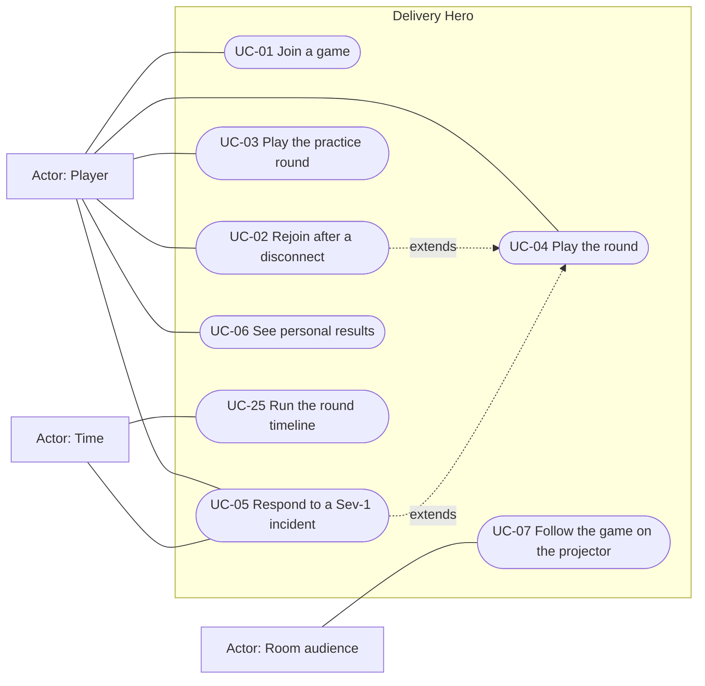
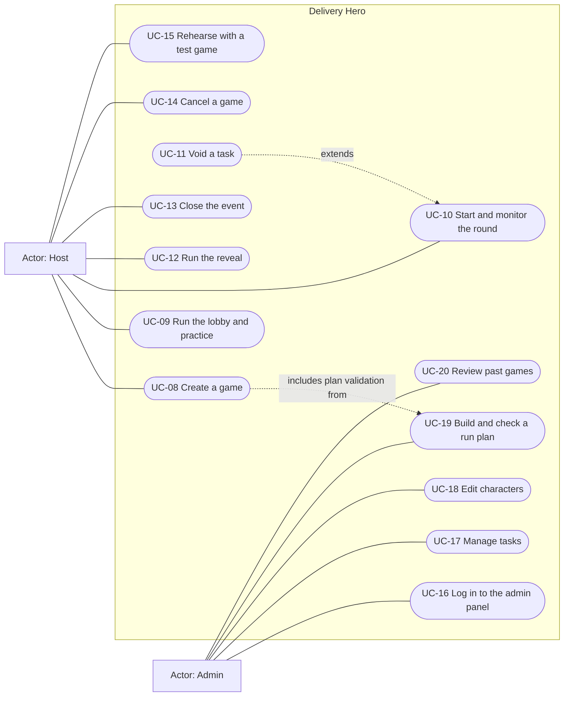
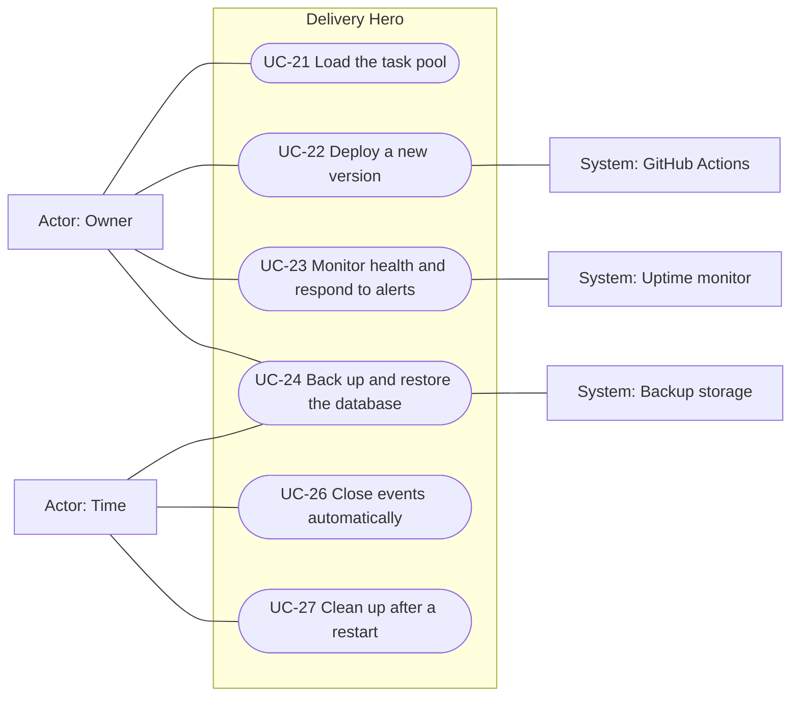
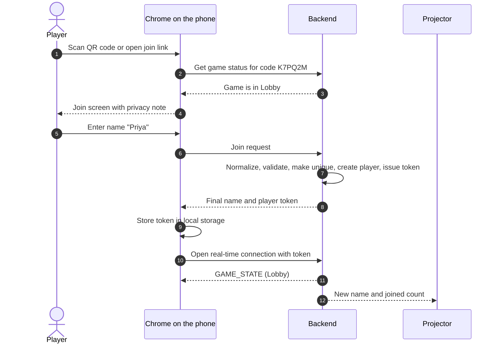
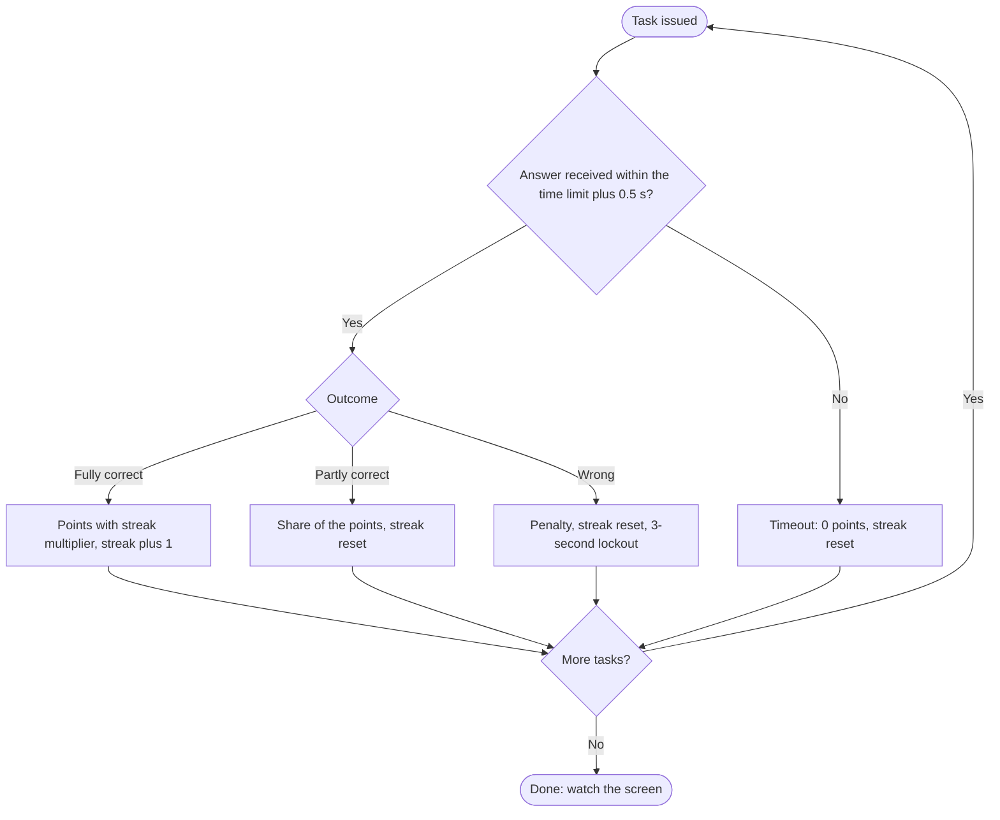
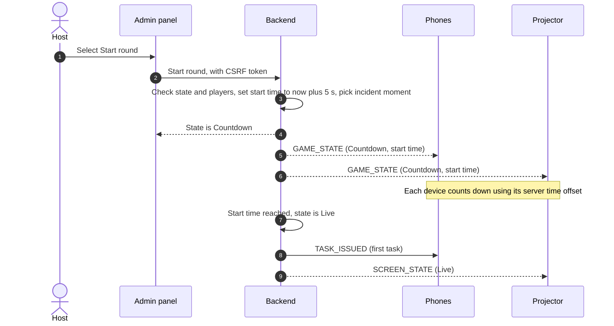
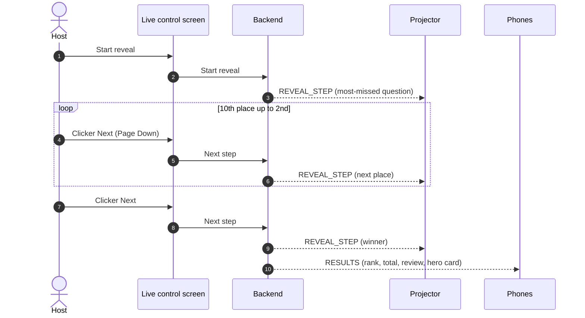
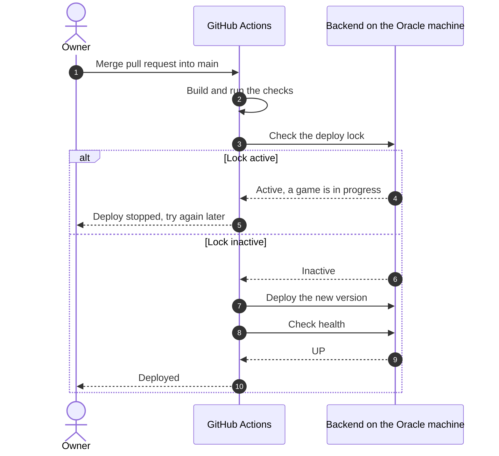

# Delivery Hero — Use Case Document

> Document 06 of 18 · Version 1.0 (approved)

## Document control

| Field | Value |
|---|---|
| Project | Delivery Hero |
| Document | 06 — Use Case Document |
| Version | 1.0 |
| Status | Approved on 23 September 2026 |
| Owner and approver | [Owner name] |
| Date | 23 September 2026 |
| Depends on | 01 — Charter v1.3 · 03 — SRS v1.1 · 04 — User Stories v1.0 · 05 — Acceptance Criteria v1.0 |
| Feeds into | 07 — HLD · 08 — LLD · 14 — Test Plan · 15 — Test Cases |
| New decisions | None |

### Revision history

| Version | Date | Author | Summary of changes |
|---|---|---|---|
| 0.1 | 2026-09-23 | [Owner name] | First draft |
| 1.0 | 2026-09-23 | [Owner name] | Approved |

---

## 1. Purpose

This document describes how each actor uses Delivery Hero to reach a goal, step by step, including what happens when things go differently. User stories (document 04) say *what* each person needs; use cases show *how* those needs play out as complete interactions, so designers can see every path the system must handle and testers can walk through them end to end.

## 2. Scope

27 use cases at user-goal level, covering players, the room audience, the host, admins, the owner as operator, and time-triggered behavior. Every user story US-01 to US-71 and every functional requirement FR-001 to FR-093 is covered (section 8). Enabler stories EN-01 to EN-09 support all use cases and appear where an actor sees their effect.

## 3. Definitions

| Term | Meaning |
|---|---|
| Actor | Someone or something outside the system that interacts with it |
| Primary actor | The actor whose goal the use case fulfils |
| Supporting actor | An actor or external system that helps the use case happen |
| Trigger | The event that starts the use case |
| Precondition | What must be true before the use case starts |
| Success guarantee | What is true when the use case ends successfully |
| Minimal guarantee | What the system guarantees even when the use case fails |
| Main success scenario | The most common path to the goal, as numbered steps |
| Extension | A different path, numbered after the step it branches from: "3a" branches from step 3, and "*a" can happen at any step |
| Extends, includes | "A extends B": A optionally interrupts B. "A includes B": A always performs B |

## 4. Assumptions

- The host is always an admin: anyone with the shared admin password can host (DEC-10).
- "System" means Delivery Hero as a whole: the backend plus the phone, projector and admin screens.
- Exact messages in double quotes come from the SRS, and every timing and scoring rule follows the SRS business rules.

## 5. Actors

| Actor | Type | Description | Main goals |
|---|---|---|---|
| Player | Primary, human | A colleague in the room, on their own phone in Chrome | Join, play, score well, see results |
| Room audience | Primary, human (passive) | Everyone watching the projector | Follow the race and the reveal together |
| Host | Primary, human | The admin running the live game from the laptop | Run the event smoothly from lobby to close |
| Admin | Primary, human | Anyone with the shared password, including the host | Prepare tasks, characters and run plans; review past games |
| Owner | Primary, human | The owner in their developer and operator role | Load content, deploy, monitor, back up |
| Time | Primary, system | The server's scheduler | Drive every timed change and automatic cleanup |
| GitHub Actions | Supporting, external system | The build and deployment pipeline | Test, check the deploy lock, deploy |
| Uptime monitor | Supporting, external system | A free external service that checks the health endpoint | Alert the owner when the server is down |
| Backup storage | Supporting, external system | Storage outside the Oracle machine | Hold database backups |

## 6. Use case overview

| ID | Use case | Primary actor | Priority | Stories |
|---|---|---|---|---|
| UC-01 | Join a game | Player | Must | US-01 to US-08 |
| UC-02 | Rejoin after a disconnect | Player | Must | US-05 |
| UC-03 | Play the practice round | Player | Should | US-10 to US-12 |
| UC-04 | Play the round | Player | Must | US-13 to US-18, US-20, US-22 to US-32, US-35 |
| UC-05 | Respond to a Sev-1 incident | Player | Should | US-33, US-34 |
| UC-06 | See personal results | Player | Must | US-46 to US-48 |
| UC-07 | Follow the game on the projector | Room audience | Must | US-12, US-21, US-34 to US-42 |
| UC-08 | Create a game | Host | Must | US-37, US-54, US-59 |
| UC-09 | Run the lobby and practice | Host | Must | US-09, US-11, US-12, US-38, US-60 |
| UC-10 | Start and monitor the round | Host | Must | US-13, US-14, US-19, US-60 |
| UC-11 | Void a task | Host | Should | US-61 |
| UC-12 | Run the reveal | Host | Must | US-43 to US-46 |
| UC-13 | Close the event | Host | Must | US-64, US-65 |
| UC-14 | Cancel a game | Host | Should | US-62 |
| UC-15 | Rehearse with a test game | Host | Should | US-63 |
| UC-16 | Log in to the admin panel | Admin | Must | US-49, US-50 |
| UC-17 | Manage tasks | Admin | Must | US-51 to US-54 |
| UC-18 | Edit characters | Admin | Should | US-55 |
| UC-19 | Build and check a run plan | Admin | Must | US-19, US-57, US-58 |
| UC-20 | Review past games | Admin | Must | US-64 |
| UC-21 | Load the task pool | Owner | Must | US-56 |
| UC-22 | Deploy a new version | Owner | Must | US-68 |
| UC-23 | Monitor health and respond to alerts | Owner | Must | US-69, US-70 |
| UC-24 | Back up and restore the database | Owner | Must | US-71 |
| UC-25 | Run the round timeline | Time | Must | US-18, US-21, US-35, US-36 |
| UC-26 | Close events automatically | Time | Should | US-63, US-66 |
| UC-27 | Clean up after a restart | Time | Must | US-67 |

### 6.1 Players, audience and the round

### 6.2 Host and admin

### 6.3 Owner, time and external systems

## 7. Use case specifications

### 7.1 Player

#### UC-01 · Join a game

| Field | Value |
|---|---|
| Primary actor | Player |
| Supporting actors | None |
| Goal | Get into the current game with a name everyone recognizes |
| Trigger | The player scans the projector's QR code or opens the join link |
| Preconditions | A game exists and its join link has been shared |
| Success guarantee | The player is in the game with a unique display name and a player token stored on their phone; they see the lobby, or tasks if the round is running; their name appears on the projector |
| Minimal guarantee | If joining fails, no partial player is created and the player sees why |
| Priority and frequency | Must · once per player per event, about 40 (up to 100) within a few minutes |
| Related | US-01 to US-08, FR-001 to FR-012, FR-051, BR-16, BR-17, BR-19, DEC-120 |

**Main success scenario**

1. The player scans the QR code or opens `https://<host>/join?code=K7PQ2M` in Chrome.
2. The system checks the browser and the game code and shows the join screen, including "Your name and answers are deleted after the event."
3. The player types a name and submits.
4. The system normalizes and validates the name, adds a number if it's taken, creates the player and issues a player token, which the phone stores.
5. The system shows the lobby screen with the final name; the projector adds the name and updates the joined count.

**Extensions**

- 2a. The browser isn't Chrome: the system shows the switch-to-Chrome notice. The player either copies the link and reopens it in Chrome (back to step 1), or taps "Continue anyway (not supported)" and continues at step 2.
- 2b. The code belongs to a closed or cancelled game, or to no game: "This game link isn't active. Ask the host for the current link." The use case ends.
- 2c. The game is in Created: "The lobby isn't open yet. Hang tight!" The player tries again later.
- 2d. The freeze has begun or the round is over: "Joining has closed for this round. Enjoy the show on the big screen!" The use case ends.
- 2e. The phone already holds a valid token for this game: continue with UC-02.
- 4a. The name is invalid: the naming-rules message appears; back to step 3.
- 4b. The game already has 100 players: "This game is full." The use case ends.
- 4c. Too many join requests from the same IP address: the request is refused and the player tries again a moment later.
- 5a. The game is in Practice: the player waits in the lobby and skips practice (DEC-115).
- 5b. The round is running and the freeze hasn't begun: the player skips practice and starts at the first scored task with the time left (continue with UC-04).

#### UC-02 · Rejoin after a disconnect

| Field | Value |
|---|---|
| Primary actor | Player |
| Supporting actors | None |
| Goal | Keep playing after losing the connection, without losing score or place |
| Trigger | The phone's connection drops, or the player closes and reopens the tab |
| Preconditions | The player joined on this phone and browser, and the game isn't closed or cancelled |
| Success guarantee | The player is back with the same name, total and current task, or the next task if the current one ran out |
| Minimal guarantee | The score is never lost or counted twice, and the round clock is unaffected |
| Priority and frequency | Must · occasional; more likely on weak mobile signal |
| Related | US-05, FR-007, FR-008, FR-025, FR-046, FR-056, DEC-89, DEC-122, NFR-03 |

**Main success scenario**

1. The connection drops; the phone shows "Reconnecting…" and retries after 0.5 s, 1 s, 2 s, then every 2 s.
2. The system shows the player as offline on the wall as soon as the connection closes, or within 20 seconds. The task timer keeps running.
3. The network returns and the phone reconnects with its token.
4. The system restores the player and sends the current state, including the current task with its remaining time.
5. The player's square on the wall returns to normal.

**Extensions**

- 3a. The player opens the link on a different phone or browser: there's no token, so they join as a new player (UC-01).
- 4a. The current task ran out while they were away: it's recorded as a timeout, the streak resets, and the next task is sent.
- 4b. The incident is running: the phone gets it with its remaining time (UC-05).
- 4c. The round is over: the phone shows "Time's up! Eyes on the screen.", or the personal results if the winner has been shown.
- 4d. The game was cancelled or closed meanwhile: "The host ended this game." or "This game has finished."
- 4e. The host removed the player: "The host removed you from this game."

#### UC-03 · Play the practice round

| Field | Value |
|---|---|
| Primary actor | Player |
| Supporting actors | Host, who starts practice |
| Goal | Learn the controls before points count |
| Trigger | The host starts practice (UC-09) |
| Preconditions | The player is in the lobby, and the game's snapshot has practice tasks |
| Success guarantee | The player has tried each task type, nothing is recorded, and the game is back in Lobby |
| Minimal guarantee | No points, streaks or answers are stored |
| Priority and frequency | Should · once per event |
| Related | US-10 to US-12, FR-014 to FR-017, DEC-73, DEC-115 |

**Main success scenario**

1. The system sends the practice tasks in order and starts one shared 30-second timer.
2. The player answers each practice task.
3. The system checks each answer and shows feedback, including a 3-second lockout after a wrong one.
4. The player finishes every practice task and the phone shows "Ready!".
5. After 30 seconds, the system ends practice and returns every phone to the lobby.

**Extensions**

- 2a. A practice task's timer runs out: the next practice task appears.
- 4a. The 30 seconds end first: practice ends anyway (step 5).
- 5a. The host ends practice early: it ends immediately.
- *a. A player joins during practice: they wait in the lobby without practice tasks.

#### UC-04 · Play the round

| Field | Value |
|---|---|
| Primary actor | Player |
| Supporting actors | Host |
| Goal | Score as many points as possible by answering tasks quickly and accurately before time runs out |
| Trigger | The round's start time arrives after the countdown (UC-10), or a player joins late |
| Preconditions | The player has joined, and the game is in Countdown or Live |
| Success guarantee | Every answer is scored by the rules; the player's total and streak are up to date; the player finishes every task or the round ends |
| Minimal guarantee | Each task has exactly one recorded outcome, and no correct answer is revealed during the round |
| Priority and frequency | Must · once per player per event |
| Related | US-13 to US-18, US-20, US-22 to US-32, US-35, FR-019 to FR-042, FR-049, BR-01 to BR-09 |

**Main success scenario**

1. The phone shows the 5-second countdown, then the round clock.
2. The system issues the next task in run-plan order, with its time limit: the character's speech bubble, and code if the task has any.
3. The player answers: taps an option; swipes or taps Yes or No; taps items in order and submits; or taps the problem words and submits.
4. The system checks the answer, measures the answer time, calculates the points (base, speed bonus, share correct, streak multiplier), and updates the total and streak.
5. The system sends feedback: outcome, points, total, streak and a reaction line from the character.
6. The wall and top 10 on the projector update.
7. Steps 2 to 6 repeat, moving into the next phase's tasks as soon as a phase is finished, until the player has no tasks left.
8. The phone shows "Done! Watch the screen".

**Extensions**

- 3a. No answer reaches the server within the time limit plus 500 ms: timeout, 0 points, the streak resets, and the next task appears immediately.
- 4a. The answer is wrong, or under half right on a partial-credit task: −40 (−100 for a yes/no swipe) and a 3-second lockout before the next task.
- 4b. The answer is at least half right but not fully right: the player earns that share of the points, and the streak resets.
- 4c. The answer is for a different task, is a duplicate, or arrives during a lockout: it's rejected and the score doesn't change.
- 4d. The host voids the current task: the player gets 0 for it and moves on immediately (UC-11).
- *a. The incident fires: UC-05, then continue.
- *b. The connection drops: UC-02.
- *c. The final stretch begins (last 20% of the round): the red tint and pulsing clock appear; scoring doesn't change.
- *d. The round clock reaches zero: any open task is recorded as a timeout with 0 points, and the phone shows "Time's up! Eyes on the screen." The use case ends.
- *e. The host cancels the game: "The host ended this game."

#### UC-05 · Respond to a Sev-1 incident

| Field | Value |
|---|---|
| Primary actor | Player |
| Supporting actors | Time, which fires the incident |
| Goal | Fix the incident quickly for big points |
| Trigger | The incident moment arrives, at a random time within the Testing part of the clock |
| Preconditions | The round is live, the snapshot has an incident task, and the player is connected |
| Success guarantee | The player's incident outcome is recorded, their paused task and any lockout resume with the time they had left, and their streak is unchanged |
| Minimal guarantee | Time spent on the incident never counts against the player's paused task |
| Priority and frequency | Should · once per round |
| Related | US-33, US-34, FR-043 to FR-048, BR-08, DEC-76, DEC-86, DEC-121 |

**Main success scenario**

1. The system sends the incident to every connected player at once and pauses each player's current task and any lockout.
2. The phone shows the full-screen red incident with its 20-second timer, and the projector turns every square red.
3. The player answers.
4. The system scores the answer (200 plus up to 100 for speed), sends feedback, and restores the player's square; the first correct answer is announced on the projector, in the live feed or a banner.
5. The player's paused task resumes with the time it had left.

**Extensions**

- 1a. The player is done: they still get the incident, and return to the done screen afterwards.
- 1b. The player is disconnected: if they return while the incident's time is still running, they get it with the time left; otherwise it's skipped for them.
- 1c. The snapshot has no incident task: this use case doesn't happen.
- 3a. No answer within 20 seconds: timeout, 0 points; the paused task resumes.
- 4a. The answer is wrong: −80 and a 3-second lockout, after which the paused task, and any paused lockout, resume.

#### UC-06 · See personal results

| Field | Value |
|---|---|
| Primary actor | Player |
| Supporting actors | Host, who reveals the winner |
| Goal | Find out how they did and what they missed |
| Trigger | The host reveals the winner (UC-12) |
| Preconditions | The player took part in the round |
| Success guarantee | The player sees their rank and total, their review screen and their hero card |
| Minimal guarantee | No player sees any rank before the winner is revealed |
| Priority and frequency | Must · once per player per event |
| Related | US-46 to US-48, FR-064 to FR-066, BR-11, BR-12, DEC-77 |

**Main success scenario**

1. During the reveal, the phone shows "Time's up! Eyes on the screen."
2. The winner is shown, and the system sends each player their results.
3. The phone shows, for example, "You finished 17th of 42" and the player's total.
4. The player opens the review screen: the tasks they got wrong, partly right or didn't answer, with the correct answers and explanations.
5. The player views their hero card: title, strongest role and stats.

**Extensions**

- 4a. The player has nothing to review: the review screen says so.
- 5a. Hero cards weren't built (a Could feature): the results show rank, total and review only.
- *a. The event has been closed: results are gone, and the phone shows "This game has finished."

### 7.2 Room audience

#### UC-07 · Follow the game on the projector

| Field | Value |
|---|---|
| Primary actor | Room audience |
| Supporting actors | Host, who opens the projector link |
| Goal | Follow and enjoy the game together |
| Trigger | The host opens the game's projector link on the room screen |
| Preconditions | A game exists, and the projector laptop has Chrome and internet access |
| Success guarantee | The screen always shows the current state: lobby, practice progress, countdown, live wall and top 10, freeze and reveal |
| Minimal guarantee | The projector never shows scores on the wall, never accepts commands, and never shows data from a closed or cancelled game |
| Priority and frequency | Must · throughout every event |
| Related | US-12, US-21, US-34 to US-42, FR-017, FR-023, FR-048 to FR-050, FR-052 to FR-058 |

**Main success scenario**

1. The host opens the projector link; the screen shows the lobby with the QR code, the link, "Open this link in Chrome", the joined count and names.
2. During practice, the screen shows how many players have finished.
3. At the start, the screen shows the countdown, then the clock, the phase bar, the wall, the top 10 and the live feed.
4. Wall squares react as players answer, and the top 10 updates at most twice a second.
5. In the final stretch, the red tint and pulsing clock appear; for the last 30 seconds, the top 10 shows "Frozen".
6. At zero, the screen shows "Time's up!", then each reveal step as the host advances (UC-12).

**Extensions**

- 1a. The key is wrong or revoked: no game data is shown.
- 4a. The incident fires: the wall turns red, flips back square by square, and the first fix is announced.
- *a. The connection drops: the projector reconnects automatically and redraws the current state.
- *b. It's a test game: "TEST" is shown.

### 7.3 Host

#### UC-08 · Create a game

| Field | Value |
|---|---|
| Primary actor | Host |
| Supporting actors | None |
| Goal | Prepare a game and its links for the event |
| Trigger | The host selects "Create game" and picks a run plan |
| Preconditions | The host is logged in (UC-16), a run plan exists, and no other game (real or test) is open |
| Success guarantee | The game is in Created, with a snapshot, a game code, a join URL, a QR code and a projector URL |
| Minimal guarantee | No game is ever created from an invalid run plan |
| Priority and frequency | Must · once per event |
| Related | US-37, US-54, US-59, FR-052, FR-072, FR-077, FR-079, BR-17, DEC-100, DEC-101 |

**Main success scenario**

1. The host chooses a run plan and selects "Create game".
2. The system validates the run plan: no empty phase, every task has a valid answer, and the round length is 3–10 minutes.
3. The system takes a snapshot of the run plan, its tasks and the characters, and generates the game code and projector key.
4. The system shows the join URL, QR code and projector URL.

**Extensions**

- 1a. Another game is still open: creation is refused, with a link to that game.
- 2a. The run plan has errors: creation is refused with the reasons (see UC-19).

#### UC-09 · Run the lobby and practice

| Field | Value |
|---|---|
| Primary actor | Host |
| Supporting actors | Players |
| Goal | Get everyone joined and warmed up |
| Trigger | The host selects "Open lobby" |
| Preconditions | The game is in Created, and the projector link is open on the room screen |
| Success guarantee | Players have joined and practiced, and the game is in Lobby, ready to start |
| Minimal guarantee | Players never receive practice tasks outside practice |
| Priority and frequency | Must · once per event |
| Related | US-09, US-11, US-12, US-38, US-60, FR-013, FR-014, FR-016, FR-017, FR-053, FR-080 |

**Main success scenario**

1. The host opens the lobby; the game moves to Lobby and the projector shows the QR code.
2. Players join (UC-01) while the host watches the joined count on the live control screen.
3. The host starts practice, and the players play it (UC-03).
4. Practice ends and the game returns to Lobby.

**Extensions**

- 2a. A player joins with an unsuitable name: the host renames or removes them (a Could feature).
- 3a. The snapshot has no practice tasks: "Start practice" is disabled, and the host skips practice.
- 3b. The room is ready early: the host ends practice.

#### UC-10 · Start and monitor the round

| Field | Value |
|---|---|
| Primary actor | Host |
| Supporting actors | Players, Time |
| Goal | Start the round for everyone at once and keep it running smoothly |
| Trigger | The host selects "Start round" |
| Preconditions | The game is in Lobby with at least one player |
| Success guarantee | The round runs to zero for everyone, and the game is in Ended |
| Minimal guarantee | The round starts at most once, at the same moment for every device |
| Priority and frequency | Must · once per event |
| Related | US-13, US-14, US-19, US-60, FR-018 to FR-021, FR-080 to FR-082, DEC-93 |

**Main success scenario**

1. The host selects "Start round".
2. The system sets the start time 5 seconds ahead, broadcasts it, and picks the incident moment.
3. Phones and the projector show the countdown, and the round begins at the start time (UC-04, UC-07, UC-25).
4. The host watches the live control screen: time remaining, players joined, connected and done, the incident status, and each task's answer count and share wrong.
5. At zero, the system ends the round.

**Extensions**

- 1a. There are no players: "Start round" is disabled.
- 1b. Two admins press "Start round" at the same time: it's applied once.
- 4a. A task looks flawed, for example a very high share wrong: the host voids it (UC-11).
- 4b. Something goes badly wrong: the host cancels the game (UC-14).

#### UC-11 · Void a task

| Field | Value |
|---|---|
| Primary actor | Host |
| Supporting actors | None |
| Goal | Stop a flawed task from affecting the results |
| Trigger | The host selects Void for a task on the live control screen |
| Preconditions | The game is in Live, Frozen or Ended, and the reveal hasn't started |
| Success guarantee | The task's points are removed for everyone, the top 10 is recalculated within 1 second, and players who haven't reached the task skip it |
| Minimal guarantee | Points earned on other tasks, including streak bonuses, never change |
| Priority and frequency | Should · rare |
| Related | US-61, FR-083, BR-14, DEC-80, DEC-116 |

**Main success scenario**

1. The host selects a task and confirms voiding it.
2. The system removes that task's points, positive and negative, from every player's total.
3. The system recalculates the rankings and updates the top 10 within 1 second.
4. Players who haven't reached the task will skip it; a player currently on it gets 0 and moves on.

**Extensions**

- 1a. The reveal has already started: Void isn't offered.

#### UC-12 · Run the reveal

| Field | Value |
|---|---|
| Primary actor | Host |
| Supporting actors | Room audience, Players |
| Goal | Reveal the results with suspense |
| Trigger | The host selects "Start reveal" after the round ends |
| Preconditions | The game is in Ended |
| Success guarantee | The winner is shown, the game is in Results, and every phone shows its personal results |
| Minimal guarantee | Once the winner is shown, the reveal can't go backwards |
| Priority and frequency | Must · once per event |
| Related | US-43 to US-46, FR-059 to FR-064, BR-10, DEC-36, DEC-112 |

**Main success scenario**

1. The host starts the reveal from the live control screen.
2. The projector shows the most-missed question with its correct answer, the share of wrong answers and the explanation.
3. The host presses Next on the keyboard or clicker, and the projector shows 10th place.
4. The host keeps pressing Next through 9th to 2nd place.
5. The host presses Next; the projector shows the winner with the celebration and "Delivery Hero", and the game moves to Results.
6. Phones show personal results (UC-06).

**Extensions**

- 2a. No task has 5 attempts: the reveal starts at step 3.
- 3a. There are fewer than 10 players: the countdown starts at the lowest place.
- 3b. The host presses Back: the previous step shows again, until the winner has been shown.
- *a. The projector reconnects mid-reveal: it shows the current step.

#### UC-13 · Close the event

| Field | Value |
|---|---|
| Primary actor | Host |
| Supporting actors | None |
| Goal | Finish the event and keep the privacy promise |
| Trigger | The host selects "Close event" |
| Preconditions | The game is in Results |
| Success guarantee | The game is Closed; only its summary and top 10 remain; its join and projector URLs no longer work |
| Minimal guarantee | Deletion is all or nothing: no half-deleted game remains |
| Priority and frequency | Must · once per event |
| Related | US-64, US-65, FR-086, FR-087, DEC-45 |

**Main success scenario**

1. The host selects "Close event" and confirms.
2. The system keeps the game summary and the top 10.
3. The system permanently deletes every player, answer and token of the game.
4. Phones and the projector show "This game has finished.", and the URLs stop working.

**Extensions**

- 1a. The host never closes the event: it closes automatically after 24 hours (UC-26).

#### UC-14 · Cancel a game

| Field | Value |
|---|---|
| Primary actor | Host |
| Supporting actors | None |
| Goal | Stop a game that can't continue |
| Trigger | The host selects Cancel |
| Preconditions | The game is in any state before Results |
| Success guarantee | The game is Cancelled, all its player data is deleted, and every screen shows "The host ended this game." |
| Minimal guarantee | Nothing from the cancelled game appears in past games |
| Priority and frequency | Should · rare |
| Related | US-62, FR-084, DEC-87 |

**Main success scenario**

1. The host selects Cancel and confirms.
2. The system sets the game to Cancelled and deletes its players, answers and tokens.
3. Phones and the projector show "The host ended this game."
4. The host can now create a new game (UC-08).

#### UC-15 · Rehearse with a test game

| Field | Value |
|---|---|
| Primary actor | Host |
| Supporting actors | Admins who join on their phones |
| Goal | Rehearse the event and check the projector without real players |
| Trigger | The host selects "Start test game" |
| Preconditions | No other game is open, and a run plan exists |
| Success guarantee | A full round runs with simulated players, "TEST" shows everywhere, and the test data is deleted afterwards |
| Minimal guarantee | A test game never appears in past games |
| Priority and frequency | Should · before each event and at the trial run |
| Related | US-63, FR-085, BR-15, DEC-105 |

**Main success scenario**

1. The host picks a run plan and a number of simulated players from 0 to 100.
2. The system creates a test game labeled "TEST".
3. The host opens the lobby, and bots named "Bot 01" onwards join.
4. The host runs practice, the round and the reveal as in UC-09 to UC-12, with admins joining on their phones if they like.
5. The host closes the test game, and the system deletes it entirely.

**Extensions**

- 5a. The host forgets to close it: it's deleted 2 hours after reaching Results (UC-26).

### 7.4 Admin

#### UC-16 · Log in to the admin panel

| Field | Value |
|---|---|
| Primary actor | Admin |
| Supporting actors | None |
| Goal | Get into the admin panel securely |
| Trigger | The admin opens the admin panel |
| Preconditions | The admin knows the shared password |
| Success guarantee | The admin has a session that lasts 12 hours or until logout |
| Minimal guarantee | The password is never stored or logged in plain text |
| Priority and frequency | Must · a few times per event day |
| Related | US-49, US-50, FR-067, FR-068, DEC-42, DEC-97, DEC-98 |

**Main success scenario**

1. The admin opens the admin panel and enters the shared password.
2. The system checks it against the stored bcrypt hash.
3. The system creates a secure session cookie valid for 12 hours.
4. The admin panel opens.

**Extensions**

- 2a. The password is wrong: an error appears; back to step 1.
- 2b. The same IP address has failed 5 times within 15 minutes: attempts are refused for 15 minutes.
- *a. The session expires or the admin logs out: the next action asks them to log in again.

#### UC-17 · Manage tasks

| Field | Value |
|---|---|
| Primary actor | Admin |
| Supporting actors | None |
| Goal | Keep the task library ready for events |
| Trigger | The admin opens the task library |
| Preconditions | The admin is logged in |
| Success guarantee | The task is saved, valid and previewed, and future games use it |
| Minimal guarantee | Invalid tasks are never saved, and games already created are never affected |
| Priority and frequency | Must · during preparation |
| Related | US-51 to US-54, FR-069 to FR-073 |

**Main success scenario**

1. The admin filters the library by role, phase, kind or type, or searches the prompts.
2. The admin creates a task or opens an existing one.
3. The admin fills in the fields for its type: prompt, optional code, options, items, words or answer, time limit and explanation.
4. The admin previews the task in the phone frame.
5. The admin saves; the system validates it against SRS section 7.3 and stores it, showing warnings for a long prompt or long code.

**Extensions**

- 2a. The admin deletes a task: allowed only if no run plan uses it; otherwise refused, naming the run plans.
- 5a. The task breaks a rule: the save is refused with the reason.
- 5b. Another admin changed the task meanwhile: the save is refused with "Someone else changed this since you opened it. Reload to see their changes."
- *a. Edits never change games that already exist, because each game keeps a snapshot.

#### UC-18 · Edit characters

| Field | Value |
|---|---|
| Primary actor | Admin |
| Supporting actors | None |
| Goal | Make the characters' names and lines fit the team's humor |
| Trigger | The admin opens the character settings |
| Preconditions | The admin is logged in |
| Success guarantee | New games use the updated names and lines |
| Minimal guarantee | Each character always keeps one intro line and three lines each for correct and wrong answers |
| Priority and frequency | Should · occasionally |
| Related | US-55, FR-073, FR-074, DEC-84 |

**Main success scenario**

1. The admin opens a character: Maya, Ben, Dev or Tess.
2. The admin edits the display name, the intro line or any reaction line.
3. The admin saves, and the system validates the lengths and stores the changes.

**Extensions**

- 3a. A name is empty or a line exceeds 80 characters: the save is refused.
- 3b. Another admin changed the character meanwhile: the save is refused with the conflict message.

#### UC-19 · Build and check a run plan

| Field | Value |
|---|---|
| Primary actor | Admin |
| Supporting actors | None |
| Goal | Design how an event plays |
| Trigger | The admin creates or opens a run plan |
| Preconditions | The admin is logged in, and the task library has tasks |
| Success guarantee | A saved run plan with no readiness errors, ready for UC-08 |
| Minimal guarantee | A plan with errors can be saved as a draft but can never start a game |
| Priority and frequency | Must · during preparation |
| Related | US-19, US-57, US-58, FR-018, FR-076, FR-078, BR-13, DEC-82 |

**Main success scenario**

1. The admin sets the plan's name and round length (3–10 minutes).
2. The admin chooses the practice tasks, in order, and an incident task.
3. The admin adds scored tasks to each phase and orders them.
4. The admin runs the readiness check, and the system lists errors and warnings.
5. The admin fixes any errors and saves.

**Extensions**

- 3a. The admin adds a task from another phase, a duplicate, or a task of the wrong kind: it isn't accepted.
- 4a. There are only warnings: the plan can still be used.
- 5a. Another admin changed the plan meanwhile: the save is refused with the conflict message.

#### UC-20 · Review past games

| Field | Value |
|---|---|
| Primary actor | Admin |
| Supporting actors | None |
| Goal | See who won past events |
| Trigger | The admin opens Past games |
| Preconditions | The admin is logged in |
| Success guarantee | The admin sees each closed real game's date, run plan name, number of players and top 10 |
| Minimal guarantee | No other player data is ever shown, because it no longer exists |
| Priority and frequency | Must · occasionally |
| Related | US-64, FR-086, DEC-39 |

**Main success scenario**

1. The admin opens Past games.
2. The system lists closed real games, newest first, each with its date, run plan name, number of players and top 10.

**Extensions**

- 2a. There are no closed games yet: the list says so.

### 7.5 Owner

#### UC-21 · Load the task pool

| Field | Value |
|---|---|
| Primary actor | Owner |
| Supporting actors | None |
| Goal | Get the reviewed task pool into the database |
| Trigger | The owner runs the loader with the seed file |
| Preconditions | The deploy lock is inactive, and the seed file has been reviewed (and optionally checked with `tools/validate_seed.py`) |
| Success guarantee | Tasks, characters and run plans are imported, or updated by key |
| Minimal guarantee | If there's any error, nothing changes |
| Priority and frequency | Must · after each content review |
| Related | US-56, FR-075, DEC-40, DEC-117 |

**Main success scenario**

1. The owner runs the loader with `seed/delivery-hero-seed.json`.
2. The system validates the whole file.
3. The system imports everything in one transaction, updating any item whose key already exists.
4. The system reports what was imported.

**Extensions**

- 1a. The deploy lock is active: the loader refuses to run.
- 2a. The file has errors: nothing is imported, and the report lists each error with its key.

#### UC-22 · Deploy a new version

| Field | Value |
|---|---|
| Primary actor | Owner |
| Supporting actors | GitHub Actions |
| Goal | Ship a change safely |
| Trigger | The owner merges a pull request into main |
| Preconditions | The change is in a pull request |
| Success guarantee | The new version runs in production and the health check reports UP |
| Minimal guarantee | Nothing is deployed while a game is in progress, and failed checks never reach production |
| Priority and frequency | Must · several times a week during the build |
| Related | US-68, EN-03, FR-090, DEC-61, DEC-68, DEC-103 |

**Main success scenario**

1. The owner opens a pull request, and GitHub Actions runs the tests, formatting, code analysis and coverage checks.
2. The checks pass and the owner merges into main.
3. The pipeline checks the deploy lock and finds it inactive.
4. The pipeline builds and deploys to the Oracle machine.
5. The pipeline checks the health endpoint, which reports UP.

**Extensions**

- 1a. A check fails: the merge is blocked.
- 3a. The lock is active because a game is in progress: the deploy stops and says why; the owner re-runs it later.
- 5a. The health check fails: the run is marked failed and GitHub notifies the owner.

#### UC-23 · Monitor health and respond to alerts

| Field | Value |
|---|---|
| Primary actor | Owner |
| Supporting actors | Uptime monitor |
| Goal | Find out quickly when the server is down, and fix it |
| Trigger | The uptime monitor's scheduled check |
| Preconditions | The uptime monitor is set up with the owner's email |
| Success guarantee | The owner is alerted within about 10 minutes of an outage and the service is restored |
| Minimal guarantee | Logs from the incident contain no personal data |
| Priority and frequency | Must · continuous, alerts rare |
| Related | US-69, US-70, FR-091, FR-092, DEC-62, R-02 |

**Main success scenario**

1. The uptime monitor checks the health endpoint every 5 minutes.
2. After 2 consecutive failures, it emails the owner.
3. The owner checks the machine in the Oracle console and reviews the logs.
4. The owner restarts the machine or the containers, and the health check reports UP again.

**Extensions**

- 3a. Oracle stopped the machine for being idle: the owner restarts it from the console.
- 4a. A game was in progress during the outage: it's cancelled when the backend restarts (UC-27).
- *a. Before every event, the owner runs the pre-event checklist in the Deployment Guide.

#### UC-24 · Back up and restore the database

| Field | Value |
|---|---|
| Primary actor | Owner |
| Supporting actors | Time, Backup storage |
| Goal | Make sure tasks and results survive losing the machine |
| Trigger | The daily schedule (backup), or the owner's decision (restore) |
| Preconditions | Off-machine backup storage is configured (Deployment Guide) |
| Success guarantee | A recent backup exists off the machine, and a restore brings back tasks, characters, run plans and past top 10s |
| Minimal guarantee | Backups older than the retention period are deleted, so deleted player data doesn't linger |
| Priority and frequency | Must · daily backup; restore rehearsed before the trial run |
| Related | US-71, FR-093, NFR-10, OI-07 |

**Main success scenario**

1. The system runs the daily database backup and copies it to the backup storage.
2. The system deletes backups older than the retention period.
3. When needed, or as a rehearsal before the trial run, the owner restores a backup to a fresh database following the Deployment Guide.
4. The owner checks that tasks, characters, run plans and past top 10s are present.

**Extensions**

- 1a. The backup fails: the failure is logged, and the pre-event checklist catches it.

### 7.6 Time-triggered

#### UC-25 · Run the round timeline

| Field | Value |
|---|---|
| Primary actor | Time |
| Supporting actors | Players, Room audience |
| Goal | Drive every timed change the same way for every device |
| Trigger | The round's start time arrives |
| Preconditions | The game is in Countdown |
| Success guarantee | Phases, the incident, the final stretch, the freeze and the end happen at their exact times for everyone |
| Minimal guarantee | Only the server decides when tasks expire and when the round ends |
| Priority and frequency | Must · once per round |
| Related | EN-05, US-18, US-21, US-35, US-36, FR-021, FR-023, FR-027, FR-049 to FR-051, BR-18 |

**Main success scenario**

1. At the start time, the game moves to Live and clocks start.
2. At each phase boundary (20%, 60% and 80% of the round), the projector's phase bar advances.
3. At the incident moment, UC-05 runs.
4. At 80% of the round, the final stretch visuals begin.
5. With 30 seconds left, the game moves to Frozen: the top 10 freezes and joining closes.
6. At zero, the game moves to Ended: open tasks are recorded as timeouts and phones show "Time's up! Eyes on the screen."

#### UC-26 · Close events automatically

| Field | Value |
|---|---|
| Primary actor | Time |
| Supporting actors | None |
| Goal | Keep the privacy promise even if nobody closes the event |
| Trigger | The server's periodic check |
| Preconditions | None |
| Success guarantee | Real games left in Results for 24 hours are closed, and test games are deleted 2 hours after reaching Results |
| Minimal guarantee | Only games in Results are ever closed automatically |
| Priority and frequency | Should · continuous |
| Related | US-63, US-66, FR-085, FR-088, DEC-79 |

**Main success scenario**

1. The system finds real games that have been in Results for 24 hours since their round ended, and closes each as in UC-13.
2. The system finds test games that reached Results more than 2 hours ago, and deletes them entirely.

#### UC-27 · Clean up after a restart

| Field | Value |
|---|---|
| Primary actor | Time (server start-up) |
| Supporting actors | None |
| Goal | Never leave a half-finished game behind |
| Trigger | The backend starts |
| Preconditions | None |
| Success guarantee | No game remains in Lobby through Reveal, and the player data of interrupted games is deleted |
| Minimal guarantee | Games in Created and Results are untouched |
| Priority and frequency | Must · after any restart |
| Related | US-67, FR-089, DEC-57, DEC-102 |

**Main success scenario**

1. The backend starts.
2. The system finds games in Lobby through Reveal, sets them to Cancelled and deletes their player data.
3. Phones and the projector that reconnect show "The host ended this game."

## 8. Traceability

| Story | Use cases |
|---|---|
| US-01 | UC-01 |
| US-02 | UC-01 |
| US-03 | UC-01 |
| US-04 | UC-01 |
| US-05 | UC-01, UC-02 |
| US-06 | UC-01 |
| US-07 | UC-01 |
| US-08 | UC-01 |
| US-09 | UC-09 |
| US-10 | UC-03 |
| US-11 | UC-03, UC-09 |
| US-12 | UC-03, UC-07, UC-09 |
| US-13 | UC-04, UC-10 |
| US-14 | UC-04, UC-10 |
| US-15 | UC-04 |
| US-16 | UC-04 |
| US-17 | UC-04 |
| US-18 | UC-04, UC-25 |
| US-19 | UC-10, UC-19 |
| US-20 | UC-04 |
| US-21 | UC-07, UC-25 |
| US-22 | UC-04 |
| US-23 | UC-04 |
| US-24 | UC-04 |
| US-25 | UC-04 |
| US-26 | UC-04 |
| US-27 | UC-04 |
| US-28 | UC-04 |
| US-29 | UC-04 |
| US-30 | UC-04 |
| US-31 | UC-04 |
| US-32 | UC-04 |
| US-33 | UC-05 |
| US-34 | UC-05, UC-07 |
| US-35 | UC-04, UC-07, UC-25 |
| US-36 | UC-07, UC-25 |
| US-37 | UC-07, UC-08 |
| US-38 | UC-07, UC-09 |
| US-39 | UC-07 |
| US-40 | UC-07 |
| US-41 | UC-07 |
| US-42 | UC-07 |
| US-43 | UC-12 |
| US-44 | UC-12 |
| US-45 | UC-12 |
| US-46 | UC-06, UC-12 |
| US-47 | UC-06 |
| US-48 | UC-06 |
| US-49 | UC-16 |
| US-50 | UC-16 |
| US-51 | UC-17 |
| US-52 | UC-17 |
| US-53 | UC-17 |
| US-54 | UC-08, UC-17 |
| US-55 | UC-18 |
| US-56 | UC-21 |
| US-57 | UC-19 |
| US-58 | UC-19 |
| US-59 | UC-08 |
| US-60 | UC-09, UC-10 |
| US-61 | UC-11 |
| US-62 | UC-14 |
| US-63 | UC-15, UC-26 |
| US-64 | UC-13, UC-20 |
| US-65 | UC-13 |
| US-66 | UC-26 |
| US-67 | UC-27 |
| US-68 | UC-22 |
| US-69 | UC-23 |
| US-70 | UC-23 |
| US-71 | UC-24 |

All 71 user stories and all 93 functional requirements (FR-001 to FR-093) appear in at least one use case's Related field. Enabler stories EN-01 to EN-09 support every use case; EN-03 and EN-05 are named where their effects are visible (UC-22 and UC-25).

## 9. Future considerations

- **Remote and hybrid play** would add a "Remote player" actor to UC-01 and UC-07, and nothing in these use cases assumes a shared room.
- **Typed answers (Jev)** would add an extension to UC-04 step 3 and a grading step to step 4.
- **Spreadsheet import and export** and **copying run plans** would add use cases under Admin.
- **Several games at once** would remove UC-08's extension 1a.

## 10. Approval

| Role | Name | Decision | Date |
|---|---|---|---|
| Owner and approver | [Owner name] | ☑ Approved | 2026-09-23 |
