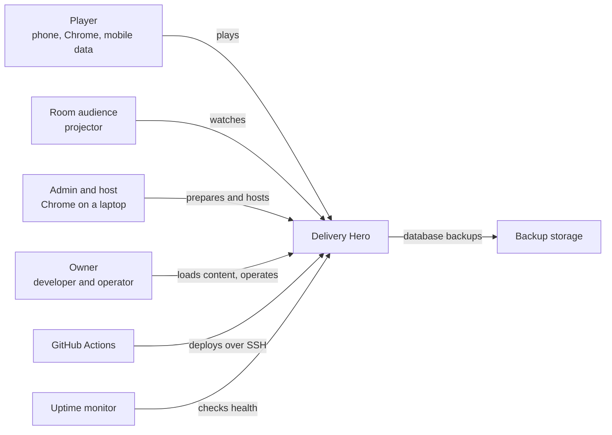
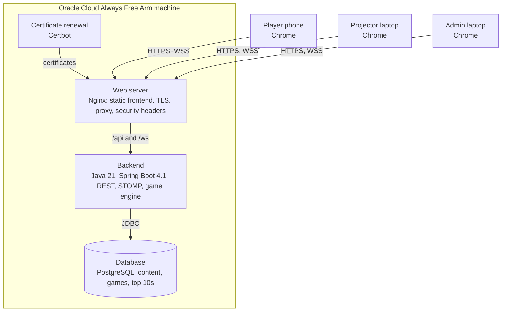
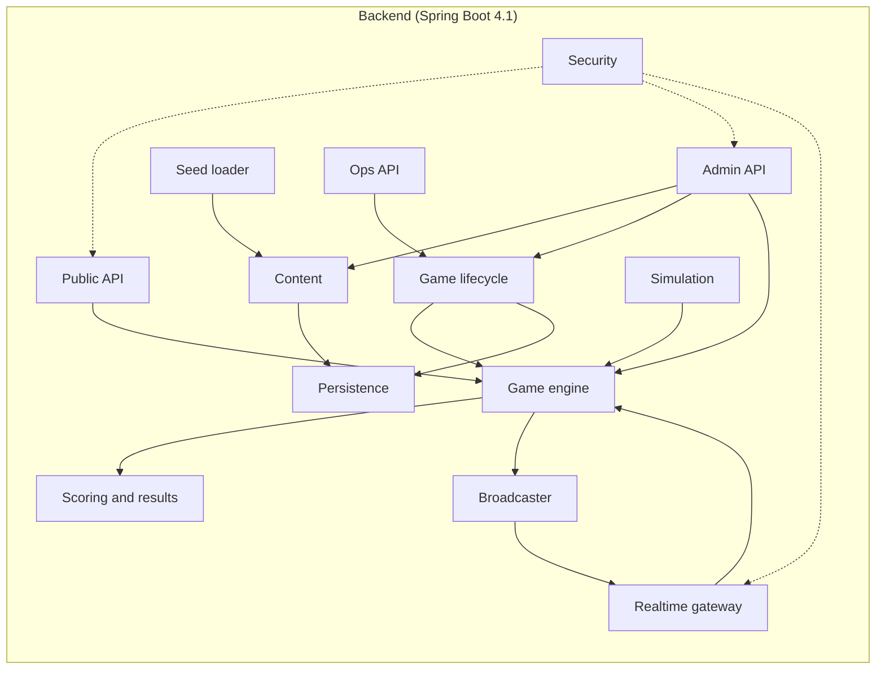
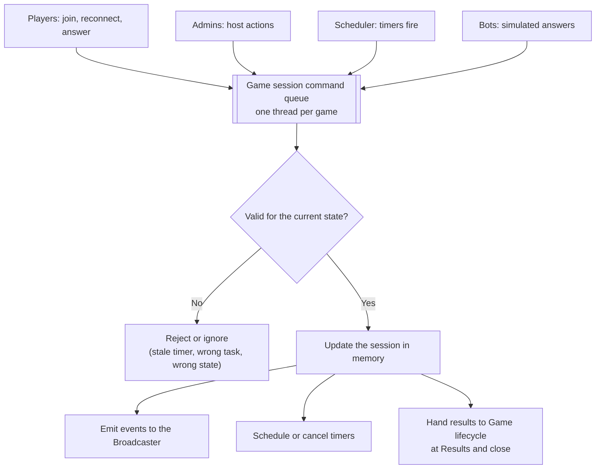
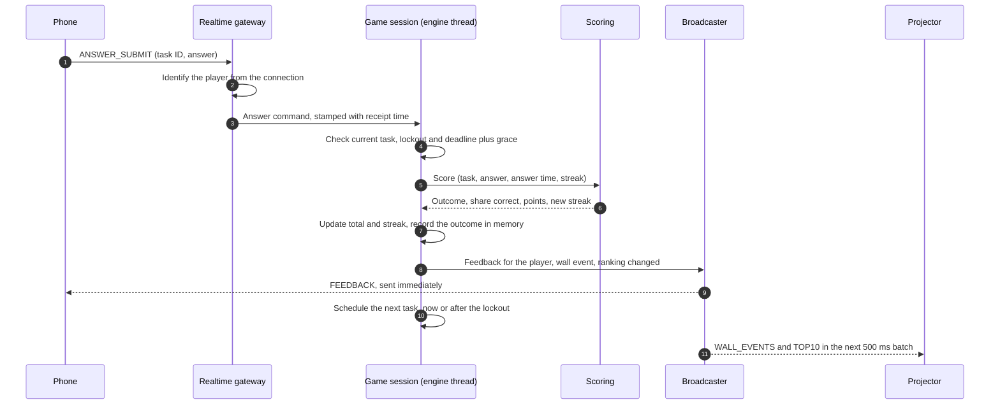
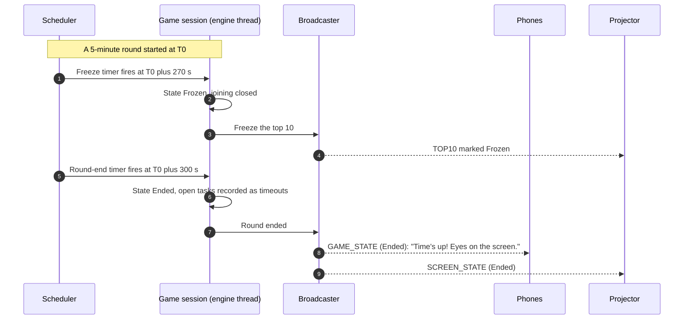
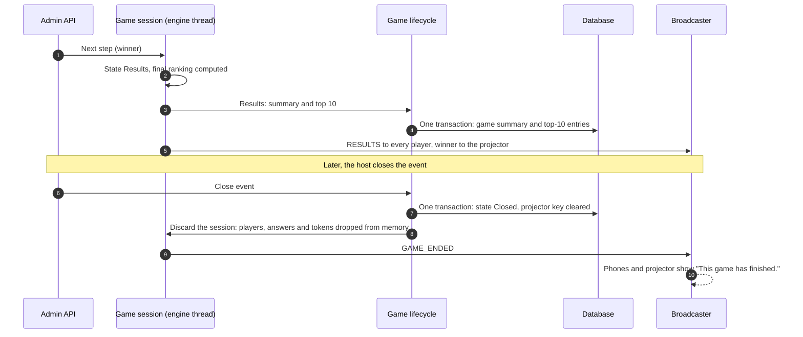
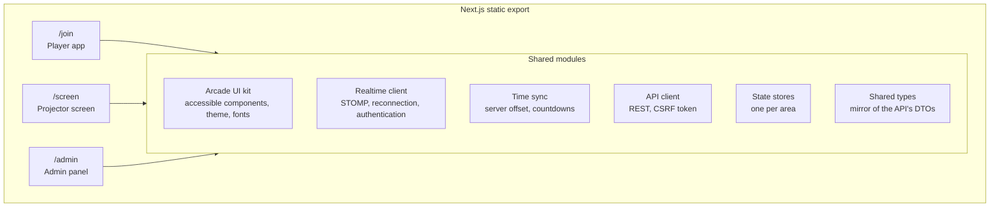
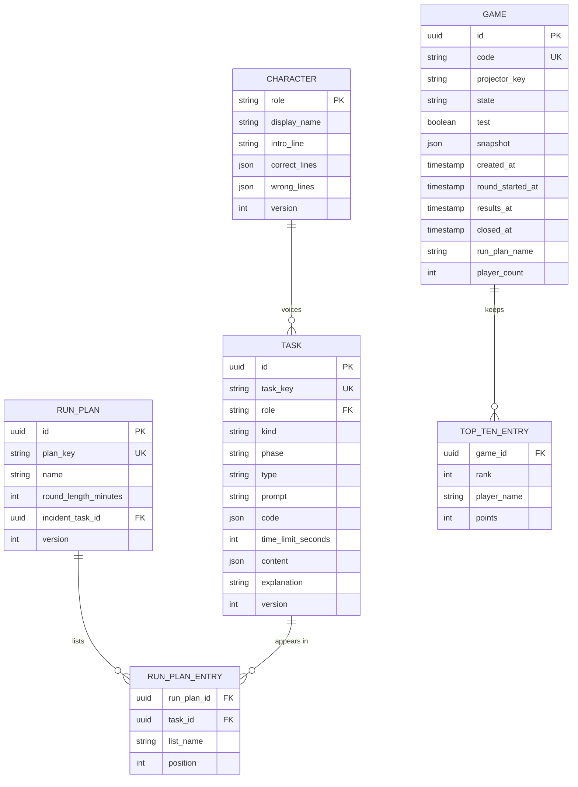
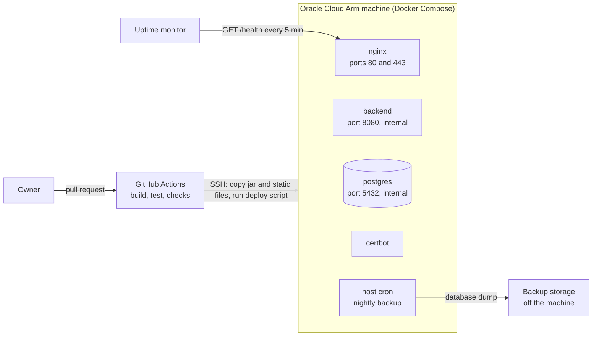

# Delivery Hero — High-Level Design (HLD)

> Document 07 of 18 · Version 1.1 (approved) · Drafted with Claude, approved by the owner

## Document control

| Field | Value |
|---|---|
| Project | Delivery Hero |
| Document | 07 — High-Level Design (HLD) |
| Version | 1.1 |
| Status | Approved on 23 September 2026 |
| Owner and approver | [Owner name] |
| Date | 23 September 2026 |
| Drafting note | Drafted with Claude; reviewed and approved by the owner |
| Depends on | 01 — Charter v1.4 (DEC-01 to DEC-123) · 03 — SRS v1.1 · 06 — Use Case Document v1.0 |
| Feeds into | 08 — LLD · 09 — Software Architecture Document · 10 — Database Design · 11 — API Specification · 16 — Deployment Guide |

### Revision history

| Version | Date | Author | Summary of changes |
|---|---|---|---|
| 0.1 | 2026-09-23 | [Owner name], drafted with Claude | First draft |
| 1.0 | 2026-09-23 | [Owner name] | Approved. HD-01 to HD-15 recorded as DEC-124 to DEC-138 (Charter v1.5) |
| 1.1 | 2026-09-23 | [Owner name], drafted with Claude | Editorial correction found while writing the LLD: section 11 said every send from a projector connection is rejected, but the projector must send time-sync requests (SRS 3.5). It now allows those, which change nothing |

---

## 1. Purpose

This document describes how Delivery Hero is built at the level of containers, components and their interactions: what runs where, which part owns which responsibility, how data and messages flow, and why the main design choices were made. It is the bridge between the requirements (SRS) and the detailed class-level design (LLD).

## 2. Scope

The whole of version 1.0: the static frontend (player app, projector screen, admin panel), the Spring Boot backend, the PostgreSQL database, the Nginx web server, and their deployment on the Oracle Cloud machine. Class-level detail, database columns and message schemas are left to documents 08, 10 and 11.

## 3. Definitions

| Term | Meaning |
|---|---|
| C4 model | A way of describing software at four zoom levels: context, containers, components and code. This document covers the first three |
| Container | A separately running or deployed unit: the web server, the backend, the database |
| Component | A module inside a container with a clear responsibility |
| Game engine | The backend component that runs live games in memory |
| Game session | The in-memory object holding everything about one live game: state, clock, players, scores |
| Command | A request to change a game session: a join, an answer, a host action or a timer firing |
| Snapshot | The copy of a run plan, its tasks and the characters that a game takes when it's created (DEC-100) |
| DTO | Data transfer object: the shape of data sent to a client |
| Destination | A STOMP address that clients subscribe to or send to, such as `/topic/games/{id}/screen` |
| Simple broker | Spring's built-in, in-memory STOMP message broker |

## 4. Assumptions and constraints

- Charter constraints C-01 to C-06 apply, including C-04 as updated by DEC-123: Java 21 with Spring Boot 4.1.
- One server, one game at a time, up to 100 players (DEC-34, DEC-57).
- The server's clock is kept accurate by the operating system's time synchronization.
- Exact library and image versions are pinned in document 09 (Software Architecture Document).

## 5. Design goals and principles

| Goal | Principle | Source |
|---|---|---|
| Fair, consistent timing | The server's clock is the only one that decides anything; devices only display it | DEC-31, DEC-94, DEC-95 |
| Nothing breaks mid-event | One process, few moving parts, a deploy lock and a rehearsed restore | DEC-57, DEC-61 |
| Privacy by design | Player data lives only in memory and disappears when the event closes | DEC-45 |
| Fast feedback | Nothing on the answer path waits for the database | DEC-56 |
| Buildable by one person in four weeks | A modular monolith with clear internal boundaries; no microservices and no external broker | DEC-64 |
| $0 running cost | Everything on one free Oracle machine | DEC-05, DEC-58 |
| Ready for later releases | Game-scoped message addresses, pluggable task types and scoring values in configuration | DEC-28, DEC-72 |

## 6. System context

The people and systems around Delivery Hero are described in Charter section 7.3 and in the actors table of document 06. At this level, the system is one black box reached over HTTPS and secure WebSockets.

## 7. Container view

| Container | Technology | Responsibility |
|---|---|---|
| Web server | Nginx | Serves the static frontend; terminates TLS; redirects HTTP to HTTPS; proxies `/api` and `/ws` to the backend; exposes only `/health` from the backend's operational endpoints; adds security headers and the content security policy |
| Frontend | Next.js static export (React, TypeScript, Tailwind CSS) | Three areas in one build: player app (`/join`), projector screen (`/screen`) and admin panel (`/admin`) |
| Backend | Java 21, Spring Boot 4.1 | REST API, STOMP messaging, the in-memory game engine, content management, housekeeping and the seed loader command |
| Database | PostgreSQL | Tasks, characters, run plans, game records and top-10 lists. Never live player data (HD-01) |
| Certificate renewal | Certbot | Obtains and renews Let's Encrypt certificates for the free subdomain |

## 8. Backend design

### 8.1 Components

| Component | Responsibility | Main requirements |
|---|---|---|
| Public API | Game status and joining over REST | FR-001 to FR-012 |
| Admin API | Login, content, run plans, games and host actions over REST | FR-013, FR-067 to FR-089 |
| Ops API | Health check (public through Nginx) and deploy-lock status (reachable only on the machine) | FR-090, FR-091 |
| Realtime gateway | The STOMP endpoint: authenticates connections, enforces subscription rules, routes answers and time-sync requests to the engine | SRS 6.2, FR-052 |
| Security | Admin sessions, CSRF protection, rate limits, token and key checks | FR-067, FR-068, NFR-13 to NFR-18 |
| Game engine | One in-memory game session per live game, each processing its commands on its own thread: state machine, task flow, timers, incident, freeze and reveal | FR-014 to FR-066 |
| Scoring and results | Pure functions for BR-01 to BR-12: points, outcomes, streaks, ranking, most-missed question, review entries and hero cards | BR-01 to BR-12 |
| Broadcaster | Sends player messages immediately and batches projector and admin updates every 500 ms | FR-041, FR-055, NFR-02 |
| Content | Tasks, characters and run plans: storage, validation and the readiness check | FR-069 to FR-078 |
| Game lifecycle | Creating games with snapshots; closing, cancelling, automatic closing, test-game cleanup and start-up cleanup; the deploy-lock status | FR-079, FR-084 to FR-090 |
| Simulation | Bots for test games, running inside the engine | FR-085, BR-15 |
| Seed loader | A one-off command that imports the seed file through Content's validation | FR-075 |
| Persistence | JPA repositories and Flyway migrations | NFR-42 |

**Design rule.** The engine's threads never touch the database or the network directly. They hand work to the Broadcaster (messages) and to Game lifecycle (database writes at Results and close), so a slow database can never delay feedback.

### 8.2 Game engine

Each live game has one game session in memory with its own command queue, processed one command at a time on a dedicated thread (HD-02). Commands come from four sources: players (join, reconnect, answer), admins (host actions), the scheduler (timers) and bots (test games).

Key behaviors:

- **Timers are commands.** Task deadlines (plus the 500 ms grace period), lockout ends, practice end, the round start, phase changes, the incident, the freeze and the round end are all scheduled as commands into the same queue. Each timer carries the sequence number of the task or lockout it belongs to, so a timer for a task that was already answered is simply ignored (HD-03).
- **Incident pause.** When the incident starts, the engine records each player's remaining task time and lockout time and cancels those timers. When that player finishes the incident, it reschedules them with the remaining time (FR-044, FR-045).
- **Disconnections don't pause anything.** A disconnect only unbinds the player's connection; their timers keep running (DEC-89). A reconnect rebinds it and triggers a full state message.
- **Answer keys stay inside the engine.** The session holds the snapshot with its answers; everything sent out is built from a public view without answer fields (HD-07).

### 8.3 Answering a task

### 8.4 Timed events

### 8.5 Reaching Results and closing the event

## 9. Frontend design

### 9.1 Structure

One Next.js project, built as a static export (DEC-67) and served by Nginx, with three areas that share a common toolkit.

| Area | Screens (detailed in document 12) |
|---|---|
| `/join` | Switch-to-Chrome notice, join, lobby, practice, countdown, the four task types, lockout, incident, done, time's up, results, review, hero card |
| `/screen` | Lobby with QR code, practice progress, live (wall, top 10, feed, phase bar, clock), frozen, reveal steps |
| `/admin` | Login, task library and editor with preview, characters, run plans with readiness check, games and live control screen, test game, past games |

### 9.2 Real-time client

- **Connection.** One STOMP connection per screen over a plain secure WebSocket at `/ws`. The player token or projector key is sent in the STOMP CONNECT headers, never in a URL of an API request (HD-10). The admin panel uses its session cookie.
- **Reconnection.** Retries after 0.5 s, 1 s, 2 s and then every 2 s, showing "Reconnecting…" (SRS 6.3). After reconnecting, the client replaces its whole state with the server's snapshot.
- **Time sync.** On connect and every 60 seconds, the client estimates its server time offset from the fastest of three request-and-reply exchanges and draws every countdown from server timestamps (HD-06).

### 9.3 State and rendering

- Each area keeps its state in a small store (HD-11), updated only by server messages; the UI never guesses outcomes.
- Each area is its own bundle, so phones download only the player app (NFR-05).
- The QR code is generated in the browser, so no third-party service sees the join link (NFR-24).
- The build targets Chrome 107 or later on Android and Chrome on iOS 16 or later (DEC-111).

## 10. Data design overview

| Data | Where it lives | Lifetime |
|---|---|---|
| Characters, tasks, run plans | Database | Until an admin deletes them |
| Game record: code, state, test flag, snapshot, timestamps, summary | Database | Kept (the summary is shown in past games) |
| Projector key | Database, on the game record | Cleared when the game is closed or cancelled |
| Top-10 entries | Database | Written when the game reaches Results, then kept |
| Players, player tokens (hashed), answers, scores, streaks | Game engine memory only | Until the game is closed or cancelled, or the backend restarts |

Consequences of keeping live player data in memory (HD-01):

- Player names and answers are never written to disk, so they can't appear in backups.
- Nothing on the answer path waits for the database.
- A backend restart loses any live game, which DEC-57 already accepts. A restart during Results keeps the game's summary and top 10, but review screens and hero cards are no longer available.

Type-specific task data (options, items, problem-word text or the yes/no answer) lives in the task's `content` JSON, validated by the Content component (HD-08). Document 10 defines the physical tables, indexes and constraints.

## 11. Interface overview

Document 11 specifies every request, response and message. At this level:

| Interface | Path | Used by | Protection |
|---|---|---|---|
| Public REST | `/api/games/...` | Player app | Rate limits |
| Admin REST | `/api/admin/...` | Admin panel | Admin session and CSRF token |
| Health | `/health` (Nginx) to the backend's health endpoint | Uptime monitor | Public, reports only UP or DOWN |
| Deploy lock | `/api/ops/deploy-lock` | Deploy script on the machine | Not proxied by Nginx; reachable only locally |
| STOMP endpoint | `/ws` | All three areas | Player token, projector key or admin session in CONNECT |

| STOMP destination | Direction | Allowed clients |
|---|---|---|
| `/app/games/{gameId}/answer` | Player to server | The game's players only |
| `/app/time-sync` | Any client to server | All connected clients |
| `/user/queue/game` | Server to one player | That player |
| `/user/queue/time-sync` | Server to one client | That client |
| `/topic/games/{gameId}/screen` | Server to projector | The game's projector connection only |
| `/topic/games/{gameId}/admin` | Server to admin panels | Admin sessions only |

The gateway rejects any subscription or send that isn't in this table for the connection's role. A projector connection may send only time-sync requests, which change nothing; every other send from it is rejected (FR-052).

## 12. Deployment view

| Aspect | Design |
|---|---|
| Services | `nginx`, `backend`, `postgres` and `certbot` in one Docker Compose project; all images from official multi-architecture (arm64) bases |
| Network | Only ports 80 and 443 are open; the backend and database are reachable only inside the Compose network |
| Build and release | GitHub Actions builds and tests the backend jar and the static frontend, copies them to the machine over SSH, and runs a deploy script there. The script checks the deploy lock locally, builds the images on the machine and restarts the services. No container registry is needed (HD-14) |
| WebSockets | Nginx forwards the upgrade headers for `/ws` and keeps idle connections open longer than the 10-second heartbeat |
| Secrets | The admin password hash and database password live in an environment file on the machine, readable only by its owner, and in GitHub secrets; never in the repository |
| Backups | A nightly host cron job dumps the database and copies it off the machine. Backups contain only content, game records and top-10 lists (HD-01). Frequency, target and retention are set in the Deployment Guide (OI-07) |

## 13. Cross-cutting concerns

### 13.1 Security

| Client | Credential | Where it's checked | Can do |
|---|---|---|---|
| Player | Player token from joining (128-bit, stored as a hash in memory) | STOMP CONNECT interceptor | Receive their own messages; answer their current task |
| Projector | Projector key in its link (128-bit) | STOMP CONNECT interceptor | Receive its game's screen topic; nothing else |
| Admin | Session cookie after password login (HttpOnly, Secure, SameSite=Strict, 12 hours) | Spring Security | Everything in the admin panel and the admin topic |
| Deploy script | Local network access only | Nginx doesn't proxy the path | Read the deploy-lock status |

Other measures: CSRF protection on every state-changing admin request (NFR-16); in-process rate limits for logins, joins and answers (DEC-108); React's automatic escaping for all user and task text, with no raw HTML rendering (NFR-19); a strict content security policy (HD-12); and the security headers in NFR-20.

### 13.2 Privacy

- Live player data exists only in memory (HD-01) and is dropped at close, cancel or restart.
- Logs carry game and player IDs but never names, answers or the password (DEC-104). Docker log rotation and Nginx log rotation keep 7 days.
- No third-party requests at runtime: fonts, images, scripts and QR codes are all produced locally (DEC-107).

### 13.3 Performance and capacity

| Measure | Expected at 100 players | Design response |
|---|---|---|
| Open connections | 100 players, 1 projector, 2 admin screens | One STOMP connection each; the simple broker handles this comfortably |
| Answers per second | About 10 on average, bursts near 100 (such as the incident) | One engine thread processes each answer in well under a millisecond and does no I/O |
| Messages to the projector | At most 2 batches per second | 500 ms batching (HD-05) |
| Memory | A few megabytes for the live game | Default JVM heap sized for the 12 GB machine (document 16) |

The EN-07 load test proves NFR-01, NFR-02 and NFR-04 on the production machine before the trial run.

### 13.4 Reliability and recovery

- One process by design (DEC-57). Deployments can't restart it while a game is active (FR-090).
- On start-up, games left between Lobby and Reveal are cancelled (FR-089, UC-27).
- The uptime monitor alerts the owner within about 10 minutes of an outage (FR-091).
- Content is protected by nightly off-machine backups with a rehearsed restore (FR-093).

### 13.5 Observability

- Structured JSON logs from Spring Boot's built-in structured logging, with a game ID, player ID and event type on each game event (NFR-11).
- A health endpoint covering the application and database (FR-091).
- The live control screen doubles as the operational view during an event (FR-082).

### 13.6 Configuration

- Application settings in the backend's configuration files, overridden by environment variables on the machine.
- All scoring values in one configuration file (DEC-28), read by the Scoring component at start-up.

## 14. How the design keeps the use cases' minimal guarantees

| Minimal guarantee (document 06) | Design mechanism |
|---|---|
| Each task has exactly one recorded outcome (UC-04) | Single-threaded engine (HD-02); each player has one current-task pointer; stale timers are ignored (HD-03) |
| No correct answer is revealed during the round (UC-04) | Outgoing DTOs have no answer fields; an automated test checks every public DTO (HD-07) |
| The round starts at most once, at the same moment everywhere (UC-10) | Engine state machine with idempotent commands; the scheduled start time is broadcast (HD-02, HD-06) |
| Incident time never counts against the paused task (UC-05) | Remaining times are stored at the pause and rescheduled at resume (section 8.2) |
| No player sees a rank before the winner (UC-06) | RESULTS messages are sent only at the winner step; no earlier message carries a rank |
| The projector never shows scores on the wall, never accepts commands, never shows a closed game (UC-07) | Screen DTOs carry no points for wall squares; the gateway rejects sends from projector connections; the key is cleared at close |
| No game from an invalid run plan (UC-08) | One validation module is shared by game creation, the readiness check, the editor and the seed loader |
| A score is never lost or counted twice on rejoin (UC-02) | Scores live in the session, keyed by player; reconnecting only rebinds the connection |
| Closing is all or nothing (UC-13) | Player data is only in memory; the database change is one transaction; memory is dropped only after it commits |
| Nothing is deployed during a game (UC-22) | The deploy script checks the lock on the machine before restarting anything (HD-14) |
| Invalid tasks are never saved (UC-17) | The shared validation module guards every write path |
| Test games never appear in past games (UC-15) | The test flag excludes them, and they're deleted rather than kept |
| Only the server decides expiry and the round end (UC-25) | All deadlines are server timers inside the engine (HD-03) |

## 15. Design decisions proposed in this HLD

These were approved with this HLD and are recorded as DEC-124 to DEC-138 in the Charter's decision log. Document 09 records the full reasoning for each as architecture decision records.

| ID | Decision | Main alternative considered | Why this choice |
|---|---|---|---|
| HD-01 | Live game data (players, tokens, answers, scores) is held only in the backend's memory; the database stores content, game records and top-10 lists | Writing every answer to the database | Privacy by design, faster answers, simpler deletion; losing a live game on a crash is already accepted (DEC-57) |
| HD-02 | Each live game runs on its own single-threaded command queue | Shared state protected by locks | No race conditions by construction: exactly one outcome per task and a single round start |
| HD-03 | All timers are commands in the game's queue, tagged so stale ones are ignored | Separate timer threads changing state | Timing logic stays in one place and one order |
| HD-04 | Spring's built-in simple STOMP broker over plain WebSocket (no SockJS), with game-scoped destinations | An external broker (RabbitMQ or Redis) | One process is enough for one game (DEC-34, DEC-57); game-scoped addresses keep multi-game possible later |
| HD-05 | Projector and admin updates are batched every 500 ms, with a full snapshot on every (re)connect | Sending every event immediately | Meets the 1-second projector target with far fewer messages |
| HD-06 | Clock synchronization uses a STOMP request and reply; every deadline is sent as server time | Relying on device clocks | Implements DEC-95 without extra infrastructure |
| HD-07 | Tasks leave the engine only through a public view with no answer fields, checked by an automated test | Filtering answers at each send | Makes leaking answers structurally impossible (NFR-12) |
| HD-08 | Type-specific task data and game snapshots are stored as JSON columns in PostgreSQL | One table per task type | One task model fits all four types and future ones such as typed answers; the seed format maps directly |
| HD-09 | Admin login uses Spring Security sessions against the bcrypt hash in configuration, CSRF protection with a cookie-to-header token, and in-process rate limiting | Token-based admin authentication, or an external rate-limit store | Simplest secure option for one shared password on one server |
| HD-10 | Player tokens and projector keys travel in STOMP CONNECT headers, checked by a channel interceptor that also enforces the destination rules in section 11 | Passing tokens as query parameters | Keeps secrets out of URLs and server logs |
| HD-11 | One Next.js static export (App Router) with three areas; `@stomp/stompjs` for messaging, Zustand for state, a browser-side QR code library, and Tailwind CSS | Three separate frontend projects | One build, one design system, less to learn for a developer new to Next.js |
| HD-12 | The content security policy allows only the site's own scripts plus build-time hashes of the inline scripts Next.js generates, with no `'unsafe-inline'` for scripts. If generating the hashes proves unworkable in Sprint 0, falling back to `'unsafe-inline'` needs the owner's approval | Allowing `'unsafe-inline'` from the start | Next.js static pages include inline hydration scripts, and a static export can't use per-request nonces; hashes keep the policy strict |
| HD-13 | The seed loader is a one-off command of the backend image: `docker compose run --rm backend seed <file>` | An upload screen in the admin panel | Reuses the same validation, needs no extra screen, and matches "loaded by script" (DEC-40) |
| HD-14 | GitHub Actions builds and tests, then deploys over SSH; images are built on the machine from official arm64 bases; the deploy script checks the deploy lock locally; only `/health` is public | Pushing images to a container registry | No registry costs or limits, and the deploy lock is never exposed to the internet |
| HD-15 | Bots in test games run inside the engine as in-process players | Bots as external clients over the network | Exercises the real game logic with no network or extra processes |

## 16. Technical risks

| ID | Risk | Mitigation |
|---|---|---|
| T-01 | A crash loses the live game (in-memory state) | Accepted (DEC-57); load test, deploy lock and health alert reduce the chance |
| T-02 | Generating CSP hashes for Next.js inline scripts is fiddly | Automate it in the build during Sprint 0; fall back only with approval (HD-12) |
| T-03 | Spring Boot 4.1 brings Spring Framework 7 and Jackson 3, which differ from older Spring examples online | Follow the current reference documentation; document 13 lists the conventions to use |
| T-04 | Phones pause background tabs, dropping the connection when a player switches apps | Server timers are unaffected; the client reconnects and resynchronizes on return (UC-02) |
| T-05 | Blocking work on an engine thread delays every player in that game | Design rule in section 8.1: engine threads never do I/O; a unit test guards the engine's dependencies |
| T-06 | The Oracle machine is reclaimed or loses capacity (R-02) | Uptime alert, pre-event check, portable Compose setup, fallback hosting in the Deployment Guide |

## 17. Traceability

| Requirement area | Design elements |
|---|---|
| NFR-01 feedback within 300 ms | In-memory engine without I/O (HD-01, HD-02), immediate feedback path (section 8.3) |
| NFR-02 projector within 1 second | 500 ms batching (HD-05) |
| NFR-03 reconnect within 5 seconds | Client backoff, token rebinding and full snapshot on reconnect (section 9.2) |
| NFR-04 capacity | One thread per game handles 100 players; the load test verifies it |
| NFR-05 first load | Static export, one bundle per area, self-hosted small assets |
| NFR-12 no answer leaks | Public DTO boundary (HD-07) |
| NFR-13 to NFR-21 security | HD-09, HD-10, HD-12, Nginx headers, secrets handling (sections 12 and 13.1) |
| NFR-22 to NFR-24 privacy | HD-01, logging policy, local QR codes and assets (section 13.2) |
| NFR-25 to NFR-34 accessibility | Arcade UI kit rules (section 9.1; detailed in document 12) |
| NFR-35 to NFR-37 compatibility | Build targets in section 9.3 |
| NFR-40 to NFR-44 maintainability | Pure scoring functions with configuration, Flyway, generated API documentation |
| FR-001 to FR-013 | Public API, Realtime gateway, Game engine |
| FR-014 to FR-066 | Game engine, Scoring and results, Broadcaster |
| FR-067 to FR-078 | Admin API, Security, Content, Seed loader |
| FR-079 to FR-089 | Game lifecycle, Simulation |
| FR-090 to FR-093 | Ops API, deployment and backups (section 12) |

## 18. Future considerations

- **Several games at once.** Sessions are already keyed by game ID and destinations are game-scoped; removing DEC-101's one-game limit is mostly an admin-panel change.
- **High availability.** Running more than one backend would need live state outside the process, such as Redis, which conflicts with HD-01's privacy benefit. Revisit only if a crash mid-round becomes unacceptable.
- **Typed answers (Jev).** Add a fifth task type and a grading port in the engine that calls Jev from the backend asynchronously, so the engine thread still never waits on the network.
- **Remote play.** The projector screen is already a web page; sharing it with remote viewers is mainly a permissions question.
- **Framework upgrade.** Plan the move from Spring Boot 4.1 before its free support ends around July 2027.

## 19. Approval

| Role | Name | Decision | Date |
|---|---|---|---|
| Owner and approver | [Owner name] | ☑ Approved | 2026-09-23 |
