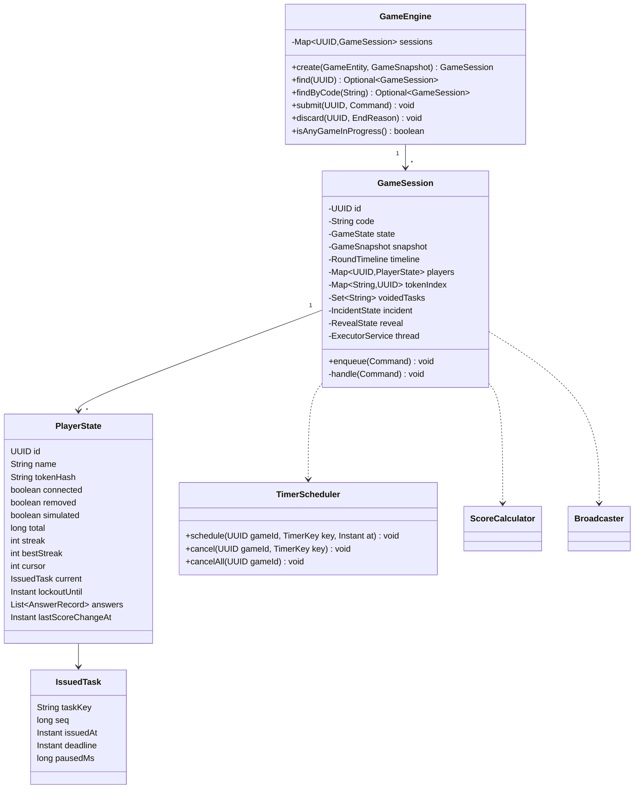
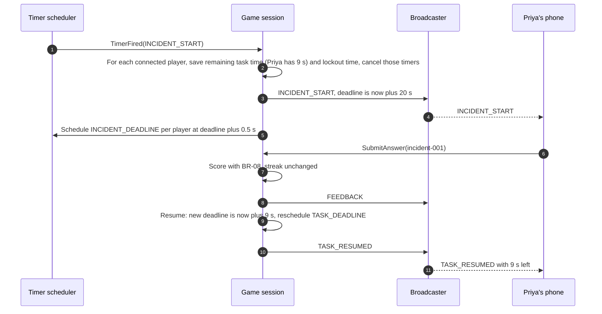
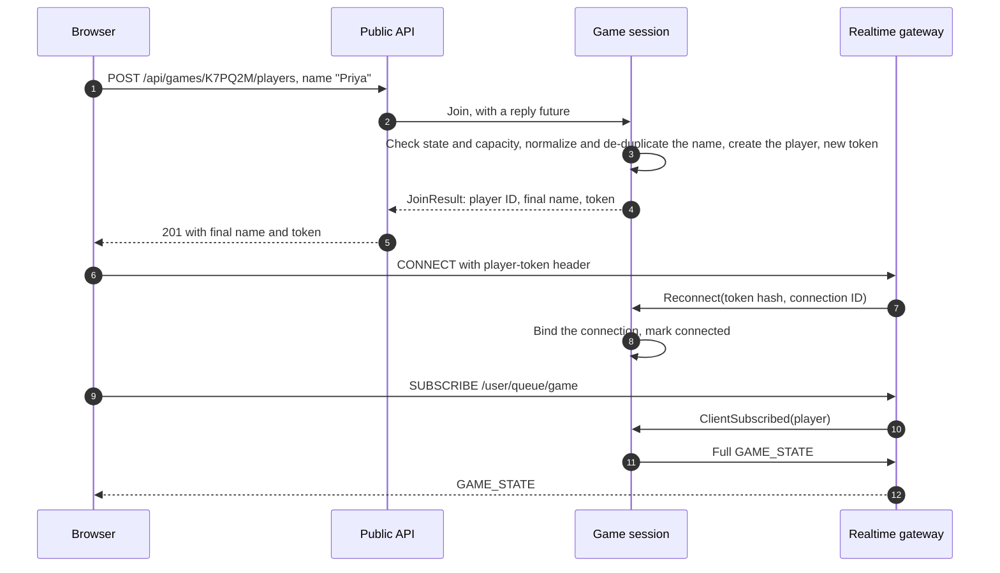
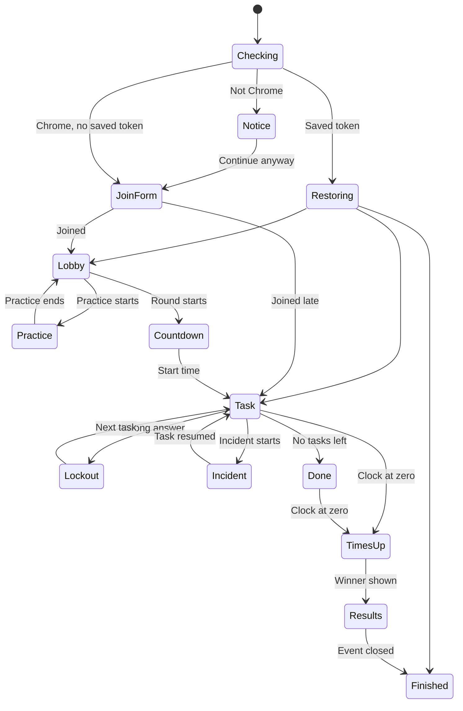

# Delivery Hero — Low-Level Design (LLD)

> Document 08 of 18 · Version 1.3 (approved)

## Document control

| Field | Value |
|---|---|
| Project | Delivery Hero |
| Document | 08 — Low-Level Design (LLD) |
| Version | 1.3 |
| Status | Approved on 23 September 2026 |
| Owner and approver | [Owner name] |
| Date | 23 September 2026 |
| Depends on | 01 — Charter v1.5 (DEC-01 to DEC-138) · 03 — SRS v1.1 · 07 — HLD v1.1 |
| Feeds into | 09 — Architecture · 10 — Database Design · 11 — API Specification · 13 — Coding Standards · 15 — Test Cases |

### Revision history

| Version | Date | Author | Summary of changes |
|---|---|---|---|
| 0.1 | 2026-09-23 | [Owner name] | First draft |
| 1.0 | 2026-09-23 | [Owner name] | Approved. LD-01 to LD-08 recorded as DEC-139 to DEC-146 (Charter v1.6) |
| 1.1 | 2026-09-23 | [Owner name] | Renamed `ProblemWordsContent.code` to `monospace` (DEC-157) |
| 1.2 | 2026-09-23 | [Owner name] | Frontend structure: added `src/copy.ts` (DEC-179) |
| 1.3 | 2026-09-24 | [Owner name] | Correction found while writing document 18: the seed command's process never runs `StartupCleanup` or `HousekeepingJob`, which could otherwise cancel a game in progress (sections 5.8, 5.10) |

---

## 1. Purpose

This document specifies the internal design of each HLD component: packages, classes, data types, algorithms, threading, configuration and error handling for the backend, and structure, state and behavior for the frontend. It is the blueprint the owner codes from.

## 2. Scope

Backend (Spring Boot 4.1 on Java 21) and frontend (Next.js static export). Physical tables are in document 10 and wire formats in document 11; this document names the types that map to them.

## 3. Definitions

| Term | Meaning |
|---|---|
| Record | A Java 21 immutable data class (`record`) |
| Sealed interface | A Java interface that lists every allowed implementation, so a `switch` over it is checked for completeness |
| Session thread | The single thread that runs one game session's commands (DEC-125) |
| Public view | The version of a task that is safe to send to phones: no answer fields (DEC-130) |
| Token index | A problem-word task's words, numbered from 0 after splitting at whitespace |
| Store | A Zustand state container in the frontend |

## 4. Assumptions and conventions

- Times are `java.time.Instant` in UTC, obtained from one injected `java.time.Clock` so tests can control time. Durations are milliseconds in messages and `java.time.Duration` in code.
- Money-like exact arithmetic (points) uses `BigDecimal` and rounds once, at the end (DEC-91).
- The root package is `app.deliveryhero` (LD-07). Replace it with the organization's reverse domain before the first commit if preferred.
- Error responses follow RFC 9457 Problem Details with a stable `code` (LD-06).

## 5. Backend

### 5.1 Package structure

| Package | HLD component | Main types |
|---|---|---|
| `app.deliveryhero` | Application | `DeliveryHeroApplication` (starts the web app or, with the `seed` argument, the seed loader) |
| `...config` | Cross-cutting | `WebSocketConfig`, `SchedulingConfig`, `ClockConfig`, `GameProperties`, `ScoringProperties` |
| `...common` | Cross-cutting | Enums (section 5.2), `Names`, `TokenService`, `ApiErrorCode`, `ProblemFactory` |
| `...api.pub` | Public API | `PublicGameController`, `GameStatusResponse`, `JoinRequest`, `JoinResponse` |
| `...api.admin` | Admin API | `TaskController`, `CharacterController`, `RunPlanController`, `GameController`, `HostActionController`, `PastGameController` |
| `...api.ops` | Ops API | `DeployLockController` (health comes from Spring Boot Actuator) |
| `...realtime` | Realtime gateway | `StompAuthInterceptor`, `DestinationPolicy`, `RealtimeController`, `StompEventListener`, `PlayerPrincipal`, `ProjectorPrincipal`, `AdminPrincipal` |
| `...engine` | Game engine | `GameEngine`, `GameSession`, `PlayerState`, `IssuedTask`, `RoundTimeline`, `IncidentState`, `RevealState`, `NameRegistry` |
| `...engine.command` | Game engine | `Command` and its records (section 5.4.3) |
| `...engine.timer` | Game engine | `TimerScheduler`, `TimerKey`, `TimerType` |
| `...scoring` | Scoring and results | `ScoringConfig`, `AnswerChecker` and its four implementations, `ScoreCalculator`, `RankingService`, `MostMissedService`, `ReviewBuilder`, `HeroCardService` |
| `...broadcast` | Broadcaster | `Broadcaster`, `ScreenBatch`, `AdminBatch`, message records (section 5.7) |
| `...content` | Content | Entities, repositories, `TaskService`, `CharacterService`, `RunPlanService`, `ContentValidator`, `ReadinessChecker`, `TaskContent` types, `PublicTaskView` |
| `...lifecycle` | Game lifecycle | `GameEntity`, `TopTenEntryEntity`, repositories, `GameLifecycleService`, `SnapshotFactory`, `GameStateRecorder`, `HousekeepingJob`, `StartupCleanup`, `DeployLockService` |
| `...simulation` | Simulation | `BotDriver`, `BotProfile` |
| `...seed` | Seed loader | `SeedCommand`, `SeedFile` records, `SeedImporter` |
| `...security` | Security | `SecurityConfig`, `LoginHandlers`, `RateLimiter`, `RateLimitFilter` |

Dependency rules, checked by an architecture test (document 13): `engine` doesn't depend on `api`, `content` repositories or `lifecycle` repositories; `scoring` depends on nothing but `common`; nothing depends on `api`.

### 5.2 Core types

```java
public enum GameState { CREATED, LOBBY, PRACTICE, COUNTDOWN, LIVE, FROZEN, ENDED, REVEAL, RESULTS, CLOSED, CANCELLED }
public enum Role      { MANAGER, BUSINESS_ANALYST, DEVELOPER, TESTER }
public enum Phase     { PLANNING, DEVELOPMENT, TESTING, RELEASE }
public enum TaskKind  { SCORED, PRACTICE, INCIDENT }
public enum TaskType  { MULTIPLE_CHOICE, YES_NO, ORDER, PROBLEM_WORDS }
public enum Outcome   { FULLY_CORRECT, PARTLY_CORRECT, WRONG, TIMEOUT, VOIDED }

// Type-specific task content, stored as JSON (DEC-131)
public sealed interface TaskContent permits MultipleChoiceContent, YesNoContent, OrderContent, ProblemWordsContent {}
public record MultipleChoiceContent(List<Option> options) implements TaskContent {
    public record Option(String text, boolean correct) {}
}
public record YesNoContent(boolean answerYes) implements TaskContent {}
public record OrderContent(List<Item> items) implements TaskContent {        // listed in display order
    public record Item(String text, int correctPosition) {}
}
public record ProblemWordsContent(String markedText, boolean monospace) implements TaskContent {}  // "load {{fast}} and…"

// What a player submits
public sealed interface AnswerPayload permits ChoiceAnswer, YesNoAnswer, OrderAnswer, WordsAnswer {}
public record ChoiceAnswer(int optionIndex) implements AnswerPayload {}
public record YesNoAnswer(boolean yes) implements AnswerPayload {}
public record OrderAnswer(List<Integer> itemIndexesInChosenOrder) implements AnswerPayload {}
public record WordsAnswer(Set<Integer> tokenIndexes) implements AnswerPayload {}
```

### 5.3 Content and validation

**Entities.** `CharacterEntity` (key: role), `TaskEntity`, `RunPlanEntity` and `RunPlanEntryEntity`, each with a `@Version` column for optimistic locking (FR-073). JSON columns (task `code` and `content`, character lines) are mapped with Hibernate's JSON type (`@JdbcTypeCode(SqlTypes.JSON)`) onto `String` fields. The services convert them to and from the records above with the application's JSON mapper, choosing the record class from the task's `type` column.

**ContentValidator.** One class holds every rule in SRS section 7.3 and returns a `ValidationReport(List<Issue> errors, List<Issue> warnings)`, where `Issue(String path, String code, String message)` names the field, for example `options[1].text`. It's used by:

| Caller | What it checks | Errors mean |
|---|---|---|
| `TaskService`, `CharacterService`, `RunPlanService` | One item | The save is refused (HTTP 422, `VALIDATION_FAILED`) |
| `ReadinessChecker` | A run plan, per BR-13 | Listed; a game can't be created |
| `GameLifecycleService.create` | The minimal rules of FR-077 | Creation refused |
| `SeedImporter` | The whole seed file | Nothing is imported |

**Problem-word tokens.** When a snapshot is built, `markedText` is split at whitespace into tokens; `{{` and `}}` are removed and the indexes of marked tokens are kept privately. The public view carries only the token strings.

**PublicTaskView** (DEC-130) is the only task shape that leaves the engine before Results:

| Field | Multiple choice | Yes/no | Tap to order | Problem words |
|---|---|---|---|---|
| `key`, `type`, `role`, `characterName`, `prompt`, `code`, `timeLimitMs` | Yes | Yes | Yes | Yes |
| Type-specific | Option texts | None | Item texts in display order | Tokens and the `monospace` flag |
| Answer data | Never | Never | Never | Never |

A unit test serializes every public message type built from every seed task and fails if any correct-answer data appears (NFR-12).

### 5.4 Game engine

#### 5.4.1 Classes



#### 5.4.2 Threads and timers

- Each `GameSession` owns a single-thread executor (DEC-125). `enqueue` only adds a command; `handle` runs on that thread.
- `TimerScheduler` wraps one shared `ScheduledExecutorService` (two threads). When a timer fires, it doesn't touch the session: it enqueues `TimerFired(key)` into the session's queue (DEC-126).
- Every per-player timer carries the `seq` of the task or lockout it belongs to. When `TimerFired` arrives, the session compares it with the player's current `seq` and ignores it if they differ.

| Timer | Fires at | Effect when current |
|---|---|---|
| `PRACTICE_END` | Practice start + 30 s | Practice ends, state back to LOBBY |
| `ROUND_START` | Round start (now + 5 s when started) | State LIVE; issue the first task to every connected player |
| `PHASE_CHANGE` (seq = phase) | Each boundary in SRS 3.2 | Screen phase bar updates |
| `INCIDENT_START` | The incident moment | Section 5.4.5 |
| `FREEZE` | L − 30 s | State FROZEN; top 10 frozen; joining closed |
| `ROUND_END` | L | State ENDED; open tasks become timeouts |
| `TASK_DEADLINE` (player, seq) | Deadline + 500 ms | Timeout for that task |
| `LOCKOUT_END` (player, seq) | Lockout end | Issue the next task, or resume after the incident |
| `INCIDENT_DEADLINE` (player) | Incident deadline + 500 ms | Incident timeout for that player |
| `FLUSH` | Every 500 ms from LOBBY to RESULTS | Build and send the screen and admin batches (section 5.7) |

#### 5.4.3 Commands

```java
public sealed interface Command permits Join, Reconnect, Disconnect, ClientSubscribed, SubmitAnswer,
                                        TimerFired, BotAnswer, HostCommand {}
public record Join(String rawName, CompletableFuture<JoinResult> reply) implements Command {}
public record Reconnect(String tokenHash, String connectionId) implements Command {}
public record Disconnect(String connectionId) implements Command {}
public record ClientSubscribed(String connectionId, ClientRole role, UUID playerId) implements Command {}
public record SubmitAnswer(UUID playerId, String taskKey, AnswerPayload answer, Instant receivedAt) implements Command {}
public record TimerFired(TimerKey key) implements Command {}
public record BotAnswer(UUID botId, String taskKey, AnswerPayload answer) implements Command {}

public sealed interface HostCommand extends Command permits OpenLobby, StartPractice, EndPractice, StartRound,
        VoidTask, StartReveal, NextStep, PreviousStep, RenamePlayer, RemovePlayer, Discard {
    CompletableFuture<ActionResult> reply();
}
```

| Command | From | Allowed in | Effect |
|---|---|---|---|
| `Join` | Public API | LOBBY, PRACTICE, COUNTDOWN, LIVE | Section 5.4.10 |
| `Reconnect`, `Disconnect`, `ClientSubscribed` | Gateway events | Any until CLOSED | Section 5.4.10 |
| `SubmitAnswer` | Gateway | PRACTICE, LIVE, FROZEN | Sections 5.4.4 to 5.4.6 |
| `OpenLobby` | Admin API | CREATED | State LOBBY; start `FLUSH` |
| `StartPractice`, `EndPractice` | Admin API | LOBBY, PRACTICE | Section 5.4.6 |
| `StartRound` | Admin API | LOBBY with at least one player | Section 5.4.7 |
| `VoidTask` | Admin API | LIVE, FROZEN, ENDED | Section 5.4.8 |
| `StartReveal`, `NextStep`, `PreviousStep` | Admin API | ENDED, REVEAL | Section 5.4.9 |
| `RenamePlayer`, `RemovePlayer` | Admin API | LOBBY | BR-16 renaming; removal ends the player's token |
| `Discard` | Game lifecycle | Any | Cancel all timers, send GAME_ENDED, drop the session |
| `TimerFired`, `BotAnswer` | Scheduler, bots | As per the timer or bot | See the timer table and section 5.11 |

A host command that doesn't apply to the current state completes its reply with `ActionResult.unchanged(currentState)`, so the admin panel refreshes instead of failing (FR-081).

#### 5.4.4 Task flow

```text
issueNext(player):
    if !player.connected: player.awaitingIssue = true; return          // LD-01
    skip entries of snapshot.order from player.cursor whose key is voided
    if none left: player.done = true; emit PlayerDone; return
    task = snapshot.order[player.cursor++]
    player.current = IssuedTask(task.key, ++player.seq, now, now + task.limit, pausedMs = 0)
    timers.schedule(TASK_DEADLINE(player, seq), deadline + grace)
    emit TaskIssued(player, publicView(task), deadline)

onSubmitAnswer(cmd):
    reject unless state in {LIVE, FROZEN}, player present and not removed,
        player.current != null, cmd.taskKey == player.current.taskKey,
        now >= player.lockoutUntil, cmd.receivedAt <= current.deadline + grace
    t = clamp(cmd.receivedAt - current.issuedAt - current.pausedMs, 0, limit)
    result = scoreCalculator.scored(task, cmd.answer, t, player.streak)
    apply result: total, streak, bestStreak, answers.add(...), lastScoreChangeAt = now
    timers.cancel(TASK_DEADLINE(player, current.seq)); player.current = null
    emit Feedback(player, result, reactionLine(task.role, result.outcome))
    if result.outcome == WRONG:
        player.lockoutUntil = now + lockout
        timers.schedule(LOCKOUT_END(player, ++player.lockoutSeq), player.lockoutUntil)
    else:
        issueNext(player)

onTaskDeadline(player, seq):
    if player.current == null or player.current.seq != seq: return     // stale
    record TIMEOUT (0 points, streak = 0); player.current = null
    emit Feedback(player, timeout)
    issueNext(player)
```

Rejections don't change any score. They are logged at debug level with the reason and counted in the admin statistics.

#### 5.4.5 Incident



- **Pause.** For each connected, non-removed player: `pausedTaskMs = deadline − now` (if a task is open) and `pausedLockoutMs = lockoutUntil − now` (if locked out); cancel both timers. The time spent paused is added to `IssuedTask.pausedMs`, so answer time excludes it (FR-037).
- **Disconnected players** are marked *pending*. If they reconnect before the incident's deadline, they receive it with the remaining time; otherwise they're marked *skipped* (FR-046).
- **Resume**, after an answer or the incident timeout: if the incident answer was wrong, a 3-second lockout comes first. Then any paused lockout is rescheduled for its remaining time, followed by the next task; otherwise the paused task gets a new deadline of now plus its remaining time and a `TASK_RESUMED` message. A player who was done returns to the done screen.
- **Streaks** are untouched by the incident (DEC-86).

#### 5.4.6 Practice

- `StartPractice` sets state PRACTICE, schedules `PRACTICE_END` 30 seconds later and gives each connected player a separate practice cursor over the snapshot's practice list.
- Practice answers go through the same checkers; the result is sent as feedback, including a 3-second lockout after a wrong answer, but nothing is added to totals, streaks, answers or statistics (FR-015).
- A player who finishes gets `PracticeReady` ("Ready!"). `PRACTICE_END` or `EndPractice` cancels practice timers and returns to LOBBY. Players who join during practice get no practice tasks (DEC-115).

#### 5.4.7 Round timeline

`RoundTimeline` is a record computed once at `StartRound` from the round length L (seconds) and a random source:

```java
public record RoundTimeline(Instant start, int lengthSec, int planningEnd, int developmentEnd,
                            int testingEnd, Integer incidentAtSec, int freezeAtSec) {
    static RoundTimeline of(Instant start, int L, boolean hasIncident, RandomGenerator rnd) {
        int p = (int) Math.floor(0.2 * L), d = (int) Math.floor(0.6 * L), t = (int) Math.floor(0.8 * L);
        int w = t - d;
        Integer incident = hasIncident
            ? d + rnd.nextInt((int) Math.ceil(0.1 * w), (int) Math.floor(0.9 * w) + 1)
            : null;
        return new RoundTimeline(start, L, p, d, t, incident, L - 30);
    }
}
```

`StartRound` sets state COUNTDOWN, `start = now + 5 s`, and schedules `ROUND_START`, three `PHASE_CHANGE` timers, `INCIDENT_START` (when present), `FREEZE` and `ROUND_END`. The incident moment is never included in any message (FR-043). A unit test checks the three rows of the table in SRS 3.2.

#### 5.4.8 Voiding a task

For `VoidTask(taskKey)` (BR-14): add the key to `voidedTasks`; for every player, find that task's `AnswerRecord`, subtract its points from the total and mark it voided; a player currently on the task has its deadline cancelled, gets a `VOIDED` record with 0 points and moves to `issueNext`. Players who haven't reached the task skip it in `issueNext`. Streaks and lockouts are left as they are. The top 10 is marked dirty, so it's resent within 500 ms (FR-083).

#### 5.4.9 Reveal and results

- `StartReveal` builds the final `List<Standing>` (section 5.5) and a `RevealState` with steps: `MOST_MISSED` (only if `MostMissedService` finds a task), then one step per distinct place from min(10, players) up to 2, then `WINNER`. Players tied at a place appear together in one step (LD-03).
- `NextStep` moves forward; reaching `WINNER` sets state RESULTS, sends each player a `RESULTS` message (rank, total, review entries, hero card) and hands the summary and top 10 to `GameLifecycleService.persistResults`, which writes them off the session thread (DEC-124).
- `PreviousStep` moves back unless the current step is `WINNER` (FR-063).

#### 5.4.10 Join, reconnect and disconnect



- **Join** (FR-003 to FR-006, FR-012): the name goes through `Names.normalize` (NFC, trim, collapse spaces; DEC-120), then validation, then `NameRegistry.unique(base)`, which adds " 2", " 3" and so on, shortening the base to fit 20 characters (BR-16). `TokenService` creates 16 random bytes, encoded as URL-safe Base64 without padding (22 characters); only its SHA-256 hash is kept, in `tokenIndex` (DEC-109). The controller waits up to 2 seconds for the reply.
- **Reconnect** binds the connection to the player and marks them connected. If the player was waiting for a task (`awaitingIssue`) and the state is LIVE or FROZEN, `issueNext` runs.
- **ClientSubscribed.** The full state is sent only once the subscription is confirmed, so nothing can arrive before the client is listening (LD-08). For projector and admin connections, it sends the screen snapshot or live statistics.
- **Disconnect** marks the player offline and adds an offline wall event. Timers keep running (DEC-89), but no new task is issued until they reconnect (LD-01).

### 5.5 Scoring and results

`ScoringConfig` is bound from `scoring.yml` (DEC-28):

```yaml
dh:
  scoring:
    base: 100
    max-bonus: 50
    wrong-penalty: 40
    yes-no-wrong-penalty: 100
    incident-base: 200
    incident-max-bonus: 100
    incident-wrong-penalty: 80
    streak-multiplier: 1.5
    streak-threshold: 3
    partial-threshold: 0.5
    lockout: 3s
    grace: 500ms
```

**Checkers** (one per type, all pure): each returns `Evaluation(BigDecimal share)`.

| Checker | Share |
|---|---|
| `MultipleChoiceChecker` | 1 if the chosen option is correct, else 0 |
| `YesNoChecker` | 1 if it matches, else 0 |
| `OrderChecker` | Items whose chosen position equals their `correctPosition`, divided by the number of items (BR-05) |
| `ProblemWordsChecker` | min(1, max(0, c − w) ÷ k) (BR-06) |

**ScoreCalculator** turns an evaluation into points with `MathContext.DECIMAL64`, implementing BR-02 (answer time), BR-03 (speed bonus), BR-04 (points), BR-07 (streaks) and BR-08 (lockout):

```text
outcome = share == 1 ? FULLY_CORRECT : share >= 0.5 ? PARTLY_CORRECT : WRONG
if WRONG: points = -(incident ? 80 : type == YES_NO ? 100 : 40); lockout = true
else:
    bonus  = maxBonus × (limitMs − t) ÷ limitMs
    m      = (!incident && FULLY_CORRECT && streakBefore >= 3) ? 1.5 : 1
    points = (base + bonus) × share × m, rounded HALF_UP to a whole number
newStreak = incident ? streakBefore : (FULLY_CORRECT ? streakBefore + 1 : 0)
```

A parameterized test covers every worked example in PRD section 8.3 and every scoring criterion in document 05.

**RankingService** (BR-09) sorts `Standing(playerId, name, total, fullyCorrect, averageAnswerMs, lastScoreChangeAt)`:

```java
Comparator<Standing> order = Comparator.comparingLong(Standing::total).reversed()
    .thenComparing(Comparator.comparingInt(Standing::fullyCorrect).reversed())
    .thenComparing(Standing::averageAnswerMs, Comparator.nullsLast(Comparator.naturalOrder()))
    .thenComparing(Standing::lastScoreChangeAt, Comparator.nullsLast(Comparator.naturalOrder()));
```

Ranks use competition numbering: players equal on all four keys share a rank, and the next rank skips accordingly. Removed players and voided answers are excluded.

**MostMissedService** (BR-10), **ReviewBuilder** (BR-11) and **HeroCardService** (BR-12) implement the rules exactly as written, each with its own unit tests. Hero card thresholds (0.5 of the time limit, 0.75 accuracy) come from `scoring.yml`.

### 5.6 Realtime gateway

**WebSocketConfig**

- STOMP endpoint `/ws` with allowed origins limited to the site's own origin; no SockJS (DEC-127).
- Simple broker for `/topic` and `/queue`, heartbeats of 10,000 ms in both directions, driven by a `ThreadPoolTaskScheduler`.
- Application prefix `/app`, user prefix `/user`, and an inbound message size limit of 8 KB.

**StompAuthInterceptor** (on the client inbound channel, DEC-133):

| STOMP frame | Check | Result |
|---|---|---|
| CONNECT with `player-token` | Hash it and look it up in the current game's `tokenIndex` | `PlayerPrincipal(gameId, playerId)`, name `p:<playerId>` |
| CONNECT with `projector-key` | Compare with the current game's key in constant time | `ProjectorPrincipal(gameId)` |
| CONNECT on an authenticated admin session | Spring Security authentication from the handshake | `AdminPrincipal` |
| CONNECT otherwise | None | Refused with an ERROR frame |
| SUBSCRIBE | `DestinationPolicy.maySubscribe(principal, destination)` per HLD section 11 | Refused if not allowed |
| SEND | `DestinationPolicy.maySend(principal, destination)`; projectors may send only to `/app/time-sync` (LD-02) | Refused if not allowed |

**RealtimeController**

- `@MessageMapping("/games/{gameId}/answer")` stamps `receivedAt` from the clock first, applies the per-player answer rate limit, then enqueues `SubmitAnswer`.
- `@MessageMapping("/time-sync")` with `@SendToUser("/queue/time-sync")` replies with `{clientSentAt, serverTime}`, without touching the engine.

**StompEventListener** turns `SessionConnectedEvent`, `SessionSubscribeEvent` and `SessionDisconnectEvent` into `Reconnect`, `ClientSubscribed` and `Disconnect` commands. A connection that stops sending heartbeats is closed by the broker within 20 seconds, which produces the disconnect event (DEC-122).

### 5.7 Broadcaster

The Broadcaster hands messages to Spring's outbound channel, which writes to sockets on its own threads, so the session thread never waits for a socket.

| Message | Destination | Sent |
|---|---|---|
| `GAME_STATE` | `/user/queue/game` | On subscribe and on every state change |
| `TASK_ISSUED`, `FEEDBACK`, `INCIDENT_START`, `TASK_RESUMED`, `PRACTICE_READY` | `/user/queue/game` | Immediately |
| `RESULTS` | `/user/queue/game` | At the winner step |
| `REMOVED`, `GAME_ENDED` | `/user/queue/game` | Immediately |
| `SCREEN_STATE` | `/topic/games/{id}/screen` | On subscribe and on state change |
| `WALL_EVENTS`, `TOP10`, `FEED_EVENT` | `/topic/games/{id}/screen` | In the 500 ms batch (DEC-128) |
| `INCIDENT_START`, `REVEAL_STEP` | `/topic/games/{id}/screen` | Immediately |
| `LIVE_STATS` | `/topic/games/{id}/admin` | In the 500 ms batch |

**Batching.** Between flushes, the session accumulates wall events (player ID and state), feed events and a `top10Dirty` flag. On `FLUSH`, it builds one `ScreenBatch` (omitting the top 10 while frozen) and one `AdminBatch`, and sends them only if they contain something. Wall events carry initials and a state, never points (FR-056).

### 5.8 Game lifecycle

| Operation | Steps |
|---|---|
| `create(runPlanId, test, botCount)` | In one transaction: check no game is outside CLOSED and CANCELLED (DEC-101); validate the plan (FR-077); `SnapshotFactory` copies the plan, tasks and characters into a `GameSnapshot`; generate a unique code (BR-17) and projector key; save the `GameEntity` in CREATED. After the commit, `GameEngine.create(...)` starts the session |
| State recording | `GameStateRecorder` writes each state change to the game row on its own single-thread executor, so writes stay in order and never block a session (LD-05) |
| `persistResults(gameId, summary, top10)` | One transaction: state RESULTS, `results_at`, player count, and the top-10 rows |
| `close(gameId)` | Requires RESULTS. One transaction: state CLOSED, `closed_at`, projector key cleared. After the commit: `Discard(FINISHED)`. For a test game, the row is deleted instead (FR-085) |
| `cancel(gameId)` | Allowed before RESULTS. One transaction: state CANCELLED, projector key cleared. After the commit: `Discard(CANCELLED)` |
| `HousekeepingJob` (every minute, web application only) | Close real games in RESULTS for 24 hours (FR-088); delete test games in RESULTS for 2 hours (FR-085) |
| `StartupCleanup` (on application ready, web application only) | Set games in LOBBY through REVEAL to CANCELLED and clear their keys; delete test games that aren't in CREATED (FR-089) |
| `DeployLockService` | Locked if any session is in LOBBY through REVEAL (FR-090) |

`StartupCleanup` and `HousekeepingJob` are created only in the web application (`@ConditionalOnWebApplication`). The seed command starts the same application without the web server, so it must never cancel a game in progress; it refuses instead (section 5.10).

After a restart during RESULTS the session is gone. Returning phones get "This game has finished.", and the admin panel labels the game "Results (live details lost after restart)" with Close still available (LD-04).

### 5.9 Security

**Filter chain** (DEC-132):

| Path | Rule |
|---|---|
| `POST /api/admin/login` | Open; rate-limited by `RateLimitFilter` |
| `/api/admin/**` | Authenticated admin; CSRF required on POST, PUT, PATCH and DELETE |
| `/api/games/**` | Open; join rate-limited per IP |
| `/api/ops/**` | Open inside the Compose network only; Nginx returns 404 for it (DEC-137) |
| `/actuator/health` | Open (proxied by Nginx as `/health`) |
| `/ws` | Open at the HTTP level; authenticated at STOMP CONNECT |
| Anything else | Denied |

- **Login.** A single user, `admin`, whose password hash is read from `DH_ADMIN_PASSWORD_HASH` (bcrypt, cost 12 or more; DEC-98). Form login is processed at `/api/admin/login` with handlers that return 204 or 401 instead of redirects. Logout is `POST /api/admin/logout`.
- **Session.** `server.servlet.session.timeout=12h`; the cookie is HttpOnly, Secure and SameSite=Strict (DEC-97).
- **CSRF.** Spring Security's cookie-based token for single-page apps: the frontend reads the `XSRF-TOKEN` cookie and sends it back in the `X-XSRF-TOKEN` header.
- **Client IP.** Tomcat trusts `X-Forwarded-For` only from the Nginx container (`server.forward-headers-strategy=native` with the internal proxies set), so rate limits see the real client address.
- **RateLimiter.** In-memory fixed windows keyed by string: `login:<ip>` (5 failures per 15 minutes, then a 15-minute block), `join:<ip>` (120 per minute), `answer:<playerId>` (5 per second). Exceeding a limit returns 429 `RATE_LIMITED`, or drops the STOMP message.

### 5.10 Seed loader

1. `docker compose run --rm backend seed /seed/delivery-hero-seed.json` starts the application without the web server (DEC-136). The startup cleanup and housekeeping beans aren't created in this mode (section 5.8).
2. `SeedCommand` refuses to run if any game row is in LOBBY through REVEAL (state recording makes this reliable, LD-05).
3. `SeedImporter` parses the file into `SeedFile` records and runs `ContentValidator` on everything. If there are errors, it prints each with its key and exits with status 1.
4. In one transaction it upserts characters by role, tasks by key and run plans by key (replacing their entries), prints the counts and exits with status 0.

### 5.11 Simulation

`BotDriver` creates the bots ("Bot 01" and onwards) when a test game's lobby opens, each with a `BotProfile(accuracy, pace)` drawn per BR-15. Whenever a task is issued to a bot, it schedules a `BotAnswer` after `pace × limit × U(0.8, 1.2)`, capped at 0.95 × limit, choosing a correct answer with probability `accuracy`. For partial-credit tasks, it picks an order or word selection whose share falls in the BR-15 range. Bots are always connected, receive no messages and are skipped by the Broadcaster.

### 5.12 Errors

Every REST error is a Problem Details body (LD-06):

```json
{ "type": "about:blank", "title": "Game full", "status": 409, "code": "GAME_FULL",
  "detail": "This game is full.", "errors": [] }
```

| Code | HTTP | Meaning | Message shown |
|---|---|---|---|
| `GAME_NOT_ACTIVE` | 404 | Join link for a closed, cancelled or unknown game | "This game link isn't active. Ask the host for the current link." |
| `LOBBY_NOT_OPEN` | 409 | Game in CREATED | "The lobby isn't open yet. Hang tight!" |
| `JOINING_CLOSED` | 409 | Freeze or later | "Joining has closed for this round. Enjoy the show on the big screen!" |
| `GAME_FULL` | 409 | 100 players | "This game is full." |
| `INVALID_NAME` | 422 | Name breaks BR-16 | The naming-rules message in FR-003 |
| `RATE_LIMITED` | 429 | A rate limit was hit | "Too many tries. Please wait a moment and try again." |
| `VALIDATION_FAILED` | 422 | Content rules broken; `errors` lists each field | Each issue's message next to its field |
| `EDIT_CONFLICT` | 409 | Optimistic lock failure | "Someone else changed this since you opened it. Reload to see their changes." |
| `TASK_IN_USE` | 409 | Deleting a task used by a run plan | "This task is used by: …", listing the plans |
| `ANOTHER_GAME_OPEN` | 409 | A game is already open | "Another game is still open. Close or cancel it first." |
| `NOT_ALLOWED_NOW` | 409 | Host action not valid in the current state | The panel refreshes to the current state |
| `DEPLOY_LOCKED` | 423 | Seed or deploy while a game is in progress | "A game is in progress. Try again after it ends." |
| `UNAUTHENTICATED` | 401 | Missing or expired admin session | The login screen appears |

### 5.13 Configuration

| Key | Default | Purpose |
|---|---|---|
| `dh.game.max-players` | 100 | FR-006 |
| `dh.game.countdown` | 5s | FR-019 |
| `dh.game.practice` | 30s | FR-014 |
| `dh.game.freeze` | 30s | FR-050 |
| `dh.game.auto-close` | 24h | FR-088 |
| `dh.game.test-retention` | 2h | FR-085 |
| `dh.broadcast.batch-interval` | 500ms | DEC-128 |
| `dh.rate.login-failures`, `dh.rate.join-per-minute`, `dh.rate.answers-per-second` | 5, 120, 5 | DEC-108 |
| `dh.admin.password-hash` | From `DH_ADMIN_PASSWORD_HASH` | DEC-98 |
| `spring.datasource.*` | From environment variables | Database connection |
| `server.servlet.session.timeout` | 12h | DEC-97 |
| `logging.structured.format.console` | `ecs` | NFR-11 |
| `spring.config.import` | `classpath:scoring.yml` | DEC-28 |

### 5.14 Logged events

Every entry is structured JSON with `gameId`, `playerId` where relevant, and `event`. Names, answers and the password are never logged (DEC-104).

| Event | Level | Extra fields |
|---|---|---|
| `GAME_CREATED`, `STATE_CHANGED` | INFO | `state`, `test` |
| `PLAYER_JOINED`, `PLAYER_RECONNECTED`, `PLAYER_DISCONNECTED`, `PLAYER_REMOVED` | INFO | None |
| `ANSWER_SCORED` | INFO | `taskKey`, `outcome`, `points`, `answerMs` |
| `ANSWER_REJECTED` | DEBUG | `taskKey`, `reason` |
| `INCIDENT_STARTED`, `TASK_VOIDED`, `REVEAL_STEP` | INFO | `taskKey` or `step` |
| `RESULTS_PERSISTED`, `GAME_CLOSED`, `GAME_CANCELLED` | INFO | `playerCount` |
| `LOGIN_SUCCEEDED`, `LOGIN_FAILED`, `RATE_LIMITED` | INFO or WARN | `ip`, `limit` |
| `SEED_IMPORTED` | INFO | Counts |

## 6. Frontend

### 6.1 Project structure

```text
frontend/
  app/                              Next.js App Router pages (static export)
    layout.tsx                      Root layout: self-hosted fonts, theme
    page.tsx                        "Scan the QR code on the big screen"
    join/page.tsx                   Player app; reads ?code=
    screen/page.tsx                 Projector; reads ?key=
    admin/                          login, tasks, tasks/edit (?id=), characters,
                                    run-plans, run-plans/edit (?id=), games, past-games
  src/
    ui/                             Arcade UI kit: ArcadeButton, SpeechBubble, TimerBar,
                                    CodeBlock, Badge, Modal, QrCode, PixelIcon
    realtime/                       stompClient.ts, useStomp.ts, reconnect schedule
    time/                           timeSync.ts, useCountdown.ts
    api/                            http.ts (JSON, CSRF header, Problem Details), endpoints.ts
    browser/                        isSupportedChrome.ts (BR-19)
    player/                         store.ts, screens/, tasks/ (one component per task type)
    screen/                         store.ts, views/ (Lobby, Practice, Live, Wall, Top10,
                                    Feed, PhaseBar, Clock, Reveal)
    admin/                          store.ts, components/
    types/                          messages.ts and dto.ts, mirroring document 11
    copy.ts                         Every user-facing string, from document 12's copy deck (DEC-179)
  scripts/csp-hashes.mjs            Post-build CSP hash generation (section 6.6)
```

Routes use query parameters instead of dynamic segments, because the site is a static export.

### 6.2 Shared modules

- **`stompClient.ts`** wraps `@stomp/stompjs` (DEC-134). It passes `player-token` or `projector-key` in the CONNECT headers, runs 10-second heartbeats and its own reconnect schedule (0.5 s, 1 s, 2 s, then every 2 s), exposes the connection status for the "Reconnecting…" banner, and re-subscribes after every reconnect.
- **`timeSync.ts`** sends three `TIME_SYNC` requests on connect and every 60 seconds, keeps the sample with the shortest round trip, and computes `offset = serverTime − (clientSentAt + roundTrip ÷ 2)`. `useCountdown(deadlineServerMs)` renders `deadline − (Date.now() + offset)`, updating at least 10 times per second.
- **`http.ts`** sends JSON, adds the `X-XSRF-TOKEN` header from the cookie on state-changing calls, and turns Problem Details into a typed error carrying `code` and field `errors`.
- **`isSupportedChrome.ts`** implements BR-19 on `navigator.userAgent`.

### 6.3 Player app



**Store** (`player/store.ts`):

```ts
interface PlayerStore {
  code: string; token?: string; name?: string;          // token kept in localStorage as dh.token.<code>
  screen: PlayerScreen;                                  // the states above, plus 'removed' and 'ended'
  total: number; streak: number;
  task?: { view: PublicTaskView; deadline: number };     // server epoch ms
  lockoutUntil?: number;
  incident?: { view: PublicTaskView; deadline: number };
  results?: ResultsMessage;
  connection: 'connecting' | 'online' | 'reconnecting';
  serverOffsetMs: number;
}
```

**Task components.** Each disables input as soon as an answer is sent and waits for `FEEDBACK`.

| Component | Behavior |
|---|---|
| `MultipleChoiceTask` | Large buttons in stored order; the first tap submits `{optionIndex}` |
| `YesNoTask` | Pointer events track horizontal movement; releasing beyond 25% of the width submits `{yes}` (right) or `{no}` (left); Yes and No buttons do the same (DEC-78) |
| `OrderTask` | Tapping an unnumbered item gives it the next number; Undo removes the last; Submit sends `itemIndexesInChosenOrder` once all are numbered |
| `ProblemWordsTask` | Each token is a toggle button; Submit sends the selected `tokenIndexes` |
| `CodeBlock` | Monospace text with whitespace preserved, inside its own horizontal scroll container (FR-033) |

### 6.4 Projector screen

- The store holds the latest `SCREEN_STATE`, applies each `WALL_EVENTS` batch to a map of player squares, and replaces the top 10 on each `TOP10`, unless frozen.
- **Wall layout.** A CSS grid sized from the player count, so 100 squares fit 1920×1080 without scrolling (about 10 columns). Each square shows initials, first name and a state icon (FR-056).
- **Reveal.** `REVEAL_STEP` swaps the whole view to the most-missed question, a place card or the winner celebration.
- The page is display-only: its only outgoing messages are time-sync requests (LD-02).

### 6.5 Admin panel

- Pages: login; task library (filters and search) and task editor with a live phone-frame preview; characters; run plans with ordering controls and the readiness report; games (create, live control, test game); past games.
- Field errors from `VALIDATION_FAILED` appear next to the matching fields, using each issue's `path`.
- **Live control screen:** large buttons for the actions valid in the current state; a confirmation dialog for Cancel and Close; live statistics from `LIVE_STATS`; and a keyboard handler, active whenever focus isn't in a text field, for Next (Right arrow, Down arrow, Page Down, Space, Enter) and Back (Left arrow, Up arrow, Page Up) (DEC-112).

### 6.6 Build and CSP hashes

- `next.config` uses `output: 'export'`, `trailingSlash: true` (so `/join/` maps to `/join/index.html`) and unoptimized images, with build targets set to the supported Chrome versions (DEC-111).
- `scripts/csp-hashes.mjs` runs after `next build`. It scans every exported HTML file for inline `<script>` elements without a `src`, computes each one's SHA-256 hash, and writes `nginx/csp.conf` containing the full `Content-Security-Policy` header: `script-src 'self'` plus those hashes, `style-src 'self' 'unsafe-inline'`, `connect-src 'self'`, `img-src 'self' data:`, `font-src 'self'`, `object-src 'none'`, `base-uri 'self'`, `frame-ancestors 'none'`. Nginx includes this file (DEC-135).
- A Playwright test loads each page with the header applied and fails on any CSP violation reported in the console.

### 6.7 Accessibility rules

- Every control is a real `<button>` or `<input>` with an accessible name; icons have text labels for assistive technology.
- Feedback and the task timer use polite live regions; the timer announces every 5 seconds, not every tick.
- Colors come from theme tokens that meet NFR-25 in dark mode; every state pairs a color with an icon (NFR-26).
- Animations respect `prefers-reduced-motion`, and nothing pulses faster than once per second (NFR-29, NFR-34).
- Layouts use relative units, so 200% text and 320-pixel widths work (NFR-30).

## 7. Design decisions proposed in this LLD

These were approved with this LLD and are recorded as DEC-139 to DEC-146 in the Charter's decision log.

| ID | Decision | Why |
|---|---|---|
| LD-01 | Tasks are issued only to connected players. A disconnected player's open task keeps its timer, but no new task is issued until they reconnect | Stops a disconnected player from losing a string of tasks to timeouts; matches AC-US05-03 |
| LD-02 | Projector connections may send only time-sync requests, which change nothing; every other send is rejected | The projector needs clock sync (SRS 3.5) while staying display-only (FR-052) |
| LD-03 | Players tied at a place in the final ranking are revealed together, in one countdown step | Implements shared ranks (BR-09) in the reveal |
| LD-04 | After a restart during Results, returning phones show "This game has finished.", and the admin panel labels the game "Results (live details lost after restart)" | Defines what players see once live data is gone (DEC-124) |
| LD-05 | Every game state change is written to the database asynchronously, in order | Start-up cleanup and the seed loader's lock check rely on it |
| LD-06 | REST errors use RFC 9457 Problem Details with a stable `code`; the frontend maps codes to the SRS messages | One predictable error format for document 11 and the frontend |
| LD-07 | The root Java package is `app.deliveryhero`, with one sub-package per HLD component | A shared convention for the code and document 13 |
| LD-08 | A client's full initial state is sent once its subscription is confirmed, not at connection time | Guarantees no message arrives before the client is listening |

## 8. Traceability

| Requirement group | Classes |
|---|---|
| FR-001 to FR-013 | `PublicGameController`, `GameSession` (join), `Names`, `NameRegistry`, `TokenService`, `isSupportedChrome` |
| FR-014 to FR-028 | `GameSession` (practice, task flow), `RoundTimeline`, `TimerScheduler`, player task components |
| FR-029 to FR-042 | Task components, checkers, `ScoreCalculator`, `Broadcaster` |
| FR-043 to FR-051 | `GameSession` (incident, freeze), `IncidentState`, projector views |
| FR-052 to FR-058 | `StompAuthInterceptor`, `DestinationPolicy`, `ScreenBatch`, projector store and views |
| FR-059 to FR-066 | `RevealState`, `RankingService`, `MostMissedService`, `ReviewBuilder`, `HeroCardService` |
| FR-067 to FR-078 | `SecurityConfig`, `RateLimiter`, content services, `ContentValidator`, `ReadinessChecker`, `SeedImporter` |
| FR-079 to FR-093 | `GameLifecycleService`, `GameStateRecorder`, `HousekeepingJob`, `StartupCleanup`, `DeployLockService`, `BotDriver` |
| BR-01 to BR-09 | Checkers, `ScoreCalculator`, `RankingService` |
| BR-10 to BR-12 | `MostMissedService`, `ReviewBuilder`, `HeroCardService` |
| BR-13 | `ReadinessChecker` |
| BR-14 | `GameSession` (void) |
| BR-15 | `BotDriver`, `BotProfile` |
| BR-16, BR-17, BR-19 | `Names`, `NameRegistry`, `TokenService`, `isSupportedChrome` |
| BR-18 | `RoundTimeline` |

## 9. Future considerations

- **Typed answers (Jev).** Add a fifth `TaskType` with its content and answer records, and a checker that calls a `GradingPort` asynchronously. The session would park the answer and resume when the grade arrives, keeping the session thread free of network calls.
- **Several games at once.** `GameEngine` already maps sessions by ID; `DestinationPolicy` already checks game IDs.
- **Editable scoring.** `ScoringConfig` is a single record; an admin screen could replace the YAML source.

## 10. Approval

| Role | Name | Decision | Date |
|---|---|---|---|
| Owner and approver | [Owner name] | ☑ Approved | 2026-09-23 |
