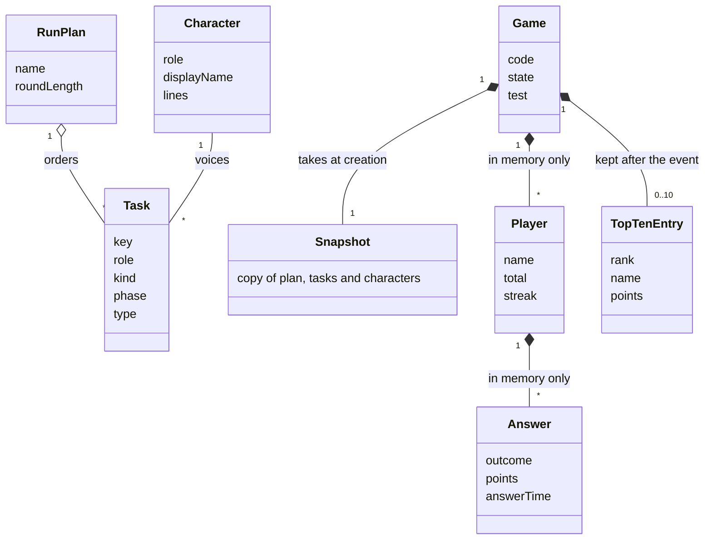
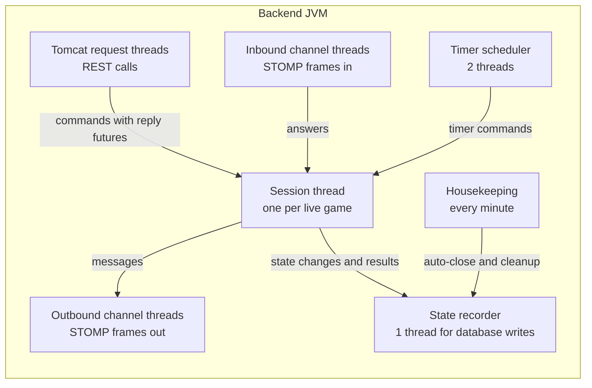
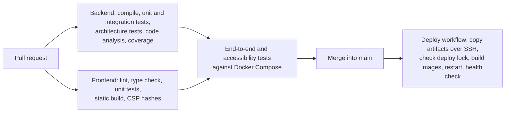

# Delivery Hero — Software Architecture Document (SAD)

> Document 09 of 18 · Version 1.2 (approved) · Drafted with Claude, approved by the owner

## Document control

| Field | Value |
|---|---|
| Project | Delivery Hero |
| Document | 09 — Software Architecture Document |
| Version | 1.2 |
| Status | Approved on 23 September 2026 |
| Owner and approver | [Owner name] |
| Date | 23 September 2026 |
| Drafting note | Drafted with Claude; reviewed and approved by the owner |
| Depends on | 01 — Charter v1.6 (DEC-01 to DEC-146) · 03 — SRS v1.1 · 07 — HLD v1.1 · 08 — LLD v1.0 |
| Feeds into | 10 — Database Design · 13 — Coding Standards · 16 — Deployment Guide · 18 — Setup Guide |

### Revision history

| Version | Date | Author | Summary of changes |
|---|---|---|---|
| 0.1 | 2026-09-23 | [Owner name], drafted with Claude | First draft |
| 1.0 | 2026-09-23 | [Owner name] | Approved. AD-01 to AD-05 recorded as DEC-147 to DEC-151 (Charter v1.7) |
| 1.1 | 2026-09-23 | [Owner name] | Development view: added `contracts/`, `docs/openapi.json` and `.githooks/` from Document 13 (DEC-175, DEC-177, DEC-180) |
| 1.2 | 2026-09-24 | [Owner name] | Development view: the local stack in `deploy/` (DEC-207) and the coverage tool in `tools/` (DEC-196) |

---

## 1. Purpose

This document is the architecture's single point of reference. It records *why* Delivery Hero is shaped the way it is: the drivers behind it, the views that describe it, the exact technology stack, the quality scenarios it must meet, and an architecture decision record (ADR) for every significant choice. The HLD and LLD describe the *what* and *how*; this document keeps the reasoning, so that later changes can be judged against it.

## 2. Scope

The architecture of version 1.0 and the planned direction of later releases. Detailed designs stay in documents 07 and 08; this document links to them rather than repeating them.

## 3. Definitions

| Term | Meaning |
|---|---|
| Architecture decision record (ADR) | A short record of one significant decision: its context, the choice, the alternatives and the consequences |
| Quality attribute scenario | A testable statement of how the system must respond to a stimulus, such as "95% of answers get feedback within 300 ms" |
| 4+1 views | Logical, process, development and physical views, plus scenarios that tie them together |
| BOM | Bill of materials: Spring Boot's managed list of compatible library versions |
| LTS | Long-term support: a release line that receives fixes for an extended period |
| Technical debt | A known shortcut taken on purpose, with a cost to pay later |

## 4. Assumptions and constraints

Charter assumptions A-01 to A-08 and constraints C-01 to C-06 apply (C-04 as changed by DEC-123). Support dates in section 9 were checked in September 2026 and must be rechecked at each release.

## 5. Stakeholders and concerns

| Stakeholder | Main concerns | Addressed in |
|---|---|---|
| Owner as developer | Buildable alone in four weeks; understandable; testable | ADR-01, ADR-07, section 8.3, section 12 |
| Owner as operator | $0 cost; easy deploys; knows when something breaks | ADR-17, ADR-20, section 8.4 |
| Host | Nothing breaks mid-event; simple controls | ADR-01, ADR-05, ADR-07, ADR-17 |
| Admins | Easy content editing; no lost work | ADR-11, ADR-16 |
| Players | Fair timing and scoring; fast feedback; privacy; works on their phone | ADR-05, ADR-06, ADR-08, ADR-09 |
| Room audience | A smooth, live projector | ADR-08 |
| Future maintainers | Clear structure; recorded reasoning; an upgrade path | Sections 11 to 14 |

## 6. Architecture drivers

### 6.1 Business goals

From the Charter: OBJ-1 (a fun team-building experience), OBJ-2 (a smooth live event) and OBJ-3 (a reusable game for future events).

### 6.2 Key constraints

Free tiers only (C-01), four weeks (C-02), one developer (C-03), a fixed stack (C-04), Chrome only (C-05) and one production server with no staging (C-06).

### 6.3 Quality attributes, in priority order

| Rank | Quality attribute | Why it ranks here | Key requirements |
|---|---|---|---|
| 1 | Correctness and fairness | A disputed score or unfair clock ruins a competitive game | BR-01 to BR-09, DEC-44, DEC-94 |
| 2 | Availability during the event | A failure mid-round is the one thing the success criteria forbid (SC-1) | DEC-57, DEC-61, FR-089 |
| 3 | Performance | Answers must feel instant and the projector must feel live | NFR-01 to NFR-05 |
| 4 | Privacy and security | Colleagues' names and answers must not outlive the event; the server is on the internet | NFR-12 to NFR-24 |
| 5 | Simplicity | One developer, four weeks | DEC-64, R-01 |
| 6 | Cost | $0 | DEC-05 |
| 7 | Accessibility | WCAG 2.2 AA | NFR-25 to NFR-34 |
| 8 | Evolvability | Recurring events and later releases | DEC-06, DEC-72 |

When two attributes conflict, the higher-ranked one wins. For example, ADR-06 accepts losing a live game on a crash (lower availability) in return for privacy and simplicity, because a crash is rare and DEC-57 already accepted it.

## 7. Architecture at a glance

Delivery Hero is a **modular monolith on one server**. A static Next.js site served by Nginx talks to one Spring Boot process over REST and STOMP. Inside that process, each live game runs **entirely in memory on its own single-threaded command queue**, which makes timing, scoring and state changes deterministic and race-free. PostgreSQL stores only content, game records and top-10 lists. Everything runs in Docker Compose on one free Oracle Cloud machine and is deployed by GitHub Actions over SSH.

## 8. Architectural views

### 8.1 Logical view

The main concepts and how they relate. Document 08 gives the classes; document 10 gives the tables.



### 8.2 Process view

How work is divided across threads inside the backend. The rule that makes the design safe: **only a game's session thread changes that game**, and it never waits on the database or a socket.



| Thread or pool | Owns | Must never |
|---|---|---|
| Session thread (one per game) | All state of its game | Block on I/O or another game's state |
| Tomcat request threads | REST handling, validation, database reads and writes for content | Change a live game except through commands |
| Inbound channel threads | Authenticating frames, rate limiting, enqueuing commands | Change a live game directly |
| Timer scheduler | Firing timers as commands | Run game logic itself |
| Outbound channel threads | Writing frames to sockets | Hold references to mutable game state |
| State recorder | Ordered database writes for games (LD-05) | Delay a session thread |
| Housekeeping | Automatic closing and test-game cleanup | Touch sessions except through the lifecycle service |

### 8.3 Development view

One repository holds everything (DEC-65):

```text
delivery-hero/
  backend/            Spring Boot application, built with the Maven Wrapper
  frontend/           Next.js application, built with npm
  seed/               delivery-hero-seed.json
  contracts/          JSON examples of every API message, shared by backend and frontend tests (DEC-180)
  tools/              validate_seed.py, ac_coverage.py (DEC-196)
  load-test/          k6 scripts
  deploy/             production: docker-compose.yml, nginx/, scripts/, environment template;
                      local stack: docker-compose.local.yml, local/ (DEC-207)
  docs/               the 18 documents, plus openapi.json generated from the code (DEC-175)
  .githooks/          pre-push hook (DEC-177)
  .github/workflows/  ci.yml (merge checks), deploy.yml (deploy on merge)
  README.md
```



The backend's package dependency rules (LLD section 5.1) are enforced by architecture tests (ADR-19); document 13 details the tooling and conventions.

### 8.4 Physical view

The deployment topology is in HLD section 12. The machine's resources are budgeted as follows (AD-04):

| Container | Memory limit | Notes |
|---|---|---|
| `backend` | 2 GB | JVM heap capped at 50% of the container (`-XX:MaxRAMPercentage=50`), about 1 GB, far more than 100 players need |
| `postgres` | 1 GB | `shared_buffers` of 256 MB; the data set is tiny |
| `nginx` | 256 MB | Static files and proxying |
| `certbot` | 128 MB | Runs only to renew certificates |
| Operating system and headroom | About 8.5 GB | Room for the backup job, updates and spikes |

CPU is not limited per container; the two Arm cores are shared.

### 8.5 Scenarios

| Scenario | Where it's shown |
|---|---|
| Joining a game | Document 06, UC-01 sequence; LLD section 5.4.10 |
| Answering a task | HLD section 8.3 |
| The incident pause and resume | LLD section 5.4.5 |
| Starting the round | Document 06, UC-10 sequence |
| The reveal | Document 06, UC-12 sequence |
| Reaching Results and closing | HLD section 8.5 |
| Deploying with the deploy lock | Document 06, UC-22 sequence |

## 9. Technology stack

| Layer | Technology | Version line | Free support | Reason |
|---|---|---|---|---|
| Server OS | Ubuntu Server LTS, arm64, on Oracle Cloud | 24.04 LTS | Standard support to 2029 | Mature, widely documented |
| Containers | Docker Engine with Docker Compose v2 | Current stable | Rolling | DEC-58 |
| Backend language | Java (Eclipse Temurin) | 21 LTS | Long-term support release | C-04 |
| Backend framework | Spring Boot (Spring Framework 7, Spring Security, Spring WebSocket and messaging) | 4.1.x, latest patch | About July 2027 | DEC-123 |
| Persistence | Spring Data JPA with Hibernate, Flyway, PostgreSQL JDBC driver | Versions managed by Spring Boot 4.1 | With Spring Boot | DEC-66 |
| JSON | Jackson 3 | Managed by Spring Boot 4.1 | With Spring Boot | Spring Boot 4 default |
| Database | PostgreSQL (official image) | 18.x, latest minor | November 2030 | Current major with a year of fixes; version 19 is too new (AD-01) |
| Web server | Nginx (official stable image) | Stable line | Rolling | DEC-67 |
| Certificates | Let's Encrypt via Certbot (official image) | Current | Rolling | DEC-60 |
| Frontend framework | Next.js | 16.x, latest patch | Active LTS line with monthly security releases | DEC-67 |
| UI library | React | 19.x, as required by Next.js 16 | With Next.js | Next.js 16 requirement |
| Frontend language | TypeScript | The version in the Next.js 16 template | Rolling | Type safety |
| Styling | Tailwind CSS | 4.x | Rolling | DEC-66 |
| Real-time client | `@stomp/stompjs` | 7.x | Rolling | DEC-134 |
| State | Zustand | 5.x | Rolling | DEC-134 |
| QR codes | `qrcode` (npm) | 1.5.x | Rolling | DEC-134 |
| Build tools | Maven Wrapper (Maven 3.9); Node.js with npm | Node.js 24 LTS | Node.js 24 to April 2028 | DEC-66 |
| Backend tests | JUnit Jupiter, Mockito, AssertJ, Testcontainers 2 | Managed by Spring Boot 4.1 | With Spring Boot | DEC-66. Its "JUnit 5" now means the JUnit Jupiter version Spring Boot 4.1 manages |
| Architecture tests | ArchUnit | 1.x | Rolling | AD-03 |
| Frontend tests | Vitest with React Testing Library | Current major | Rolling | DEC-66 |
| End-to-end and accessibility | Playwright with axe-core | Playwright 1.x | Rolling | DEC-66, EN-09 |
| Load testing | k6 | 1.x | Rolling | DEC-66 |
| CI/CD | GitHub Actions | Hosted runners | Free allowance | DEC-61 |

### 9.1 Version policy (AD-02)

- **At project start,** use the latest patch of each line above. The lock files (`pom.xml` with the Spring Boot parent, `package-lock.json`) and image digests in `docker-compose.yml` are the source of truth.
- **Weekly,** GitHub Dependabot (free) opens pull requests for patch and minor updates; they merge once the checks pass.
- **Security releases** (for example, Next.js's monthly security releases or a Spring Boot patch fixing a CVE) are applied within 7 days, never while the deploy lock is active, and during content-freeze week only if rated critical.
- **Major upgrades** are planned changes with their own branch, not Dependabot merges. The next planned one is Spring Boot before July 2027 (section 14).

## 10. Quality attribute scenarios

| ID | Attribute | Stimulus | Environment | Required response | Measure | Addressed by |
|---|---|---|---|---|---|---|
| QA-01 | Performance | 100 players answer during a burst, such as the incident | Live round, production | Every answer gets feedback | 95% within 300 ms | ADR-06, ADR-07, EN-07 |
| QA-02 | Performance | Scores change continuously | Live round | The projector updates | At most 1 s behind; at most 2 updates per second | ADR-08 |
| QA-03 | Availability | A pull request is merged during an event | Lobby to Reveal | The deploy is refused | Zero restarts during games | ADR-17 |
| QA-04 | Availability | A phone loses signal for 20 seconds | Live round | It reconnects and resumes | Within 5 s of the network returning, with the score intact | ADR-07, DEC-139 |
| QA-05 | Fairness | A phone's clock is 45 seconds wrong | Live round | Countdown correct; points unaffected | Display within 250 ms; answer time measured by the server | ADR-05, ADR-09 |
| QA-06 | Security | A player reads the page's code and messages | Live round | No answers can be found | No answer data before the round ends | ADR-10 |
| QA-07 | Security | Someone guesses the admin password | Any time | Attempts are blocked | 15-minute block after 5 failures from one IP | ADR-12 |
| QA-08 | Privacy | The host closes the event | Results | Player data is gone everywhere | None in memory, database, logs or backups | ADR-06 |
| QA-09 | Modifiability | New scoring values are wanted | Between events | Only configuration changes | No code change | DEC-28 |
| QA-10 | Modifiability | Typed answers are added | Later release | New type, checker and grading port | No change to the existing task types | ADR-11 |
| QA-11 | Testability | A scoring rule is changed | Development | Tests pinpoint the effect | At least 80% coverage on scoring and engine; time injectable | DEC-68 |
| QA-12 | Accessibility | A player uses 200% text size | Any screen | Everything remains usable | No lost content or sideways scrolling | NFR-30 |

## 11. Architecture decision records

Each ADR is accepted: its decision is in the Charter's decision log.

### ADR-01 · A modular monolith on one server

- **Context:** One developer, four weeks, one game at a time, free hosting (DEC-34, DEC-58, DEC-64).
- **Decision:** One Spring Boot process with internal modules and enforced boundaries, one database and one web server, on one machine.
- **Alternatives:** Microservices, which need more infrastructure, deployment work and failure handling than the team or budget allows.
- **Consequences:** Simple to build, run and debug. A crash stops the game (DEC-57), and scaling beyond one server would need rework (section 14).

### ADR-02 · Spring Boot 4.1 on Java 21

- **Context:** The stack was fixed as Spring Boot 3, but every 3.x release lost free security support on 30 June 2026.
- **Decision:** Spring Boot 4.1.x on Java 21 (DEC-123).
- **Alternatives:** Spring Boot 3.5, which has no free patches; Spring Boot 4.0, whose free support ends in December 2026.
- **Consequences:** Free patches until about July 2027. Online examples written for Spring Boot 3 may need adapting to Spring Framework 7 and Jackson 3.

### ADR-03 · A statically exported Next.js frontend served by Nginx

- **Context:** Every screen gets its data from the backend; the developer is new to Next.js (DEC-64).
- **Decision:** Next.js with `output: 'export'`, served as files by Nginx (DEC-67).
- **Alternatives:** Running Next.js as a Node server, which means another process and server-side features that aren't needed.
- **Consequences:** No Node process in production and a small attack surface. Per-request nonces for the security policy aren't possible, which ADR-15 handles.

### ADR-04 · STOMP over WebSocket with Spring's simple broker

- **Context:** Real-time updates to up to 103 clients from one process.
- **Decision:** STOMP over plain WebSocket with the built-in simple broker and game-scoped destinations (DEC-66, DEC-127).
- **Alternatives:** An external broker such as RabbitMQ or Redis, which adds a service for no benefit on one node; raw WebSocket, which would need its own routing and heartbeats.
- **Consequences:** Few moving parts. Scaling to several backend nodes would require switching to a broker relay.

### ADR-05 · Answers and timing decided on the server

- **Context:** Fairness is the top quality attribute, and players control their own phones.
- **Decision:** The server checks every answer and measures every answer time, with a 500 ms grace period (DEC-44, DEC-94).
- **Alternatives:** Checking on the phone for instant feedback, which is easy to cheat; phone-measured time, which can be faked.
- **Consequences:** Cheat-resistant. Network delay costs under one point of speed bonus.

### ADR-06 · Live game data only in memory

- **Context:** Player data must be deleted after the event (DEC-45), and feedback must be fast.
- **Decision:** Players, tokens, answers and scores live only in the backend's memory; the database stores content, game records and top-10 lists (DEC-124).
- **Alternatives:** Writing every answer to the database.
- **Consequences:** Privacy by design, including backups, and no database waits on the answer path. A restart loses the live game (already accepted), and a restart during Results loses review screens (DEC-142).

### ADR-07 · One single-threaded command queue per game

- **Context:** Answers, host actions and timers all change the same game at once.
- **Decision:** Each game processes commands one at a time on its own thread; timers are commands too (DEC-125, DEC-126).
- **Alternatives:** Shared state protected by locks.
- **Consequences:** No races by construction: exactly one outcome per task and one round start. One thread per game is ample at this scale.

### ADR-08 · Batched projector and admin updates

- **Context:** Answers arrive in bursts; the projector needs to feel live but not flood.
- **Decision:** Batch wall, top-10, feed and admin updates every 500 ms, and send a full snapshot on every (re)connect (DEC-128).
- **Alternatives:** Sending every event immediately.
- **Consequences:** Meets the 1-second target (NFR-02) with at most two messages per second per screen.

### ADR-09 · Server-time clock synchronization

- **Context:** Phone clocks can be wrong by seconds or minutes.
- **Decision:** Devices estimate their offset from the server with request-and-reply messages and draw countdowns from server timestamps (DEC-95, DEC-129).
- **Alternatives:** Trusting device clocks.
- **Consequences:** Every screen shows the same time within 250 ms, with no extra infrastructure.

### ADR-10 · Answer keys behind a public view

- **Context:** Correct answers must never reach phones before the round ends (NFR-12).
- **Decision:** Tasks leave the engine only through a public view with no answer fields, verified by an automated test (DEC-130).
- **Alternatives:** Removing answer fields at each place a message is built.
- **Consequences:** Leaking an answer would need a deliberate code change that the test catches.

### ADR-11 · JSON columns for task content and snapshots

- **Context:** Four task types today, more later, and a seed file that mirrors the content.
- **Decision:** Type-specific task data and game snapshots are stored as JSON in PostgreSQL and validated in code (DEC-131, DEC-100).
- **Alternatives:** One table per task type.
- **Consequences:** One task model, easy imports and future types without schema changes. The database can't enforce content rules, so the shared validator must (ADR-16).

### ADR-12 · Admin sessions and in-process rate limits

- **Context:** One shared admin password (DEC-42) on a public server.
- **Decision:** Spring Security sessions checked against a bcrypt hash, CSRF protection for the static frontend, and in-memory rate limits (DEC-97, DEC-98, DEC-108, DEC-132).
- **Alternatives:** Token-based admin authentication; an external rate-limit store.
- **Consequences:** Simple and secure for one server. There's no record of which admin did what (Charter R-05).

### ADR-13 · Credentials in STOMP CONNECT

- **Context:** Players and the projector have no accounts; tokens mustn't leak through URLs or logs.
- **Decision:** Player tokens and projector keys go in CONNECT headers, checked by an interceptor that also enforces destination rules (DEC-133).
- **Alternatives:** Query parameters on the WebSocket address.
- **Consequences:** Secrets stay out of URLs and access logs. The projector key is still in the projector page's own URL, which `Referrer-Policy: no-referrer` protects.

### ADR-14 · Frontend libraries

- **Context:** A developer new to Next.js needs few, well-known libraries.
- **Decision:** `@stomp/stompjs`, Zustand, a browser-side QR code library and Tailwind CSS, in one project with three areas (DEC-134).
- **Alternatives:** Separate projects per area; a heavier state library.
- **Consequences:** One build and one design system, with minimal dependencies to learn and patch.

### ADR-15 · A strict content security policy using build-time hashes

- **Context:** Next.js static pages include inline hydration scripts, and a static site can't generate per-request nonces.
- **Decision:** Allow only the site's own scripts plus the SHA-256 hashes of its inline scripts, generated after each build; falling back to `'unsafe-inline'` needs the owner's approval (DEC-135).
- **Alternatives:** `'unsafe-inline'` from the start.
- **Consequences:** Strong protection against injected scripts, at the cost of a build step and an end-to-end test that fails on any policy violation.

### ADR-16 · One validator, and the seed loader as a backend command

- **Context:** Content arrives through the editor, the seed file and game creation, and must obey the same rules everywhere.
- **Decision:** One `ContentValidator` guards every write path; the seed loader is a one-off command of the backend image (DEC-136).
- **Alternatives:** An upload screen; separate validation per path.
- **Consequences:** No rule drift between paths. Loading content needs shell access to the machine, which only the owner has.

### ADR-17 · SSH deployment with a deploy lock

- **Context:** Automatic deploys (DEC-61) must never restart a game, and there's no budget for a registry.
- **Decision:** GitHub Actions copies artifacts over SSH; images are built on the machine; the deploy script checks the lock locally; only `/health` is public (DEC-137).
- **Alternatives:** Pushing images to a container registry; exposing the lock over the internet.
- **Consequences:** $0 and safe. The first build on the machine after a base-image update is slower.

### ADR-18 · Bots inside the engine

- **Context:** Rehearsals need up to 100 realistic players without 100 phones.
- **Decision:** Simulated players run as in-process players that submit commands (DEC-138).
- **Alternatives:** External bot clients over the network.
- **Consequences:** Rehearsals exercise the real engine and projector. Network load is tested separately by k6 (EN-07).

### ADR-19 · Enforced boundaries and one error format

- **Context:** A solo developer under time pressure can erode module boundaries without noticing.
- **Decision:** Package dependency rules and the "no I/O on session threads" rule are checked by architecture tests (AD-03); every REST error uses Problem Details with a stable code (DEC-144).
- **Alternatives:** Relying on discipline and code review, which isn't available to a solo developer.
- **Consequences:** Violations fail the build. The frontend has one predictable error shape.

### ADR-20 · Oracle Cloud Always Free hosting

- **Context:** Free tiers only; the backend needs an always-on server with enough memory (DEC-05).
- **Decision:** One Oracle Cloud Always Free Arm machine running Docker Compose (DEC-58).
- **Alternatives:** Render with Neon, whose free backend is too small and sleeps; company servers, which aren't available.
- **Consequences:** Enough capacity at $0. Oracle may reclaim idle machines or change its terms (R-02), so the setup stays portable, with a documented fallback.

## 12. Architectural rules

| Rule | Enforced by |
|---|---|
| `engine` doesn't depend on `api` or on any repository | Architecture test |
| `scoring` depends only on `common` | Architecture test |
| Session code doesn't call repositories, HTTP clients or blocking I/O | Architecture test on the engine's dependencies |
| No public message contains answer data before Results | Serialization test over every seed task (LLD section 5.3) |
| Every page loads under the production content security policy without violations | Playwright test (LLD section 6.6) |
| Database schema changes only through Flyway migrations | Migration check in the pipeline (NFR-42) |
| No secrets in the repository | A secret-scanning step in the pipeline (tool chosen in document 13) |
| Scoring values only in `scoring.yml` | Code review checklist and a test that loads the file (DEC-28) |

## 13. Risks and technical debt

| ID | Item | Type | Impact | Plan |
|---|---|---|---|---|
| TD-01 | One server, no high availability | Accepted debt | A crash ends the live game | Revisit only if needed (section 14) |
| TD-02 | Shared admin password | Accepted debt | No record of which admin did what | Individual accounts if the admin group grows |
| TD-03 | No staging environment | Accepted debt | The trial run is the first full production test | Docker Compose parity locally; end-to-end tests in the pipeline |
| TD-04 | CSP hash generation | Risk | Build fragility | Automated in Sprint 0; fallback only with approval (ADR-15) |
| TD-05 | Support windows: Spring Boot 4.1 to about July 2027; Next.js 16 and Node.js 24 LTS lines | Risk | Security patches stop | Upgrade plan in section 14 |
| TD-06 | Oracle's free-tier terms and idle reclaiming | Risk | Hosting lost | Uptime alert, pre-event check, fallback hosting (Deployment Guide) |
| TD-07 | Live details lost if the backend restarts during Results | Accepted debt | Review screens and hero cards unavailable | Players see "This game has finished." (DEC-142) |

## 14. Evolution roadmap

| When | Change | Architectural impact |
|---|---|---|
| Before every event | Apply pending patches under the version policy | Low: patch releases only |
| Later release | Typed answers graded by Jev | A new task type and checker, plus an asynchronous grading port so session threads never wait on the network; needs a TypeSafe account and budget |
| Later release | Spreadsheet import and export; copying run plans | Admin API and Content only |
| Later release | Remote and hybrid players | Projector access for remote viewers; no engine change |
| Before July 2027 | Upgrade from Spring Boot 4.1 | A framework upgrade guarded by the test suite |
| If needed | Several games at once | Remove the one-game limit (DEC-101) and extend the admin panel; sessions and destinations are already game-scoped |
| If needed | High availability | Move live state to an external store, reopening ADR-06's privacy trade-off |

## 15. Decisions proposed in this document

These were approved with this document and are recorded as DEC-147 to DEC-151 in the Charter's decision log.

| ID | Decision | Why |
|---|---|---|
| AD-01 | Technology lines as in section 9: Ubuntu 24.04 LTS on the server, Java 21 (Temurin), Spring Boot 4.1.x, PostgreSQL 18, Node.js 24 LTS for builds, Next.js 16 with React 19, Tailwind CSS 4, `@stomp/stompjs` 7, Zustand 5; backend libraries at the versions Spring Boot 4.1 manages | Current, supported lines with at least a year of free support |
| AD-02 | The version policy in section 9.1 | Keeps security patches flowing without disrupting events |
| AD-03 | ArchUnit architecture tests enforce the package rules and the no-I/O rule for session threads | Protects the design's key guarantees without a code reviewer |
| AD-04 | The resource budget in section 8.4, including a 2 GB backend container with a heap of 50% of it | Predictable behavior on the 12 GB machine, with headroom |
| AD-05 | All images come from official multi-architecture sources (`eclipse-temurin:21-jre`, `postgres:18`, `nginx` stable, `certbot/certbot`) and are pinned by digest in `docker-compose.yml` | Repeatable builds on Arm; updates happen through the version policy |

## 16. Future considerations

- Recheck every support date in section 9 at each release; they drive the upgrade plan.
- When a decision in this document changes, add a new ADR that supersedes the old one rather than editing history.
- If the game grows beyond one team per event, revisit ADR-01 and ADR-04 together, because they're the decisions tied most closely to "one server".

## 17. Approval

| Role | Name | Decision | Date |
|---|---|---|---|
| Owner and approver | [Owner name] | ☑ Approved | 2026-09-23 |
