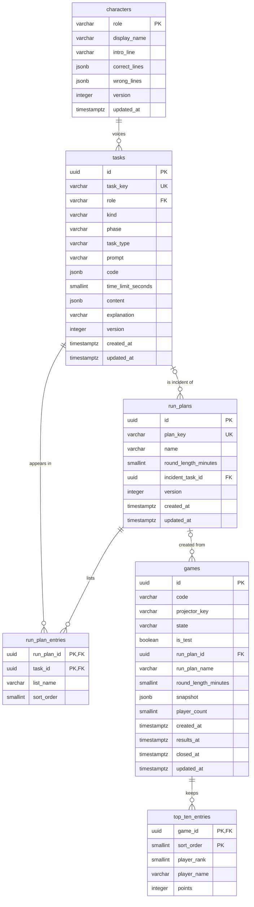

# Delivery Hero — Database Design Document (ERD)

> Document 10 of 18 · Version 1.0 (approved) · Drafted with Claude, approved by the owner

## Document control

| Field | Value |
|---|---|
| Project | Delivery Hero |
| Document | 10 — Database Design Document (ERD) |
| Version | 1.0 |
| Status | Approved on 23 September 2026 |
| Owner and approver | [Owner name] |
| Date | 23 September 2026 |
| Drafting note | Drafted with Claude. The DDL in section 10 was applied to a real PostgreSQL database (version 16 in the drafting environment; the pipeline runs version 18), the full task pool was imported, and 16 constraint tests passed |
| Depends on | 01 — Charter v1.7 (DEC-01 to DEC-151) · 03 — SRS v1.1 · 07 — HLD v1.1 · 08 — LLD v1.0 · 09 — SAD v1.0 |
| Feeds into | 11 — API Specification · 15 — Test Cases · 16 — Deployment Guide · 18 — Setup Guide |

### Revision history

| Version | Date | Author | Summary of changes |
|---|---|---|---|
| 0.1 | 2026-09-23 | [Owner name], drafted with Claude | First draft |
| 1.0 | 2026-09-23 | [Owner name] | Approved. DB-01 to DB-07 recorded as DEC-152 to DEC-158 (Charter v1.8); the LLD and SRS updated for the `monospace` flag |

---

## 1. Purpose

This document defines Delivery Hero's physical database: every table, column, constraint, index and JSON format, the rules the database enforces versus the application, the Flyway migrations that create it, and how data is written, kept and deleted.

## 2. Scope

The PostgreSQL 18 database used by the backend (DEC-147). Live game data (players, tokens, answers and scores) is deliberately **not** stored here; it lives only in the backend's memory (DEC-124).

## 3. Definitions

| Term | Meaning |
|---|---|
| DDL | Data definition language: the SQL that creates tables and constraints |
| Flyway migration | A versioned SQL file (`V1__…sql`) that Flyway applies once, in order |
| Natural key | A meaningful unique identifier, such as `task_key`, alongside the technical primary key |
| JSONB | PostgreSQL's binary JSON column type |
| Compare-and-set update | An `UPDATE … WHERE state = <expected>` that only succeeds if the row is still in the expected state |
| Optimistic locking | Detecting concurrent edits with a `version` column that must match when saving |

## 4. Assumptions and conventions

- PostgreSQL 18 (DEC-147), accessed through Spring Data JPA (Hibernate), with Flyway owning all schema changes.
- Table and column names are `snake_case`; tables are plural.
- Primary keys are UUIDs assigned by the application, with unique natural keys where one exists (DB-02).
- Every timestamp is `timestamptz` and stored in UTC.
- Enumerations are stored as text with `CHECK` constraints, matching the Java enum names in LLD section 5.2.
- Column names avoid SQL keywords (`task_type`, `sort_order`, `player_rank`, `is_test`) so they never need quoting.

## 5. Design principles

| Principle | How it shows in the schema | Source |
|---|---|---|
| No live player data on disk | There are no player, token or answer tables | DEC-124 |
| Keep only what's promised | Past games keep a summary and top-10 entries; nothing else about players | DEC-39, DEC-45 |
| The database guards what it can cheaply | Checks, unique keys, foreign keys and a partial unique index for "one open game" | DB-01 |
| The application guards the rest | Rules needing JSON inspection or cross-table logic live in `ContentValidator` | DEC-131 |
| Concurrent admin edits are detected | A `version` column on every editable table | FR-073 |
| Game writes are ordered | One writer thread with compare-and-set updates | DB-05 |

## 6. Entity-relationship diagram



The diagram omits some timestamp columns on `games` for readability; section 7.5 lists them all.

## 7. Data dictionary

### 7.1 `characters`

The four fixed roles and their editable names and lines (DEC-21, DEC-84). The four rows are created by migration V2 (DB-03).

| Column | Type | Null | Default | Rules | Description |
|---|---|---|---|---|---|
| `role` | varchar(20) | No | | Primary key; one of the four roles | The role this character voices |
| `display_name` | varchar(20) | No | | 1–20 characters | Name shown to players, such as "Maya" |
| `intro_line` | varchar(80) | No | | 1–80 characters | The character's intro line |
| `correct_lines` | jsonb | No | | Array of exactly 3 strings (each 1–80 characters, checked by the application) | Reactions to correct answers |
| `wrong_lines` | jsonb | No | | Array of exactly 3 strings | Reactions to wrong answers |
| `version` | integer | No | 0 | Incremented on every save | Optimistic locking (FR-073) |
| `updated_at` | timestamptz | No | `now()` | | Last change |

### 7.2 `tasks`

The task library: scored, practice and incident tasks (DEC-14, DEC-76).

| Column | Type | Null | Default | Rules | Description |
|---|---|---|---|---|---|
| `id` | uuid | No | | Primary key | Technical identifier |
| `task_key` | varchar(40) | No | | Unique; `^[a-z0-9-]{1,40}$` | Stable key, such as `mgr-plan-01` |
| `role` | varchar(20) | No | | References `characters.role` | The character who "sends" the task |
| `kind` | varchar(10) | No | | SCORED, PRACTICE or INCIDENT | What the task is used for |
| `phase` | varchar(12) | Yes | | Required when `kind` is SCORED, otherwise empty | Phase for scored tasks |
| `task_type` | varchar(16) | No | | MULTIPLE_CHOICE, YES_NO, ORDER or PROBLEM_WORDS; incident tasks must be MULTIPLE_CHOICE | How the task is answered |
| `prompt` | varchar(200) | No | | 1–200 characters | The question text |
| `code` | jsonb | Yes | | An object when present (section 8.2) | Optional code snippet |
| `time_limit_seconds` | smallint | Yes | | 5–60; empty means the default for the type (DEC-74) | Answer time limit |
| `content` | jsonb | No | | An object in the format for `task_type` (section 8.3) | Options, items, words or the yes/no answer, including correct answers |
| `explanation` | varchar(300) | Yes | | Required for scored and incident tasks by the readiness check | Shown on the review screen |
| `version` | integer | No | 0 | | Optimistic locking |
| `created_at`, `updated_at` | timestamptz | No | `now()` | | Audit times |

### 7.3 `run_plans`

Game templates (DEC-37).

| Column | Type | Null | Default | Rules | Description |
|---|---|---|---|---|---|
| `id` | uuid | No | | Primary key | Technical identifier |
| `plan_key` | varchar(40) | No | | Unique; same pattern as `task_key` | Stable key, such as `default-5min` |
| `name` | varchar(60) | No | | 1–60 characters | Shown to admins, such as "Default 5-minute plan" |
| `round_length_minutes` | smallint | No | | 3–10 | Round length (DEC-13) |
| `incident_task_id` | uuid | Yes | | References `tasks.id`; must be an incident task (checked by the application) | The plan's incident task |
| `version` | integer | No | 0 | | Optimistic locking |
| `created_at`, `updated_at` | timestamptz | No | `now()` | | Audit times |

### 7.4 `run_plan_entries`

The ordered practice list and phase lists of each run plan.

| Column | Type | Null | Default | Rules | Description |
|---|---|---|---|---|---|
| `run_plan_id` | uuid | No | | Part of the primary key; references `run_plans.id`, deleted with the plan | The plan |
| `task_id` | uuid | No | | Part of the primary key, so a task appears at most once per plan; references `tasks.id`, which blocks deleting a task in use | The task |
| `list_name` | varchar(12) | No | | PRACTICE, PLANNING, DEVELOPMENT, TESTING or RELEASE | Which list the task is in |
| `sort_order` | smallint | No | | 0 or more; unique per plan and list, checked at commit so lists can be reordered | Position in the list |

### 7.5 `games`

One row per game, real or test. The only player-related information kept is `player_count` (DEC-124).

| Column | Type | Null | Default | Rules | Description |
|---|---|---|---|---|---|
| `id` | uuid | No | | Primary key | Game identifier, used in message destinations |
| `code` | varchar(6) | No | | Six characters from `ABCDEFGHJKLMNPQRSTUVWXYZ23456789` | The join code (BR-17) |
| `projector_key` | varchar(22) | Yes | | Present while the game is open; cleared when it's closed or cancelled | Secret in the projector link (DEC-109) |
| `state` | varchar(10) | No | | One of the 11 game states | Current state, written by the state recorder (DEC-143) |
| `is_test` | boolean | No | false | | Test games are never shown in past games |
| `run_plan_id` | uuid | Yes | | References `run_plans.id`; set to empty if the plan is later deleted | The plan the game was created from |
| `run_plan_name` | varchar(60) | No | | | Copy of the plan's name, shown in past games |
| `round_length_minutes` | smallint | No | | 3–10 | Copy of the round length |
| `snapshot` | jsonb | No | | An object (section 8.5) | The plan, tasks and characters as they were at creation (DEC-100) |
| `player_count` | smallint | Yes | | 0–100; set when the game reaches Results | Number of players |
| `created_at` | timestamptz | No | `now()` | | When the game was created |
| `lobby_opened_at`, `round_started_at`, `round_ended_at` | timestamptz | Yes | | | Key moments |
| `results_at` | timestamptz | Yes | | Required in RESULTS and CLOSED | When the winner was shown; drives auto-close (FR-088) |
| `closed_at` | timestamptz | Yes | | Required in CLOSED | When the event was closed |
| `cancelled_at` | timestamptz | Yes | | Required in CANCELLED | When the game was cancelled |
| `updated_at` | timestamptz | No | `now()` | | Last state change |

### 7.6 `top_ten_entries`

The results kept after an event (DEC-39, DEC-45).

| Column | Type | Null | Default | Rules | Description |
|---|---|---|---|---|---|
| `game_id` | uuid | No | | Part of the primary key; references `games.id`, deleted with the game | The game |
| `sort_order` | smallint | No | | Part of the primary key; 1 or more | Display order, which stays stable when ranks are shared |
| `player_rank` | smallint | No | | 1–10 | The player's rank; tied players share it (BR-09) |
| `player_name` | varchar(20) | No | | 1–20 characters | The player's display name |
| `points` | integer | No | | Can be negative (DEC-23) | Final total |

Every player ranked 1st to 10th is kept, so a tie at 10th place can make the list longer than 10 entries (DB-04).

## 8. JSON formats

The application validates every JSON column with `ContentValidator` before writing it (LLD section 5.3).

### 8.1 Character lines

`correct_lines` and `wrong_lines` are arrays of exactly three strings:

```json
["Bug squashed!", "Test passed. I'm almost disappointed.", "Zero defects. Suspicious, but nice."]
```

### 8.2 Task code snippet

```json
{ "language": "java", "text": "if (age > 18) {\n    allowSignup();\n}" }
```

`language` is one of text, java, javascript, typescript, sql, json, python or shell; `text` is at most 2,000 characters and 30 lines (SRS 7.3).

### 8.3 Task content, by type

| `task_type` | `content` | Example |
|---|---|---|
| MULTIPLE_CHOICE | `options`: 2–4 objects with `text` (1–80 characters) and `correct`; exactly one correct; stored in display order | `{"options":[{"text":"Roll back to the last good release","correct":true},{"text":"Debug directly in production","correct":false}]}` |
| YES_NO | `answerYes`: true or false | `{"answerYes":false}` |
| ORDER | `items`: 3–5 objects with `text` (1–60 characters) and `correctPosition` (1 to n, each once); stored in display order, which must differ from the correct order | `{"items":[{"text":"Unit test","correctPosition":1},{"text":"End-to-end test","correctPosition":3},{"text":"Integration test","correctPosition":2}]}` |
| PROBLEM_WORDS | `markedText`: 1–200 characters with 1–4 words marked `{{like this}}`, each marker wrapping one whole word; `monospace`: whether to show it as code (DB-06) | `{"markedText":"Show a warning when the balance is {{low}} for {{several}} days","monospace":false}` |

### 8.4 From the seed file to the database

The seed file (SRS 7.4) is shaped for people; the loader maps it to these columns:

| Seed property | Database |
|---|---|
| `key` | `tasks.task_key` or `run_plans.plan_key` |
| `role`, `kind`, `phase`, `prompt`, `explanation` | Columns of the same name |
| `type` | `tasks.task_type` |
| `code` | `tasks.code` |
| `timeLimitSeconds` | `tasks.time_limit_seconds` (empty when absent) |
| `options` | `content.options` |
| `answer` ("YES" or "NO") | `content.answerYes` (true or false) |
| `items` | `content.items` |
| `text`, and optional `monospace` | `content.markedText`, `content.monospace` (false when absent) |
| `roundLengthMinutes` | `run_plans.round_length_minutes` |
| `incident` | `run_plans.incident_task_id` |
| `practice`, `phases` | Rows in `run_plan_entries`, with `sort_order` from the list order |
| `displayName`, `introLine`, `correctLines`, `wrongLines` | The `characters` columns |

### 8.5 Game snapshot

```json
{
  "formatVersion": 1,
  "runPlanName": "Default 5-minute plan",
  "roundLengthSeconds": 300,
  "characters": { "MANAGER": { "displayName": "Maya", "introLine": "Quick one!",
                               "correctLines": ["…", "…", "…"], "wrongLines": ["…", "…", "…"] } },
  "practice": [ { "key": "practice-mc", "role": "MANAGER", "kind": "PRACTICE", "type": "MULTIPLE_CHOICE",
                  "prompt": "Warm-up: what does QA stand for?", "code": null, "timeLimitMs": 8000,
                  "content": { "options": [ { "text": "Quick Answer", "correct": false } ] },
                  "explanation": "Just practice. Good luck in the real round!" } ],
  "incident": { "key": "incident-001", "…": "…" },
  "phases": { "PLANNING": [ { "key": "mgr-plan-01", "…": "…" } ], "DEVELOPMENT": [], "TESTING": [], "RELEASE": [] }
}
```

In a snapshot, every time limit is resolved to milliseconds (defaults applied), and every character is included, so the game never depends on later edits. A snapshot includes correct answers; it's read only by the backend and never sent to clients (DEC-130). A 68-task snapshot is roughly 50–100 KB.

## 9. Integrity rules: database versus application

| Rule | Enforced by | Source |
|---|---|---|
| Enumerated values (roles, kinds, phases, types, lists, states) | Database checks | LLD 5.2 |
| Key formats, text lengths, time-limit and round-length ranges | Database checks, also validated earlier by the application for friendly messages | SRS 7.3 |
| A scored task has a phase; others don't | Database check | SRS 7.3 |
| Incident tasks are multiple choice | Database check | DEC-76 |
| A task appears at most once per run plan | Database primary key on `run_plan_entries` | FR-076 |
| Unique positions within each list | Database unique constraint, checked at commit | FR-076 |
| A task used by a run plan can't be deleted | Database foreign keys (and a friendly message from the application listing the plans) | FR-071 |
| At most one game outside CLOSED and CANCELLED | Database partial unique index | DEC-101, DB-01 |
| The projector key exists while a game is open and is cleared when it's closed or cancelled | Database checks | DEC-109, DB-01 |
| Required timestamps for RESULTS, CLOSED and CANCELLED | Database checks | FR-087, FR-088 |
| JSON shapes, exactly one correct option, display order different from the correct order, 1–4 marked words | Application (`ContentValidator`) | SRS 7.3 |
| A phase list only holds scored tasks of that phase; the practice list only practice tasks; the incident slot only an incident task | Application | FR-076 |
| Valid state transitions | Application, using compare-and-set updates (section 11) | SRS 3.1 |

## 10. Migrations

Flyway applies these from `backend/src/main/resources/db/migration`. Hibernate only validates the schema at start-up (`spring.jpa.hibernate.ddl-auto=validate`), so Flyway is the only thing that ever changes it (DB-06).

### 10.1 `V1__create_schema.sql`

```sql
-- Delivery Hero schema, version 1 (Database Design Document, section 10)

CREATE TABLE characters (
    role            varchar(20)  PRIMARY KEY
                    CHECK (role IN ('MANAGER', 'BUSINESS_ANALYST', 'DEVELOPER', 'TESTER')),
    display_name    varchar(20)  NOT NULL CHECK (char_length(display_name) >= 1),
    intro_line      varchar(80)  NOT NULL CHECK (char_length(intro_line) >= 1),
    correct_lines   jsonb        NOT NULL
                    CHECK (jsonb_typeof(correct_lines) = 'array' AND jsonb_array_length(correct_lines) = 3),
    wrong_lines     jsonb        NOT NULL
                    CHECK (jsonb_typeof(wrong_lines) = 'array' AND jsonb_array_length(wrong_lines) = 3),
    version         integer      NOT NULL DEFAULT 0,
    updated_at      timestamptz  NOT NULL DEFAULT now()
);

CREATE TABLE tasks (
    id                  uuid         PRIMARY KEY,
    task_key            varchar(40)  NOT NULL UNIQUE CHECK (task_key ~ '^[a-z0-9-]{1,40}$'),
    role                varchar(20)  NOT NULL REFERENCES characters (role),
    kind                varchar(10)  NOT NULL CHECK (kind IN ('SCORED', 'PRACTICE', 'INCIDENT')),
    phase               varchar(12)  CHECK (phase IN ('PLANNING', 'DEVELOPMENT', 'TESTING', 'RELEASE')),
    task_type           varchar(16)  NOT NULL
                        CHECK (task_type IN ('MULTIPLE_CHOICE', 'YES_NO', 'ORDER', 'PROBLEM_WORDS')),
    prompt              varchar(200) NOT NULL CHECK (char_length(prompt) >= 1),
    code                jsonb        CHECK (code IS NULL OR jsonb_typeof(code) = 'object'),
    time_limit_seconds  smallint     CHECK (time_limit_seconds BETWEEN 5 AND 60),
    content             jsonb        NOT NULL CHECK (jsonb_typeof(content) = 'object'),
    explanation         varchar(300),
    version             integer      NOT NULL DEFAULT 0,
    created_at          timestamptz  NOT NULL DEFAULT now(),
    updated_at          timestamptz  NOT NULL DEFAULT now(),
    CONSTRAINT tasks_phase_matches_kind CHECK ((kind = 'SCORED') = (phase IS NOT NULL)),
    CONSTRAINT tasks_incident_is_multiple_choice CHECK (kind <> 'INCIDENT' OR task_type = 'MULTIPLE_CHOICE')
);

CREATE TABLE run_plans (
    id                    uuid         PRIMARY KEY,
    plan_key              varchar(40)  NOT NULL UNIQUE CHECK (plan_key ~ '^[a-z0-9-]{1,40}$'),
    name                  varchar(60)  NOT NULL CHECK (char_length(name) >= 1),
    round_length_minutes  smallint     NOT NULL CHECK (round_length_minutes BETWEEN 3 AND 10),
    incident_task_id      uuid         REFERENCES tasks (id),
    version               integer      NOT NULL DEFAULT 0,
    created_at            timestamptz  NOT NULL DEFAULT now(),
    updated_at            timestamptz  NOT NULL DEFAULT now()
);

CREATE TABLE run_plan_entries (
    run_plan_id  uuid         NOT NULL REFERENCES run_plans (id) ON DELETE CASCADE,
    task_id      uuid         NOT NULL REFERENCES tasks (id),
    list_name    varchar(12)  NOT NULL
                 CHECK (list_name IN ('PRACTICE', 'PLANNING', 'DEVELOPMENT', 'TESTING', 'RELEASE')),
    sort_order   smallint     NOT NULL CHECK (sort_order >= 0),
    PRIMARY KEY (run_plan_id, task_id),
    CONSTRAINT run_plan_entries_order_unique UNIQUE (run_plan_id, list_name, sort_order)
        DEFERRABLE INITIALLY DEFERRED
);

CREATE INDEX run_plan_entries_task_idx ON run_plan_entries (task_id);

CREATE TABLE games (
    id                    uuid         PRIMARY KEY,
    code                  varchar(6)   NOT NULL CHECK (code ~ '^[ABCDEFGHJKLMNPQRSTUVWXYZ23456789]{6}$'),
    projector_key         varchar(22),
    state                 varchar(10)  NOT NULL
                          CHECK (state IN ('CREATED', 'LOBBY', 'PRACTICE', 'COUNTDOWN', 'LIVE', 'FROZEN',
                                           'ENDED', 'REVEAL', 'RESULTS', 'CLOSED', 'CANCELLED')),
    is_test               boolean      NOT NULL DEFAULT false,
    run_plan_id           uuid         REFERENCES run_plans (id) ON DELETE SET NULL,
    run_plan_name         varchar(60)  NOT NULL,
    round_length_minutes  smallint     NOT NULL CHECK (round_length_minutes BETWEEN 3 AND 10),
    snapshot              jsonb        NOT NULL CHECK (jsonb_typeof(snapshot) = 'object'),
    player_count          smallint     CHECK (player_count BETWEEN 0 AND 100),
    created_at            timestamptz  NOT NULL DEFAULT now(),
    lobby_opened_at       timestamptz,
    round_started_at      timestamptz,
    round_ended_at        timestamptz,
    results_at            timestamptz,
    closed_at             timestamptz,
    cancelled_at          timestamptz,
    updated_at            timestamptz  NOT NULL DEFAULT now(),
    CONSTRAINT games_key_cleared_when_finished
        CHECK (projector_key IS NULL OR state NOT IN ('CLOSED', 'CANCELLED')),
    CONSTRAINT games_key_present_while_open
        CHECK (projector_key IS NOT NULL OR state IN ('CLOSED', 'CANCELLED')),
    CONSTRAINT games_results_time_set
        CHECK (state NOT IN ('RESULTS', 'CLOSED') OR results_at IS NOT NULL),
    CONSTRAINT games_closed_time_set CHECK (state <> 'CLOSED' OR closed_at IS NOT NULL),
    CONSTRAINT games_cancelled_time_set CHECK (state <> 'CANCELLED' OR cancelled_at IS NOT NULL)
);

-- DEC-101: at most one game, real or test, outside CLOSED and CANCELLED
CREATE UNIQUE INDEX games_one_open ON games ((true)) WHERE state NOT IN ('CLOSED', 'CANCELLED');
CREATE INDEX games_code_idx ON games (code);
CREATE INDEX games_past_idx ON games (closed_at DESC) WHERE state = 'CLOSED' AND NOT is_test;
CREATE INDEX games_results_idx ON games (results_at) WHERE state = 'RESULTS';

CREATE TABLE top_ten_entries (
    game_id      uuid         NOT NULL REFERENCES games (id) ON DELETE CASCADE,
    sort_order   smallint     NOT NULL CHECK (sort_order >= 1),
    player_rank  smallint     NOT NULL CHECK (player_rank BETWEEN 1 AND 10),
    player_name  varchar(20)  NOT NULL CHECK (char_length(player_name) >= 1),
    points       integer      NOT NULL,
    PRIMARY KEY (game_id, sort_order)
);
```

### 10.2 `V2__default_characters.sql`

Creates the four characters with the same defaults as the seed file, so tasks can be created before any seed import (DB-03):

```sql
-- Default characters; the seed loader later updates them by role
INSERT INTO characters (role, display_name, intro_line, correct_lines, wrong_lines) VALUES
    ('MANAGER', 'Maya', 'Quick one!', '["Client''s happy. You''re a legend.", "That''s going in my good-news update.", "Nailed it. Coffee''s on me."]', '["That''s going in my status report.", "The client just called. Again.", "Let''s take that one offline."]'),
    ('BUSINESS_ANALYST', 'Ben', 'What exactly do we mean by fast?', '["Crystal clear. I''m framing that answer.", "That''s exactly what the user story meant!", "Requirements understood. Chef''s kiss."]', '["Hmm, that''s not what the user story says.", "Let''s revisit the acceptance criteria.", "Adding that to my list of questions."]'),
    ('DEVELOPER', 'Dev', 'Works on my machine.', '["Merged. No conflicts.", "Clean build. Beautiful.", "Ship it!"]', '["That broke the build.", "Merge conflict incoming.", "Who wrote this? Oh. Me."]'),
    ('TESTER', 'Tess', 'Found another one!', '["Bug squashed!", "Test passed. I''m almost disappointed.", "Zero defects. Suspicious, but nice."]', '["That bug just reached production.", "Reopening the ticket.", "Logged it. Severity: ouch."]');
```

### 10.3 Migration rules

- Never edit a migration that has been applied anywhere; add a new one instead.
- One logical change per migration, named `V<number>__<what_it_does>.sql`.
- Every migration is tested in the pipeline against a fresh PostgreSQL 18 container (Testcontainers) and against a copy of the previous schema.
- The seed file is content, not schema, so it's loaded by the seed command (DEC-136), never by Flyway.

## 11. How data is written

| Operation | SQL pattern | Notes |
|---|---|---|
| Edit a task, character or run plan | JPA update with `version` check | A version mismatch returns `EDIT_CONFLICT` (DEC-144) |
| Replace a run plan's lists | Delete and re-insert its entries in one transaction | The position constraint is checked at commit, so any order works |
| Create a game | Insert in CREATED | The partial unique index rejects a second open game even if two admins try at once |
| Record a state change | `UPDATE games SET state = :new, <time column> = now(), updated_at = now() WHERE id = :id AND state = :expected` | Compare-and-set on the state recorder's thread (DB-05) |
| Reach Results | One transaction: the compare-and-set to RESULTS with `results_at` and `player_count`, then insert the top-10 rows | FR-087 |
| Close | `UPDATE games SET state = 'CLOSED', closed_at = now(), projector_key = NULL, updated_at = now() WHERE id = :id AND state = 'RESULTS'` | Zero rows updated means the close isn't allowed |
| Cancel | The same pattern to CANCELLED, from any state before RESULTS | FR-084 |
| Delete a test game | `DELETE FROM games WHERE id = :id AND is_test` | Its top-10 rows go with it |
| Start-up cleanup | `UPDATE games SET state = 'CANCELLED', cancelled_at = now(), projector_key = NULL WHERE state IN ('LOBBY', 'PRACTICE', 'COUNTDOWN', 'LIVE', 'FROZEN', 'ENDED', 'REVEAL') AND NOT is_test`, and delete test games not in CREATED | FR-089 |

## 12. Common queries and their indexes

| Query | Used by | Index |
|---|---|---|
| Find a task by key | Seed loader, snapshots | Unique index on `task_key` |
| Which run plans use a task? | Deleting a task (FR-071) | `run_plan_entries_task_idx` |
| The open game (if any) | Joining, game creation, deploy lock | `games_one_open` (at most one row) |
| A game by join code | Joining (FR-001) | `games_code_idx` |
| Past games, newest first | Past games page (FR-086) | `games_past_idx` |
| Games waiting in Results | Housekeeping (FR-088) | `games_results_idx` |
| Filter and search the task library | Task library (FR-070) | None needed: a few hundred rows scan in well under a millisecond |

## 13. Volumes, performance and settings

| Item | Estimate |
|---|---|
| Tasks | 100–500 rows |
| Games | About one per event; hundreds over years |
| Top-10 entries | About 10 per game |
| Largest rows | Snapshots, about 50–100 KB each |
| Database size | Well under 100 MB after years of use |

Settings (Spring Boot): the connection pool is limited to 5 connections (`spring.datasource.hikari.maximum-pool-size=5`); `spring.jpa.open-in-view=false`; Hibernate's JDBC time zone is UTC. PostgreSQL runs with `shared_buffers` of 256 MB inside its 1 GB container (DEC-150).

## 14. Security, retention and backups

- **Access.** One database role owns the schema and is used by the application and Flyway. It's not a superuser, its password comes from the environment file, and the database port is reachable only inside the Compose network (DB-07).
- **Personal data.** The only personal data stored is the display names in `top_ten_entries` (DEC-39). There are no player tokens, answers or live scores anywhere in the database (DEC-124).
- **Retention.** Characters, tasks and run plans are kept until an admin deletes them; games and their top 10s are kept; test games are deleted (FR-085); projector keys are cleared at close or cancel.
- **Backups.** A nightly `pg_dump` (custom format) is copied off the machine; frequency, target and retention are set in the Deployment Guide (OI-07). Because the database holds no live player data, backups can't leak answers or tokens.
- **Restore.** Documented and rehearsed in the Deployment Guide before the trial run (FR-093).

## 15. Test data

- Integration tests run against PostgreSQL 18 in Testcontainers, with the same Flyway migrations as production.
- The seed file provides realistic content: 68 scored, 4 practice and 2 incident tasks, 4 characters and 2 run plans. While writing this document, V1 and V2 were applied to a real PostgreSQL database, the whole seed was imported using the mapping in section 8.4, and 16 tests confirmed that every database-enforced rule in section 9 rejects bad data and allows the valid flows (including reordering entries and closing a game, then opening a new one).

## 16. Design decisions proposed in this document

These were approved with this document and are recorded as DEC-152 to DEC-158 in the Charter's decision log.

| ID | Decision | Why |
|---|---|---|
| DB-01 | The database itself enforces "at most one open game" with a partial unique index, and requires the projector key to exist while a game is open and be cleared once it's closed or cancelled | Guards DEC-101 and DEC-109 even if application code has a bug or two admins act at once |
| DB-02 | Primary keys are UUIDs assigned by the application, with unique natural keys (`task_key`, `plan_key`, `role`) | Stable technical identities; human-friendly keys for the seed file |
| DB-03 | Migration V2 creates the four default characters, so tasks can reference them before any seed import | Tasks' foreign key to characters is always satisfiable |
| DB-04 | The top-10 list keeps every player ranked 1st to 10th, with a separate display order; a tie at 10th can make it longer than 10 | Implements shared ranks (BR-09) without dropping tied players |
| DB-05 | All writes to game rows go through the state recorder's single thread as compare-and-set updates on the expected state | Keeps writes ordered and makes invalid transitions impossible |
| DB-06 | Flyway owns all schema changes; Hibernate only validates (`ddl-auto=validate`); problem-word content uses a `monospace` flag (the LLD's `ProblemWordsContent.code` field is renamed `monospace` to match) | One source of truth for the schema; avoids confusing the flag with the task's code snippet |
| DB-07 | One least-privilege database role, not a superuser, owns the schema; the database is reachable only inside the Compose network | Minimal attack surface on a single machine |

## 17. Future considerations

- **Deleting past games.** Version 1.0 keeps them indefinitely; an admin action to delete a past game and its top 10 would be a small addition if wanted.
- **Several games at once** would drop `games_one_open` and replace it with a per-code unique index for open games.
- **Typed answers** would add a new `task_type` value and content format; the JSON design needs no new tables.
- **Upgrading PostgreSQL** to a later major release uses `pg_upgrade` or a dump and restore, planned under the version policy (DEC-148).

## 18. Approval

| Role | Name | Decision | Date |
|---|---|---|---|
| Owner and approver | [Owner name] | ☑ Approved | 2026-09-23 |
