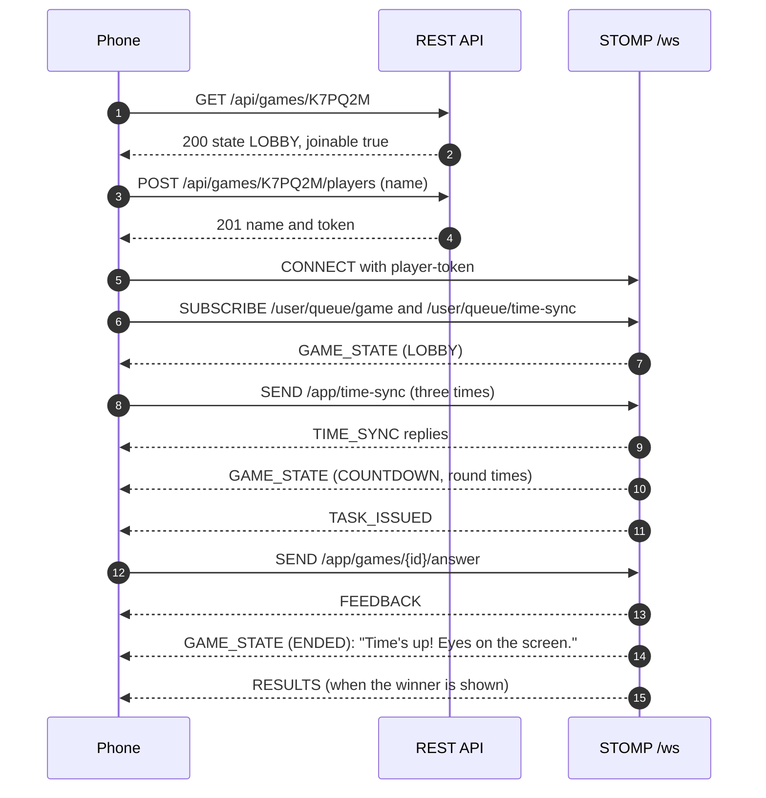
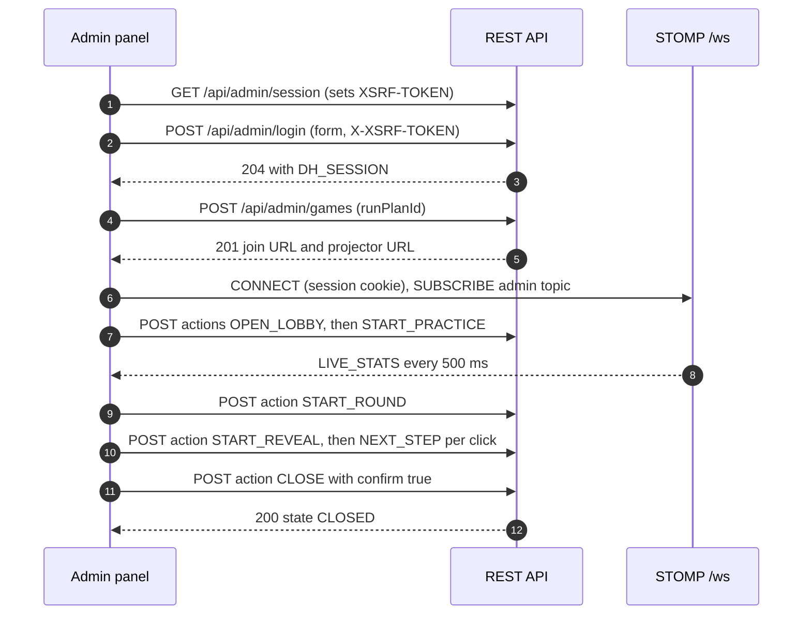

# Delivery Hero — API Specification

> Document 11 of 18 · Version 1.0 (approved) · Drafted with Claude, approved by the owner

## Document control

| Field | Value |
|---|---|
| Project | Delivery Hero |
| Document | 11 — API Specification |
| Version | 1.0 |
| Status | Approved on 23 September 2026 |
| Owner and approver | [Owner name] |
| Date | 23 September 2026 |
| Drafting note | Drafted with Claude; reviewed and approved by the owner |
| Depends on | 01 — Charter v1.8 (DEC-01 to DEC-158) · 03 — SRS v1.2 · 07 — HLD v1.1 · 08 — LLD v1.1 · 10 — Database Design v1.0 |
| Feeds into | Frontend and backend implementation · 15 — Test Cases · the OpenAPI document generated from code (NFR-44) |

### Revision history

| Version | Date | Author | Summary of changes |
|---|---|---|---|
| 0.1 | 2026-09-23 | [Owner name], drafted with Claude | First draft |
| 1.0 | 2026-09-23 | [Owner name] | Approved. AP-01 to AP-07 recorded as DEC-159 to DEC-165 (Charter v1.9); ANSWER_REJECTED added to the SRS message catalog (v1.3) |

---

## 1. Purpose

This document is the contract between Delivery Hero's frontend and backend: every REST endpoint and every real-time (STOMP) message, with request and response shapes, authentication, errors and examples. The OpenAPI document generated from the backend code (NFR-44) must match it; where they differ, this document wins until it's revised.

## 2. Scope

- The public REST API used by phones to find and join a game.
- The admin REST API used by the admin panel.
- The operational endpoints (health check and deploy lock).
- The real-time API over STOMP: connection, destinations, permissions and every message.

## 3. Definitions

| Term | Meaning |
|---|---|
| Endpoint | An HTTP method and path, such as `POST /api/games/{code}/players` |
| Frame | A STOMP protocol unit: CONNECT, SUBSCRIBE, SEND, MESSAGE, ERROR |
| Destination | The address in a STOMP frame, such as `/user/queue/game` |
| Envelope | The fields every real-time message carries: `type` and `serverTime` |
| Public view | A task without any answer data, safe to send to phones (DEC-130) |
| Problem Details | The RFC 9457 JSON error format (DEC-144) |

## 4. Conventions

| Topic | Convention |
|---|---|
| Base address | `https://<host>`; REST under `/api`, the real-time endpoint at `/ws` |
| Format | JSON in UTF-8 (`application/json`), except the login form (section 7.2) |
| Property names | camelCase |
| Identifiers | UUID strings, except natural keys (`taskKey`, `planKey`, `role`) and the 6-character game code |
| Enumerations | Upper-case names exactly as in LLD section 5.2, such as `MULTIPLE_CHOICE` |
| Time in REST | ISO 8601 in UTC, such as `2026-10-21T09:30:00Z` |
| Time in real-time messages | Epoch milliseconds (UTC), such as `1792575000000` |
| Missing values | Sent as `null`, never omitted, so clients can rely on every documented field |
| Versioning | Unversioned paths: the frontend and backend are released together from one repository (AP-01) |
| Cross-origin requests | None: everything is served from the same origin, so no CORS headers are sent |

## 5. Security

### 5.1 Who can call what

| Client | Credential | Used for |
|---|---|---|
| Phone (player) | None for public REST; a player token in the STOMP CONNECT header | Joining, then playing over STOMP |
| Projector | The projector key in the STOMP CONNECT header | Receiving its game's screen messages |
| Admin panel | The `DH_SESSION` cookie from logging in, plus a CSRF token on state-changing requests | Everything under `/api/admin` and the admin topic |
| Deploy script | Access from inside the machine only; Nginx doesn't forward `/api/ops` | The deploy lock |
| Uptime monitor | None | `GET /health` |

### 5.2 Admin session and CSRF (AP-06)

- `GET /api/admin/session` always succeeds and sets the `XSRF-TOKEN` cookie. The admin panel calls it on load.
- The session cookie is `DH_SESSION`: HttpOnly, Secure and SameSite=Strict, valid for 12 hours (DEC-97).
- Every `POST`, `PUT`, `PATCH` and `DELETE` under `/api/admin`, including login and logout, must send the value of the `XSRF-TOKEN` cookie in the `X-XSRF-TOKEN` header. Without it, the response is 403.

### 5.3 Rate limits

| Limit | Scope | Response when exceeded |
|---|---|---|
| 5 failed logins per 15 minutes, then a 15-minute block | Per IP address | 429 `RATE_LIMITED` with a `Retry-After` header in seconds |
| 120 join requests per minute | Per IP address (set high because phones on one mobile network share addresses) | 429 `RATE_LIMITED` |
| 5 answers per second | Per player, on STOMP | Extra messages are dropped |

## 6. Errors

### 6.1 Format

Every REST error uses Problem Details with a stable `code` (DEC-144):

```json
{
  "type": "about:blank",
  "title": "Game full",
  "status": 409,
  "code": "GAME_FULL",
  "detail": "This game is full.",
  "errors": []
}
```

`detail` holds the exact user-facing message from the SRS where one exists. The frontend shows messages by `code`, never the raw `title`.

### 6.2 Error codes

| Code | HTTP | When |
|---|---|---|
| `GAME_NOT_ACTIVE` | 404 | The code belongs to a closed or cancelled game, or to none (FR-002) |
| `LOBBY_NOT_OPEN` | 409 | Joining a game still in CREATED (FR-005) |
| `JOINING_CLOSED` | 409 | Joining from the freeze onward (FR-005, FR-051) |
| `GAME_FULL` | 409 | The game has 100 players (FR-006) |
| `INVALID_NAME` | 422 | The name breaks BR-16 (FR-003) |
| `RATE_LIMITED` | 429 | A limit in section 5.3 was hit |
| `UNAUTHENTICATED` | 401 | No valid admin session, or a failed login |
| `VALIDATION_FAILED` | 422 | Content breaks SRS 7.3 or BR-13; `errors` lists each issue |
| `EDIT_CONFLICT` | 409 | The `version` sent doesn't match: someone else changed the item (FR-073) |
| `TASK_IN_USE` | 409 | Deleting a task that a run plan uses; `errors` lists the plans (FR-071) |
| `ANOTHER_GAME_OPEN` | 409 | Creating a game while another is open (DEC-101) |
| `NOT_ALLOWED_NOW` | 409 | A host action that doesn't apply to the current state; the body includes `currentState` (FR-081) |
| `CONFIRMATION_REQUIRED` | 422 | CANCEL or CLOSE sent without `"confirm": true` (AP-02) |
| `NOT_FOUND` | 404 | An unknown task, run plan, character or game ID |
| `DEPLOY_LOCKED` | 423 | An operation refused while a game is in progress |

### 6.3 Validation issues

`VALIDATION_FAILED` responses, and the `warnings` field of successful content saves, list issues:

```json
{ "path": "content.options", "code": "EXACTLY_ONE_CORRECT", "message": "Choose exactly one correct option." }
```

| Issue code | Severity | Meaning |
|---|---|---|
| `REQUIRED` | Error | A required field is missing |
| `TOO_LONG`, `TOO_SHORT`, `OUT_OF_RANGE`, `PATTERN` | Error | A length, range or format rule is broken |
| `DUPLICATE_KEY` | Error | The task or plan key is already used |
| `EXACTLY_ONE_CORRECT` | Error | A multiple-choice task doesn't have exactly one correct option |
| `ORDER_SAME_AS_CORRECT` | Error | An ordering task's display order equals its correct order |
| `POSITIONS_INVALID` | Error | Correct positions aren't 1 to n, each used once |
| `MARKED_WORDS_COUNT` | Error | Not 1–4 marked problem words |
| `MARKER_NOT_WHOLE_WORD` | Error | A `{{marker}}` doesn't wrap exactly one whole word |
| `PHASE_REQUIRED`, `PHASE_NOT_ALLOWED` | Error | Scored tasks need a phase; others can't have one |
| `INCIDENT_NOT_MULTIPLE_CHOICE` | Error | An incident task isn't multiple choice |
| `EMPTY_PHASE` | Error | A run plan phase has no tasks (BR-13) |
| `WRONG_LIST` | Error | A task is in a list that doesn't match its kind or phase |
| `DUPLICATE_TASK` | Error | A task appears twice in a run plan |
| `PROMPT_OVER_25_WORDS` | Warning | A prompt is longer than recommended |
| `CODE_OVER_12_LINES` | Warning | A code snippet is longer than recommended |
| `MISSING_EXPLANATION` | Warning | A scored or incident task has no explanation |
| `FEW_TASKS` | Warning | Fewer scored tasks than the round length in seconds ÷ 6 |
| `NO_INCIDENT` | Warning | The run plan has no incident task |
| `FEW_PRACTICE_TASKS` | Warning | Fewer than 4 practice tasks |
| `PRACTICE_MISSING_TYPE` | Warning | Practice doesn't include a task type used in the round |

## 7. REST API

### 7.1 Endpoint summary

| Method and path | Purpose | Auth | Requirements |
|---|---|---|---|
| `GET /api/games/{code}` | Game status for the join screen | None | FR-001, FR-002, FR-005 |
| `POST /api/games/{code}/players` | Join | None | FR-003 to FR-007, FR-012 |
| `GET /api/admin/session` | Session status; sets the CSRF cookie | None | FR-067 |
| `POST /api/admin/login` | Log in | CSRF | FR-067, FR-068 |
| `POST /api/admin/logout` | Log out | Session | FR-067 |
| `GET /api/admin/tasks` | List and filter tasks | Session | FR-070 |
| `GET /api/admin/tasks/{id}` | One task, including answers | Session | FR-069 |
| `POST /api/admin/tasks` | Create a task | Session | FR-069 |
| `PUT /api/admin/tasks/{id}` | Update a task | Session | FR-069, FR-073 |
| `DELETE /api/admin/tasks/{id}` | Delete an unused task | Session | FR-069, FR-071 |
| `POST /api/admin/tasks/public-view` | The public view of unsaved task input, for the preview | Session | FR-069, AP-05 |
| `GET /api/admin/characters` | The four characters | Session | FR-074 |
| `PUT /api/admin/characters/{role}` | Update a character | Session | FR-073, FR-074 |
| `GET /api/admin/run-plans` | List run plans | Session | FR-076 |
| `GET /api/admin/run-plans/{id}` | One run plan with its lists | Session | FR-076 |
| `POST /api/admin/run-plans` | Create a run plan | Session | FR-076 |
| `PUT /api/admin/run-plans/{id}` | Update a run plan | Session | FR-073, FR-076 |
| `DELETE /api/admin/run-plans/{id}` | Delete a run plan | Session | FR-076 |
| `GET /api/admin/run-plans/{id}/readiness` | Readiness check | Session | FR-078 |
| `GET /api/admin/games/current` | The open game, if any | Session | FR-079, FR-082 |
| `POST /api/admin/games` | Create a game | Session | FR-077, FR-079 |
| `POST /api/admin/test-games` | Create a test game with bots | Session | FR-085 |
| `GET /api/admin/games/{id}/players` | The open game's players | Session | FR-013 |
| `POST /api/admin/games/{id}/actions` | Perform a host action | Session | FR-013, FR-014, FR-016, FR-019, FR-059, FR-063, FR-080 to FR-084, FR-087 |
| `GET /api/admin/past-games` | Closed games with their top 10 | Session | FR-086 |
| `GET /api/ops/deploy-lock` | Deploy-lock status | Machine only | FR-090 |
| `GET /health` | Health (Nginx forwards to the backend's health endpoint) | None | FR-091 |

### 7.2 Public endpoints

#### `GET /api/games/{code}`

Tells the join screen what to show before the player types a name.

**Response 200**

```json
{
  "gameId": "3f6c1a52-8d1e-4f1b-9a3c-2b7e5d9c0a11",
  "code": "K7PQ2M",
  "state": "LOBBY",
  "test": false,
  "joinable": true,
  "reason": null
}
```

When `joinable` is false, `reason` is `LOBBY_NOT_OPEN`, `JOINING_CLOSED` or `GAME_FULL`, and the phone shows that code's message. **Errors:** 404 `GAME_NOT_ACTIVE`.

#### `POST /api/games/{code}/players`

**Request**

```json
{ "name": "  Priya   S " }
```

**Response 201**

```json
{
  "gameId": "3f6c1a52-8d1e-4f1b-9a3c-2b7e5d9c0a11",
  "playerId": "8b2d4e61-1c7a-4f9e-b0d3-5a6c7e8f9012",
  "name": "Priya S",
  "token": "q3Xk9vT2bLmN8pR4sW7yZa"
}
```

The phone stores `token` in local storage under `dh.token.K7PQ2M` (FR-007) and connects to `/ws` with it. **Errors:** 404 `GAME_NOT_ACTIVE`, 409 `LOBBY_NOT_OPEN`, 409 `JOINING_CLOSED`, 409 `GAME_FULL`, 422 `INVALID_NAME`, 429 `RATE_LIMITED`.

### 7.3 Admin session

| Endpoint | Request | Success | Errors |
|---|---|---|---|
| `GET /api/admin/session` | None | 200 `{"authenticated": true, "expiresAt": "2026-10-21T21:00:00Z"}`, or `{"authenticated": false, "expiresAt": null}` | None |
| `POST /api/admin/login` | Form fields `username=admin` and `password=<shared password>` (`application/x-www-form-urlencoded`) | 204, with the `DH_SESSION` cookie set | 401 `UNAUTHENTICATED`, 429 `RATE_LIMITED` |
| `POST /api/admin/logout` | None | 204; the session ends | None |

### 7.4 Tasks

**Task input** (for create, update and public view):

| Field | Type | Notes |
|---|---|---|
| `key` | string | Pattern `^[a-z0-9-]{1,40}$`; can't change after creation |
| `role` | enum | MANAGER, BUSINESS_ANALYST, DEVELOPER, TESTER |
| `kind` | enum | SCORED, PRACTICE, INCIDENT |
| `phase` | enum or null | Required for SCORED, null otherwise |
| `type` | enum | MULTIPLE_CHOICE, YES_NO, ORDER, PROBLEM_WORDS |
| `prompt` | string | 1–200 characters |
| `code` | object or null | `{"language": "java", "text": "…"}` (Database Design section 8.2) |
| `timeLimitSeconds` | integer or null | 5–60; null uses the type's default (DEC-74) |
| `content` | object | The format for `type` in Database Design section 8.3 |
| `explanation` | string or null | Up to 300 characters |
| `version` | integer | Required on update: the version last read |

**Task detail** adds `id`, `effectiveTimeLimitSeconds`, `usedBy` (a list of `{"id", "name"}` run plans), `createdAt`, `updatedAt` and `warnings`.

**Example: create a yes/no task**

```json
{
  "key": "tst-test-02",
  "role": "TESTER",
  "kind": "SCORED",
  "phase": "TESTING",
  "type": "YES_NO",
  "prompt": "A login button that's two pixels off is a release blocker.",
  "code": null,
  "timeLimitSeconds": null,
  "content": { "answerYes": false },
  "explanation": "Cosmetic issues rarely block a release."
}
```

**Response 201**

```json
{
  "id": "0c9e7a44-2f5b-4d1e-8a3f-6b7c8d9e0f12",
  "key": "tst-test-02",
  "role": "TESTER",
  "kind": "SCORED",
  "phase": "TESTING",
  "type": "YES_NO",
  "prompt": "A login button that's two pixels off is a release blocker.",
  "code": null,
  "timeLimitSeconds": null,
  "effectiveTimeLimitSeconds": 8,
  "content": { "answerYes": false },
  "explanation": "Cosmetic issues rarely block a release.",
  "version": 0,
  "usedBy": [],
  "createdAt": "2026-09-30T10:12:00Z",
  "updatedAt": "2026-09-30T10:12:00Z",
  "warnings": []
}
```

| Endpoint | Details | Errors |
|---|---|---|
| `GET /api/admin/tasks` | Query parameters `role`, `phase`, `kind`, `type` (each optional) and `q` (case-insensitive search in prompts). Returns summaries: `id`, `key`, `role`, `kind`, `phase`, `type`, `prompt`, `effectiveTimeLimitSeconds`, `usedByCount`, `version` | 401 |
| `GET /api/admin/tasks/{id}` | Task detail, including correct answers (admins only) | 401, 404 |
| `POST /api/admin/tasks` | Task input; returns 201 with the detail | 401, 422 `VALIDATION_FAILED` |
| `PUT /api/admin/tasks/{id}` | Task input with `version`; returns 200 with the detail | 401, 404, 409 `EDIT_CONFLICT`, 422 |
| `DELETE /api/admin/tasks/{id}?version=3` | Returns 204 | 401, 404, 409 `TASK_IN_USE` or `EDIT_CONFLICT` |
| `POST /api/admin/tasks/public-view` | Task input (without `version`); returns the public view (section 9.1) the phones would get, with the default time limit and tokens resolved; nothing is saved | 401, 422 |

### 7.5 Characters

| Endpoint | Details | Errors |
|---|---|---|
| `GET /api/admin/characters` | Returns all four: `role`, `displayName`, `introLine`, `correctLines` (3), `wrongLines` (3), `version` | 401 |
| `PUT /api/admin/characters/{role}` | The same fields with `version`; returns 200 with the saved character | 401, 404, 409 `EDIT_CONFLICT`, 422 |

```json
{
  "displayName": "Tessa",
  "introLine": "Found another one!",
  "correctLines": ["Bug squashed!", "Test passed. I'm almost disappointed.", "Zero defects. Suspicious, but nice."],
  "wrongLines": ["That bug just reached production.", "Reopening the ticket.", "Logged it. Severity: ouch."],
  "version": 1
}
```

### 7.6 Run plans

**Run plan input:**

```json
{
  "key": "friday-fun",
  "name": "Friday fun",
  "roundLengthMinutes": 4,
  "practice": ["<task id>", "<task id>", "<task id>", "<task id>"],
  "incidentTaskId": "<task id>",
  "phases": {
    "PLANNING": ["<task id>"],
    "DEVELOPMENT": ["<task id>"],
    "TESTING": ["<task id>"],
    "RELEASE": ["<task id>"]
  },
  "version": 0
}
```

Lists are ordered; the order is the play order. `version` is required on update.

| Endpoint | Details | Errors |
|---|---|---|
| `GET /api/admin/run-plans` | Summaries: `id`, `key`, `name`, `roundLengthMinutes`, `scoredTaskCount`, `errorCount`, `warningCount`, `version` | 401 |
| `GET /api/admin/run-plans/{id}` | Detail: the input fields, with each list as task summaries in order, plus `readiness` in the same shape as the readiness endpoint below | 401, 404 |
| `POST /api/admin/run-plans` | Run plan input; returns 201 with the detail. Plans with readiness errors can be saved, but can't start a game | 401, 422 (structural errors such as `WRONG_LIST` or `DUPLICATE_TASK`) |
| `PUT /api/admin/run-plans/{id}` | Run plan input with `version`; returns 200 | 401, 404, 409, 422 |
| `DELETE /api/admin/run-plans/{id}?version=2` | Returns 204. Games created from it keep their snapshot | 401, 404, 409 |
| `GET /api/admin/run-plans/{id}/readiness` | `{"errors": [Issue], "warnings": [Issue]}` per BR-13 | 401, 404 |

### 7.7 Games

**Game view** (returned by the game endpoints):

```json
{
  "id": "3f6c1a52-8d1e-4f1b-9a3c-2b7e5d9c0a11",
  "code": "K7PQ2M",
  "state": "CREATED",
  "test": false,
  "runPlanName": "Default 5-minute plan",
  "roundLengthMinutes": 5,
  "joinUrl": "https://<host>/join?code=K7PQ2M",
  "projectorUrl": "https://<host>/screen?key=Zp4Tq8Lm2Vx6Nc9Rb3Hk7w",
  "createdAt": "2026-10-21T09:10:00Z",
  "liveDetailsAvailable": true,
  "allowedActions": ["OPEN_LOBBY", "CANCEL"]
}
```

`liveDetailsAvailable` is false for a game left in Results by a restart (DEC-142). `allowedActions` lists exactly the actions valid in the current state (FR-080).

| Endpoint | Details | Errors |
|---|---|---|
| `GET /api/admin/games/current` | 200 with the game view, or 204 when no game is open | 401 |
| `POST /api/admin/games` | `{"runPlanId": "<id>"}`; returns 201 with the game view | 401, 404, 409 `ANOTHER_GAME_OPEN`, 422 `VALIDATION_FAILED` (plan errors) |
| `POST /api/admin/test-games` | `{"runPlanId": "<id>", "botCount": 40}` with `botCount` from 0 to 100; returns 201 with the game view (`test` true) | 401, 404, 409, 422 |
| `GET /api/admin/games/{id}/players` | While the game is open: `[{"playerId", "name", "connected", "done", "simulated"}]` | 401, 404 |
| `POST /api/admin/games/{id}/actions` | See section 7.8 | 401, 404, 409, 422 |

### 7.8 Host actions

One endpoint performs every host action (AP-02):

```json
{ "action": "VOID_TASK", "taskKey": "dev-dev-11" }
```

| Action | Extra fields | Allowed in | Effect |
|---|---|---|---|
| `OPEN_LOBBY` | None | CREATED | State LOBBY |
| `START_PRACTICE` | None | LOBBY, with practice tasks | State PRACTICE for 30 seconds |
| `END_PRACTICE` | None | PRACTICE | State LOBBY |
| `START_ROUND` | None | LOBBY, with at least one player | State COUNTDOWN; the round starts 5 seconds later |
| `VOID_TASK` | `taskKey` | LIVE, FROZEN, ENDED | BR-14 |
| `START_REVEAL` | None | ENDED | State REVEAL, first step |
| `NEXT_STEP` | None | REVEAL | Next step; the winner step moves the game to RESULTS |
| `PREVIOUS_STEP` | None | REVEAL, before the winner | Previous step |
| `RENAME_PLAYER` | `playerId`, `name` | LOBBY | BR-16 renaming |
| `REMOVE_PLAYER` | `playerId` | LOBBY | The player is removed |
| `CANCEL` | `confirm: true` | Any state before RESULTS | State CANCELLED; player data dropped |
| `CLOSE` | `confirm: true` | RESULTS | State CLOSED; player data dropped |

**Response 200**

```json
{ "state": "COUNTDOWN", "changed": true, "allowedActions": ["CANCEL"] }
```

**Errors:** 409 `NOT_ALLOWED_NOW` with `currentState` (for example, a second admin pressing a button that no longer applies), 422 `CONFIRMATION_REQUIRED`, 422 `INVALID_NAME` (renaming), 404 for an unknown player or task.

### 7.9 Past games

`GET /api/admin/past-games?limit=50` returns closed real games, newest first:

```json
[
  {
    "id": "3f6c1a52-8d1e-4f1b-9a3c-2b7e5d9c0a11",
    "closedAt": "2026-10-22T08:05:00Z",
    "runPlanName": "Default 5-minute plan",
    "playerCount": 42,
    "topTen": [
      { "rank": 1, "name": "Sam", "points": 4210 },
      { "rank": 2, "name": "Priya", "points": 3985 },
      { "rank": 2, "name": "Arjun", "points": 3985 }
    ]
  }
]
```

Tied players share a rank, so `topTen` can hold more than 10 entries (DEC-155).

### 7.10 Operational endpoints

| Endpoint | Response |
|---|---|
| `GET /api/ops/deploy-lock` | `{"locked": true, "state": "LIVE"}`; `locked` is true from LOBBY to REVEAL (DEC-103). Reachable only inside the machine |
| `GET /health` | `{"status": "UP"}` or `{"status": "DOWN"}`, with no further detail |

## 8. Real-time API (STOMP)

### 8.1 Connection

- **Address:** `wss://<host>/ws`, a plain WebSocket speaking STOMP 1.2 (no SockJS; DEC-127).
- **CONNECT headers:** `accept-version: 1.2`, `heart-beat: 10000,10000`, and either `player-token: <token>` (phones) or `projector-key: <key>` (projector). The admin panel sends neither; its session cookie authenticates the WebSocket handshake.
- **Refusal:** an unknown or revoked token or key gets an ERROR frame with `message: UNAUTHORIZED`, and the connection closes (FR-052).
- **After connecting,** the client subscribes; the server sends the full state once the subscription is confirmed (DEC-146).

### 8.2 Destinations and permissions

| Destination | Direction | Allowed for | Messages |
|---|---|---|---|
| `/user/queue/game` | Server to one player | That player | GAME_STATE, TASK_ISSUED, FEEDBACK, ANSWER_REJECTED, INCIDENT_START, TASK_RESUMED, PRACTICE_READY, RESULTS, REMOVED, GAME_ENDED |
| `/user/queue/time-sync` | Server to one client | Every client | TIME_SYNC |
| `/topic/games/{gameId}/screen` | Server to projector | That game's projector | SCREEN_STATE, WALL_EVENTS, TOP10, FEED_EVENT, INCIDENT_START, REVEAL_STEP, GAME_ENDED |
| `/topic/games/{gameId}/admin` | Server to admin panels | Admin sessions | LIVE_STATS, GAME_ENDED |
| `/app/games/{gameId}/answer` | Player to server | That game's players | ANSWER_SUBMIT |
| `/app/time-sync` | Any client to server | Every client, including the projector (DEC-140) | TIME_SYNC request |

Any other SUBSCRIBE or SEND is refused with an ERROR frame.

### 8.3 Envelope

Every message from the server is a JSON object with `type` and `serverTime` (epoch ms), plus the fields of that type (AP-04). Clients ignore unknown fields, so fields can be added without breaking them.

### 8.4 Client-to-server messages

**ANSWER_SUBMIT** to `/app/games/{gameId}/answer`:

```json
{ "taskKey": "ba-plan-01", "answer": { "kind": "WORDS", "tokenIndexes": [4, 9] } }
```

| `answer.kind` | Fields | For task type |
|---|---|---|
| `CHOICE` | `optionIndex` (0-based, display order) | MULTIPLE_CHOICE (scored, practice and incident) |
| `YES_NO` | `yes` (true or false) | YES_NO |
| `ORDER` | `itemIndexes`: every item's display index, in the chosen order | ORDER |
| `WORDS` | `tokenIndexes`: the selected token indexes | PROBLEM_WORDS |

The server replies with FEEDBACK, or with ANSWER_REJECTED if it can't accept the answer.

**TIME_SYNC** request to `/app/time-sync`:

```json
{ "clientSentAt": 1792575064900 }
```

### 8.5 Server-to-player messages

| Type | When | Fields |
|---|---|---|
| GAME_STATE | On subscribe and every state change | `gameId`, `state`, `you` (`playerId`, `name`, `total`, `streak`, `streakBonusNext`, `done`), `round` (`startsAt`, `endsAt`, `releaseAt`, `freezeAt`, or null before the countdown), `task` (`{view, deadline}` or null), `lockoutUntil`, `incident` (`{view, deadline}` or null), `practice` (`{endsAt, ready}` or null) |
| TASK_ISSUED | A task is issued | `task` (public view), `deadline` |
| FEEDBACK | An answer or timeout is scored | `taskKey`, `outcome`, `points`, `total`, `streak`, `streakBonusNext`, `lockoutUntil` (or null), `reaction` (`characterName`, `line`), `practice` (true in practice) |
| ANSWER_REJECTED | An answer couldn't be accepted (AP-03) | `taskKey`, `reason`: `LATE`, `NOT_CURRENT_TASK`, `LOCKED_OUT`, `DUPLICATE` or `NOT_ACCEPTING` |
| INCIDENT_START | The incident reaches this player | `task` (public view), `deadline` |
| TASK_RESUMED | After the incident | `task` and `deadline` of the resumed task, or `lockoutUntil` if a lockout resumes first |
| PRACTICE_READY | The player finished practice | No extra fields |
| RESULTS | The winner is shown (DEC-77) | `rank`, `playerCount`, `total`, `review` (section 9.3), `heroCard` (section 9.4, or null) |
| REMOVED | The host removed the player | No extra fields |
| GAME_ENDED | The game was closed or cancelled | `reason`: `FINISHED` ("This game has finished.") or `CANCELLED` ("The host ended this game.") |
| TIME_SYNC | Reply on `/user/queue/time-sync` | `clientSentAt`, and the envelope's `serverTime` |

**Example: TASK_ISSUED**

```json
{
  "type": "TASK_ISSUED",
  "serverTime": 1792575065123,
  "task": {
    "key": "ba-plan-01",
    "type": "PROBLEM_WORDS",
    "role": "BUSINESS_ANALYST",
    "characterName": "Ben",
    "prompt": "Tap the words that make this requirement untestable.",
    "code": null,
    "timeLimitMs": 20000,
    "options": null,
    "items": null,
    "tokens": ["The", "system", "should", "load", "fast", "and", "be", "user-friendly", "for", "most", "users."],
    "monospace": false
  },
  "deadline": 1792575085123
}
```

**Example: FEEDBACK** (two of the three problem words, 8 seconds after issue: 87 points, per AC-US29-05)

```json
{
  "type": "FEEDBACK",
  "serverTime": 1792575073140,
  "taskKey": "ba-plan-01",
  "outcome": "PARTLY_CORRECT",
  "points": 87,
  "total": 1245,
  "streak": 0,
  "streakBonusNext": false,
  "lockoutUntil": null,
  "reaction": { "characterName": "Ben", "line": "Hmm, that's not what the user story says." },
  "practice": false
}
```

A partly correct answer takes a line from the character's wrong-answer lines, because it ends the streak (AP-07).

**Example: RESULTS**

```json
{
  "type": "RESULTS",
  "serverTime": 1792575420000,
  "rank": 17,
  "playerCount": 42,
  "total": 2310,
  "review": [
    {
      "taskKey": "dev-dev-11",
      "prompt": "This loop should print 1 to 5. What does it actually print?",
      "code": { "language": "java", "text": "for (int i = 1; i < 5; i++) {\n    print(i);\n}" },
      "outcome": "WRONG",
      "yourAnswer": "1 to 5",
      "correctAnswer": "1 to 4",
      "explanation": "i < 5 stops before 5. It needs i <= 5."
    }
  ],
  "heroCard": {
    "title": "Auditor",
    "flavorText": "Measured twice, deployed once.",
    "strongestRole": { "role": "TESTER", "label": "Bug Hunter" },
    "total": 2310,
    "rank": 17,
    "fullyCorrect": 19,
    "bestStreak": 6,
    "averageAnswerSeconds": 9.4
  }
}
```

### 8.6 Server-to-projector messages

| Type | When | Fields |
|---|---|---|
| SCREEN_STATE | On subscribe and every state change | `gameId`, `state`, `test`, `joinUrl`, `players` (`[{playerId, initials, firstName, status}]`), `playerCount`, `practice` (`{finished, total}` or null), `round` (`startsAt`, `endsAt`, `phases` as `[{phase, startsAt}]`, `releaseAt`, `freezeAt`, or null), `top10` (entries), `frozen`, `feed` (the latest 4 feed events), `incident` (`{active}` or null), `reveal` (the current step or null) |
| WALL_EVENTS | Every 500 ms when something changed | `events`: `[{playerId, event, initials, firstName, streak}]` (section 9.5) |
| TOP10 | Every 500 ms when the ranking changed, not while frozen | `entries`: `[{rank, playerId, name, points}]`, `frozen` |
| FEED_EVENT | Every 500 ms when there's news | `events`: `[{kind, playerName, value}]` (section 9.6) |
| INCIDENT_START | The incident starts | No extra fields; every square turns red |
| REVEAL_STEP | Each reveal step | `step` (section 9.7) |
| GAME_ENDED | The game was closed or cancelled | `reason` |

No projector message ever contains a player's points on the wall, a correct answer before the reveal, or the incident moment in advance (FR-043, FR-056).

**Example: REVEAL_STEP** (most-missed question)

```json
{
  "type": "REVEAL_STEP",
  "serverTime": 1792575330000,
  "step": {
    "kind": "MOST_MISSED",
    "index": 0,
    "count": 11,
    "mostMissed": {
      "taskKey": "dev-dev-11",
      "prompt": "This loop should print 1 to 5. What does it actually print?",
      "code": { "language": "java", "text": "for (int i = 1; i < 5; i++) {\n    print(i);\n}" },
      "correctAnswer": "1 to 4",
      "wrongPercent": 70,
      "explanation": "i < 5 stops before 5. It needs i <= 5."
    },
    "place": null
  }
}
```

### 8.7 Server-to-admin messages

**LIVE_STATS**, every 500 ms while the game is open:

```json
{
  "type": "LIVE_STATS",
  "serverTime": 1792575205000,
  "state": "LIVE",
  "round": { "startsAt": 1792575000000, "endsAt": 1792575300000 },
  "players": { "joined": 42, "connected": 41, "done": 3 },
  "incident": "ACTIVE",
  "tasks": [
    { "taskKey": "dev-dev-11", "answers": 30, "wrongPercent": 70, "voided": false }
  ],
  "allowedActions": ["VOID_TASK", "CANCEL"]
}
```

`incident` is `NONE` (no incident task), `PENDING`, `ACTIVE` or `DONE`. The live control screen computes the time remaining from `round.endsAt` and its server time offset.

## 9. Shared data types

### 9.1 Public task view

| Field | Type | Notes |
|---|---|---|
| `key` | string | Task key |
| `type` | enum | Task type |
| `role` | enum | Character role |
| `characterName` | string | From the game's snapshot |
| `prompt` | string | |
| `code` | object or null | Code snippet |
| `timeLimitMs` | integer | Resolved limit (defaults applied) |
| `options` | string array or null | Multiple choice only, in display order, **without** correct flags |
| `items` | string array or null | Ordering only, in display order, **without** positions |
| `tokens` | string array or null | Problem words only: the text split at whitespace, markers removed, **without** which words are problems |
| `monospace` | boolean or null | Problem words only |

Yes/no tasks carry no type-specific fields.

### 9.2 Outcomes

`FULLY_CORRECT`, `PARTLY_CORRECT`, `WRONG`, `TIMEOUT` and `VOIDED` (BR-01, BR-14).

### 9.3 Review entry

`taskKey`, `prompt`, `code`, `outcome`, `yourAnswer` (display text, or "No answer"), `correctAnswer` (display text) and `explanation` (BR-11). Display text is: the option text (multiple choice); "Yes" or "No"; the items joined in order with " → " (ordering); or the selected or correct words joined with ", " (problem words).

### 9.4 Hero card

`title`, `flavorText`, `strongestRole` (`{role, label}`, or null for "Still warming up"), `total`, `rank`, `fullyCorrect`, `bestStreak` and `averageAnswerSeconds` (one decimal place) (BR-12).

### 9.5 Wall events

| `event` | Meaning on the square |
|---|---|
| `JOINED` | A new square appears |
| `CORRECT` | Brief green highlight with a check icon |
| `WRONG` | Brief shake with a cross icon |
| `LOCKED`, `UNLOCKED` | Lock icon on and off |
| `STREAK` | Flame icon; `streak` carries the count (3 or more) |
| `STREAK_ENDED` | Flame icon removed |
| `OFFLINE`, `ONLINE` | Grayed with a no-signal icon, then back to normal |
| `DONE` | Check-mark badge |
| `INCIDENT_CLEARED` | Red removed after that player's incident answer or timeout |
| `REMOVED` | The square disappears |

### 9.6 Feed events

| `kind` | `playerName` | `value` |
|---|---|---|
| `STREAK` | The player | The streak reached: 5, 10, 15 and so on |
| `INCIDENT_FIRST_FIX` | The first to answer the incident correctly | Answer time in seconds, one decimal place |
| `LATE_JOIN` | The player | null |
| `OFFLINE`, `ONLINE` | The player | null |
| `PHASE` | null | The new phase |
| `FREEZE` | null | null |

### 9.7 Reveal step

`kind` is `MOST_MISSED`, `PLACE` or `WINNER`; `index` counts from 0; `count` is the total number of steps. For `MOST_MISSED`, `mostMissed` holds the task, correct answer, `wrongPercent` and explanation. For `PLACE` and `WINNER`, `place` holds `{"rank", "players": [{"name", "points"}]}`, listing tied players together (DEC-141).

## 10. API flows

### 10.1 A player's journey



### 10.2 The host's journey



## 11. Traceability

| Requirement group | Covered by |
|---|---|
| FR-001 to FR-012 (joining) | `GET /api/games/{code}`, `POST …/players`, STOMP CONNECT, GAME_STATE |
| FR-013 (rename and remove) | `RENAME_PLAYER`, `REMOVE_PLAYER`, REMOVED |
| FR-014 to FR-017 (practice) | `START_PRACTICE`, `END_PRACTICE`, PRACTICE_READY, SCREEN_STATE `practice` |
| FR-018 to FR-028 (round engine) | `START_ROUND`, GAME_STATE `round`, TASK_ISSUED, FEEDBACK (timeouts), TIME_SYNC |
| FR-029 to FR-042 (tasks and scoring) | Public task view, ANSWER_SUBMIT, FEEDBACK, ANSWER_REJECTED |
| FR-043 to FR-051 (timed events) | INCIDENT_START, TASK_RESUMED, WALL_EVENTS, FEED_EVENT, TOP10 `frozen`, GAME_STATE `releaseAt` and `freezeAt` |
| FR-052 to FR-058 (projector) | Projector key, destination rules, SCREEN_STATE, WALL_EVENTS, TOP10, FEED_EVENT |
| FR-059 to FR-066 (reveal and results) | `START_REVEAL`, `NEXT_STEP`, `PREVIOUS_STEP`, REVEAL_STEP, RESULTS |
| FR-067 to FR-075 (admin and content) | Session endpoints, task and character endpoints, `public-view`; the seed loader is a command, not an endpoint (DEC-136) |
| FR-076 to FR-085 (run plans and games) | Run plan endpoints, readiness, game endpoints, actions, LIVE_STATS, test games |
| FR-086 to FR-089 (after the event) | Past games, `CLOSE`, GAME_ENDED |
| FR-090 to FR-091 (operations) | Deploy lock, `/health` |

## 12. Decisions proposed in this document

These were approved with this document and are recorded as DEC-159 to DEC-165 in the Charter's decision log.

| ID | Decision | Why |
|---|---|---|
| AP-01 | API paths are unversioned; breaking changes happen only in a release that updates frontend and backend together | Both come from one repository and deploy together, so versioning adds cost without benefit |
| AP-02 | All host actions go through `POST /api/admin/games/{id}/actions` with an action name; `CANCEL` and `CLOSE` also require `"confirm": true` | One idempotent control point, and a guard against accidental destructive calls |
| AP-03 | A new player message, ANSWER_REJECTED, tells the phone why an answer wasn't accepted; the SRS message catalog (section 6.2) gains it | Keeps phones in sync instead of leaving them waiting |
| AP-04 | Every real-time message carries `type` and `serverTime`; clients ignore unknown fields | Lets clients sanity-check time and lets the API add fields safely |
| AP-05 | `POST /api/admin/tasks/public-view` returns the exact public view of unsaved task input | The admin preview matches the phones exactly, including tokens and default time limits |
| AP-06 | The session cookie is named `DH_SESSION`; CSRF uses the `XSRF-TOKEN` cookie and `X-XSRF-TOKEN` header, bootstrapped by `GET /api/admin/session` | A predictable contract for the admin panel |
| AP-07 | Reaction lines: fully correct answers use the character's correct-answer lines; partly correct, wrong and timed-out answers use its wrong-answer lines | A partly correct answer ends the streak, so a correct-answer line like "Crystal clear" would mislead |

## 13. Future considerations

- **Typed answers (Jev)** would add an `answer.kind` of `TEXT` and a new task type in the public view; FEEDBACK would arrive after grading.
- **Several games at once** needs no change to destinations, which are already game-scoped; `GET /api/admin/games/current` would become a list.
- **Spreadsheet import and export** would add `POST /api/admin/tasks/import` and `GET /api/admin/tasks/export`.
- Any breaking change must update this document, the frontend types in `src/types` and the generated OpenAPI document in the same release (AP-01).

## 14. Approval

| Role | Name | Decision | Date |
|---|---|---|---|
| Owner and approver | [Owner name] | ☑ Approved | 2026-09-23 |
