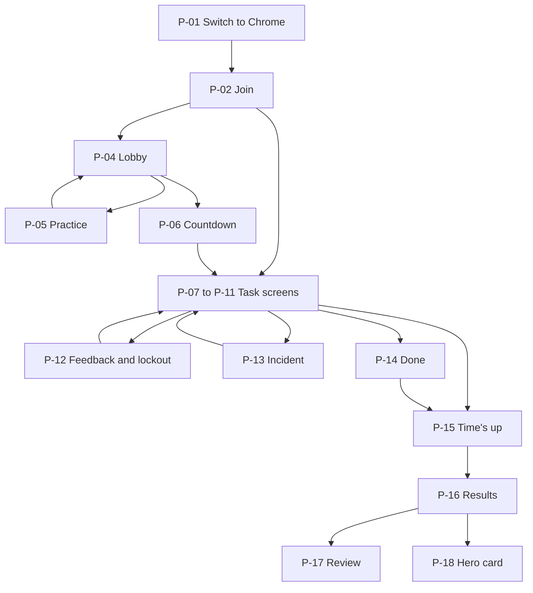
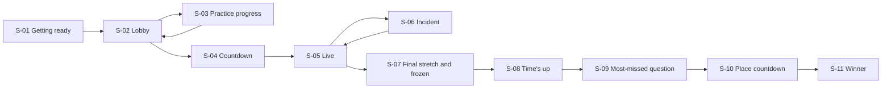
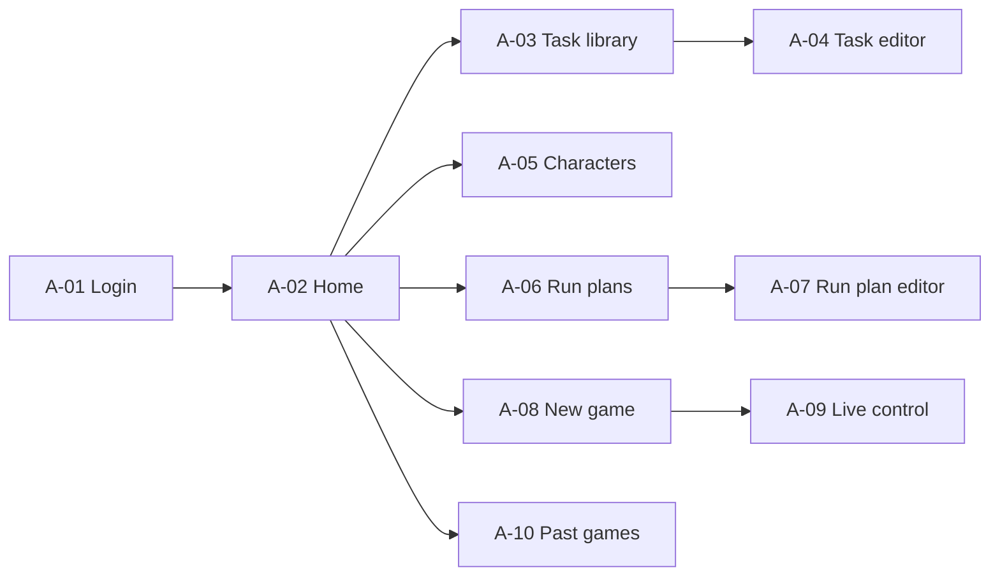

# Delivery Hero — UI/UX Wireframes

> Document 12 of 18 · Version 1.0 (approved)

## Document control

| Field | Value |
|---|---|
| Project | Delivery Hero |
| Document | 12 — UI/UX Wireframes |
| Version | 1.0 |
| Status | Approved on 23 September 2026 |
| Owner and approver | [Owner name] |
| Date | 23 September 2026 |
| Drafting note | Every color pairing in section 5.2 was checked against WCAG 2.2 AA contrast ratios |
| Depends on | 01 — Charter v1.9 · 02 — PRD v1.1 · 03 — SRS v1.3 · 08 — LLD v1.1 · 11 — API Specification v1.0 |
| Feeds into | Frontend implementation · 15 — Test Cases |

### Revision history

| Version | Date | Author | Summary of changes |
|---|---|---|---|
| 0.1 | 2026-09-23 | [Owner name] | First draft |
| 1.0 | 2026-09-23 | [Owner name] | Approved. UX-01 to UX-09 recorded as DEC-166 to DEC-174 (Charter v1.10) |

---

## 1. Purpose

This document shows what every screen looks like and how it behaves: layout, content, states, exact wording, interactions and accessibility. It also defines the small design system the screens share, so the owner can build consistent screens without a separate designer.

## 2. Scope

Every screen of the three surfaces: phones (section 7), the projector (section 8) and the admin panel (section 9). Visual polish such as the final pixel art is out of scope; the wireframes fix structure, content and behavior.

## 3. Definitions

| Term | Meaning |
|---|---|
| Wireframe | A low-detail drawing of a screen's layout and content, not to scale |
| Design token | A named value, such as a color, used everywhere instead of raw values |
| Banner | A non-blocking message that appears briefly without stopping play |
| Overlay | A layer that covers part of the screen and blocks input while shown |
| Safe area | The part of a phone screen not covered by notches or system bars |

## 4. Conventions

- Wireframes use monospace text drawings. `[MAYA]` marks a character image, `[QR]` a QR code, `[icon: lock]` an icon, and `▮▮▮▯▯` a timer bar.
- Reference sizes: phones 360 × 780 CSS pixels (portrait), the projector 1920 × 1080, the admin panel 1440 pixels wide.
- Text in double quotes is exact wording. Section 10 lists every string with its source.
- Examples use real tasks from the task pool and the personas Sam, Priya and Arjun.

## 5. Design system

### 5.1 Principles

1. **Readable first, arcade second.** The retro look lives in headings, frames and art; task text is always plain and clear.
2. **Big, obvious targets.** Answer controls fill the lower half of the phone and are at least 48 px tall.
3. **Never color alone.** Every state pairs a color with an icon or words (NFR-26).
4. **Calm motion.** Short, purposeful animation; nothing flashes more than three times per second; reduced motion is respected (NFR-29, NFR-34).
5. **Nothing wastes answer time.** Feedback never blocks the next task, except the deliberate 3-second lockout (UX-08).

### 5.2 Color tokens

| Token | Value | Use |
|---|---|---|
| `--bg` | `#0B1020` | Page background (dark navy) |
| `--surface` | `#151C33` | Cards, panels, speech bubbles |
| `--surface-2` | `#1E2745` | Raised elements, hovered rows |
| `--text` | `#F5F7FF` | Main text |
| `--text-muted` | `#A9B4D6` | Secondary text |
| `--ink` | `#0B1020` | Text on bright fills |
| `--primary` | `#38E1FF` | Primary buttons, timer bar, links (cyan) |
| `--accent` | `#FF5FD2` | Logo, highlights, the winner (magenta) |
| `--success` | `#4BE38A` | Correct answers (green) |
| `--warning` | `#FFC53D` | Streak flame, timer under 5 seconds (amber) |
| `--danger` | `#FF6B6B` | Wrong-answer icons, timer under 3 seconds (red); never used behind text |
| `--danger-bg` | `#8E1B1B` | Filled red areas with text: the incident screen, destructive buttons |
| `--border` | `#7382B8` | Input and control borders |
| `--focus` | `#FFD84D` | 3 px keyboard focus ring |

**Contrast check (WCAG 2.2 AA):**

| Pairing | Ratio | Required | Result |
|---|---|---|---|
| `--text` on `--bg` / `--surface` / `--surface-2` | 17.70 / 15.76 / 13.71 | 4.5 | Pass |
| `--text-muted` on `--bg` / `--surface` | 9.18 / 8.18 | 4.5 | Pass |
| `--ink` on `--primary` / `--success` / `--warning` / `--accent` | 12.06 / 11.41 / 12.00 / 7.05 | 4.5 | Pass |
| `--text` on `--danger-bg` | 8.45 | 4.5 | Pass |
| `--danger`, `--success`, `--warning`, `--primary`, `--accent` icons on `--bg` | 6.82 to 12.06 | 3 | Pass |
| `--border` on `--bg` / `--surface` | 5.06 / 4.51 | 3 | Pass |
| `--focus` on `--bg` / `--surface` | 13.69 / 12.19 | 3 | Pass |
| `--text` on `--danger` | 2.59 | 4.5 | **Fails, so this pairing is never used** |

The final-stretch red tint is a thin frame and a translucent vignette at the screen edges; text always stays on `--bg` or `--surface`.

### 5.3 Typography

| Role | Font | Sizes (phone / projector) | Used for |
|---|---|---|---|
| Display | "Press Start 2P" (SIL Open Font License), self-hosted | 16–24 px / 32–96 px | Logo, headings, the clock, scores, ranks (UX-02) |
| Text | System UI font stack (`system-ui, -apple-system, "Segoe UI", Roboto, sans-serif`) | 16–20 px / 28–40 px | Prompts, options, messages, admin panel |
| Code | System monospace stack (`ui-monospace, Menlo, Consolas, "Liberation Mono", monospace`) | 14–16 px / 24 px | Code snippets and monospace problem words |

The pixel font is never used for sentences longer than a few words, and never below 16 px. All sizes are in `rem`, so the phone's text-size setting scales them (NFR-30).

### 5.4 Layout, shape and spacing

- An 8-pixel spacing grid. Arcade-style frames: 2 px solid borders with square corners, and no drop shadows.
- Phone content keeps inside the safe area. Answer controls sit in the bottom half, within thumb reach.
- The projector uses a 12-column grid: the wall takes 8 columns and the sidebar 4.

### 5.5 Icons and character art

- **Characters:** one pixel-art image per role from the free pack (DEC-50), shown at 96 px on phones and 160 px on the projector.
- **Interface icons** come from an open-licensed pixel icon set, such as Pixelarticons (MIT license; confirm when chosen, and record it in the README) (UX-03). Each icon has visible text beside it or an accessible label.

| Icon | Meaning |
|---|---|
| Check | Correct, done |
| Cross | Wrong |
| Lock | Lockout, frozen leaderboard |
| Flame | Streak of 3 or more |
| No-signal | Offline |
| Siren | Incident |
| Clock | Time remaining |

### 5.6 Motion

| Animation | Duration | Reduced-motion version |
|---|---|---|
| Screen and card transitions | 150–250 ms slide or fade | Fade only |
| Feedback banner | Appears for about 1 s | Same, without slide |
| Wall square: correct highlight, wrong shake | 300 ms | Color change only |
| Final-stretch clock pulse | Once per second | Static red clock |
| Incident border pulse | Once per second | Static red border |
| Winner celebration | Pixel confetti falling for 4 s, no flashing | A static "winner" frame |

### 5.7 Components

| Component | Description |
|---|---|
| `TopBar` | Phone header: time remaining, total points, streak with ×1.5 badge |
| `TimerBar` | A draining bar plus the seconds as a number; turns `--warning` at 5 s and `--danger` at 3 s (UX-04) |
| `SpeechBubble` | Character image, name and role, with the prompt in a bubble |
| `AnswerButton` | Full-width button with a letter badge (A–D) and the option text; at least 48 px tall (UX-04) |
| `ArcadeButton` | Primary, secondary and danger variants of a regular button |
| `CodeBlock` | Monospace code with its own horizontal scroll and a fade at the edge showing there's more |
| `TokenChip` | One tappable word in a problem-word task; selected chips get a check icon and an underline |
| `OrderItem` | A tappable item that shows its assigned number |
| `FeedbackBanner` | Non-blocking outcome message with the character's reaction line (UX-08) |
| `LockoutOverlay` | Covers the answer area during the 3-second lockout with a countdown |
| `ReconnectBanner` | A top banner while the connection is being restored |
| `WallSquare`, `Top10Row`, `FeedItem`, `PhaseBar`, `Clock` | Projector building blocks |
| `ConfirmDialog` | Admin confirmation for Cancel and Close |

## 6. Screen maps

### 6.1 Phone



P-03 (join messages), P-19 (reconnecting) and P-20 (game over) can appear from several screens.

### 6.2 Projector



### 6.3 Admin panel



## 7. Phone screens

All phone screens are portrait. In landscape, the layout still works, and a small hint says "Turn your phone upright for the best view." (UX-06).

### P-01 · Switch to Chrome (FR-009)

```text
┌──────────────────────────────┐
│        DELIVERY HERO         │
│                              │
│        [icon: browser]       │
│                              │
│  Delivery Hero works best    │
│  in Chrome. Copy the link    │
│  and open it in Chrome.      │
│                              │
│ ┌──────────────────────────┐ │
│ │       Copy the link      │ │
│ └──────────────────────────┘ │
│                              │
│  Continue anyway             │
│  (not supported)             │
└──────────────────────────────┘
```

- **Copy the link** copies the join URL and shows "Link copied!" for 2 seconds. Without clipboard access, it shows the URL selected for manual copying (NFR-37).
- **Continue anyway (not supported)** is a text link that opens P-02 (DEC-106).

### P-02 · Join (FR-003 to FR-005, FR-011)

```text
┌──────────────────────────────┐
│        DELIVERY HERO         │
│   [MAYA] [BEN] [DEV] [TESS]  │
│                              │
│  What should we call you?    │
│ ┌──────────────────────────┐ │
│ │ Priya S                  │ │
│ └──────────────────────────┘ │
│  Up to 20 characters         │
│                              │
│ ┌──────────────────────────┐ │
│ │          Join            │ │
│ └──────────────────────────┘ │
│                              │
│  Your name and answers are   │
│  deleted after the event.    │
└──────────────────────────────┘
```

- On load, the phone calls `GET /api/games/{code}`. If the game isn't joinable, P-03 replaces the form.
- **Join** is disabled while the field is empty. An invalid name shows the naming-rules message under the field, linked to it for screen readers.
- A duplicate name is resolved by the server; the lobby shows the final name (FR-004).

### P-03 · Join messages (FR-002, FR-005, FR-006)

```text
┌──────────────────────────────┐
│        DELIVERY HERO         │
│                              │
│        [icon: <icon>]        │
│                              │
│   <message for the reason>   │
│                              │
│ ┌──────────────────────────┐ │
│ │        Try again         │ │  (only for "Hang tight!")
│ └──────────────────────────┘ │
└──────────────────────────────┘
```

| Reason | Icon | Message |
|---|---|---|
| Inactive link | Cross | "This game link isn't active. Ask the host for the current link." |
| Lobby not open | Clock | "The lobby isn't open yet. Hang tight!" (with a **Try again** button) |
| Joining closed | Lock | "Joining has closed for this round. Enjoy the show on the big screen!" |
| Game full | Lock | "This game is full." |
| Too many tries | Clock | "Too many tries. Please wait a moment and try again." |

### P-04 · Lobby (FR-010)

```text
┌──────────────────────────────┐
│        DELIVERY HERO         │
│                              │
│   You're in, Priya S!        │
│                              │
│   [MAYA] [BEN] [DEV] [TESS]  │
│                              │
│   Waiting for the host to    │
│   start…                     │
│                              │
│   ▯ ▮ ▯   (slow pulse)       │
│                              │
│   Tip: keep this screen open │
└──────────────────────────────┘
```

- Switches automatically to P-05 or P-06 when the host starts practice or the round.
- "Waiting for the host to start…" is in a polite live region, so screen readers announce the change.

### P-05 · Practice (FR-014 to FR-016)

The same layouts as the task screens (P-07 to P-11), with a banner across the top instead of the score:

```text
┌──────────────────────────────┐
│ PRACTICE · not scored   0:21 │
│ ▮▮▮▮▮▮▮▮▯▯▯▯      8s         │
│  …task content as in P-07…   │
└──────────────────────────────┘
```

After the last practice task, the screen shows a large check icon and "Ready!", then returns to P-04 when practice ends.

### P-06 · Countdown (FR-019)

```text
┌──────────────────────────────┐
│                              │
│         Get ready!           │
│                              │
│             3                │
│                              │
│   Answer fast, answer right. │
│                              │
└──────────────────────────────┘
```

The digit counts 5 to 1 from server time (FR-020), then P-07 appears.

### P-07 · Task: multiple choice (FR-029)

```text
┌──────────────────────────────┐
│ 3:42      1,245 pts [3] ×1.5 │  TopBar: time left, total, streak
│ ▮▮▮▮▮▮▮▮▮▮▮▯▯▯▯▯     12s     │  TimerBar + seconds
│                              │
│ [MAYA]  ┌───────────────────┐│
│         │ The client wants a││  SpeechBubble
│         │ "small" new       ││
│         │ feature two days  ││
│         │ before release.   ││
│         │ Your first move?  ││
│         └───────────────────┘│
│ Maya · Manager               │
│                              │
│ ┌──────────────────────────┐ │
│ │ A  Say yes to keep them  │ │  AnswerButton (≥48 px)
│ │    happy                 │ │
│ └──────────────────────────┘ │
│ ┌──────────────────────────┐ │
│ │ B  Quietly add it to the │ │
│ │    sprint                │ │
│ └──────────────────────────┘ │
│ ┌──────────────────────────┐ │
│ │ C  Estimate the impact,  │ │
│ │    then agree a date     │ │
│ │    with the client       │ │
│ └──────────────────────────┘ │
│ ┌──────────────────────────┐ │
│ │ D  Refuse without        │ │
│ │    discussing it         │ │
│ └──────────────────────────┘ │
└──────────────────────────────┘
```

- `[3] ×1.5` is the streak count with a flame icon; the ×1.5 badge shows only when the next fully correct answer will be multiplied (FR-040).
- One tap submits. The tapped button shows a pressed state and every button is disabled until feedback arrives.
- The timer announces the seconds remaining every 5 seconds through a polite live region (LLD section 6.7).

### P-08 · Task: yes/no swipe (FR-030)

```text
┌──────────────────────────────┐
│ 2:58       1,385 pts  [1]    │
│ ▮▮▮▮▮▮▮▯▯▯       5s          │
│                              │
│ [TESS]  Tess · Tester        │
│ ┌──────────────────────────┐ │
│ │ A login button that's    │ │  Statement card (swipeable)
│ │ two pixels off is a      │ │
│ │ release blocker.         │ │
│ └──────────────────────────┘ │
│  ← NO     swipe     YES →    │
│                              │
│ ┌────────────┐┌────────────┐ │
│ │  [cross]   ││  [check]   │ │  Buttons (same effect)
│ │     NO     ││    YES     │ │
│ └────────────┘└────────────┘ │
└──────────────────────────────┘
```

- The card follows the finger; releasing beyond 25% of the screen width submits, and anything shorter springs back.
- The buttons are the accessible alternative to swiping (NFR-28).

### P-09 · Task: tap to order (FR-031)

```text
┌──────────────────────────────┐
│ 2:31       1,512 pts         │
│ ▮▮▮▮▮▮▮▮▮▮▮▮▮▮▯▯▯▯   19s     │
│                              │
│ [TESS]  Order these bugs     │
│         from most to least   │
│         severe.              │
│ Tap them in order.           │
│ ┌──────────────────────────┐ │
│ │ ( )  Profile photo       │ │
│ │      upload is slow      │ │
│ └──────────────────────────┘ │
│ ┌──────────────────────────┐ │
│ │ (1)  Checkout fails for  │ │  numbered after tapping
│ │      every user          │ │
│ └──────────────────────────┘ │
│ ┌──────────────────────────┐ │
│ │ ( )  Typo in the footer  │ │
│ └──────────────────────────┘ │
│ ┌──────────────────────────┐ │
│ │ (2)  Export fails in     │ │
│ │      Firefox, works in   │ │
│ │      Chrome              │ │
│ └──────────────────────────┘ │
│ ┌───────────┐┌─────────────┐ │
│ │   Undo    ││   Submit    │ │  Submit enabled when all numbered
│ └───────────┘└─────────────┘ │
└──────────────────────────────┘
```

Tapping a numbered item does nothing; **Undo** removes the last number. Each item's accessible name includes its number, for example "Checkout fails for every user, position 1".

### P-10 · Task: tap the problem words (FR-032, FR-034)

```text
┌──────────────────────────────┐
│ 1:05       1,158 pts  [2]    │
│ ▮▮▮▮▮▮▮▮▮▮▮▮▯▯▯▯     12s     │
│                              │
│ [BEN]  Tap the words that    │
│        make this requirement │
│        untestable.           │
│                              │
│ ┌──────────────────────────┐ │
│ │ The  system  should load │ │  TokenChips
│ │ [fast✓]  and  be         │ │  selected: check + underline
│ │ user-friendly  for       │ │
│ │ [most✓]  users.          │ │
│ └──────────────────────────┘ │
│ 2 selected                   │
│ ┌──────────────────────────┐ │
│ │          Submit          │ │
│ └──────────────────────────┘ │
└──────────────────────────────┘
```

Each chip is a toggle button with `aria-pressed`. With the `monospace` flag set, the chips use the code font (FR-034).

### P-11 · Task with a code snippet (FR-033)

```text
┌──────────────────────────────┐
│ 2:10      1,640 pts [4] ×1.5 │
│ ▮▮▮▮▮▮▮▮▮▮▮▮▮▯▯▯▯▯▯▯  14s    │
│ [DEV]  Users aged 18 or over │
│        may sign up. What's   │
│        wrong with this check?│
│ ┌──────────────────────────┐ │
│ │ if (age > 18) {          │ │  CodeBlock (scrolls sideways
│ │     allowSignup();       │ │  inside the box only)
│ │ }                        │ │
│ └──────────────────────────┘ │
│ ┌──────────────────────────┐ │
│ │ A  It lets 17-year-olds  │ │
│ │    in                    │ │
│ └──────────────────────────┘ │
│  … B, C, D as in P-07 …      │
└──────────────────────────────┘
```

The page itself never scrolls sideways; long lines scroll inside the code block, with a fade at the right edge showing there's more.

### P-12 · Feedback and lockout (FR-038, FR-041)

**After a correct or partly correct answer:** the next task is already on screen, and a banner slides over the top bar for about 1 second without blocking it (UX-08):

```text
┌──────────────────────────────┐
│ [check] Correct! +140 [MAYA] │  FeedbackBanner
│ "Client's happy. You're a    │
│  legend."                    │
│  …next task already visible… │
└──────────────────────────────┘
```

| Outcome | Banner text | Icon and color |
|---|---|---|
| Fully correct | "Correct! +140" | Check, `--success` |
| Partly correct | "Partly right! +87" | Half-check, `--warning` |
| Timeout | "Out of time on that one." | Clock, `--text-muted` |

**After a wrong answer:** the answer area is covered by the lockout overlay for 3 seconds, then the next task appears:

```text
│ ┌──────────────────────────┐ │
│ │ [cross] Wrong! -40       │ │  LockoutOverlay
│ │ [DEV] "That broke the    │ │
│ │  build."                 │ │
│ │     [icon: lock]  3      │ │  countdown 3, 2, 1
│ └──────────────────────────┘ │
```

A wrong yes/no swipe shows "Wrong! -100". Feedback never shows the correct answer (DEC-44); outcomes are announced through a polite live region.

### P-13 · Incident (FR-044 to FR-047)

```text
┌──────────────────────────────┐  whole screen --danger-bg,
│ [siren] SEV-1 INCIDENT  0:17 │  border pulses once per second
│ ▮▮▮▮▮▮▮▮▮▮▮▮▮▮▮▮▯▯▯▯         │
│                              │
│ [DEV]  Production is down    │
│        right after the 5 pm  │
│        deploy. What do you   │
│        do first?             │
│                              │
│ ┌──────────────────────────┐ │
│ │ A  Debug directly in     │ │
│ │    production            │ │
│ └──────────────────────────┘ │
│  … B, C, D …                 │
│                              │
│ Worth 200 + speed bonus      │
└──────────────────────────────┘
```

After answering, the banner shows the result ("Incident fixed! +275"), then the paused task returns with its remaining time and the note "Back to where you were". A wrong answer shows "Wrong! -80" and the lockout overlay first.

### P-14 · Done (FR-026)

```text
┌──────────────────────────────┐
│ 0:48                3,020 pts│
│                              │
│   [MAYA] [BEN] [DEV] [TESS]  │
│        [icon: check]         │
│                              │
│   Done! Watch the screen     │
│                              │
│   You answered every task.   │
└──────────────────────────────┘
```

### P-15 · Time's up (FR-027, FR-064)

```text
┌──────────────────────────────┐
│                              │
│          TIME'S UP           │
│                              │
│   Time's up! Eyes on the     │
│   screen.                    │
│                              │
│        [icon: clock]         │
└──────────────────────────────┘
```

No score or rank is shown here, so the reveal isn't spoiled (DEC-77).

### P-16 · Results (FR-064)

```text
┌──────────────────────────────┐
│        DELIVERY HERO         │
│                              │
│   You finished 17th of 42    │
│                              │
│          2,310 pts           │
│                              │
│ ┌──────────────────────────┐ │
│ │    See what you missed   │ │  → P-17
│ └──────────────────────────┘ │
│ ┌──────────────────────────┐ │
│ │      Your hero card      │ │  → P-18 (if built)
│ └──────────────────────────┘ │
└──────────────────────────────┘
```

The winner's phone shows "You finished 1st of 42" with the accent color and the title "Delivery Hero".

### P-17 · Review (FR-065)

```text
┌──────────────────────────────┐
│ ← Back   What you missed (4) │
│ ┌──────────────────────────┐ │
│ │ This loop should print 1 │ │
│ │ to 5. What does it       │ │
│ │ actually print?          │ │
│ │ [code block]             │ │
│ │ [cross] You: 1 to 5      │ │
│ │ [check] Answer: 1 to 4   │ │
│ │ i < 5 stops before 5. It │ │
│ │ needs i <= 5.            │ │
│ └──────────────────────────┘ │
│ ┌──────────────────────────┐ │
│ │ …next missed task…       │ │
└──────────────────────────────┘
```

With nothing to review, the screen shows "Nothing to review. You got everything right!"

### P-18 · Hero card (FR-066)

```text
┌──────────────────────────────┐
│ ╔══════════════════════════╗ │
│ ║        AUDITOR           ║ │  title (display font)
│ ║   [pixel frame + TESS]   ║ │  strongest role's character
│ ║ Measured twice, deployed ║ │
│ ║ once.                    ║ │
│ ║                          ║ │
│ ║ Strongest role:          ║ │
│ ║ Bug Hunter               ║ │
│ ║ Points      2,310        ║ │
│ ║ Rank        17th         ║ │
│ ║ Correct     19           ║ │
│ ║ Best streak 6            ║ │
│ ║ Avg time    9.4 s        ║ │
│ ╚══════════════════════════╝ │
│  Screenshot this!            │
└──────────────────────────────┘
```

When no role has positive points, "Strongest role" reads "Still warming up" and the frame shows all four characters (DEC-119).

### P-19 · Reconnecting (FR-008, NFR-03)

```text
┌──────────────────────────────┐
│ [no-signal] Reconnecting…    │  ReconnectBanner (--warning)
│  …current screen, inputs     │
│   disabled…                  │
└──────────────────────────────┘
```

After 5 seconds the banner reads "Still trying… check your mobile data." Once reconnected, the banner disappears and the screen redraws from the server's state.

### P-20 · Game over messages

| Situation | Message |
|---|---|
| Host cancelled | "The host ended this game." |
| Event closed | "This game has finished." |
| Removed by the host | "The host removed you from this game." |

Each is a full screen with the logo, an icon and the message, like P-03 without a button.

## 8. Projector screens

The projector is display-only. In test games, a "TEST" ribbon sits in the top-right corner of every screen (FR-085).

### S-01 · Getting ready (state CREATED)

```text
┌────────────────────────────────────────────────────────────────────────────┐
│                                                                            │
│                             DELIVERY HERO                                  │
│                  [MAYA]    [BEN]    [DEV]    [TESS]                        │
│                                                                            │
│                            Getting ready…                                  │
│                                                                            │
└────────────────────────────────────────────────────────────────────────────┘
```

The QR code appears only once the lobby opens, so nobody tries to join too early (UX-05).

### S-02 · Lobby (FR-053)

```text
┌────────────────────────────────────────────────────────────────────────────┐
│ DELIVERY HERO                                                  Scan to join│
│                                                                            │
│   ┌────────────────────┐     Joined: 37                                    │
│   │                    │                                                   │
│   │        [QR]        │     Priya S · Arjun · Sam · Rahul 2 · Mei ·       │
│   │   (≥ 400 × 400 px) │     Kofi · Lena · Tom · Aisha · Dev K · …         │
│   │                    │     (newest first, new names pop in)              │
│   └────────────────────┘                                                   │
│   https://<host>/join?code=K7PQ2M                                          │
│   Open this link in Chrome                                                 │
└────────────────────────────────────────────────────────────────────────────┘
```

### S-03 · Practice progress (FR-017)

The lobby layout, with the QR panel replaced by:

```text
│            PRACTICE ROUND                  0:18                             │
│            32 of 40 finished practice                                       │
│            ▮▮▮▮▮▮▮▮▮▮▮▮▮▮▮▮▯▯▯▯                                             │
```

### S-04 · Countdown (FR-019, FR-054)

```text
┌────────────────────────────────────────────────────────────────────────────┐
│                                                                            │
│                                   3                                        │
│                         The sprint starts now!                             │
│                                                                            │
└────────────────────────────────────────────────────────────────────────────┘
```

### S-05 · Live (FR-054 to FR-057)

```text
┌────────────────────────────────────────────────────────────────────────────────────────────┐
│ DELIVERY HERO   [Planning] [Development] [■ Testing] [Release]           [clock] 1:43      │
├─────────────────────────────────────────────────────────────┬──────────────────────────────┤
│ ┌────┐┌────┐┌────┐┌────┐┌────┐┌────┐┌────┐┌────┐┌────┐┌────┐ │ Top 10                      │
│ │ PS ││ AR ││ SA ││ R2 ││ ME ││ KO ││ LE ││ TO ││ AI ││ DK │ │  1  Sam              1,820  │
│ │Priy││Arju││Sam ││Rahu││Mei ││Kofi││Lena││Tom ││Aish││Dev │ │  2  Priya S          1,745  │
│ │ ok ││ LK ││ F5 ││    ││ X  ││ ok ││    ││ -- ││    ││ DN │ │  3  Arjun            1,690  │
│ └────┘└────┘└────┘└────┘└────┘└────┘└────┘└────┘└────┘└────┘ │  …                          │
│  … up to 10 rows of 10 squares …                            │ 10  Lena             1,105   │
│                                                             │ Live feed                    │
│                                                             │  Sam hit a 5-answer streak   │
│                                                             │  Testing phase started       │
│                                                             │  Kofi joined late            │
│                                                             │  Tom went offline            │
└─────────────────────────────────────────────────────────────┴──────────────────────────────┘
```

- In this drawing, `ok` marks a correct highlight, `X` a wrong answer, `LK` a lockout, `F5` a flame with a streak of 5, `--` offline and `DN` done.
- **Wall squares** show initials, first name and a state icon: check (correct, brief green highlight), cross (wrong, brief shake), lock (lockout), flame (streak of 3 or more), no-signal (offline, grayed), double check (done). The wall never shows points (FR-056).
- **Top 10** rows animate to their new positions at most twice per second (FR-055).
- **Phase bar** highlights the clock's phase with a filled marker and bold label (FR-023).
- The wall grid sizes itself: 10 columns for up to 100 players, larger squares for fewer players.

### S-06 · Incident (FR-048)

The live layout with every square red (`--danger-bg`) and a siren banner across the wall:

```text
│ [siren] SEV-1 INCIDENT: production is down!                                 │
│ ┌────┐┌────┐┌────┐ …  squares flip back to normal as players answer         │
│ │ PS ││ AR ││ SA │                                                           │
```

When the first correct answer arrives, the feed (or a banner, if the feed isn't built) shows "Priya S fixed it first: 2.8 s" (DEC-121).

### S-07 · Final stretch and frozen (FR-049, FR-050)

- **Final stretch** (from 80% of the round): a red frame and edge vignette appear, and the clock pulses once per second.
- **Freeze** (last 30 seconds): the top-10 heading changes to "[icon: lock] Frozen", and the rows stop changing. The wall keeps moving.

```text
│ [lock] Frozen                 │
│  1  Sam              2,410    │  (last standings, no longer updating)
```

### S-08 · Time's up (FR-027)

```text
┌────────────────────────────────────────────────────────────────────────────┐
│                               TIME'S UP!                                   │
│                     Let's see how the sprint went…                         │
└────────────────────────────────────────────────────────────────────────────┘
```

### S-09 · Reveal: most-missed question (FR-060)

```text
┌────────────────────────────────────────────────────────────────────────────┐
│ MOST MISSED                                           70% got this wrong   │
│                                                                            │
│  [DEV]  This loop should print 1 to 5. What does it actually print?        │
│         ┌───────────────────────────────────┐                              │
│         │ for (int i = 1; i < 5; i++) {     │                              │
│         │     print(i);                     │                              │
│         │ }                                 │                              │
│         └───────────────────────────────────┘                              │
│  [check] Answer: 1 to 4                                                    │
│  i < 5 stops before 5. It needs i <= 5.                                    │
└────────────────────────────────────────────────────────────────────────────┘
```

### S-10 · Reveal: place countdown (FR-061)

```text
┌────────────────────────────────────────────────────────────────────────────┐
│                                                                            │
│                                  #10                                       │
│                                 Lena                                       │
│                              1,105 points                                  │
│                                                                            │
│                    ○ ○ ○ ○ ○ ○ ○ ○ ○ ●   step 2 of 11                      │
└────────────────────────────────────────────────────────────────────────────┘
```

Tied players appear together: "#2 · Priya S and Arjun · 3,985 points" (DEC-141).

### S-11 · Reveal: winner (FR-062)

```text
┌────────────────────────────────────────────────────────────────────────────┐
│   *  .   *    .   *   (pixel confetti, no flashing)   .   *    .   *       │
│                                                                            │
│                            DELIVERY HERO                                   │
│                                 #1                                         │
│                                 Sam                                        │
│                             4,210 points                                   │
│                   [MAYA]  [BEN]  [DEV]  [TESS]  cheering                   │
└────────────────────────────────────────────────────────────────────────────┘
```

After the winner, the projector stays on this screen until the host closes the event, then shows "This game has finished."

## 9. Admin screens

The admin panel is designed for a laptop at 1280 pixels wide or more, and is fully usable with a keyboard (NFR-32).

### A-01 · Login (FR-067, FR-068)

```text
┌──────────────────────────────────────────────┐
│ DELIVERY HERO · Admin                        │
│                                              │
│ Password                                     │
│ ┌──────────────────────────────────────────┐ │
│ │ ••••••••••••                             │ │
│ └──────────────────────────────────────────┘ │
│ ┌──────────┐                                 │
│ │  Log in  │                                 │
│ └──────────┘                                 │
│ That password didn't work.                   │  (after a failure)
└──────────────────────────────────────────────┘
```

When rate-limited: "Too many tries. Please wait a moment and try again."

### A-02 · Home

```text
┌────────────────────────────────────────────────────────────────────────────┐
│ DELIVERY HERO admin   Tasks · Characters · Run plans · Games · Past games  │
│                                                                   Log out  │
├────────────────────────────────────────────────────────────────────────────┤
│ Current game: none                          ┌──────────────────┐           │
│                                             │  Create a game   │ → A-08    │
│                                             └──────────────────┘           │
│ Library: 74 tasks · 2 run plans                                            │
│ Default 5-minute plan: ready (no errors, no warnings)                      │
└────────────────────────────────────────────────────────────────────────────┘
```

With a game open, the "Current game" panel shows its code, state and a **Go to live control** button.

### A-03 · Task library (FR-070)

```text
┌────────────────────────────────────────────────────────────────────────────┐
│ Tasks                                                     [ New task ]     │
│ Role [All ▾]  Phase [All ▾]  Kind [All ▾]  Type [All ▾]  Search [standup ] │
├──────────────┬──────────┬─────────────┬────────────────┬──────────┬────────┤
│ Key          │ Role     │ Phase       │ Type           │ Used in  │ Time   │
├──────────────┼──────────┼─────────────┼────────────────┼──────────┼────────┤
│ mgr-dev-04   │ Manager  │ Development │ Multiple choice│ 1 plan   │ 15 s   │
│ The daily standup keeps running for 40 minutes. What's the best fix?       │
└────────────────────────────────────────────────────────────────────────────┘
```

Selecting a row opens A-04.

### A-04 · Task editor (FR-069, FR-071, FR-073)

```text
┌──────────────────────────────────────────────────┬─────────────────────────┐
│ Edit task  tst-test-01                          │ Preview (phone)          │
│ Role [Tester ▾]  Kind [Scored ▾]  Phase [Testing▾]│ ┌─────────────────────┐│
│ Type [Tap to order ▾]   Time limit [   ] s (25)  │ │ [TESS] Order these  │ │
│ Prompt                                           │ │ bugs from most to   │ │
│ [Order these bugs from most to least severe.   ] │ │ least severe.       │ │
│ Items (display order)          Correct position  │ │ ( ) Profile photo…  │ │
│ [Profile photo upload is slow           ]  [3]   │ │ ( ) Checkout fails… │ │
│ [Checkout fails for every user          ]  [1]   │ │ ( ) Typo in the…    │ │
│ [Typo in the footer                     ]  [4]   │ │ ( ) Export fails…   │ │
│ [Export fails in Firefox, works in Chrome] [2]   │ │ [Undo]   [Submit]   │ │
│ [ + Add item ]                                   │ └─────────────────────┘ │
│ Code snippet  [ none ▾ ]                         │                         │
│ Explanation                                      │ Warnings: none          │
│ [A blocker beats a broken feature with…        ] │                         │
│ [ Save ]   [ Delete ]                            │                         │
└──────────────────────────────────────────────────┴─────────────────────────┘
```

- The fields in the middle change with the type: options with a "correct" radio (multiple choice), a Yes/No choice, items with positions (ordering), or text with `{{markers}}` and a monospace checkbox (problem words).
- The preview calls `POST /api/admin/tasks/public-view` as the form changes, so it matches the phones exactly (DEC-163).
- Errors appear beside their fields; warnings (such as a prompt over 25 words) appear in the side panel.
- **Delete** is disabled for tasks in use, with "Used by: Default 5-minute plan, Quick 3-minute plan".

### A-05 · Characters (FR-074)

```text
┌────────────────────────────────────────────────────────────────────────────┐
│ Characters                                                                 │
│ ┌──────────────────────────────┐ ┌──────────────────────────────┐          │
│ │ [MAYA] Manager               │ │ [BEN] Business Analyst       │          │
│ │ Name  [Maya          ]       │ │ Name  [Ben           ]       │          │
│ │ Intro [Quick one!    ]       │ │ Intro [What exactly do…]     │          │
│ │ Correct 1 [Client's happy…]  │ │ …                            │          │
│ │ Correct 2 [That's going in…] │ │                              │          │
│ │ Correct 3 [Nailed it…     ]  │ │                              │          │
│ │ Wrong 1–3 [ … ]              │ │                              │          │
│ │ [ Save ]                     │ │ [ Save ]                     │          │
│ └──────────────────────────────┘ └──────────────────────────────┘          │
│  … Dev and Tess below …                                                    │
└────────────────────────────────────────────────────────────────────────────┘
```

Each field shows its character count against the 80-character limit.

### A-06 · Run plans

```text
┌────────────────────────────────────────────────────────────────────────────┐
│ Run plans                                                [ New run plan ]  │
├────────────────────────┬────────┬───────┬──────────────────────────────────┤
│ Name                   │ Length │ Tasks │ Readiness                        │
├────────────────────────┼────────┼───────┼──────────────────────────────────┤
│ Default 5-minute plan  │ 5 min  │ 68    │ [check] Ready                    │
│ Quick 3-minute plan    │ 3 min  │ 36    │ [check] Ready                    │
│ Friday fun             │ 4 min  │ 22    │ [cross] 1 error · 2 warnings     │
└────────────────────────┴────────┴───────┴──────────────────────────────────┘
```

### A-07 · Run plan editor (FR-076, FR-078)

```text
┌────────────────────────────────────────────────────────────┬───────────────┐
│ Name [Friday fun        ]   Round length [4 ▾] minutes     │ Readiness     │
│ Incident task [incident-002 ▾]                             │ [cross] Errors│
│ Practice (4)      Planning (5)      Development (9)  …     │ Release has   │
│ ┌──────────────┐  ┌──────────────┐  ┌──────────────┐       │ no tasks      │
│ │1 practice-mc │  │1 mgr-plan-01 │  │1 dev-dev-02  │       │               │
│ │  [↑][↓][✕]   │  │  [↑][↓][✕]   │  │  [↑][↓][✕]   │       │ Warnings      │
│ │2 practice-…  │  │2 ba-plan-03  │  │…             │       │ 22 tasks; 40  │
│ └──────────────┘  └──────────────┘  └──────────────┘       │ recommended   │
│ [ + Add ]         [ + Add ]         [ + Add ]              │ for 4 minutes │
│ [ Save ]                                                   │               │
└────────────────────────────────────────────────────────────┴───────────────┘
```

- Tasks move with the **↑** and **↓** buttons, which work from the keyboard; drag-and-drop is an optional extra (UX-09, NFR-32).
- **+ Add** opens a picker filtered to the right kind and phase, so wrong entries can't be chosen (FR-076).
- The readiness panel updates after each save (BR-13).

### A-08 · New game and test game (FR-079, FR-085)

```text
┌────────────────────────────────────────────────────────────────────────────┐
│ New game                                                                   │
│ Run plan [Default 5-minute plan ▾]   [check] Ready                         │
│ ┌─────────────────┐                                                        │
│ │  Create game    │                                                        │
│ └─────────────────┘                                                        │
│ ── or rehearse ──                                                          │
│ Simulated players [ 40 ] (0–100)                                           │
│ ┌──────────────────────┐                                                   │
│ │  Start a test game   │                                                   │
│ └──────────────────────┘                                                   │
└────────────────────────────────────────────────────────────────────────────┘
```

A plan with errors disables **Create game** and lists the errors.

### A-09 · Live control (FR-080 to FR-084, FR-059)

```text
┌────────────────────────────────────────────────────────────────────────────┐
│ Game K7PQ2M · Default 5-minute plan · LIVE            [clock] 1:43 left    │
│ Join link  https://<host>/join?code=K7PQ2M          [ Copy ]               │
│ Projector  https://<host>/screen?key=…              [ Open ] [ Copy ]      │
├────────────────────────────────────────────────────────────────────────────┤
│ ┌──────────────┐ ┌──────────────┐ ┌──────────────┐ ┌──────────────┐        │
│ │ Open lobby   │ │ Start        │ │ Start round  │ │ Start reveal │        │
│ │  (disabled)  │ │ practice     │ │  (disabled)  │ │  (disabled)  │        │
│ └──────────────┘ └──────────────┘ └──────────────┘ └──────────────┘        │
│ ┌──────────────┐                                  ┌──────────────┐         │
│ │ ◄ Back       │   Reveal step 3 of 11            │ Next ►       │         │
│ └──────────────┘                                  └──────────────┘         │
│                                                   ┌──────────────┐         │
│                                                   │ Cancel game  │ danger  │
│                                                   └──────────────┘         │
├────────────────────────────────────────────────────────────────────────────┤
│ Players 42 joined · 41 connected · 3 done     Incident: active             │
│ Tasks, most wrong first                                                    │
│  dev-dev-11   30 answers   70% wrong                [ Void ]               │
│  tst-test-04  28 answers   46% wrong                [ Void ]               │
│ Keyboard: → ↓ Page Down Space Enter = Next · ← ↑ Page Up = Back            │
└────────────────────────────────────────────────────────────────────────────┘
```

- Only the actions in `allowedActions` are enabled (FR-080). The reveal buttons appear from Ended onward; Close replaces Cancel in Results.
- **Cancel game** and **Close event** open a confirmation dialog: "Cancel this game? All player data will be deleted." or "Close this event? Everything except the top 10 will be deleted."
- **Void** asks "Void dev-dev-11? Its points will be removed for everyone."
- The keyboard shortcuts work whenever focus isn't in a text field, so a presentation clicker can drive the reveal (DEC-112).
- In the lobby, a player list with **Rename** and **Remove** appears (FR-013).
- For a game left in Results after a restart, the header reads "Results (live details lost after restart)" (DEC-142).

### A-10 · Past games (FR-086)

```text
┌────────────────────────────────────────────────────────────────────────────┐
│ Past games                                                                 │
│ ┌────────────────────────────────────────────────────────────────────────┐ │
│ │ 22 Oct 2026 · Default 5-minute plan · 42 players                       │ │
│ │  1 Sam 4,210 · 2 Priya S 3,985 · 2 Arjun 3,985 · 4 Mei 3,700 · …       │ │
│ └────────────────────────────────────────────────────────────────────────┘ │
└────────────────────────────────────────────────────────────────────────────┘
```

## 10. Copy deck

Every user-facing string. "SRS" strings are fixed by requirements; "New" strings are introduced by this document (UX-07).

| Where | Text | Source |
|---|---|---|
| P-01 | "Delivery Hero works best in Chrome. Copy the link and open it in Chrome." | SRS FR-009 |
| P-01 | "Copy the link" · "Link copied!" · "Continue anyway (not supported)" | SRS FR-009 / New |
| P-02 | "What should we call you?" · "Up to 20 characters" · "Join" | New |
| P-02 | "Your name and answers are deleted after the event." | SRS FR-011 |
| P-02 | "Names can use letters, numbers, spaces, hyphens, apostrophes and full stops, up to 20 characters." | SRS FR-003 |
| P-03 | "This game link isn't active. Ask the host for the current link." | SRS FR-002 |
| P-03 | "The lobby isn't open yet. Hang tight!" · "Try again" | SRS FR-005 / New |
| P-03 | "Joining has closed for this round. Enjoy the show on the big screen!" | SRS FR-005 |
| P-03 | "This game is full." | SRS FR-006 |
| P-03, A-01 | "Too many tries. Please wait a moment and try again." | LLD 5.12 |
| P-04 | "You're in, Priya S!" · "Tip: keep this screen open" | New |
| P-04 | "Waiting for the host to start…" | SRS FR-010 |
| P-05 | "PRACTICE · not scored" | New |
| P-05 | "Ready!" | SRS FR-016 |
| P-06 | "Get ready!" · "Answer fast, answer right." | New |
| P-08 | "swipe" hint · "YES" · "NO" | New |
| P-09 | "Tap them in order." · "Undo" · "Submit" | New |
| P-12 | "Correct! +140" · "Partly right! +87" · "Out of time on that one." · "Wrong! -40" | New |
| P-13 | "SEV-1 INCIDENT" · "Worth 200 + speed bonus" · "Incident fixed! +275" · "Back to where you were" | New |
| P-14 | "Done! Watch the screen" | SRS FR-026 |
| P-14 | "You answered every task." | New |
| P-15 | "Time's up! Eyes on the screen." | SRS FR-027 |
| P-16 | "You finished 17th of 42" | SRS FR-064 |
| P-16 | "See what you missed" · "Your hero card" | New |
| P-17 | "What you missed" · "No answer" · "Nothing to review. You got everything right!" | SRS BR-11 / New |
| P-18 | Hero titles, flavor texts and role labels | PRD 8.10 |
| P-18 | "Still warming up" | SRS BR-12 |
| P-18 | "Screenshot this!" | New |
| P-19 | "Reconnecting…" | SRS 6.3 |
| P-19 | "Still trying… check your mobile data." | New |
| P-20 | "The host ended this game." · "This game has finished." · "The host removed you from this game." | SRS |
| Any phone | "Turn your phone upright for the best view." | New |
| S-01 | "Getting ready…" | New |
| S-02 | "Scan to join" · "Joined: 37" | New |
| S-02 | "Open this link in Chrome" | SRS FR-053 |
| S-03 | "32 of 40 finished practice" | SRS FR-017 |
| S-04 | "The sprint starts now!" | New |
| S-06 | "SEV-1 INCIDENT: production is down!" · "Priya S fixed it first: 2.8 s" | New |
| S-07 | "Frozen" | SRS FR-050 |
| S-08 | "TIME'S UP!" · "Let's see how the sprint went…" | New |
| S-09 | "MOST MISSED" · "70% got this wrong" · "Answer: 1 to 4" | New |
| S-11 | "Delivery Hero" | SRS FR-062 |
| All projector screens in test games | "TEST" | SRS FR-085 |
| A-01 | "That password didn't work." | New |
| A-04 | "Someone else changed this since you opened it. Reload to see their changes." | SRS FR-073 |
| A-09 | "Cancel this game? All player data will be deleted." · "Close this event? Everything except the top 10 will be deleted." · "Void dev-dev-11? Its points will be removed for everyone." | New |
| A-09 | "Results (live details lost after restart)" | LLD LD-04 |

## 11. Accessibility checklist

| Rule | How the screens meet it | Requirement |
|---|---|---|
| Contrast | Every pairing in section 5.2 checked; text never on `--danger` | NFR-25 |
| Color not alone | Every state has an icon or words | NFR-26 |
| Target size | Answer buttons at least 48 px tall; other controls at least 24 × 24 px | NFR-27 |
| Gestures | Swipes have Yes/No buttons; ordering uses taps; admin reordering uses ↑/↓ buttons | NFR-28 |
| Flashing | Pulses once per second at most; confetti falls without flashing | NFR-29 |
| Text size and reflow | `rem` units; layouts tested at 200% text and 320 px wide | NFR-30 |
| Names and live regions | Real buttons with accessible names; timer, feedback and state changes in polite live regions | NFR-31 |
| Keyboard | Admin panel fully usable by keyboard with a visible 3 px `--focus` ring; logical focus order top to bottom | NFR-32 |
| Timing | Time limits are essential to the game; stated in the README's accessibility statement | NFR-33 |
| Reduced motion | Section 5.6 lists every animation's reduced version | NFR-34 |

## 12. Traceability

| Requirement group | Screens |
|---|---|
| FR-001 to FR-013 (joining and lobby) | P-01 to P-04, S-02, A-09 (player list) |
| FR-014 to FR-017 (practice) | P-05, S-03, A-09 |
| FR-018 to FR-028 (round engine) | P-06, P-07 to P-11, P-14, P-15, S-04, S-05 |
| FR-029 to FR-042 (tasks and scoring) | P-07 to P-12 |
| FR-043 to FR-051 (timed events) | P-13, S-06, S-07 |
| FR-052 to FR-058 (projector) | S-01 to S-07 |
| FR-059 to FR-066 (reveal and results) | S-09 to S-11, P-16 to P-18, A-09 |
| FR-067 to FR-078 (admin and content) | A-01, A-03 to A-07 |
| FR-079 to FR-088 (games and after the event) | A-02, A-08 to A-10, P-20 |

## 13. Design decisions proposed in this document

These were approved with this document and are recorded as DEC-166 to DEC-174 in the Charter's decision log.

| ID | Decision | Why |
|---|---|---|
| UX-01 | The color tokens in section 5.2, all verified against WCAG 2.2 AA; text is never placed on the bright red token | Meets NFR-25 with the dark arcade look |
| UX-02 | Fonts: "Press Start 2P" (SIL Open Font License), self-hosted, for display text only at 16 px or larger; the system UI font stack for text; the system monospace stack for code | Arcade flavor where it's safe; fast, readable text everywhere else; nothing to download but one font |
| UX-03 | Interface icons come from an open-licensed pixel icon set such as Pixelarticons, with the license confirmed when chosen and recorded in the README; every icon has text or an accessible label | Consistent style and legal clarity |
| UX-04 | Multiple-choice buttons show letters A–D; the task timer shows the seconds as well as the bar, turning amber at 5 s and red at 3 s | Easier to discuss answers; timing never relies on color alone |
| UX-05 | The projector shows the QR code only once the lobby is open; before that it shows "Getting ready…" | Avoids players meeting "The lobby isn't open yet" |
| UX-06 | Phones in landscape get a small, non-blocking hint to turn upright | The game is designed for portrait, without locking anyone out |
| UX-07 | The "New" strings in the copy deck become the product's wording | One agreed source for every string |
| UX-08 | After correct, partly correct or timed-out answers, feedback is a non-blocking banner for about 1 second while the next task is already answerable; only wrong answers block, with the 3-second lockout | The server issues the next task immediately, so a blocking feedback screen would silently cost every player answer time |
| UX-09 | Admin reordering uses ↑/↓ buttons, with drag-and-drop only as an optional extra | Keyboard-accessible and meets WCAG 2.5.7 |

## 14. Future considerations

- Replace wireframe placeholders with the chosen pixel-art pack once its license is confirmed (R-11).
- Run a quick usability check with 3–5 colleagues during the trial run, especially on P-09 (ordering) and P-10 (problem words), the least familiar controls.
- If remote play arrives, the projector screens need a "viewer" variant without the QR code.

## 15. Approval

| Role | Name | Decision | Date |
|---|---|---|---|
| Owner and approver | [Owner name] | ☑ Approved | 2026-09-23 |
