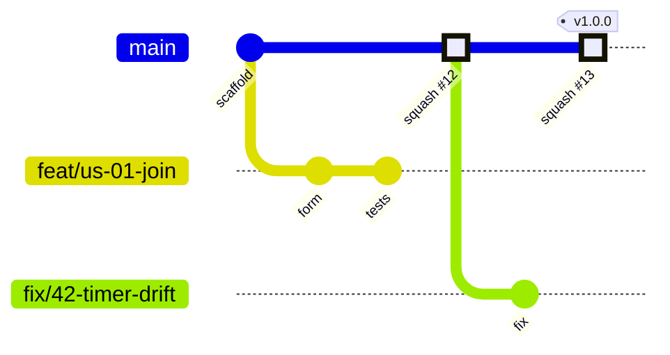
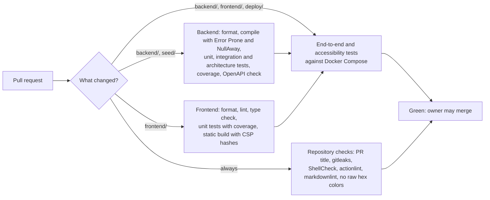

# Delivery Hero — Coding Standards and Git Strategy

> Document 13 of 18 · Version 1.2 (approved)

## Document control

| Field | Value |
|---|---|
| Project | Delivery Hero |
| Document | 13 — Coding Standards and Git Strategy |
| Version | 1.2 |
| Status | Approved on 23 September 2026 |
| Owner and approver | [Owner name] |
| Date | 23 September 2026 |
| Drafting note | The configuration examples in the appendices were checked with the tools they configure |
| Depends on | 01 — Charter v1.10 (DEC-64 to DEC-68, DEC-147 to DEC-149) · 03 — SRS v1.3 (NFR-40 to NFR-44) · 08 — LLD v1.1 · 09 — Software Architecture v1.0 · 12 — UI/UX Wireframes v1.0 |
| Feeds into | Sprint 0 repository setup · 14 — Test Plan · 16 — Deployment Guide |

### Revision history

| Version | Date | Author | Summary of changes |
|---|---|---|---|
| 0.1 | 2026-09-23 | [Owner name] | First draft |
| 1.0 | 2026-09-23 | [Owner name] | Approved. CS-01 to CS-06 and GS-01 to GS-04 recorded as DEC-175 to DEC-184 (Charter v1.11) |
| 1.1 | 2026-09-23 | [Owner name] | Corrections found while writing the Test Plan: the accessibility scan now fails on any WCAG 2.2 A or AA violation, as approved criterion AC-EN09-01 requires; the CI outline gains the seed validation step |
| 1.2 | 2026-09-24 | [Owner name] | From the approved Deployment Guide and Technical Documentation: Dependabot watches the Dockerfiles in `deploy/backend` and `deploy/nginx`; the CI end-to-end job uses the local stack with `DH_PROFILE=e2e` and loads the task pool (DEC-207); `.shellcheckrc` and `.gitleaks.toml` added, without which CI's ShellCheck step fails on the server scripts and its secret scan flags documented example values |

---

## 1. Purpose

This document sets how Delivery Hero's code is written, checked, reviewed, committed, merged and released. It names the formatting and analysis tools that NFR-43 leaves to this document, and it turns the rules scattered through the design documents into checks that run automatically, so a single developer working to a four-week deadline gets a safety net rather than a rulebook.

## 2. Scope

- Coding conventions for Java (backend), TypeScript and React (frontend), SQL migrations, shell scripts and documentation.
- The tools that check them, locally and in continuous integration.
- The Git workflow: branches, commits, pull requests, merging, tags and freezes.
- Dependency updates and repository hygiene.

Test strategy and test cases are in documents 14 and 15; the deploy workflow is in document 16.

## 3. Definitions

| Term | Meaning |
|---|---|
| Merge gate | The checks that must pass before a change reaches `main` |
| Pull request (PR) | A GitHub request to merge a branch into `main`; every change goes through one |
| Squash merge | Merging a pull request as one commit on `main` |
| Conventional Commits | A commit-message format: `type(scope): summary` |
| Static analysis | Automated checks that find bugs without running the code |
| Architecture test | A unit test that checks the code's structure, written with ArchUnit |
| Fixture | A stored example, here a JSON message used by both backend and frontend tests |

## 4. Principles

1. **Automate the rules.** A rule a tool can check is checked by a tool; this document explains the rest.
2. **Readable over clever.** The next reader might be the owner at 11 pm before the event.
3. **The design documents are the source of truth.** Code follows the API Specification, the LLD and the Database Design; when they must change, the documents change in the same pull request.
4. **Small, safe steps.** Short branches, small pull requests and a `main` that can always be deployed.
5. **Privacy and fairness are code properties.** No player data on disk (DEC-124), no answers on phones before the round ends (DEC-44, DEC-130) and no personal data in logs (DEC-104), each backed by a check where possible.

## 5. Tools

### 5.1 Summary

| Area | Tool | Runs | Fails the merge gate when |
|---|---|---|---|
| Java formatting | Spotless with palantir-java-format | Maven `validate` phase; pre-push hook | Any file isn't formatted |
| Java bug patterns | Error Prone (compiler plugin) | Every compile | Any error-level finding |
| Java null safety | NullAway with JSpecify annotations, for `engine` and `scoring` | Every compile | A possible null dereference |
| Architecture | ArchUnit tests (section 6.4) | Unit tests | Any rule is broken |
| Backend coverage | JaCoCo, unit and integration tests combined | Maven `verify` | `engine` or `scoring` below 80% line coverage (NFR-41) |
| REST documentation | springdoc-openapi, compared with the committed `docs/openapi.json` | Integration tests | The generated document differs from the committed one |
| TypeScript formatting | Prettier with the Tailwind class-order plugin | `npm run format:check`; pre-push hook | Any file isn't formatted |
| TypeScript linting | ESLint (flat config): Next.js core-web-vitals and TypeScript configs, typescript-eslint type-aware rules, jsx-a11y, project rules (section 7.5) | `npm run lint` | Any error |
| Type checking | TypeScript compiler, strict mode (`tsc --noEmit`) | `npm run typecheck` | Any type error |
| Frontend unit tests | Vitest with V8 coverage | `npm test` | A failure, or `src/time` or a store below 80% line coverage |
| End-to-end and accessibility | Playwright with axe-core | CI, against Docker Compose | A failure, or any detectable WCAG 2.2 A or AA violation (AC-EN09-01) |
| Secrets | gitleaks | CI; pre-push hook when installed | A secret-like string |
| Shell scripts | ShellCheck | CI | Any warning |
| Workflows | actionlint | CI | Any error |
| Documents | markdownlint-cli2 (relaxed rules in Appendix D) | CI | Any error |
| Task pool | `tools/validate_seed.py` | CI | Any error in the seed file |
| Dependencies | Dependabot version and security updates | Weekly, and on new advisories | Not applicable: it opens pull requests |

Next.js 16 removed `next lint` and no longer lints during `next build`, so ESLint runs as its own step with a flat `eslint.config.mjs`.

### 5.2 Why these tools

- **Error Prone rather than SpotBugs, PMD or Checkstyle.** It runs inside the compiler, is fast and reports few false positives; formatting is Spotless's job. One analyzer the owner actually reads beats three that get ignored.
- **NullAway only where it matters most.** Spring Framework 7, underneath Spring Boot 4.1, is annotated with JSpecify, so NullAway can check calls into Spring as well as our code. Limiting it to `engine` and `scoring` keeps the effort proportionate for four weeks.
- **No SonarQube Cloud or CodeQL.** Both need accounts or paid plans for private repositories. The tools above run anywhere at $0.
- **gitleaks rather than GitHub secret scanning.** GitHub's secret scanning and push protection for private repositories are paid features; gitleaks is free and runs in CI.

## 6. Java standards (backend)

### 6.1 Language and style

- Java 21. The formatter decides layout (4-space indentation, 120-column lines); nobody argues about it.
- **Records** for DTOs, commands, messages, configuration properties and value objects.
- **Sealed interfaces** for closed families: `Command`, `TaskContent`, answer payloads. `switch` over them has no `default`, so the compiler reports any missing case.
- `var` only when the type is obvious from the right-hand side.
- No wildcard imports; no unused code left behind "just in case".
- Names say what things are: `ScoreCalculator.fullyCorrect(...)`, not `ScoreHelper.calc(...)`.
- Comments explain *why*. Rules from the requirements cite their ID, for example `// BR-03: the streak multiplier starts at the 4th fully correct answer`.
- A `TODO` must reference a GitHub issue: `// TODO(#42): …`.

### 6.2 Null handling

- Every package has `@NullMarked` in `package-info.java`; anything that may be null is annotated `@Nullable`.
- Never return `null` for a collection; return an empty one.
- `Optional` only as a return type, never for fields or parameters.

### 6.3 Spring conventions

| Topic | Rule |
|---|---|
| Injection | Constructor injection only; no `@Autowired` fields |
| Configuration | `@ConfigurationProperties` records with `@Validated`; scoring values live only in `scoring.yml` (NFR-40) |
| Controllers | Thin: validate the request record, call a service, return a DTO. Never return an entity |
| Transactions | `@Transactional` on service methods only, never in `engine` |
| Persistence | Spring Data repositories; `spring.jpa.open-in-view=false`; Hibernate `ddl-auto=validate`; schema changes only through Flyway (NFR-42, DEC-157) |
| Errors | Throw a `DeliveryHeroException` carrying an `ApiErrorCode`; one `@RestControllerAdvice` turns it into Problem Details (DEC-144) |
| Real-time | Destination strings live in one `Destinations` class; message types are records with the `type` and `serverTime` envelope (DEC-162) |
| OpenAPI | springdoc-openapi (the 3.x line for Spring Boot 4), enabled only in the `dev` and `test` profiles; Nginx never exposes it |

### 6.4 Architecture rules (ArchUnit)

These tests enforce the LLD's package rules and the no-I/O rule for session threads (DEC-149):

| Rule | Why |
|---|---|
| `engine` doesn't depend on `api`, `content` repositories or `lifecycle` repositories | The engine stays pure and fast (LLD 5.1) |
| `scoring` depends only on `common` and the JDK | Scoring is testable in isolation |
| Nothing depends on `api` | Controllers are the outer layer |
| Classes in `engine` don't use JDBC, JPA, Spring Data, `java.net`, file I/O or `Thread.sleep` | Session threads never block (DEC-125) |
| Only `config` calls `Instant.now()`, `System.currentTimeMillis()`, `new Random()` or `Math.random()` | Time and randomness are injected, so tests control them (LLD section 4) |
| No `@Autowired` fields | Constructor injection only |
| Controllers never return types annotated `@Entity` | Entities stay inside their package |
| No JPA entity references a type from `engine` | Live game data never reaches the database (DEC-124) |

### 6.5 Concurrency rules

- A game's state is touched only on that game's session thread (DEC-125). No `synchronized`, locks or atomics inside `engine`.
- Only immutable objects (records, unmodifiable collections) cross threads.
- Timers are commands on the queue, never callbacks that change state directly (DEC-126).
- An exception inside one command is logged and the session continues with the next command; it never kills the thread.

### 6.6 Logging

- SLF4J with parameterized messages: `log.info("Game {} started", gameId)`.
- Never log names, answers, passwords, player tokens, projector keys or session IDs (DEC-104). Log IDs and counts instead.
- `gameId` goes into the MDC on session threads, so every line from a game can be traced.
- Levels: `ERROR` needs attention; `WARN` is unexpected but handled; `INFO` records lifecycle events; `DEBUG` is off in production.

### 6.7 Tests

- Unit tests end in `Test` and run with Surefire; integration tests end in `IT`, use Testcontainers and run with Failsafe.
- A test checking an acceptance criterion names it: `@DisplayName("AC-US29-05 two of three problem words scores 87")`.
- Structure each test as given, when, then. One behavior per test.
- Time comes from a mutable test clock; randomness from a seeded generator. No `Thread.sleep` in tests.

## 7. TypeScript and React standards (frontend)

### 7.1 Language and style

- TypeScript `strict`, plus `noUncheckedIndexedAccess`, `noImplicitOverride` and `noFallthroughCasesInSwitch`.
- No `any`: use `unknown` and narrow it. Messages are discriminated unions on `type`, handled by an exhaustive `switch` ending in `assertNever`.
- Prettier decides layout (2-space indentation, double quotes, semicolons, 100-column lines).
- Files: components in PascalCase (`TimerBar.tsx`), one component per file, named exports; other modules in camelCase (`timeSync.ts`); hooks start with `use`.

### 7.2 State and data flow

- One Zustand store per surface (`player`, `screen`, `admin`), following the LLD's folder structure.
- Stores change only through pure functions that apply a server message; these functions are unit-tested with the shared fixtures (section 7.6).
- Components read the store through selectors. Local component state is for UI details only, such as which ordering item was tapped.
- Derived values are computed, not stored with `useEffect`. Every subscription and timer is cleaned up.

### 7.3 Time, network and copy

- Countdowns use `serverNow()` from `src/time`; `Date.now()` is allowed only there.
- REST calls go through `src/api/http.ts`, which adds the CSRF header and parses Problem Details; `fetch` is allowed only there. STOMP goes through `src/realtime`.
- Every user-facing string lives in `src/copy.ts`, matching the copy deck in document 12 (DEC-172), so wording changes happen in one place.

### 7.4 Styling, CSP and static export

- Tailwind utility classes only. The color tokens from document 12 (DEC-166) are defined once with `@theme` in `globals.css`; components never contain raw hex colors (a CI check searches for them).
- **No `style` prop.** Pre-rendered HTML with a `style` attribute breaks the hash-based CSP (DEC-135). Dynamic sizes use SVG attributes (for example, the timer bar's `width`) or a CSS custom property set through a ref after mounting.
- No `dangerouslySetInnerHTML`, `eval` or `new Function`; no third-party scripts, fonts or images from other sites.
- The site is a static export: no API routes, no server actions, no dynamic route segments (routes use query parameters), and images are unoptimized static files.

### 7.5 Project lint rules

On top of the Next.js, TypeScript and jsx-a11y configurations, the ESLint config adds:

| Rule | Setting |
|---|---|
| `@typescript-eslint/no-explicit-any` | Error |
| `@typescript-eslint/no-floating-promises` | Error (type-aware) |
| `react/no-danger` | Error |
| `react/forbid-dom-props` | Error for `style` |
| `no-restricted-properties` | Error for `Date.now` outside `src/time` |
| `no-restricted-globals` | Error for `fetch` outside `src/api` |
| `no-console` | Error, except `console.error` |

### 7.6 Contract fixtures

The backend has a test that serializes one example of every REST response and real-time message listed in document 11 with the real serializers, and writes them to `contracts/*.json`. It fails if a committed fixture differs, and the frontend's store tests read the same files. A change to a message shape therefore breaks a test on both sides until document 11, the backend and the frontend agree (CS-06).

### 7.7 Accessibility in code

- Real `<button>` elements for actions and `<a>` for navigation; never a clickable `<div>`.
- Every icon is either decorative (`aria-hidden="true"` beside visible text) or has an `aria-label`.
- Announcements go through one shared `LiveAnnouncer` component with a polite live region.
- Each new screen gets an axe check in its Playwright test.

## 8. SQL, shell and documentation standards

### 8.1 SQL migrations

- Files are named `V<n>__<description>.sql`, with snake_case descriptions, in `backend/src/main/resources/db/migration`.
- A migration merged into `main` is never edited: Flyway's checksum would fail. Fix forward with a new migration.
- Lowercase snake_case identifiers and explicit constraint names, following `V1__create_schema.sql`.
- Every migration runs in the Testcontainers integration tests on every pull request.

### 8.2 Shell scripts

- Start with `#!/usr/bin/env bash` and `set -euo pipefail`; quote every variable; pass ShellCheck with no warnings.
- Scripts that change the server (deploy, backup) print what they're doing and exit non-zero on any failure.

### 8.3 Documentation

- Markdown in `docs/`, named `NN-kebab-case.md`, with Mermaid diagrams (DEC-70), sentence-case headings and the document control table (DEC-71).
- A change in behavior updates its documents in the same pull request. New decisions are added to the Charter's decision log with the next DEC number.
- The README covers setup; document 18 expands it.

## 9. Git strategy

### 9.1 Repository and visibility

The repository is private, because it holds the task pool with its answers and internal code (GS-01). On GitHub Free, private repositories can't use branch protection or rulesets, so GitHub can't enforce the merge gate by itself. The gate works like this instead:

1. CI runs on every pull request.
2. The owner merges only when CI is green and the branch is up to date with `main`; the pull request template asks for both.
3. The deploy workflow builds the merged commit and runs the unit tests again before deploying, so nothing unbuildable reaches the server (document 16).
4. If the organization provides a GitHub Team plan, or the owner upgrades to Pro, a ruleset turns this into enforcement: pull requests required, the CI checks required, linear history, and no force pushes or deletions on `main`.

### 9.2 Branching model

Trunk-based development with short-lived branches (DEC-65):



Highlighted commits are squash merges: pull request #12 lands on `main` as one new commit titled, for example, `feat(phone): join a game (#12)`, and the branch's own commits don't appear there.

- `main` is always deployable; every merge deploys, except while the deploy lock is active (DEC-61, DEC-103).
- Branches live at most two days. Anything bigger is split, or hidden behind a disabled feature setting.
- Branch names: `<type>/<story-or-issue>-<short-description>`, lowercase with hyphens, for example `feat/us-25-multiple-choice` or `fix/42-lockout-rounding`. Types match the commit types below.
- Nobody pushes directly to `main`, including documentation changes.

### 9.3 Commits

Conventional Commits, in the imperative mood, with a summary of 72 characters at most:

```text
feat(phone): show the lockout countdown after a wrong answer

The answer area stays covered for the 3-second lockout, with a
countdown, as in wireframe P-12, so players know when the next
task will appear.

Refs: US-28, FR-038
```

| Type | Use |
|---|---|
| `feat` | New behavior for users |
| `fix` | A bug fix |
| `test` | Tests only |
| `refactor` | Code change with no behavior change |
| `perf` | Performance improvement |
| `docs` | Documentation only |
| `build` | Build, dependencies or Docker |
| `ci` | Workflows |
| `chore` | Anything else (configuration, housekeeping) |
| `revert` | Undoing an earlier commit |

Scopes: `engine`, `scoring`, `api`, `realtime`, `content`, `lifecycle`, `security`, `db`, `seed`, `phone`, `screen`, `admin`, `ui`, `deploy`, `docs`.

### 9.4 Pull requests

- One story or fix per pull request, ideally under 400 changed lines, not counting lock files, fixtures or generated files.
- The title is a Conventional Commit, because it becomes the squash commit on `main`; CI checks its format.
- The body links the stories, requirements and decisions it covers, and completes the template in Appendix B.
- UI changes include a phone screenshot.
- Merge with **squash merge** only, giving `main` a linear history of one commit per pull request; delete the branch afterward.
- For changes to `engine`, `scoring` or `security`, the owner re-reads the full diff at least an hour after writing it, or asks a colleague to look.

### 9.5 Continuous integration



To stay within the 2,000 free Actions minutes a month for private repositories (GS-03):

- Jobs run only for the parts of the repository that changed; documentation-only pull requests run only the repository checks.
- A new push to a pull request cancels its earlier, unfinished run.
- Maven and npm dependencies and Playwright's browser are cached.
- Documentation-only merges don't trigger a deploy.
- The owner checks Actions usage every Monday. Past 75% of the allowance, end-to-end tests run only on demand (a manual run before merging a risky change) until the month resets.

Running CI on the Oracle machine instead was rejected: it would compete with live games and put build tools on the production server.

### 9.6 Tags, versions and freezes

- Versions follow Semantic Versioning. `v1.0.0` is tagged on `main` at the deployment freeze (E−1, Tue 20 Oct); later fixes become `v1.0.1` and so on (GS-04).
- The admin panel's footer shows the version and short commit hash, taken from Spring Boot's build information.
- **Content freeze (E−5):** task edits only to fix errors. **Deployment freeze (E−1):** merges only for problems that would stop the event, still through a pull request with green CI, and never while the deploy lock is active.
- Dependency updates follow the version policy (DEC-148): patch and minor updates weekly; security releases within 7 days; majors as planned work.

### 9.7 Local hooks

A versioned pre-push hook (Appendix C) runs the fast checks, formatting and linting for the parts that changed, plus gitleaks when installed, in well under a minute. It's enabled once per clone with `git config core.hooksPath .githooks`, and can be skipped for one push with `git push --no-verify`. CI remains the real gate.

## 10. Definition of Done

A story is done when:

1. Its acceptance criteria marked for testing (T) have automated tests that pass.
2. CI is green and the pull request is squash-merged into `main`.
3. It is deployed, and a user-facing change has been tried on a real phone in Chrome.
4. Affected documents are updated, and any new decision is in the Charter's log.
5. It adds no new accessibility violations, and uses no hard-coded strings or colors.

## 11. Repository hygiene

- Committed: `.editorconfig`, `.gitattributes`, `.shellcheckrc`, `.gitleaks.toml` (Appendix A), the Maven Wrapper, `package-lock.json`, `contracts/`, `docs/openapi.json`.
- Never committed: secrets, `.env` files, database dumps, player data, build output. `deploy/.env.example` documents every setting with placeholder values.
- No binary files over 1 MB; the pixel art is small PNG files, so Git LFS isn't needed.
- Third-party GitHub Actions are avoided where a few lines of shell will do. Every action is pinned to a full commit SHA, and Dependabot keeps the pins current (CS-03).

## 12. Traceability

| Source | Where this document meets it |
|---|---|
| DEC-65 (GitHub, one repository, short-lived branches) | Sections 9.1, 9.2 |
| DEC-66 (tools) | Section 5 |
| DEC-68 and NFR-41 (merge checks, 80% coverage) | Sections 5.1, 9.1, 9.5 |
| NFR-40 (scoring values in one file) | Section 6.3 |
| NFR-42 (Flyway only) | Sections 6.3, 8.1 |
| NFR-43 (formatting and static analysis on every pull request) | Sections 5.1, 9.5 |
| NFR-44 (generated OpenAPI) | Sections 5.1, 6.3 |
| DEC-104 (no personal data in logs) | Section 6.6 |
| DEC-124, DEC-125, DEC-126 (memory-only data, single-threaded sessions, timer commands) | Sections 6.4, 6.5 |
| DEC-135 (hash-based CSP) | Section 7.4 |
| DEC-148 (version policy) | Sections 9.6, Appendix E |
| DEC-149 (architecture tests) | Section 6.4 |
| DEC-166, DEC-172 (color tokens, copy deck) | Sections 7.3, 7.4 |

## 13. Decisions proposed in this document

These were approved with this document and are recorded as DEC-175 to DEC-184 in the Charter's decision log.

| ID | Decision | Why |
|---|---|---|
| CS-01 | Backend checks: Spotless with palantir-java-format; Error Prone; NullAway with JSpecify in `engine` and `scoring`; ArchUnit rules in section 6.4; JaCoCo at 80% line coverage for `engine` and `scoring`; springdoc-openapi with a committed `docs/openapi.json` compared in tests | Names the tools NFR-43 leaves open, with the fewest tools that cover formatting, bugs, structure and coverage |
| CS-02 | Frontend checks: Prettier with Tailwind class ordering; ESLint flat config with the Next.js, TypeScript, typescript-eslint type-aware and jsx-a11y rules plus section 7.5; strict `tsc`; Vitest at 80% line coverage for `src/time` and the stores; Playwright with axe-core | Next.js 16 no longer runs linting, so the checks are explicit; client timing logic gets the same coverage bar as server game logic |
| CS-03 | Repository checks: gitleaks, ShellCheck, actionlint, markdownlint-cli2 and a raw-hex-color search; Dependabot for Maven, npm, GitHub Actions and Docker; third-party actions pinned by commit SHA | Free replacements for GitHub's paid scanning on private repositories, and supply-chain safety |
| CS-04 | Rules enforced by tooling: time and randomness only through injected sources; no `style` prop, `dangerouslySetInnerHTML`, stray `Date.now` or stray `fetch` in the frontend | Turns fairness, testability and CSP requirements into automatic checks |
| CS-05 | All user-facing strings live in `src/copy.ts`, matching document 12's copy deck | One place to change wording, and tests can refer to exact strings |
| CS-06 | Contract fixtures: the backend writes one JSON example of every message and response to `contracts/`, and the frontend's tests read them | Keeps document 11, the backend and the frontend in step without a heavier contract-testing tool |
| GS-01 | The repository is private. The merge gate is CI on every pull request, plus merging only when green and up to date, plus re-verification in the deploy workflow. A ruleset enforces it if the plan ever allows | GitHub Free can't protect branches in private repositories, and making the repository public would publish the answers |
| GS-02 | Trunk-based development: branches of at most two days named `<type>/<story>-<description>`, Conventional Commit messages and pull request titles (checked in CI), squash merges only, no direct pushes to `main` | A clean, linear, searchable history and a `main` that's always deployable |
| GS-03 | CI minutes budget: path-filtered jobs, cancelled superseded runs, caching, no deploys for documentation-only merges, a weekly usage check, and end-to-end tests run only on demand if usage passes 75% | Stays inside the 2,000 free minutes a month for private repositories |
| GS-04 | Semantic Versioning, with `v1.0.0` tagged at the deployment freeze; version and commit shown in the admin footer; the freeze rules in section 9.6 | Clear release points for the event and for document 17 |

## 14. Future considerations

- If the repository moves to a paid GitHub plan, switch on the ruleset from section 9.1 and GitHub's secret scanning.
- If more developers join, add a code owners file and required reviews, and consider generating the frontend's REST types from `docs/openapi.json`.
- Spring Boot's next major upgrade (before July 2027) is planned work on its own branch, per the version policy.

## 15. Approval

| Role | Name | Decision | Date |
|---|---|---|---|
| Owner and approver | [Owner name] | ☑ Approved | 2026-09-23 |

---

## Appendix A. Editor and Git attributes

`.editorconfig`:

```ini
root = true

[*]
charset = utf-8
end_of_line = lf
insert_final_newline = true
trim_trailing_whitespace = true
indent_style = space
indent_size = 2

[*.java]
indent_size = 4

[*.md]
trim_trailing_whitespace = false
```

`.gitattributes`:

```text
* text=auto eol=lf
*.cmd text eol=crlf
*.png binary
*.woff2 binary
```

`.shellcheckrc`, so the CI and editor checks follow the helper file the server scripts source:

```text
# Follow sourced files, resolving paths from each script's own folder
external-sources=true
source-path=SCRIPTDIR
```

`.gitleaks.toml`, which CI's secret scan and the pre-push hook read from the repository root:

```toml
# Secret scanning (document 13, Appendix A): gitleaks' default rules, plus an allowlist of
# documented example values that aren't secrets. Add new examples here; never weaken the rules.
[extend]
useDefault = true

[[allowlists]]
description = "Example token and projector key in the API specification, and the seed's run-plan key"
regexTarget = "secret"
regexes = [
  '''^q3Xk9vT2bLmN8pR4sW7yZa$''',
  '''^Zp4Tq8Lm2Vx6Nc9Rb3Hk7w$''',
  '''^default-5min$''',
]
```

## Appendix B. Pull request template

`.github/pull_request_template.md`:

```markdown
## What and why

<!-- One or two sentences. -->

Refs: <!-- stories, requirements, decisions, for example US-25, FR-029, DEC-173 -->

## Checklist

- [ ] CI is green and this branch is up to date with main
- [ ] Tests cover the change (acceptance criteria IDs in test names)
- [ ] Documents updated, and new decisions added to the Charter's log
- [ ] No secrets, and no names, answers or tokens in logs
- [ ] UI: tried on a phone in Chrome; screenshot attached; strings in src/copy.ts
- [ ] Migration: new file only, never an edited one
```

## Appendix C. Pre-push hook

`.githooks/pre-push`:

```bash
#!/usr/bin/env bash
# Fast local checks before pushing. Skip once with: git push --no-verify
set -euo pipefail

cd "$(git rev-parse --show-toplevel)"

base="$(git rev-parse --abbrev-ref --symbolic-full-name '@{upstream}' 2>/dev/null || echo origin/main)"
changed="$(git diff --name-only "${base}...HEAD" 2>/dev/null || true)"

if grep -q '^backend/' <<<"${changed}"; then
  echo "pre-push: checking Java formatting"
  (cd backend && ./mvnw -q spotless:check)
fi

if grep -q '^frontend/' <<<"${changed}"; then
  echo "pre-push: checking frontend formatting and lint"
  (cd frontend && npm run -s format:check && npm run -s lint)
fi

if command -v gitleaks >/dev/null 2>&1; then
  echo "pre-push: scanning for secrets"
  gitleaks git --no-banner --log-opts="${base}..HEAD"
fi
```

## Appendix D. Markdown lint rules

`.markdownlint-cli2.jsonc`:

```json
{
  "config": {
    "default": true,
    "MD013": false,
    "MD036": false,
    "MD060": false
  },
  "ignores": ["**/node_modules/**", "frontend/out/**"]
}
```

Three rules are off because they conflict with the documents' deliberate style: long lines (MD013), bold labels such as **Main success scenario** or **Response 200** (MD036), and compact table delimiter rows (MD060). With these settings, all 13 documents written so far pass with no errors.

## Appendix E. Dependabot configuration

`.github/dependabot.yml`:

```yaml
version: 2
updates:
  - package-ecosystem: maven
    directory: /backend
    schedule:
      interval: weekly
      day: monday
    open-pull-requests-limit: 5
    groups:
      backend-minor-and-patch:
        update-types: [minor, patch]
    ignore:
      - dependency-name: "*"
        update-types: [version-update:semver-major]

  - package-ecosystem: npm
    directory: /frontend
    schedule:
      interval: weekly
      day: monday
    open-pull-requests-limit: 5
    groups:
      frontend-minor-and-patch:
        update-types: [minor, patch]
    ignore:
      - dependency-name: "*"
        update-types: [version-update:semver-major]

  - package-ecosystem: github-actions
    directory: /
    schedule:
      interval: weekly
      day: monday

  - package-ecosystem: docker
    directories:
      - /deploy/backend
      - /deploy/nginx
    schedule:
      interval: weekly
      day: monday
```

Major versions are ignored because they're planned work (DEC-148). The production Dockerfiles live in `deploy/backend` and `deploy/nginx`; the images pinned in `docker-compose.yml` are re-pinned by hand (Deployment Guide, section 8.3). Security updates arrive as soon as an advisory is published, whatever the schedule.

## Appendix F. CI workflow outline

`.github/workflows/ci.yml`, shown with example action versions. At setup, pin each action to the full commit SHA of its latest release (CS-03).

```yaml
name: CI

on:
  pull_request:
  workflow_dispatch:

permissions:
  contents: read

concurrency:
  group: ci-${{ github.event.pull_request.number || github.ref }}
  cancel-in-progress: true

jobs:
  changes:
    runs-on: ubuntu-24.04
    outputs:
      backend: ${{ steps.filter.outputs.backend }}
      frontend: ${{ steps.filter.outputs.frontend }}
      e2e: ${{ steps.filter.outputs.e2e }}
    steps:
      - uses: actions/checkout@v5
        with:
          fetch-depth: 0
      - id: filter
        env:
          EVENT: ${{ github.event_name }}
          BASE_REF: ${{ github.base_ref }}
        run: |
          if [ "$EVENT" != "pull_request" ]; then
            printf 'backend=true\nfrontend=true\ne2e=true\n' >> "$GITHUB_OUTPUT"
            exit 0
          fi
          files="$(git diff --name-only "origin/${BASE_REF}...HEAD")"
          has() { if grep -Eq "$1" <<<"$files"; then echo true; else echo false; fi; }
          {
            echo "backend=$(has '^(backend/|seed/|contracts/)')"
            echo "frontend=$(has '^(frontend/|contracts/)')"
            echo "e2e=$(has '^(backend/|frontend/|deploy/|seed/)')"
          } >> "$GITHUB_OUTPUT"

  repo-checks:
    runs-on: ubuntu-24.04
    steps:
      - uses: actions/checkout@v5
        with:
          fetch-depth: 0
      - name: Pull request title follows Conventional Commits
        if: github.event_name == 'pull_request'
        env:
          TITLE: ${{ github.event.pull_request.title }}
        run: |
          pattern='^(feat|fix|test|refactor|perf|docs|build|ci|chore|revert)(\([a-z-]+\))?!?: .{1,72}$'
          if ! grep -Eq "$pattern" <<<"$TITLE"; then
            echo "Title must look like: feat(engine): short summary"
            exit 1
          fi
      - name: Secrets
        env:
          GITLEAKS_VERSION: vX.Y.Z # pin to the latest release at setup
        run: docker run --rm -v "$PWD:/repo" "ghcr.io/gitleaks/gitleaks:${GITLEAKS_VERSION}" git /repo --no-banner
      - name: Shell scripts
        run: |
          shellcheck .githooks/pre-push
          find . -name '*.sh' -not -path '*/node_modules/*' -print0 | xargs -0 -r shellcheck
      - name: No raw hex colors in components
        run: |
          if grep -rnE '#[0-9A-Fa-f]{6}\b' frontend/src --include='*.tsx'; then
            echo "Use the color tokens from docs/12 instead of hex values"
            exit 1
          fi
      - name: Markdown
        run: npx --yes markdownlint-cli2 "docs/**/*.md" "README.md"
      - name: Seed file
        run: python3 tools/validate_seed.py seed/delivery-hero-seed.json

  backend:
    needs: changes
    if: needs.changes.outputs.backend == 'true'
    runs-on: ubuntu-24.04
    steps:
      - uses: actions/checkout@v5
      - uses: actions/setup-java@v5
        with:
          distribution: temurin
          java-version: "21"
          cache: maven
      - name: Format, compile, test, coverage, architecture, OpenAPI check
        working-directory: backend
        run: ./mvnw -B verify

  frontend:
    needs: changes
    if: needs.changes.outputs.frontend == 'true'
    runs-on: ubuntu-24.04
    defaults:
      run:
        working-directory: frontend
    steps:
      - uses: actions/checkout@v5
      - uses: actions/setup-node@v5
        with:
          node-version: "24"
          cache: npm
          cache-dependency-path: frontend/package-lock.json
      - run: npm ci
      - run: npm run format:check
      - run: npm run lint
      - run: npm run typecheck
      - run: npm test -- --coverage
      - run: npm run build

  e2e:
    needs: [changes, backend, frontend]
    if: >-
      always() &&
      needs.changes.outputs.e2e == 'true' &&
      !contains(needs.*.result, 'failure') &&
      !contains(needs.*.result, 'cancelled')
    runs-on: ubuntu-24.04
    steps:
      - uses: actions/checkout@v5
      - uses: actions/setup-node@v5
        with:
          node-version: "24"
          cache: npm
          cache-dependency-path: frontend/package-lock.json
      - name: Start the local stack with the e2e profile, and load the task pool (DEC-207)
        env:
          DH_PROFILE: e2e
        run: |
          docker compose -f deploy/docker-compose.local.yml up -d --build --wait
          docker compose -f deploy/docker-compose.local.yml run --rm backend seed /seed/delivery-hero-seed.json
      - name: Playwright with axe-core
        working-directory: frontend
        run: |
          npm ci
          npx playwright install --with-deps chromium
          npx playwright test
      - name: Keep the report on failure
        if: failure()
        uses: actions/upload-artifact@v4
        with:
          name: playwright-report
          path: frontend/playwright-report
          retention-days: 7
```

A manual run (`workflow_dispatch`) runs every job, which is how end-to-end tests are run on demand under the GS-03 fallback. The `actionlint` step joins the repository checks when the binary is added in Sprint 0. The deploy workflow doesn't reuse this file: it builds the merged commit with its unit tests and deploys only if that succeeds (document 16).
