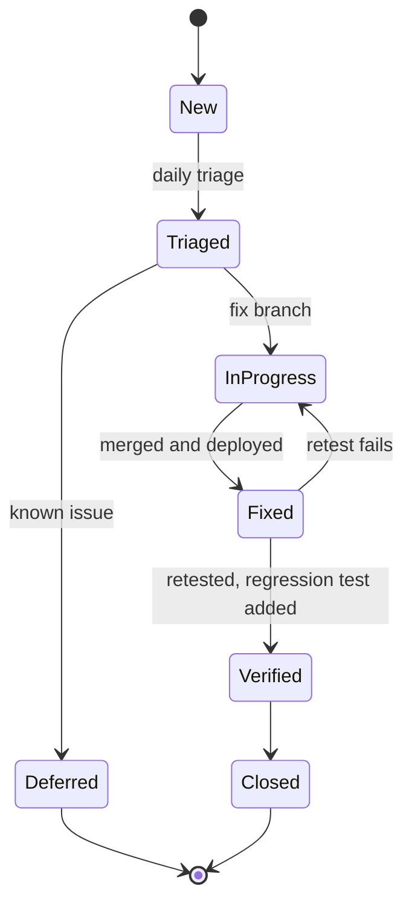
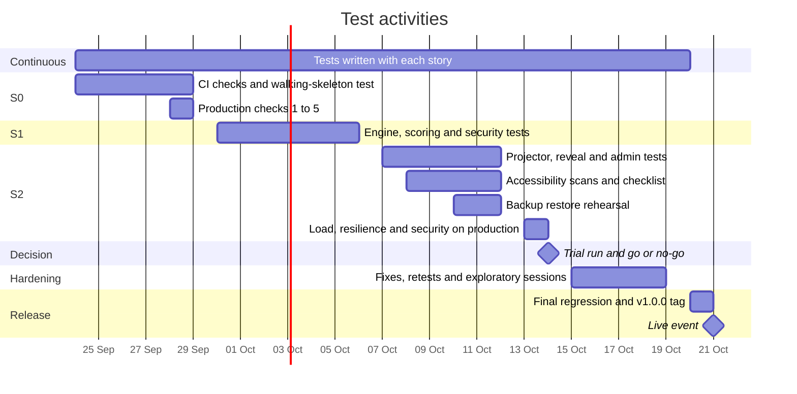

# Delivery Hero — Test Plan

> Document 14 of 18 · Version 1.1 (approved) · Drafted with Claude, approved by the owner

## Document control

| Field | Value |
|---|---|
| Project | Delivery Hero |
| Document | 14 — Test Plan |
| Version | 1.1 |
| Status | Approved on 23 September 2026 |
| Owner and approver | [Owner name] |
| Date | 23 September 2026 |
| Drafting note | Drafted with Claude. The message sizes in section 7.6 were measured from the real task pool |
| Depends on | 01 — Charter v1.11 · 02 — PRD v1.2 · 03 — SRS v1.3 · 04 — User Stories v1.0 · 05 — Acceptance Criteria v1.1 · 09 — Software Architecture v1.1 · 11 — API Specification v1.0 · 12 — UI/UX Wireframes v1.0 · 13 — Coding Standards and Git Strategy v1.1 |
| Feeds into | 15 — Test Cases · the test summary report at the go/no-go · 17 — Release Notes |

### Revision history

| Version | Date | Author | Summary of changes |
|---|---|---|---|
| 0.1 | 2026-09-23 | [Owner name], drafted with Claude | First draft |
| 1.0 | 2026-09-23 | [Owner name] | Approved. TP-01 to TP-10 recorded as DEC-185 to DEC-194 (Charter v1.12); TP-10 applied to SRS section 6.3 (v1.4) |
| 1.1 | 2026-09-23 | [Owner name] | End-to-end profile values revised by DEC-197 (section 7.4 and TP-02) |

---

## 1. Purpose

This plan explains how Delivery Hero will be shown to be ready for the live event on Wednesday 21 October: what is tested, at which level, with which tools and data, by whom and when, and how the go/no-go decision is made. Document 15 turns it into individual test cases.

## 2. Scope

### 2.1 In scope

- Every feature built for version 1.0: all 34 Must features, and the Should and Could features that are completed.
- All 93 functional requirements, 44 non-functional requirements, 271 acceptance criteria and 7 cross-cutting criteria.
- The task pool: its structure, answers and readiness.
- Operations: deploys and the deploy lock, restarts, backups and restores, certificates, monitoring.
- Security, privacy and accessibility.
- Performance at 100 players, and a real-room trial run.

### 2.2 Out of scope

- Browsers other than Chrome, beyond checking that the "works best in Chrome" notice appears (FR-009).
- Features planned for later releases: typed answers, spreadsheet import, remote play, several games at once.
- Paid or third-party penetration testing; the security checks in section 7.8 are self-run.
- More than 100 players as a pass criterion; one 150-player run only measures headroom (TP-03).

## 3. Definitions

| Term | Meaning |
|---|---|
| Test level | A stage of testing with its own scope, such as unit, integration or end-to-end |
| Regression test | Re-running existing tests to check that a change broke nothing |
| Smoke test | A quick check that a deployed build basically works |
| End-to-end (E2E) test | A browser test driving phones, projector and admin panel together against the running system |
| Virtual player | A simulated player in the k6 load test |
| Bot | A simulated player inside a test game (BR-15) |
| Flaky test | A test that sometimes passes and sometimes fails without any code change |
| Go/no-go | The decision at the trial run on whether the event goes ahead |
| Severity | How badly a defect affects the event (section 12) |

## 4. References

- Documents 01 to 13 in `docs/`, especially the acceptance criteria (05) and the quality attribute scenarios QA-01 to QA-12 (09, section 10).
- WCAG 2.2, level AA.
- ISO/IEC/IEEE 29119-3, used as a guide for this plan's structure.

## 5. Test strategy

### 5.1 Principles

1. **Test each rule at the lowest level that can prove it.** Scoring rules are proven by unit tests in milliseconds, not by playing rounds in a browser. End-to-end tests prove that the parts work together.
2. **Automate first.** Every criterion marked T in the SRS gets an automated test where practical; manual checks cover demonstrations, inspections and real devices.
3. **Trace everything.** Test names carry acceptance criterion IDs (section 6.3), so coverage can be reported automatically (TP-05).
4. **Rehearse the event.** Real conditions — the Arm server, 100 players, real phones on mobile data, a projector — are tested on production with test games, because there's no staging environment (R-09).
5. **Focus on what would ruin the event.** Unfair scores, a stalled game, leaked answers and phones that can't join get the deepest testing (section 5.4).

### 5.2 Test levels

| Level | What it checks | Tools | Runs |
|---|---|---|---|
| Static checks | Formatting, lint, types, bug patterns, null safety | Spotless, Error Prone, NullAway, Prettier, ESLint, `tsc` (DEC-175, DEC-176) | Every pull request |
| Backend unit | Scoring, engine commands and timers, round timeline, ranking and ties, hero cards, names, content validation | JUnit Jupiter, test clock, seeded random generator | Every pull request |
| Frontend unit and component | Time sync and countdowns, store updates using the contract fixtures, task components, browser detection | Vitest, Testing Library, jsdom (TP-01) | Every pull request |
| Backend integration | REST endpoints and errors, STOMP flows and permissions, security, Flyway migrations, lifecycle, startup cleanup, deploy lock | Spring Boot tests, Testcontainers with PostgreSQL 18, Spring's STOMP client | Pull requests touching the backend |
| Contract and architecture | Message shapes, the OpenAPI document, package and no-I/O rules | Contract fixtures (DEC-180), OpenAPI comparison (DEC-175), ArchUnit (DEC-149) | Every pull request |
| End-to-end | Complete journeys across phones, projector and admin panel | Playwright against Docker Compose, `e2e` profile (TP-02) | Pull requests touching backend, frontend or deployment |
| Accessibility | WCAG 2.2 A and AA | axe-core in every end-to-end run; manual checklist (Appendix B) | Automated continuously; manual in S2 |
| Performance | Feedback latency, projector lag, CPU, memory, message sizes | k6 (TP-03) | Tue 13 Oct on production, and after performance fixes |
| Resilience and operations | Reconnection, restarts, reboots, deploy lock, backups, certificates, alerts | Playwright, production checklist (Appendix A) | S0 and S2 |
| Security | CSRF, sessions, rate limits, tokens, rendering as text, headers, TLS, answer leaks | Integration and end-to-end tests, `curl`, OWASP ZAP baseline (TP-01) | Every pull request; the scan before the trial |
| Trial run | Real phones in a real room, usability, the join experience | 5–10 colleagues, plus bots | Wed 14 Oct |
| Exploratory | Unscripted, charter-based sessions (Appendix D) | None | S2 and the hardening days |

### 5.3 Where each epic is mainly tested

| Epic | Criteria | Mainly proven by |
|---|---|---|
| Enablers | 27 | Production checks, CI configuration, integration tests |
| EP-01 Joining and lobby | 31 | Unit (name rules), integration (tokens, limits, full game), end-to-end (join, rejoin, late join) |
| EP-02 Practice round | 7 | Integration and end-to-end |
| EP-03 Round engine | 22 | Unit (timeline and timers with a test clock), integration (STOMP), end-to-end (countdown, done, time's up) |
| EP-04 Task types | 15 | Component tests per task type, end-to-end |
| EP-05 Scoring and feedback | 27 | Unit (every worked example as a parameterized case), integration (server-measured time), end-to-end (banner, lockout) |
| EP-06 Timed events | 17 | Unit (incident window, freeze), integration, end-to-end (incident screen) |
| EP-07 Projector screen | 18 | Component and end-to-end tests, demonstration in the trial run |
| EP-08 Reveal and results | 27 | Unit (ranking, ties, most-missed, hero cards), end-to-end (reveal steps, results, review) |
| EP-09 Admin access and content | 29 | Integration (login, validation, edit conflicts), end-to-end (editor and preview) |
| EP-10 Run plans and games | 30 | Integration (readiness, one open game), end-to-end (live control, void, test games) |
| EP-11 After the event | 9 | Integration (deletion on close, auto-close with a test clock), end-to-end (past games) |
| EP-12 Operations | 12 | Integration (deploy lock, health, startup cleanup), production checks |

### 5.4 Risk-based focus

| Product risk | Why it matters | Test focus |
|---|---|---|
| Wrong or unfair scores | Players argue, and trust is lost | Every scoring example from the PRD, SRS and criteria as unit tests; a check that each total equals the sum of its task points; server-measured time with a skewed phone clock |
| The game stalls or crashes mid-round (R-03) | The event fails | Engine tests including failing commands; the load test; three back-to-back games; restart tests |
| Answers leak to phones (NFR-12) | Cheating | Automated leak test and public-view contract test (TP-04) |
| Phones can't join or keep dropping (R-06, R-08) | Players miss out | Trial run on real mobile data; reconnect tests; first-load size |
| A deploy restarts a live game (QA-03) | The event fails | Deploy-lock test on production |
| Player data is kept (privacy promise) | Breaks what players were told | Deletion tests on close and cancel; log scan; backup inspection |
| Screens aren't accessible | Some colleagues are excluded | axe in every end-to-end run; manual checklist |
| Debatable task answers (R-10) | Arguments in the room | Seed validator, admin review, a void rehearsal in the trial |

### 5.5 Test design techniques

Document 15 uses these techniques, which the criteria already lend themselves to:

- **Boundary values:** time limits and the 500 ms grace period (for mgr-plan-01: 20.3 s accepted, 20.5 s times out, 20.7 s rejected), name lengths (20 and 21 characters), round lengths (3 and 10 minutes), bot counts (0, 100 and 101), and rate limits (the 5th and 6th failed login).
- **State transitions:** every host action in every game state, checked against `allowedActions` (FR-080, FR-081).
- **Decision tables:** outcome × task type × streak position for scoring (BR-01 to BR-08).
- **Equivalence classes:** valid and invalid names (section 9.2), and each validation error in content.

## 6. Verification of requirements

### 6.1 Functional requirements

| SRS method | Count | How |
|---|---|---|
| Test (T) | 80 | Automated tests at the levels in section 5.3 |
| Demonstration (D) | 10 | FR-017, FR-023, FR-048, FR-049, FR-053, FR-054, FR-056, FR-057, FR-062 and FR-082 are visual projector and live-control behaviors. End-to-end tests check their content, and the owner demonstrates them in S2 and the trial run |
| Inspection (I) | 2 | FR-011 (privacy note, also asserted by an end-to-end test) and FR-092 (log contents, also checked by the log scan in TP-04) |
| Test and inspection | 1 | FR-035: scoring tests plus a review of what leaves the server |

### 6.2 Non-functional requirements

| NFR | Method | How and when |
|---|---|---|
| NFR-01 Feedback within 300 ms for 95% | T | k6 on production, Tue 13 Oct; spot checks on 4G phones in the trial |
| NFR-02 Projector within 1 s | T | k6's projector connection measures the lag |
| NFR-03 Reconnect within 5 s after up to 60 s offline | T | End-to-end test taking a phone offline for 60 s during a 2-minute round; airplane-mode checks in the trial |
| NFR-04 CPU below 70%, memory below 4 GB | T | Load test with one projector and two admin connections, sampling the machine every 5 seconds |
| NFR-05 Join screen within 3 s on 4G, under 1 MB | T | Playwright on production with network throttling (9 Mbps down, 1.5 Mbps up, 100 ms latency), adding up transferred bytes |
| NFR-06 Message sizes | A | Largest message of each type recorded in the load test; RESULTS sized from the real pool (section 7.6, TP-10) |
| NFR-07 No deploy during the lock | T | Integration test of the lock; production test in Appendix A |
| NFR-08 Health within 1 s | T | Production check and the uptime monitor's history |
| NFR-09 No in-progress game after a restart | T | Integration test; production restart during a test game |
| NFR-10 Daily backups and a rehearsed restore | D | Restore into a scratch database by Mon 12 Oct |
| NFR-11 Structured JSON logs | I | Log review during the load test; an integration test parses a log line |
| NFR-12 No answers before the round ends | T, I | Leak test, public-view contract test and static-build scan (TP-04); review of what the server sends |
| NFR-13 HTTPS and WSS only, HSTS | T | `curl` checks on production |
| NFR-14 bcrypt at cost 12 or more, never logged | I | Configuration review; log scan |
| NFR-15 Session cookie flags and 12-hour expiry | T | Integration tests with a test clock |
| NFR-16 CSRF protection | T | Integration tests: a missing or wrong token gets 403 |
| NFR-17 Rate limits | T | Integration tests for logins, joins and answers |
| NFR-18 Tokens and keys | T, I | Unit and integration tests; the database holds only hashes |
| NFR-19 Text never rendered as HTML; CSP | T | End-to-end test with HTML-like task text; any CSP violation fails the test |
| NFR-20 Security headers | T | Header test against Nginx in CI; production `curl` |
| NFR-21 No known critical vulnerability | I | Dependabot review at E−7 and E−1 |
| NFR-22 Minimal personal data | I | Code and configuration review; database inspection after the trial |
| NFR-23 Nothing left after close | T | Integration test; database inspection after the trial |
| NFR-24 No third-party requests | T | Playwright fails on any request to another site |
| NFR-25 Contrast | T | axe; the token table verified in document 12 |
| NFR-26 Not color alone | I | Manual checklist |
| NFR-27 Target sizes | I | Manual checklist, plus an end-to-end check that answer buttons are at least 48 px tall |
| NFR-28 Swipe and drag alternatives | T | End-to-end: yes/no by buttons, ordering by taps |
| NFR-29 No flashing | I | Manual review of the animations |
| NFR-30 200% text and 320 px | T | Playwright at 320 px with 200% text; manual check on a phone |
| NFR-31 Accessible names and live regions | T | axe and role-based locators; a TalkBack spot check |
| NFR-32 Keyboard-usable admin panel | T | Keyboard-only end-to-end test; manual checklist |
| NFR-33 Timing statement | I | README review |
| NFR-34 Reduced motion | T | Playwright's reduced-motion emulation; manual check |
| NFR-35 Phone browsers | T | Device matrix (section 7.11) |
| NFR-36 Desktop Chrome and projector sizes | T | Playwright at 1920×1080 and 1280×720; a check with the venue projector |
| NFR-37 Optional features never block | T | End-to-end test with clipboard access denied and no wake lock |
| NFR-38 90% join within 30 s | D | Measured in the trial run |
| NFR-39 Plain error messages | I | Copy deck review; end-to-end tests assert the exact messages |
| NFR-40 Scoring values in one file | I | Code review |
| NFR-41 80% coverage | T | JaCoCo gate in CI |
| NFR-42 Flyway only | I | Code review; Hibernate validates the schema at startup |
| NFR-43 Formatting and analysis on every pull request | I | CI configuration review |
| NFR-44 OpenAPI and message catalog | I | OpenAPI comparison test; contract fixtures |

### 6.3 Acceptance criteria and traceability

- Each automated test for a criterion names it, for example `@DisplayName("AC-US28-01 speed bonus: 140 points at 4.0 s")` in Java, or `test("AC-US22-01 options are at least 48 px tall", …)` in Vitest and Playwright.
- The cross-cutting criteria X-01 to X-07 are checked by shared helpers used in every end-to-end test (exact messages, no HTML rendering, no outside requests), by the log scan and by the manual checklist.
- Manual results are recorded in `test-results/manual-results.csv` (criterion ID, date, result, tester, notes).
- A script, `tools/ac_coverage.py`, reads the criterion IDs from document 05, the test reports and the manual results, and lists each criterion as automated, manual or missing. It runs in CI as a report, not a gate (TP-05).

## 7. Test types in detail

### 7.1 Unit tests

**Backend.** Every scoring example in the PRD, SRS and criteria becomes a parameterized case: speed bonus, rounding halves up, streak multiplier, partial credit, yes/no penalty, incident points, voided tasks. Timeline tests check the phase boundaries (20/40/20/20%), the incident window (10% to 90% of Testing), the final stretch at 80% and the 30-second freeze, using a test clock. Ranking tests cover every tie-break step (DEC-96). Name tests use the list in section 9.2.

**Frontend.** Time sync (offset from three samples, choosing the lowest round-trip time), countdown display, store updates from every contract fixture, each task component (ordering numbers and Undo, problem-word toggles, the 25% swipe threshold, yes/no buttons), and browser detection against real user-agent strings (BR-19).

### 7.2 Integration tests

- Every REST endpoint in document 11, including each error code.
- STOMP: connect with valid and invalid credentials; subscription and send permissions; the full-state message after subscribing (DEC-146); answer to feedback; every ANSWER_REJECTED reason; the projector limited to time-sync (DEC-140).
- The 16 database constraint tests from document 10, the one-open-game rule, and seed re-import (AC-US56-03).
- Lifecycle with a test clock: close, cancel, auto-close after 24 hours, test-game deletion after 2 hours, startup cleanup.
- Security: CSRF, cookie attributes and expiry, logout, each rate limit, bcrypt settings.

### 7.3 Contract and architecture tests

- Contract fixtures (DEC-180) and the OpenAPI comparison (DEC-175) keep document 11, the backend and the frontend in step.
- A contract test serializes every public task view and fails if any answer field appears (DEC-130).
- ArchUnit enforces the package and no-I/O rules (DEC-149).

### 7.4 End-to-end tests

Only one game can be open at a time (DEC-101), so the suite runs serially. The `e2e` profile runs rounds from 60 seconds with a 10-second freeze and joining window and 10-second practice, and fixes the random seed, so the incident moment is repeatable (TP-02, as revised by DEC-197). Target: the whole suite in under 10 minutes on CI.

| Spec | Covers | Browsers |
|---|---|---|
| `join-and-lobby` | Join, duplicate names, rejoin with the stored token, late join, rename and remove, the Chrome notice | 3 phones, admin |
| `golden-path` | Practice, countdown, all four task types, feedback banner, lockout, timeout, incident, freeze, time's up, reveal by keyboard, results, review, hero card, close, past games | 3 phones, projector, admin |
| `host-controls` | Void, cancel, one-game rule, stale actions from a second admin tab | 2 phones, 2 admins |
| `content-admin` | Task editing for each type with preview, edit conflict, delete refused while in use, characters, run plans and readiness | Admin |
| `test-game` | Bots, the TEST ribbon, deletion on close | Admin, projector |
| `resilience` | 60 s offline during a 2-minute round, a phone clock 45 s fast, clipboard denied, no wake lock | 2 phones |
| `security-privacy` | Answer-leak recording, HTML-like text rendered as text, outside requests, CSP violations, headers, log scan | Phone, admin |
| `accessibility` | axe on every main screen, keyboard-only admin, 320 px with 200% text, reduced motion | All surfaces |
| `page-weight` | First load under 1 MB | Phone |

Tests wait for specific messages or screen states, never fixed delays.

### 7.5 Accessibility testing

- **Automated:** axe-core checks every main screen in every end-to-end run and fails on any WCAG 2.2 A or AA violation (AC-EN09-01, DEC-176).
- **Manual:** the checklist in Appendix B, completed in S2 and before the trial run (AC-EN09-02).

### 7.6 Performance and load testing

The load test is story EN-07.

**Setup (TP-03):**

- k6 simulates 100 virtual players, one projector and two admin connections in a test game on production.
- It runs from a temporary second Always Free Arm instance in the server's region, which is deleted afterward.
- If that instance can't be created, the owner's laptop is the fallback, and the server's own processing times separate network time from server time.

**Virtual player behavior:**

1. Join, connect and synchronize time.
2. Answer each task after a random 2–12 seconds: 70% correct, 20% wrong, 10% left to time out.
3. Answer the incident within 2–8 seconds, so everyone answers in the same burst (QA-01).

**Runs:**

1. 100 players, one full 5-minute game.
2. 100 players again; both runs must pass.
3. 150 players, to measure headroom only.
4. Three games back to back, checking that memory returns to its baseline after each close.

**Pass criteria:**

```javascript
// load-test/round.js: metrics and pass criteria; the full script is written in S2 (EN-07)
import { Counter, Trend } from "k6/metrics";

export const feedbackLatency = new Trend("feedback_latency", true);
export const projectorLag = new Trend("projector_lag", true);
export const playerMessageBytes = new Trend("player_message_bytes");
export const resultsMessageBytes = new Trend("results_message_bytes");
export const wsConnectFailures = new Counter("ws_connect_failures");

export const options = {
  scenarios: {
    players: { executor: "per-vu-iterations", vus: 100, iterations: 1, maxDuration: "15m" },
  },
  thresholds: {
    feedback_latency: ["p(95)<300"], // NFR-01, milliseconds from SEND to FEEDBACK
    projector_lag: ["p(95)<1000"], // NFR-02
    player_message_bytes: ["max<4096"], // NFR-06, messages during the round
    results_message_bytes: ["max<32768"], // NFR-06 as clarified by TP-10
    ws_connect_failures: ["count==0"],
    checks: ["rate>0.99"],
  },
};
```

CPU and memory (NFR-04) are sampled on the server every 5 seconds with `docker stats` and `vmstat`, and must stay below 70% and 4 GB.

**Message sizes, measured from the real task pool.** The largest message during the round, a TASK_ISSUED for `ba-plan-06`, is about 0.5 KB, well inside the SRS's 4 KB limit. RESULTS is different: with its review list, it passes 4 KB once a player has more than about 11 tasks to review. That is common in a 5-minute round, and it reaches about 22 KB in the theoretical worst case of all 68 tasks. TP-10 proposes applying the 4 KB limit to messages during the round, and allowing up to 32 KB for the one-time RESULTS message.

| Tasks to review | Typical RESULTS size |
|---|---|
| 5 | 1.9 KB |
| 10 | 3.5 KB |
| 15 | 5.1 KB |
| 20 | 6.8 KB |
| 30 | 10.0 KB |
| 68 (all) | 22.3 KB |

### 7.7 Resilience and operations testing

- **Reconnection:**
  - In the end-to-end suite, a phone is taken offline for 60 seconds during a 2-minute round. It must reconnect within 5 seconds of coming back online, with its score intact (NFR-03).
  - In the trial, volunteers switch airplane mode on for 20 and 60 seconds.
- **Restarts:** the backend is restarted during a test game; the game must become Cancelled, and phones must show "The host ended this game." (FR-089).
- **Operations:** reboot recovery, certificate renewal, the deploy lock, backup and restore, and uptime alerts follow the production checklist in Appendix A.

### 7.8 Security testing

- **Automated (integration and end-to-end):** CSRF, session cookies, rate limits, token and key rules, HTML-like content rendered as text, CSP violations, security headers and answer leaks.
- **On production:** HTTPS redirect, HSTS and headers checked with `curl`, and an OWASP ZAP baseline scan (passive) before the trial run, which must show no high-risk alerts (TP-01).
- **Dependencies:** Dependabot alerts reviewed at E−7 and E−1 (NFR-21).

### 7.9 Privacy testing

- Integration tests confirm that after a close or cancel, nothing but the summary and the top 10 remains (NFR-23).
- The end-to-end log scan looks for the test players' names and answer texts in the backend logs (X-06, FR-092).
- After the trial, the owner inspects the database, the logs and the latest backup for player names (QA-08).

### 7.10 Content testing

- `tools/validate_seed.py` runs in CI on every change (DEC-177, Document 13 v1.1).
- The admins review all 74 tasks with the review sheet by Wed 7 Oct (E−14).
- Readiness checks are covered by integration tests (BR-13).
- The trial run rehearses voiding a task and collects feedback on confusing tasks.

### 7.11 Compatibility testing

| Surface | Browser and system | Devices | How |
|---|---|---|---|
| Phone | Chrome 107+ on Android | The owner's phone and two colleagues' phones, including an older model | Manual in S2; trial run |
| Phone | Chrome on iOS 16+ | One or two iPhones | Manual in S2; trial run |
| Phone | Other browsers | Safari, Samsung Internet | Check that the Chrome notice appears (FR-009) |
| Phone layout | Chromium emulation | Pixel and iPhone profiles; 320 px width | Playwright |
| Projector | Desktop Chrome, current and previous | The host's laptop with the venue projector, at 1920×1080 and 1280×720 | Manual; Playwright viewports |
| Admin panel | Desktop Chrome, current and previous | The owner's laptop | Playwright; manual |

### 7.12 Trial run

The trial run follows the script in Appendix C (TP-09). It measures:

- Join times, with a stopwatch against the projector's join counter (NFR-38).
- Crashes, restarts and lost scores; there must be none.
- Feedback speed on real 4G phones (NFR-01).
- Players' answers to a three-question survey on fun, clarity and anything confusing.

### 7.13 Exploratory testing

Time-boxed 30-minute sessions follow the charters in Appendix D. The owner runs them in S2 and during the hardening days, and the admins run the admin-panel charters. Each session ends with notes and new issues.

### 7.14 Smoke and regression testing

- **After every deploy:** the deploy workflow checks health. In the final week, the owner also runs a 5-minute manual smoke test: admin login, a test game with 5 bots through practice, then cancel.
- **Regression:** the automated suites run on every pull request. A full manual pass of Appendices A and B follows feature completion (Mon 12 Oct), and a final regression follows the last change before the deployment freeze (Tue 20 Oct).

## 8. Test environments

| Environment | Used for | Notes |
|---|---|---|
| Developer laptop | Unit, integration and end-to-end tests while coding | Docker Compose with PostgreSQL 18; Testcontainers; Chrome device emulation |
| CI (GitHub Actions, x64 Ubuntu) | The merge gate (DEC-181) | End-to-end tests run against Docker Compose. Images are multi-architecture (DEC-151); Arm-specific problems are caught by production smoke tests |
| Production (Oracle Arm machine) | Smoke, load, resilience and security checks, trial run, event | The only full environment (R-09). Test games keep rehearsals apart from real results (FR-085), and the deploy lock protects games |
| Load generator | k6 | A temporary second Always Free Arm instance in the same region, or the owner's laptop (TP-03) |
| Devices | Compatibility and trial run | Section 7.11 |

## 9. Test data

### 9.1 Content and players

- **Standard content:** the seed's 74 tasks and two run plans, with the standard test data from document 05, section 5. mgr-plan-01 has a 20-second limit (corrected in document 05 v1.1).
- **Players:** the personas Sam, Priya and Arjun for scripted tests. Bots (BR-15) fill test games, and k6 virtual players follow the behavior in section 7.6.
- **Time and randomness:** a test clock and seeded random generator in unit and integration tests; the `e2e` profile for end-to-end tests (TP-02).
- **HTML-like content:** task text and reaction lines such as ``, used only in test databases, to prove text is never rendered as HTML (NFR-19).
- **Personal data:** automated tests use invented names only. Trial participants play under their own names by choice, and their data is deleted when the game closes (DEC-45).

### 9.2 Name cases (BR-16)

| Input | Expected |
|---|---|
| "Priya S" typed with extra spaces before, between and after | Accepted as "Priya S" |
| `Zoë`, `O'Brien`, `Anne-Marie`, `A.J.`, `李明` | Accepted |
| `José` typed with a combining accent | Accepted and stored in NFC form |
| A 20-character name | Accepted |
| A 21-character name, an empty name, `Sam 😀`, `<b>Sam</b>` | Rejected with the naming-rules message |
| `Sam`, then `sam` | Accepted as "Sam" and "sam 2" |

## 10. Entry, exit, suspension and resumption criteria

| Stage | Entry | Exit |
|---|---|---|
| Story testing | Story in progress, criteria agreed | The Definition of Done (document 13, section 10) |
| Load test (Tue 13 Oct) | Must stories complete (Mon 12 Oct); deployed; no open Sev-1 | Two 100-player runs meet every threshold; memory returns to baseline after three back-to-back games |
| Trial run (Wed 14 Oct) | Load test passed; production checks done; task review complete; manual accessibility checklist done; no open Sev-1 | Trial completed and recorded; go/no-go decided |
| Release (Tue 20 Oct) | A go decision; every change since the trial passed CI and a production smoke test | Final regression passed; no open Sev-1 or Sev-2; `v1.0.0` tagged |

**Suspension:** testing on production pauses if the post-deploy smoke test fails, the machine is unavailable, or a Sev-1 blocks a whole area. **Resumption:** after a fix passes the smoke test and the affected tests have been re-run.

## 11. Go/no-go criteria

At the trial run (E−7), the owner decides "go" only if all of these hold (TP-07). The first three are the Charter's conditions (section 16); the rest make them measurable.

1. No open Sev-1 or Sev-2 defects.
2. The 100-player load test has passed.
3. The task pool has been reviewed and loaded.
4. Every Must acceptance criterion has passed, automated or with a recorded manual result.
5. The trial run completed with no crash, restart or lost scores.
6. At least 90% of trial players joined within 30 seconds of scanning (NFR-38).
7. A backup restore has been rehearsed, and the deploy lock verified on production.
8. No known critical vulnerability is open (NFR-21).
9. The automated accessibility scans pass, and the manual checklist is complete, with any failures logged as defects.

The decision and its evidence go into the test summary report (Appendix E). After a no-go, fixes happen during the hardening days and a shorter trial on Mon 19 Oct re-checks the same criteria. If that also fails, the event date moves (A-01).

## 12. Defect management

Defects are GitHub issues labeled `bug`, a severity and an area (`area:engine`, `area:phone` and so on). Findings from the trial are also labeled `found-in:trial`.

| Severity | Meaning | Example | Rule |
|---|---|---|---|
| Sev-1 Blocker | The event can't run, results are wrong or unfair for everyone, or privacy or security is breached | Wrong scores, answers visible on phones, data kept after close, nobody can join | Fix before the event; blocks a go |
| Sev-2 Major | A Must feature fails for many players or the host, with no reasonable workaround | Reconnection fails, the projector stops updating, the reveal can't advance | Fix before the event; blocks a go |
| Sev-3 Minor | Something misbehaves, but there's a workaround or it affects few devices | Layout issue on one phone model, an editor glitch | Fix if cheap; otherwise listed as a known issue in the release notes |
| Sev-4 Trivial | Cosmetic or wording | A typo | Fix when convenient |



Every fixed defect gets an automated regression test where practical (TP-06). Triage is daily from S2 onward.

## 13. Schedule

| When | Test activities |
|---|---|
| S0 (Thu 24 – Tue 29 Sep) | CI checks live (EN-03); first unit tests; a walking-skeleton end-to-end test (join and lobby); production checks 1 to 5 |
| S1 (Wed 30 Sep – Tue 6 Oct) | Engine, scoring, content and security tests; contract fixtures; the golden path for multiple-choice and yes/no tasks |
| S2 (Wed 7 – Tue 13 Oct) | Projector, reveal and admin end-to-end tests; accessibility scans and manual checklist; backup restore by Mon 12 Oct; full regression after feature completion (Mon 12 Oct); load test, resilience and security checks on production (Tue 13 Oct) |
| Wed 14 Oct (E−7) | Trial run and go/no-go |
| Hardening (Thu 15 – Mon 19 Oct) | Fixes and retests; exploratory sessions; device checks; content freeze on Fri 16 Oct; re-check on Mon 19 Oct if needed |
| Tue 20 Oct (E−1) | Final regression; production smoke test; `v1.0.0` tagged |
| Wed 21 Oct (E) | Event-day smoke test (document 16) |



## 14. Roles and responsibilities

| Role | Responsibilities |
|---|---|
| Owner | Test manager and tester: writes and runs the automated tests, runs the load test and production checks, triages defects, writes the test summary report and makes the go/no-go decision |
| Admins | Review the task pool by Wed 7 Oct; run the admin-panel exploratory charters in S2; help run the trial |
| Trial group (5–10 colleagues) | Play the trial on their own phones, report problems and answer the survey |
| Claude | Drafts the test cases (document 15), and helps analyze results on request |

## 15. Deliverables, metrics and reporting

**Deliverables:** this plan; the test cases (document 15); the automated suites in the repository; the criterion coverage report (TP-05); the load test results; the trial run notes; the test summary report (Appendix E); and the defect log (GitHub issues).

| Metric | Source | Target |
|---|---|---|
| Must criteria automated | Coverage report | At least 80%; the rest recorded manually |
| Must criteria passed | Coverage report and manual results | 100% for a go |
| Line coverage, `engine` and `scoring` | JaCoCo | At least 80% (NFR-41) |
| Open defects by severity | GitHub issues | No Sev-1 or Sev-2 at go |
| Feedback latency, 95th percentile | k6 | Under 300 ms |
| Peak CPU and memory | Server sampling | Under 70% and 4 GB |
| Joins within 30 s in the trial | Stopwatch | At least 90% |
| Flaky tests | CI reports | Zero unaddressed for more than one working day (TP-08) |

The owner posts a short weekly status in a pinned "Test status" issue, and writes the test summary report at the go/no-go, updating it at E−1.

## 16. Risks and contingencies

| Risk | Contingency |
|---|---|
| No staging environment (R-09) | Test games on production; the deploy lock; load tests outside working hours |
| The load-generator instance can't be created (Oracle capacity) | The owner's laptop, with server-side timings (TP-03) |
| CI minutes run low | The GS-03 fallback (DEC-183); run end-to-end tests locally before merging |
| Bots (FR-085, a Should feature) aren't built | The trial uses real phones only; the load test provides the scale |
| Too few trial players or devices | Borrow devices; rely on emulation for layout; use the Mon 19 Oct re-check slot |
| Schedule pressure (R-01) | Must criteria first; test at the lowest level; Should and Could criteria only for built features |
| Flaky real-time tests | Wait for messages, never sleep; TP-08 |
| x64 in CI, Arm in production | A smoke test after each deploy; the load test runs on Arm |
| The company network blocks the site (R-07) | Checked in the trial; the host uses a phone hotspot if needed |

## 17. Decisions proposed in this document

These were approved with this document and are recorded as DEC-185 to DEC-194 in the Charter's decision log.

| ID | Decision | Why |
|---|---|---|
| TP-01 | Test tooling additions, all free: Testing Library with jsdom for frontend component tests; Spring's STOMP client for integration tests; Playwright's clock, network and reduced-motion emulation; an OWASP ZAP baseline (passive) scan of production before the trial run | Fills the gaps between the tools already chosen and the requirements to be tested |
| TP-02 | An `e2e` profile, used only by end-to-end tests, allows rounds from 30 seconds and fixes the random seed (revised by DEC-197 to rounds from 60 seconds, a 10-second freeze window and 10-second practice). Production validation stays at 3–10 minutes, and a test proves the production profile rejects shorter rounds. Complete 5-minute games are covered by the load test and trial run | Full-length rounds would make the suite too slow for CI, and a random incident moment would make it unrepeatable |
| TP-03 | Load test: k6 with 100 virtual players, one projector and two admin connections in a test game on production, from a temporary second Always Free Arm instance in the same region; the owner's laptop as fallback. Two passing 100-player runs, one 150-player headroom run, and three back-to-back games checking memory | Meets NFR-01's measurement condition (a client in the server's region) at $0, and exposes leaks before the event |
| TP-04 | Automated leak and privacy checks: record everything a phone receives during a round and fail on any answer data before it ends; scan the static build for task content and answer fields; scan backend logs from end-to-end runs for test names and answers; fail on any outside request | Turns NFR-12, NFR-24, X-06 and X-07 into checks that run on every change |
| TP-05 | A coverage report matches criterion IDs in test names and manual results against document 05, in CI as a report. Target: at least 80% of Must criteria automated; a go requires every Must criterion passed | Makes readiness visible and shows gaps early |
| TP-06 | Defect severities Sev-1 to Sev-4 as in section 12; Sev-1 and Sev-2 block a go; fixed defects get regression tests where practical | A shared scale for triage and the go/no-go |
| TP-07 | The go/no-go criteria in section 11, extending the Charter's three conditions, decided at the trial run; a re-check on Mon 19 Oct after a no-go; the event date moves (A-01) if that fails | A decision based on evidence, with a planned second chance |
| TP-08 | Playwright retries a failed test once in CI; any test that needed a retry is reported; a flaky test is fixed or quarantined with an issue within one working day; scoring, leak and privacy tests are never quarantined | Keeps the merge gate trustworthy without letting important tests quietly disappear |
| TP-09 | Trial run format (Appendix C): a test game on the Default 5-minute plan with real phones plus bots filling the room, then a short real game on the Quick 3-minute plan covering closing, the top 10 and past games | Tests the full room and the real-game path in one session |
| TP-10 | Message sizes: the 4 KB limit applies to player messages during the round; the one-time RESULTS message may be up to 32 KB. SRS section 6.3 is updated on approval | Measured on the real pool, RESULTS passes 4 KB for a player with more than about 11 tasks to review (common), and reaches about 22 KB at most |

## 18. Future considerations

- Visual comparison tests for the projector, if its look starts changing often.
- Property-based tests for scoring, if the rules grow.
- A small device lab or cloud device service, if more phone models need regular checks.

## 19. Approval

| Role | Name | Decision | Date |
|---|---|---|---|
| Owner and approver | [Owner name] | ☑ Approved | 2026-09-23 |

---

## Appendix A. Production checklist

| # | Check | Requirement | When |
|---|---|---|---|
| 1 | Plain HTTP redirects to HTTPS | NFR-13 | S0 |
| 2 | Certificate renewal dry run succeeds | AC-EN02-02 | S0 |
| 3 | After a reboot, every container restarts and health reports UP | AC-EN02-03 | S0 |
| 4 | Security headers present on pages and API responses | NFR-20 | S0 |
| 5 | Health responds within 1 second | NFR-08 | S0 |
| 6 | HSTS enabled once the certificate setup is proven | NFR-13 | S2 |
| 7 | Stopping the backend for 11 minutes produces the uptime alert email | FR-091 | S2 |
| 8 | With a test game in the lobby, a deploy stops; after closing it, the deploy proceeds | NFR-07, FR-090 | S2 |
| 9 | Restarting the backend during a test game cancels it, and phones show "The host ended this game." | NFR-09, FR-089 | S2 |
| 10 | The latest backup is off the machine, and restores into a scratch database with matching row counts | NFR-10, FR-093 | By Mon 12 Oct |
| 11 | After closing a game: no player records in the database, and no names in the logs or the latest backup | NFR-23, X-06 | S2 and after the trial |
| 12 | First load under 1 MB and join screen within 3 seconds on throttled 4G | NFR-05 | Tue 13 Oct |
| 13 | OWASP ZAP baseline scan shows no high-risk alerts | TP-01 | Tue 13 Oct |
| 14 | No open critical Dependabot alert | NFR-21 | E−7 and E−1 |

## Appendix B. Manual accessibility checklist

| # | Check | Requirement |
|---|---|---|
| 1 | Every phone screen works at 200% text size, without sideways scrolling | NFR-30 |
| 2 | Every phone screen works at 320 CSS pixels wide | NFR-30 |
| 3 | With reduced motion on, highlights, shakes and the celebration become fades | NFR-34 |
| 4 | The admin panel works by keyboard alone, with a visible focus ring, including the reveal shortcuts | NFR-32 |
| 5 | Every state shows an icon or text as well as color | NFR-26 |
| 6 | With TalkBack on Android, a player can join, answer a task and hear the feedback and timer | NFR-31 |
| 7 | Nothing flashes more than three times per second (incident, final stretch, winner) | NFR-29 |
| 8 | Answer buttons are at least 48 px tall; other controls at least 24 × 24 px | NFR-27 |
| 9 | Error messages say what happened and what to do next | NFR-39 |

## Appendix C. Trial run script

About one hour on Wed 14 Oct, with 5–10 colleagues in the event room if possible.

| Time | Step | Checks |
|---|---|---|
| −30 min | Set up the laptop and projector; check health and the company network (R-07); create a test game on the Default 5-minute plan with bots to bring the room to about 40 players | NFR-36, R-07 |
| 0:00 | Welcome; open the lobby; players scan the QR code; start the stopwatch and read the join counter at 30 seconds | NFR-38 |
| 0:05 | Practice round | FR-014 to FR-017 |
| 0:08 | Full 5-minute round. Two volunteers switch airplane mode on for 20 and 60 seconds. The host voids one task afterward | NFR-03, FR-083 |
| 0:15 | Reveal with the clicker or keyboard; players look at their results, review and hero cards; then close the test game | FR-059 to FR-066 |
| 0:25 | A short real game on the Quick 3-minute plan, real players only; close it and check past games | FR-086, FR-087 |
| 0:35 | Survey (fun 1–5, clarity 1–5, anything confusing?) and a 10-minute debrief; log issues | TP-09 |
| After | Check logs for errors and CPU and memory peaks; inspect database, logs and backup for player data; write the test summary report and decide go/no-go | NFR-04, NFR-23, TP-07 |

## Appendix D. Exploratory charters

| # | Charter | Looks for |
|---|---|---|
| 1 | Chaotic host: double-click every host button, use two admin tabs, press keys during the reveal | State errors (FR-081) |
| 2 | Clock games: change the phone's time zone and clock, lock the screen and switch apps during a task | Timing and resume problems |
| 3 | Flaky network: toggle airplane mode repeatedly; switch between Wi-Fi and 4G mid-round | Reconnection and duplicate answers |
| 4 | Odd names: other scripts, maximum lengths, duplicates differing only in case | Name handling (BR-16) |
| 5 | Content editor: edit tasks during a game, make conflicting edits, try invalid markers and long code | Validation and snapshots (FR-072, FR-073) |
| 6 | Screen sizes: 320 px phones, 200% text, landscape, the projector at 1280×720 | Layout |
| 7 | Late and returning players: join late, leave, rejoin from another tab, rejoin after removal | Token and state handling |
| 8 | Incident edges: answer at the last moment, while locked out, after finishing every task | Incident rules (FR-044 to FR-047) |

## Appendix E. Test summary report template

| Field | Content |
|---|---|
| Build | Version and commit |
| Date and author | |
| Automated results | Pass and fail counts per suite, with links to the CI runs |
| Criterion coverage | Must criteria automated, passed manually, and missing |
| Load test | Latency percentiles, projector lag, peak CPU and memory, largest messages, errors |
| Trial run | Players, join times, crashes, survey results, observations |
| Open defects | Counts by severity, and the list of Sev-1 and Sev-2 issues |
| Known issues | Sev-3 and Sev-4 issues going into the release notes |
| Go/no-go | Each criterion in section 11 marked met or not met, and the decision |
