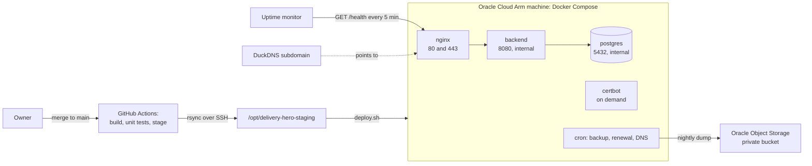

# Delivery Hero — Deployment Guide

> Document 16 of 18 · Version 1.0 (approved)

## Document control

| Field | Value |
|---|---|
| Project | Delivery Hero |
| Document | 16 — Deployment Guide |
| Version | 1.0 |
| Status | Approved on 24 September 2026 |
| Owner and approver | [Owner name] |
| Date | 24 September 2026 |
| Drafting note | The files in `deploy/` and `.github/workflows/deploy.yml` were tested as described in section 18 |
| Depends on | 01 — Charter v1.13 (DEC-58 to DEC-62, DEC-103, DEC-104, DEC-137, DEC-150, DEC-151, DEC-158) · 07 — HLD v1.1 · 08 — LLD v1.3 · 09 — Software Architecture v1.1 · 13 — Coding Standards and Git Strategy v1.2 · 14 — Test Plan v1.1 · 15 — Test Cases v1.0 |
| Feeds into | Sprint 0 infrastructure · production checks OPS-01 to OPS-22 · 18 — Technical Documentation |

### Revision history

| Version | Date | Author | Summary of changes |
|---|---|---|---|
| 0.1 | 2026-09-23 | [Owner name] | First draft |
| 0.2 | 2026-09-24 | [Owner name] | CSP file aligned with LLD section 6.6 (`frontend/nginx/csp.conf`, no domain placeholder); Nginx routes moved to a snippet shared with the local stack (document 18); pages served without a redirect; relative redirects; Dependabot note in section 17 |
| 1.0 | 2026-09-24 | [Owner name] | Approved. DG-01 to DG-09 recorded as DEC-198 to DEC-206 (Charter v1.14), settling OI-07; Dependabot entry applied to document 13 (v1.2) |

---

## 1. Purpose

This guide takes Delivery Hero from an empty Oracle Cloud account to a running, monitored, backed-up production site. It also covers how every later change reaches production, how to operate the site before, during and after an event, and how to recover when something breaks. It settles open item OI-07: backup frequency, target and retention.

## 2. Scope

- Provisioning the Oracle Cloud Always Free Arm machine, its network and the free subdomain.
- Preparing the server: Docker, users, SSH, firewall, logs, scheduled jobs.
- Configuration and secrets.
- The first deployment, including the HTTPS certificate and the task pool.
- Continuous deployment from GitHub Actions, with the deploy lock.
- Operations: monitoring, certificates, backups and restores, updates, event checklists.
- Troubleshooting, rollback, disaster recovery and fallback hosting.

The files this guide uses are in the repository's `deploy/` folder and `.github/workflows/deploy.yml`. Appendix A lists them, and Appendix B shows the most important ones in full.

## 3. Definitions

| Term | Meaning |
|---|---|
| Live folder | `/opt/delivery-hero` on the server: the running release's files and the `.env` settings file |
| Staging folder | `/opt/delivery-hero-staging`: where GitHub Actions copies a new release before the deploy script installs it |
| Deploy lock | The backend's signal that a game is between Lobby and Reveal, so no deploy may restart it (DEC-103) |
| Pinned image | A container image referenced by its content digest (`@sha256:…`) rather than a moving tag (DEC-151) |
| Instance principal | An Oracle Cloud feature that lets the machine itself call Oracle services, so no keys are stored on disk |
| RPO and RTO | How much data a recovery may lose, and how long it may take |

## 4. Overview



| Item | Choice |
|---|---|
| Machine | One Always Free Ampere A1 instance with 2 OCPUs and 12 GB of memory, running Ubuntu 24.04, in the home region nearest the office (DEC-58) |
| Services | `nginx`, `backend`, `postgres` and `certbot` in one Compose project (HLD section 12) |
| Memory limits | Backend 2 GB (heap 50%), PostgreSQL 1 GB, Nginx 256 MB, Certbot 128 MB (DEC-150) |
| Open ports | 80 and 443 for everyone; 22 for SSH (DG-08) |
| Address | A DuckDNS subdomain with a Let's Encrypt certificate (DEC-60, DG-01) |
| Environments | Local and production only (DEC-59) |

## 5. Before you start

| Need | Notes |
|---|---|
| Oracle Cloud account | The home region is chosen at sign-up and can't change; Always Free compute must be created there |
| Pay As You Go upgrade (recommended) | Protects the machine from idle reclamation; see section 6.1 and DG-02 |
| GitHub repository | Private, as decided in DEC-181 |
| DuckDNS account | Free, signed in with a GitHub or Google account |
| Uptime monitor | A free external HTTP monitor whose terms allow internal company use (DG-07) |
| Password manager | Holds the `.env` contents, the admin password and the deploy key, so the server can be rebuilt (section 14) |
| Local tools | SSH client and Git |

## 6. Provision the Oracle Cloud machine

### 6.1 Account and guardrails

1. Sign up for Oracle Cloud and pick the home region nearest the office.
2. **Upgrade to Pay As You Go (DG-02).** Oracle may reclaim Always Free instances it considers idle. Between events, this machine will be idle most of the time, with CPU at the 95th percentile well under 20% for weeks, so it's a likely candidate. Upgrading keeps Always Free resources free of charge; only usage above the Always Free limits is billed.
3. Create a budget of $1 per month for the tenancy, with an email alert. Create only resources labeled "Always Free-eligible". This machine (2 OCPUs, 12 GB), plus the temporary load generator in the Test Plan (DEC-187), stays within the Arm allowance of 4 OCPUs and 24 GB.
4. If you decide not to upgrade, the uptime alert and the pre-event checks (section 11.1) are the only protection, as risk R-02 describes. A stopped instance can be started again from the console.

### 6.2 Create the instance

1. Open **Compute → Instances → Create instance**.
2. **Image:** Canonical Ubuntu 24.04 (Always Free-eligible). **Shape:** Ampere `VM.Standard.A1.Flex`, with 2 OCPUs and 12 GB of memory.
3. **Networking:** create or choose a virtual cloud network with a public subnet, and assign a public IPv4 address.
4. **SSH key:** upload your own public key; you'll log in as `ubuntu`.
5. **Boot volume:** the default 50 GB, within the 200 GB of Always Free block storage.
6. If creation fails with "out of host capacity", try another availability domain, or try again later.

### 6.3 Open the firewall

1. In the virtual cloud network's security list, add ingress rules from `0.0.0.0/0` for TCP ports 80 and 443. Port 22 is open by default.
2. Oracle's Ubuntu images also have their own `iptables` rules that reject everything but SSH. On the machine:

```bash
sudo iptables -I INPUT -p tcp -m multiport --dports 80,443 -m conntrack --ctstate NEW -j ACCEPT
sudo netfilter-persistent save
```

### 6.4 Point the subdomain at the machine (DG-01)

1. Sign in to DuckDNS and create a subdomain, such as `deliveryhero-yourteam`.
2. Set its IP address to the instance's public IP, and keep the account token for `.env`.
3. The scheduled job in section 7.5 re-sends the address every 5 minutes, so the name follows the machine if it's ever rebuilt with a new address.

The company network might block free subdomains on the host's laptop (R-07). Check this in the trial run; players use mobile data and aren't affected.

## 7. Prepare the server

Log in with `ssh ubuntu@<public IP>` and run these steps once.

### 7.1 System basics

```bash
sudo apt-get update && sudo apt-get -y upgrade
sudo timedatectl set-timezone UTC
sudo apt-get install -y unattended-upgrades apache2-utils rsync
```

Security updates install automatically. Reboots stay manual, and never happen during an event week without checking (section 11.4).

### 7.2 Docker Engine and Compose

Follow Docker's official instructions for Ubuntu. In short:

```bash
sudo install -m 0755 -d /etc/apt/keyrings
sudo curl -fsSL https://download.docker.com/linux/ubuntu/gpg -o /etc/apt/keyrings/docker.asc
sudo chmod a+r /etc/apt/keyrings/docker.asc
echo "deb [arch=$(dpkg --print-architecture) signed-by=/etc/apt/keyrings/docker.asc] https://download.docker.com/linux/ubuntu $(. /etc/os-release && echo "$VERSION_CODENAME") stable" \
  | sudo tee /etc/apt/sources.list.d/docker.list >/dev/null
sudo apt-get update
sudo apt-get install -y docker-ce docker-ce-cli containerd.io docker-buildx-plugin docker-compose-plugin
sudo systemctl enable --now docker
```

Docker starts at boot, and every service has `restart: unless-stopped`, so the site comes back by itself after a reboot (AC-EN02-03).

### 7.3 The deploy user and SSH (DG-08)

1. Create the user and folders:

   ```bash
   sudo adduser --disabled-password --gecos "" deploy
   sudo usermod -aG docker deploy
   sudo install -d -o deploy -g deploy -m 750 /opt/delivery-hero /opt/delivery-hero-staging
   ```

2. On your own computer, generate a key pair used only by GitHub Actions: `ssh-keygen -t ed25519 -f dh_deploy -C github-deploy -N ""`.
3. Add the public key to `/home/deploy/.ssh/authorized_keys`, prefixed with `no-port-forwarding,no-agent-forwarding,no-X11-forwarding`. Keep the private key for the GitHub secret in section 9.1.
4. Harden SSH with `/etc/ssh/sshd_config.d/delivery-hero.conf`, then run `sudo systemctl reload ssh`:

   ```text
   PasswordAuthentication no
   KbdInteractiveAuthentication no
   PermitRootLogin no
   AllowUsers ubuntu deploy
   ```

### 7.4 Logs kept for 7 days (DG-04)

Every container logs to the system journal. Copy `deploy/host/journald-delivery-hero.conf` to `/etc/systemd/journald.conf.d/delivery-hero.conf`, then run `sudo systemctl restart systemd-journald`. Entries older than 7 days are removed, and the journal never exceeds 2 GB (FR-092, AC-US70-02).

### 7.5 Scheduled jobs

Copy `deploy/host/cron-delivery-hero` to `/etc/cron.d/delivery-hero` (owned by root, mode 644). It runs three jobs as `deploy`:

- the nightly backup;
- the certificate renewal check, twice a day;
- the DuckDNS update, every 5 minutes.

Their output goes to the journal under the tags `dh-backup`, `dh-certs` and `dh-dns`.

### 7.6 Backup storage (DG-03)

1. **Install rclone** from its website, not from Ubuntu. The packaged 1.60 release lacks the native Oracle Object Storage backend.

   ```bash
   curl -fsSLO https://downloads.rclone.org/rclone-current-linux-arm64.deb
   sudo apt-get install -y ./rclone-current-linux-arm64.deb
   ```

2. **Create a private bucket** named `delivery-hero-backups` (Standard tier) in the home region. It uses a tiny part of the 20 GB of Always Free object storage.
3. **Let the machine write to it, with no keys stored on disk.**
   - Create a dynamic group `delivery-hero-server` with the rule `ALL {instance.id = '<instance OCID>'}`.
   - Add a policy:

   ```text
   Allow dynamic-group delivery-hero-server to manage objects in compartment <compartment> where target.bucket.name = 'delivery-hero-backups'
   Allow dynamic-group delivery-hero-server to read buckets in compartment <compartment>
   ```

4. **Configure rclone.** As `deploy`, create `~/.config/rclone/rclone.conf`:

   ```ini
   [oci]
   type = oracleobjectstorage
   provider = instance_principal_auth
   namespace = <object storage namespace>
   compartment = <compartment OCID>
   region = <home region identifier, for example eu-frankfurt-1>
   ```

5. **Test:** `rclone lsd oci:` lists the bucket.

## 8. Configure

### 8.1 Settings

Copy `deploy/.env.example` to `/opt/delivery-hero/.env` as `deploy`, fill it in, and run `chmod 600 .env`. Store a copy in your password manager.

| Setting | What it is |
|---|---|
| `DOMAIN` | The full subdomain, such as `deliveryhero-yourteam.duckdns.org` |
| `DUCKDNS_SUBDOMAIN`, `DUCKDNS_TOKEN` | For the address updater |
| `CERTBOT_EMAIL` | Optional; Let's Encrypt no longer sends expiry reminders |
| `POSTGRES_PASSWORD` | The database superuser's password, for administration only |
| `APP_DB_USER`, `APP_DB_PASSWORD` | The application's own database role, which isn't a superuser (DG-05) |
| `ADMIN_PASSWORD_HASH` | The admin panel password as a bcrypt hash (section 8.2), in single quotes |
| `BACKUP_REMOTE`, `BACKUP_RETENTION_DAYS` | `oci:delivery-hero-backups` and `14` |
| `BACKUP_HEARTBEAT_URL` | Optional: pinged after each successful nightly backup (DG-07) |

Use long random passwords, for example the output of `openssl rand -base64 30`.

### 8.2 The admin password

Choose a strong shared password, and store it in the password manager. To hash it at cost 12 (NFR-14), run:

```bash
htpasswd -nBC 12 "" | tr -d ':\n'; echo
```

`htpasswd` asks for the password twice, so it never lands in the shell history. Paste the result into `.env` inside single quotes, because the hash contains `$` signs. To change the password later, repeat this and restart the backend.

### 8.3 Pin the base images (DEC-151)

As `deploy`, run `scripts/pin-images.sh`. It prints four references like `postgres:18@sha256:…`.

- Put the `postgres` and `certbot` lines in `docker-compose.yml`.
- Put the `eclipse-temurin` and `nginx` lines in the `FROM` lines of `backend/Dockerfile` and `nginx/Dockerfile`.
- Commit these changes to the repository.

The deploy script refuses to deploy while any base image is unpinned. Refresh the pins monthly, or when a security release requires it, following the version policy (DEC-148).

### 8.4 Backend settings this setup expects

The backend's `prod` profile must include these settings:

| Setting | Why |
|---|---|
| `server.forward-headers-strategy=native` | Nginx sends the client's real address, so rate limits work per player and per network (NFR-17) |
| `management.endpoints.web.exposure.include=health` and `management.endpoint.health.show-details=never` | Only the minimal health response is public (DEC-137) |
| `spring.jpa.hibernate.ddl-auto=validate` and `spring.jpa.open-in-view=false` | Flyway owns the schema (DEC-157); document 13 rules |
| Structured JSON console logging | NFR-11 |
| `<finalName>delivery-hero</finalName>` in `pom.xml` | The deploy workflow copies `backend/target/delivery-hero.jar` |

The frontend build's post-build script writes `frontend/nginx/csp.conf` with the inline-script hashes (LLD section 6.6, DEC-135). The workflow copies it into the Nginx image.

## 9. First deployment

Do this once, in Sprint 0 (EN-02, EN-03).

### 9.1 GitHub secrets

In the repository's **Settings → Secrets and variables → Actions**, add these secrets. The workflow reads nothing else.

| Secret | Value |
|---|---|
| `DEPLOY_HOST` | The instance's public IP or the subdomain |
| `DEPLOY_SSH_KEY` | The private key from section 7.3 |
| `DEPLOY_KNOWN_HOSTS` | The output of `ssh-keyscan -t ed25519 <host>`. Check that its fingerprint matches `ssh-keygen -lf /etc/ssh/ssh_host_ed25519_key.pub` on the server |

### 9.2 The first release

With the server prepared (section 7) and `.env` in place (section 8), run the **Deploy** workflow from the Actions tab. It also runs on every merge to `main`. It:

1. builds and tests the backend and frontend;
2. copies the release to the staging folder;
3. runs `deploy.sh`, which installs the release, builds the images on the machine and starts everything.

There's no certificate yet, so Nginx starts in bootstrap mode, serving only certificate challenges over HTTP. The script therefore checks the backend's health directly, and ends by telling you to run `init-cert.sh`.

### 9.3 PostgreSQL starts for the first time

On its first start, PostgreSQL runs `postgres/init/01-app-role.sh`, which creates the application's role and its database (DG-05). The data volume is mounted at `/var/lib/postgresql`, as PostgreSQL 18 images require. A mount at the older `/var/lib/postgresql/data` path would silently lose the data whenever the container is recreated. The backend then applies the Flyway migrations as the application's role.

### 9.4 The certificate

As `deploy`, in `/opt/delivery-hero`, run:

```bash
scripts/init-cert.sh
```

It requests a Let's Encrypt certificate using the bootstrap site, then restarts Nginx with HTTPS. From now on, the twice-daily job renews it when due. Leave HSTS commented out in `nginx/snippets/security-headers.conf` until renewal has been proven; enabling it is check OPS-06 (NFR-13).

### 9.5 Load the task pool

```bash
docker compose run --rm backend seed /seed/delivery-hero-seed.json
```

The loader validates the whole file, then imports all 74 tasks, 4 characters and 2 run plans, or nothing (FR-075). It refuses to run while the deploy lock is active.

### 9.6 Check it

Run checks OPS-01 to OPS-05 from document 15:

- the HTTP redirect;
- the certificate renewal dry run: `docker compose run --rm certbot renew --dry-run --webroot -w /var/www/certbot`;
- a reboot;
- the security headers;
- the health endpoint's speed.

Then log in to the admin panel, create a test game and join it from a phone. Checks OPS-17 and OPS-18 cover the pipeline once the next change is merged.

## 10. Continuous deployment

### 10.1 What happens on every merge

The workflow runs on every push to `main` except documentation-only changes. Only one deploy runs at a time.

1. **Build again.** The backend build runs formatting, code analysis and unit tests; the frontend runs its unit tests and builds. This is the re-verification in the merge gate (DEC-181).
2. **Stage.** It assembles the release: the `deploy/` files, the jar, the static site, `csp.conf` and the seed file.
3. **Copy.** It copies the release to the staging folder over SSH, checking the pinned host key.
4. **Deploy.** It runs `deploy.sh`:

| Step | What the script does |
|---|---|
| Check the release | Refuses unpinned base images, and releases missing the jar, the site or `csp.conf` |
| Check the lock | Asks the backend for the deploy lock. If a game is in progress, stops with exit code 75 without changing anything |
| Back up | Takes a pre-deploy database backup |
| Keep the old release | Copies the live folder to `/opt/delivery-hero.previous`, and tags the current images as `previous` |
| Install | Copies the new release into the live folder, keeping `.env` |
| Build | Builds the images on the machine from the pinned official bases (DEC-137) |
| Check the lock again | A game may have started during the build. If so, stops with exit code 75 before restarting anything |
| Start | Recreates changed containers and waits for their health checks |
| Verify | Calls `https://<domain>/health` until it answers, for up to a minute |
| Roll back if needed | If starting or verifying fails, restores the previous folder and images, and the run fails. GitHub then emails the owner (AC-EN03-03) |

### 10.2 When a game blocks a deploy

The run ends with exit code 75 and the message "a game is in progress". Nothing was restarted, and the game continues. After the game reaches Results or is closed, use **Re-run jobs** on that workflow run (AC-US68-03).

### 10.3 Database migrations and rollback (DG-06)

An automatic rollback restores the previous application but not the database. Migrations must therefore stay compatible with the previous release for one release. Add columns and tables first, and remove them in a later release. If a rollback ever does need the old database, restore the pre-deploy backup (section 13.3).

## 11. Operations

### 11.1 Event checklists

**A week before, the day before, and on the day:**

- The instance shows Running in the Oracle console, and there's no idle-reclamation email.
- `https://<domain>/health` reports UP, and `docker compose ps` shows every service healthy.
- The certificate has more than 14 days left. Check with `echo | openssl s_client -connect <domain>:443 -servername <domain> 2>/dev/null | openssl x509 -noout -enddate`.
- Last night's backup exists: `rclone lsl oci:delivery-hero-backups | sort -k2,3 | tail -3`.
- The disk is less than 80% full: `df -h /`.
- From the day before: the deployment freeze is on, with no merges (GS-04).

**On the day, an hour before:**

1. Run a test game with 5 bots through practice, then cancel it.
2. Create the real game from the chosen run plan.
3. Open the projector link on the venue screen, and check the laptop's network or its phone hotspot (R-07).
4. Join from a phone, check the lobby, then remove that player.

**After the event:**

- Close the game after the winner is shown; it closes itself after 24 hours otherwise.
- Check that past games lists the top 10.
- Run the privacy check OPS-13.

### 11.2 Logs

| Task | Command |
|---|---|
| Follow the backend | `docker compose logs -f backend` |
| Last hour of Nginx | `docker compose logs --since 1h nginx` |
| Scheduled jobs | `journalctl -t dh-backup -t dh-certs -t dh-dns --since yesterday` |

Nginx logs paths without query strings, so join codes and projector keys never reach the logs (DG-04). The backend never logs names, answers or secrets (DEC-104).

### 11.3 Certificates

Renewal runs twice a day and renews only when due. Let's Encrypt stopped sending expiry reminder emails in 2025, so the certificate check in section 11.1 matters. A free certificate-expiry monitor is a useful extra (DG-07).

### 11.4 Updates

| What | How |
|---|---|
| Operating system security fixes | Install automatically. Reboot within a few days, never in event week, then check health |
| Base images | Re-pin them (section 8.3) monthly or for security releases, through a pull request (DEC-148) |
| Application | Through the pipeline, never by hand |
| Old images | The deploy script prunes dangling images. `docker system df` shows space use |

### 11.5 Backups (DG-03, settles OI-07)

| Item | Setting |
|---|---|
| What | A PostgreSQL custom-format dump of the application database: tasks, characters, run plans, game records and top-10 lists. Live player data is never in the database (DEC-124), so it can't be in a backup |
| When | Nightly at 21:30 UTC, before every deploy, and on demand with `scripts/backup.sh manual` |
| Where | The private `delivery-hero-backups` bucket in Oracle Object Storage |
| Check | Each dump is read back before upload; an empty or unreadable dump fails the job |
| Retention | 14 days; older backups are deleted by the backup job |
| Alert | Failures appear in the journal. With `BACKUP_HEARTBEAT_URL` set, a missed nightly backup produces an email |

### 11.6 Restore rehearsal

Before the trial run, rehearse a restore (NFR-10, OPS-11):

```bash
scripts/backup.sh rehearsal
scripts/restore.sh latest
```

The restore goes into a scratch database. The script compares its row counts for characters, tasks, run plans, games and top-10 entries with the live database, then drops the scratch copy. "Rehearsal passed" means the backup is good.

### 11.7 Monitoring (DG-07)

Configure the external uptime monitor as follows:

- **Check:** `https://<domain>/health` every 5 minutes, expecting HTTP 200 and the word `UP`.
- **Alert:** an email to the owner, after two failed checks if the service offers that setting (FR-091).
- **Test it:** stop the backend for 11 minutes outside game time, as check OPS-07 does.

## 12. Troubleshooting

| Symptom | Likely cause | What to do |
|---|---|---|
| The site doesn't load at all | The instance was stopped, or DNS points elsewhere | Check the Oracle console and start the instance if needed; check `nslookup <domain>` against the public IP |
| Browser certificate warning | Renewal failed, or Nginx is still in bootstrap mode | `journalctl -t dh-certs`; run `scripts/renew-cert.sh`; after a rebuild, run `scripts/init-cert.sh` |
| Pages load, but phones keep showing "Reconnecting…" | WebSocket traffic isn't passing | Check the `/ws` location's upgrade headers, then `docker compose logs nginx` |
| Backend unhealthy after a deploy | Wrong database settings or a failed migration | `docker compose logs backend`; the deploy has already rolled back; fix and merge again |
| Deploy stopped with exit code 75 | A game is in progress | Wait for Results or Closed, then re-run the workflow |
| Deploy says images aren't pinned | A base image lost its digest | Section 8.3 |
| Many players rejected for "too many tries" | Rate limits see Nginx's address instead of players' | Check `server.forward-headers-strategy=native` (section 8.4) |
| Backup job failing | rclone can't reach the bucket | `rclone lsd oci:`; check the dynamic group and policy (section 7.6) |
| "Out of host capacity" when creating the instance | No free Arm capacity at that moment | Another availability domain, or later; Pay As You Go accounts have more options |

## 13. Rollback

### 13.1 Automatic

A deploy that doesn't become healthy rolls itself back (section 10.1).

### 13.2 Manual application rollback

Use this if a problem shows up after a successful deploy. As `deploy`, with no game in progress:

```bash
cd /opt/delivery-hero
docker image tag delivery-hero/backend:previous delivery-hero/backend:current
docker image tag delivery-hero/nginx:previous delivery-hero/nginx:current
rsync -a --checksum --delete /opt/delivery-hero.previous/ /opt/delivery-hero/
docker compose up -d --no-build --wait
```

Then revert the change on `main`, so the next deploy doesn't bring it back.

### 13.3 Database

To restore a backup over the live database, first find the backup's name with `rclone lsf oci:delivery-hero-backups`. Then, with no game in progress, run:

```bash
scripts/restore.sh --replace <backup name>
```

The script stops the backend, replaces the database and starts the backend again. Anything written after that backup, such as content edits or closed games, is lost.

## 14. Disaster recovery and fallback hosting (DG-09)

| Situation | Response | Target |
|---|---|---|
| Oracle stopped the instance | Start it in the console; everything restarts by itself | Minutes |
| The instance or its disk is lost | Rebuild: sections 6.2 to 8, then 9, then `scripts/restore.sh --replace latest`. Update the `DEPLOY_HOST` and `DEPLOY_KNOWN_HOSTS` secrets; DuckDNS updates itself | About 2 hours |
| Oracle Cloud unavailable to us | The same steps on any Linux VM with Docker. The images are multi-architecture, so x64 works too. Only rclone's backup target needs another destination | Half a day |
| None of the above in time for the event | Postpone the event (A-01) | — |

- **RPO:** content, game records and top-10 lists lose at most one day, or nothing since the last deploy. A game in progress can't be recovered, by design (DEC-57).
- **Rebuild prerequisites:** the `.env` copy, the admin password and the deploy key must be in the password manager.

## 15. Security summary

| Area | Measure |
|---|---|
| Network | Only 80, 443 and 22 open; database and backend reachable only inside Compose |
| SSH | Keys only; no root or password login; a separate deploy key with forwarding disabled; host key pinned in GitHub (DG-08) |
| Secrets | Only in `.env` (mode 600), GitHub secrets and the password manager; backups use instance principal authentication, so no cloud keys on disk |
| TLS | TLS 1.2 and 1.3; HTTP redirects to HTTPS; HSTS once renewal is proven (NFR-13) |
| Headers | CSP with build-time hashes, `nosniff`, `no-referrer`, `frame-ancestors 'none'`, and a restrictive Permissions-Policy (NFR-19, NFR-20) |
| Client addresses | Nginx overwrites `X-Forwarded-For` with the real address, so clients can't fake it to dodge rate limits |
| Database | A non-superuser application role; the superuser only for administration (DEC-158) |
| Containers | The backend runs as a non-root user; images built from pinned official bases (DEC-151) |
| Privacy | Access logs hold client addresses, as NFR-22 allows, but no query strings; journal retention of 7 days; backups contain no live player data |

## 16. Traceability

| Source | Where it's met |
|---|---|
| DEC-58, DEC-59, DEC-60 | Sections 4, 6 |
| DEC-61, DEC-103, FR-090, NFR-07 | Sections 10.1, 10.2 |
| DEC-62, FR-091, NFR-08 | Sections 11.7, 9.6 |
| DEC-104, FR-092, NFR-11 | Sections 7.4, 8.4, 11.2 |
| FR-093, NFR-10, OI-07 | Sections 7.6, 11.5, 11.6, 13.3 |
| FR-089, NFR-09 | Restart behavior: section 14 and check OPS-09 |
| NFR-04, DEC-150 | Memory limits in `docker-compose.yml` |
| NFR-13, NFR-19, NFR-20 | Sections 9.4, 15 and the Nginx files |
| NFR-14 | Section 8.2 |
| NFR-17 | Sections 8.4, 15 |
| DEC-137, DEC-151 | Sections 8.3, 10.1 |
| DEC-158 | Sections 9.3, 15 |
| R-02 | Sections 6.1, 11.1, 14 |
| R-07 | Sections 6.4, 11.1 |

## 17. Decisions proposed in this document

These were approved with this document and are recorded as DEC-198 to DEC-206 in the Charter's decision log. Approval also updated document 13's Dependabot entry for Docker (v1.2) to `directories: ["/deploy/backend", "/deploy/nginx"]`, because the production Dockerfiles live in those subfolders.

| ID | Decision | Why |
|---|---|---|
| DG-01 | The free subdomain comes from DuckDNS, with a job that re-sends the machine's address every 5 minutes | Free, works with Let's Encrypt, and follows the machine if it's rebuilt |
| DG-02 | Upgrade the Oracle account to Pay As You Go, stay within Always Free limits, and set a $1 budget alert | Oracle can reclaim idle Always Free instances, and this machine is idle between events; Always Free resources stay free after upgrading |
| DG-03 | Backups: a nightly and pre-deploy `pg_dump`, checked by reading it back, copied with rclone to a private Oracle Object Storage bucket using instance principal authentication, kept 14 days; restores rehearsed with `restore.sh` (settles OI-07) | Off-machine, $0, no cloud keys on the server, and restores proven before the trial |
| DG-04 | Containers log to the system journal with 7-day retention and a 2 GB cap; Nginx logs paths without query strings | Meets the 7-day rule without extra tools, and keeps join codes and projector keys out of logs |
| DG-05 | PostgreSQL: the image's superuser for administration only; an init script creates the application's non-superuser role, which owns the database; the volume is mounted at `/var/lib/postgresql` for PostgreSQL 18 | Implements DEC-158, and avoids PostgreSQL 18's silent data-loss trap |
| DG-06 | The deploy script refuses unpinned images, checks the deploy lock before building and again before restarting, backs up first, keeps the previous release, verifies health and rolls back automatically; migrations stay compatible with the previous release | A deploy can never restart a live game or leave the site broken |
| DG-07 | Monitoring: an external check of `/health` every 5 minutes with email alerts, from a service whose free terms allow internal company use; optional heartbeat for the nightly backup and a free certificate-expiry monitor | UptimeRobot's free plan is limited to personal, non-commercial use; Let's Encrypt no longer emails expiry reminders |
| DG-08 | SSH: keys only, no root or password login, a dedicated `deploy` user and key for GitHub Actions with forwarding disabled, and the host key pinned in GitHub secrets; port 22 stays open because GitHub's runner addresses change | The simplest secure model for push deploys from GitHub-hosted runners |
| DG-09 | Recovery: rebuild on a new Oracle instance from this guide and the latest backup (target about 2 hours), or on any Docker host; keep `.env`, the admin password and the deploy key in a password manager | Covers risk R-02's "documented fallback hosting" |

## 18. How these files were tested

| File | Test | Result |
|---|---|---|
| `docker-compose.yml` | Validated against the official Compose Specification schema | Valid |
| Nginx configuration | Ran Nginx with the production site, and with the local site that shares its routes, against a stand-in backend and the static export's real layout. Checked the redirect, health, blocked `/api/ops/`, pages including nested admin routes, 404s, security headers on every response type, caching, proxy and WebSocket headers, a spoofed `X-Forwarded-For`, and the access log | All behaved as intended; no key or join code in the log. The tests caught a redirect on every QR-code join, now removed |
| Bootstrap startup script | Ran with and without a certificate | Switches correctly; serves only the ACME challenge until a certificate exists |
| `deploy.sh` | Nine scenarios with stand-in Docker and curl commands and real file copying: unpinned images; a game in progress; normal deploy; a game starting mid-deploy; failed health with rollback; no previous release; backend not running; first deploy without a certificate; first deploy with an unhealthy backend | Each ended as designed; a game in progress is never restarted |
| `01-app-role.sh`, `backup.sh`, `restore.sh` | Against a real PostgreSQL server and a local rclone destination: the role script, then the project's migrations as that role, then backup with retention, a rehearsal that passes, a rehearsal that detects a changed database, a full replace, and a bad backup name | All passed; tables are owned by the application's role |
| All scripts | ShellCheck | No warnings |
| `deploy.yml` | actionlint with ShellCheck | No errors |

Still untested until Sprint 0: anything that needs the real machine and accounts, such as Docker builds on Arm, certificate issuance, Oracle's instance principal authentication and the uptime alert. Checks OPS-01 to OPS-22 cover these.

## 19. Future considerations

- If the company provides a paid GitHub plan, add a protected `production` environment for deploys.
- An HTTP-only variant of the Nginx configuration would allow emergency hosting behind a tunnel service.
- Before Spring Boot's free support ends in July 2027, plan the major upgrade (DEC-148).

## 20. Approval

| Role | Name | Decision | Date |
|---|---|---|---|
| Owner and approver | [Owner name] | ☑ Approved | 2026-09-24 |

## Appendix A. Deployment files

All are in the repository. Scripts must be committed as executable (`git update-index --chmod=+x`). The local stack's files (`deploy/docker-compose.local.yml` and `deploy/local/`) are described in document 18.

| File | Purpose |
|---|---|
| `deploy/docker-compose.yml` | The four services, pinned images, health checks, memory limits, journald logging, volumes |
| `deploy/.env.example` | Every setting, with placeholders; copied to `.env` on the server |
| `deploy/backend/Dockerfile` | Backend image from the pinned Temurin 21 JRE, with `curl` for health checks, running as a non-root user |
| `deploy/nginx/Dockerfile` | Nginx image from the pinned stable release, with the static site baked in |
| `deploy/nginx/nginx.conf` | Main Nginx settings: privacy log format, relative redirects, gzip, WebSocket upgrade map |
| `deploy/nginx/templates/delivery-hero.conf.template` | The production site: HTTP redirect and certificate challenges, TLS, headers and the shared routes |
| `deploy/nginx/snippets/routes.conf` | Routes shared with the local stack: `/health`, blocked `/api/ops/`, API and WebSocket proxying, pages, caching |
| `deploy/nginx/bootstrap.conf` | HTTP-only site used until the first certificate exists |
| `deploy/nginx/entrypoint/40-https-or-bootstrap.sh` | Picks the full or bootstrap site at startup |
| `deploy/nginx/snippets/proxy.conf` | Headers passed to the backend, including the unspoofable client address |
| `deploy/nginx/snippets/security-headers.conf` | Security headers and the CSP include; HSTS ready to enable |
| `deploy/nginx/snippets/csp.conf.example` | Shape of the CSP file the frontend build writes (LLD section 6.6) |
| `deploy/postgres/init/01-app-role.sh` | Creates the application's non-superuser role and its database on first start |
| `deploy/scripts/common.sh` | Shared helpers: logging, loading `.env`, running Compose |
| `deploy/scripts/deploy.sh` | The deploy, with lock checks, backup, health verification and rollback |
| `deploy/scripts/backup.sh` | Dump, read-back check, upload, retention and optional heartbeat |
| `deploy/scripts/restore.sh` | Restore rehearsal with row-count comparison, or full replace |
| `deploy/scripts/init-cert.sh` | Gets the first certificate |
| `deploy/scripts/renew-cert.sh` | Renews when due and reloads Nginx |
| `deploy/scripts/duckdns-update.sh` | Keeps the subdomain pointing at the machine |
| `deploy/scripts/pin-images.sh` | Prints digest-pinned references for the four base images |
| `deploy/host/journald-delivery-hero.conf` | Journal retention of 7 days and a 2 GB cap |
| `deploy/host/cron-delivery-hero` | The three scheduled jobs |
| `.github/workflows/deploy.yml` | Build, test, stage, copy and deploy on every merge to `main` |

## Appendix B. Key files in full

These are copies of the repository files at this version; if they ever differ, the repository wins.

### B.1 `deploy/docker-compose.yml`

```yaml
# Delivery Hero production stack (document 16). Run from /opt/delivery-hero.
# Base images must be pinned by digest before the first production deploy (DEC-151):
# run scripts/pin-images.sh and paste its output here and into the two Dockerfiles.
name: delivery-hero

x-logging: &journald
  driver: journald
  options:
    tag: "{{.Name}}"

services:
  postgres:
    image: postgres:18 # PIN: replace with the postgres:18@sha256:... line from pin-images.sh
    restart: unless-stopped
    command: ["postgres", "-c", "shared_buffers=256MB"] # resource budget, DEC-150
    environment:
      POSTGRES_PASSWORD: ${POSTGRES_PASSWORD:?set POSTGRES_PASSWORD in .env}
      APP_DB_USER: ${APP_DB_USER:?set APP_DB_USER in .env}
      APP_DB_PASSWORD: ${APP_DB_PASSWORD:?set APP_DB_PASSWORD in .env}
    volumes:
      # PostgreSQL 18 images keep data under /var/lib/postgresql/18/docker, so the volume
      # must be mounted at /var/lib/postgresql, not /var/lib/postgresql/data (DG-05)
      - pgdata:/var/lib/postgresql
      - ./postgres/init:/docker-entrypoint-initdb.d:ro
    healthcheck:
      test: ["CMD-SHELL", "pg_isready -U postgres -d postgres"]
      interval: 10s
      timeout: 5s
      retries: 6
    mem_limit: 1g
    logging: *journald

  backend:
    build:
      context: ./backend
    image: delivery-hero/backend:current
    restart: unless-stopped
    depends_on:
      postgres:
        condition: service_healthy
    environment:
      SPRING_PROFILES_ACTIVE: prod
      SPRING_DATASOURCE_URL: jdbc:postgresql://postgres:5432/deliveryhero
      SPRING_DATASOURCE_USERNAME: ${APP_DB_USER}
      SPRING_DATASOURCE_PASSWORD: ${APP_DB_PASSWORD}
      DH_ADMIN_PASSWORD_HASH: ${ADMIN_PASSWORD_HASH:?set ADMIN_PASSWORD_HASH in .env}
      DH_PUBLIC_BASE_URL: https://${DOMAIN:?set DOMAIN in .env}
      JAVA_TOOL_OPTIONS: -XX:MaxRAMPercentage=50
      TZ: UTC
    volumes:
      - ./seed:/seed:ro
    healthcheck:
      test: ["CMD", "curl", "-fsS", "--max-time", "3", "http://localhost:8080/actuator/health"]
      interval: 10s
      timeout: 5s
      retries: 12
      start_period: 40s
    mem_limit: 2g
    logging: *journald

  nginx:
    build:
      context: ./nginx
    image: delivery-hero/nginx:current
    restart: unless-stopped
    depends_on:
      backend:
        condition: service_healthy
    ports:
      - "80:80"
      - "443:443"
    environment:
      DOMAIN: ${DOMAIN}
      NGINX_ENVSUBST_FILTER: ^DOMAIN$
    volumes:
      - letsencrypt:/etc/letsencrypt:ro
      - certbot-webroot:/var/www/certbot:ro
    mem_limit: 256m
    logging: *journald

  certbot:
    image: certbot/certbot:latest # PIN: replace with the certbot/certbot@sha256:... line from pin-images.sh
    profiles: ["tools"]
    volumes:
      - letsencrypt:/etc/letsencrypt
      - certbot-webroot:/var/www/certbot
    mem_limit: 128m
    logging: *journald

volumes:
  pgdata:
  letsencrypt:
  certbot-webroot:
```

### B.2 `deploy/.env.example`

```bash
# Delivery Hero production settings (document 16, section 8).
# Copy to /opt/delivery-hero/.env, fill in, then: chmod 600 .env
# Never commit the real file.

# Public address: the free subdomain (DG-01)
DOMAIN=deliveryhero-example.duckdns.org
DUCKDNS_SUBDOMAIN=deliveryhero-example
DUCKDNS_TOKEN=replace-with-your-duckdns-token

# Optional email for the Let's Encrypt account (Let's Encrypt no longer sends expiry reminders)
CERTBOT_EMAIL=

# PostgreSQL superuser, for administration only; the application never uses it
POSTGRES_PASSWORD=replace-with-a-long-random-password

# The application's least-privilege database role (DG-05, DEC-158)
APP_DB_USER=dh_app
APP_DB_PASSWORD=replace-with-another-long-random-password

# Admin panel password as a bcrypt hash, cost 12 or more (NFR-14).
# Keep the single quotes: the hash contains $ signs.
ADMIN_PASSWORD_HASH='$2y$12$replace.with.the.output.of.htpasswd.as.in.section.8.2'

# Backups (DG-03): rclone destination and how many days to keep
BACKUP_REMOTE=oci:delivery-hero-backups
BACKUP_RETENTION_DAYS=14

# Optional heartbeat URL pinged after each successful nightly backup (DG-07)
BACKUP_HEARTBEAT_URL=
```

### B.3 `deploy/scripts/deploy.sh`

```bash
#!/usr/bin/env bash
# Deploys the release that GitHub Actions copied to the staging folder (DEC-137, DG-06).
# Exit codes: 0 deployed; 1 failed (rolled back where possible); 75 stopped because a game is in progress.
set -euo pipefail

SCRIPT_NAME=deploy
STAGING_DIR="$(cd "$(dirname "${BASH_SOURCE[0]}")/.." && pwd)"
# shellcheck source=common.sh
source "$STAGING_DIR/scripts/common.sh"

HEALTH_RETRIES="${HEALTH_RETRIES:-12}"
HEALTH_DELAY="${HEALTH_DELAY:-5}"

[[ -f "$LIVE_DIR/.env" ]] || die "No $LIVE_DIR/.env yet: prepare the server and settings first (document 16, sections 7 and 8)"
load_env

lock_is_active() {
    local body
    body="$(compose exec -T backend curl -fsS --max-time 5 http://localhost:8080/api/ops/deploy-lock 2>/dev/null || true)"
    [[ "$body" =~ \"locked\"[[:space:]]*:[[:space:]]*true ]]
}

stop_if_locked() {
    if lock_is_active; then
        log "Deploy stopped: a game is in progress (deploy lock active). Re-run this workflow after the game ends."
        exit 75
    fi
}

check_release() {
    local unpinned
    unpinned="$(grep -HnE '^[[:space:]]*(image:|FROM[[:space:]])' \
        "$STAGING_DIR/docker-compose.yml" "$STAGING_DIR/backend/Dockerfile" "$STAGING_DIR/nginx/Dockerfile" \
        | grep -v '@sha256:' | grep -v 'delivery-hero/' || true)"
    [[ -z "$unpinned" ]] || die "Base images must be pinned by digest (DEC-151); run scripts/pin-images.sh. Unpinned: $unpinned"
    [[ -f "$STAGING_DIR/backend/app.jar" ]] || die "The release has no backend/app.jar"
    [[ -f "$STAGING_DIR/nginx/snippets/csp.conf" ]] || die "The release has no nginx/snippets/csp.conf"
    [[ -f "$STAGING_DIR/nginx/site/index.html" ]] || die "The release has no static site"
}

has_certificate() {
    compose run --rm --entrypoint sh certbot -c "test -f /etc/letsencrypt/live/${DOMAIN}/fullchain.pem" >/dev/null 2>&1
}

backend_is_healthy() {
    compose exec -T backend curl -fsS --max-time 5 http://localhost:8080/actuator/health >/dev/null 2>&1
}

site_is_healthy() {
    local attempt
    for ((attempt = 1; attempt <= HEALTH_RETRIES; attempt++)); do
        if curl -fsS --max-time 5 "https://${DOMAIN}/health" >/dev/null 2>&1; then
            return 0
        fi
        sleep "$HEALTH_DELAY"
    done
    return 1
}

roll_back() {
    log "The new release didn't become healthy; rolling back"
    if [[ ! -d "$LIVE_DIR.previous" ]] || ! docker image inspect delivery-hero/backend:previous >/dev/null 2>&1; then
        die "There is no previous release to roll back to; see document 16, section 13"
    fi
    rsync -a --checksum --delete "$LIVE_DIR.previous/" "$LIVE_DIR/"
    for service in backend nginx; do
        docker image tag "delivery-hero/$service:previous" "delivery-hero/$service:current"
    done
    if compose up -d --no-build --wait --wait-timeout 180; then
        die "Rolled back to the previous release; the failed change needs fixing before the next deploy"
    fi
    die "The rollback failed too; follow the manual recovery in document 16, section 13"
}

check_release
stop_if_locked

if [[ -n "$(compose ps --status running -q postgres 2>/dev/null || true)" ]]; then
    log "Backing up the database first"
    "$LIVE_DIR/scripts/backup.sh" predeploy
fi

log "Keeping the current release for rollback"
rsync -a --checksum --delete "$LIVE_DIR/" "$LIVE_DIR.previous/"
for service in backend nginx; do
    if docker image inspect "delivery-hero/$service:current" >/dev/null 2>&1; then
        docker image tag "delivery-hero/$service:current" "delivery-hero/$service:previous"
    fi
done

log "Installing the new release"
rsync -a --checksum --delete --exclude '.env' "$STAGING_DIR/" "$LIVE_DIR/"

log "Building the images on this machine"
compose build backend nginx

stop_if_locked # a game may have started while the images were building

log "Starting the new release"
compose up -d --wait --wait-timeout 180 || roll_back
if has_certificate; then
    site_is_healthy || roll_back
else
    # First deployment: Nginx runs in bootstrap mode until scripts/init-cert.sh has run once
    backend_is_healthy || roll_back
    log "No HTTPS certificate yet: run scripts/init-cert.sh once (document 16, section 9.4)"
fi
docker image prune -f >/dev/null
log "Deployed successfully"
```

### B.4 `deploy/nginx/templates/delivery-hero.conf.template`

```nginx
# Production site. The nginx image replaces ${DOMAIN} at startup (NGINX_ENVSUBST_FILTER=^DOMAIN$).

server {
    listen 80 default_server;
    server_name ${DOMAIN};

    location /.well-known/acme-challenge/ {
        root /var/www/certbot;
    }

    location / {
        return 301 https://$host$request_uri;
    }
}

server {
    listen 443 ssl default_server;
    http2 on;
    server_name ${DOMAIN};

    ssl_certificate     /etc/letsencrypt/live/${DOMAIN}/fullchain.pem;
    ssl_certificate_key /etc/letsencrypt/live/${DOMAIN}/privkey.pem;
    ssl_protocols       TLSv1.2 TLSv1.3;
    ssl_session_cache   shared:SSL:10m;
    ssl_session_timeout 1d;

    include /etc/nginx/snippets/security-headers.conf;
    include /etc/nginx/snippets/routes.conf;
}
```

### B.5 `deploy/nginx/snippets/routes.conf`

```nginx
# Routes shared by production and the local stack, so the end-to-end tests exercise production's routing

root /usr/share/nginx/html;
error_page 404 /404.html;

# The only public backend endpoint besides the API (DEC-137)
location = /health {
    proxy_pass http://backend:8080/actuator/health;
    include /etc/nginx/snippets/proxy.conf;
}

# Operational endpoints are for scripts on the machine only (FR-090)
location /api/ops/ {
    return 404;
}

location /api/ {
    proxy_pass http://backend:8080;
    include /etc/nginx/snippets/proxy.conf;
}

# STOMP over WebSocket; idle limits well above the 10-second heartbeat (HLD section 12)
location = /ws {
    proxy_pass http://backend:8080;
    include /etc/nginx/snippets/proxy.conf;
    proxy_http_version 1.1;
    proxy_set_header Upgrade $http_upgrade;
    proxy_set_header Connection $connection_upgrade;
    proxy_read_timeout 60s;
    proxy_send_timeout 60s;
}

# Content-hashed build assets can be cached for a year
location /_next/static/ {
    expires 1y;
}

# Pages are never cached, so a deploy shows at once. The static export writes join/index.html and
# so on (trailingSlash, LLD section 6.6); serving it directly spares every QR-code scan a redirect.
location / {
    expires -1;
    try_files $uri $uri/index.html $uri.html =404;
}
```

### B.6 `.github/workflows/deploy.yml`

```yaml
name: Deploy

# Every merge to main deploys, except documentation-only changes (DEC-61, DEC-183).
# The deploy script on the server stops without deploying while a game is in progress (DEC-103).
on:
  push:
    branches: [main]
    paths-ignore:
      - "docs/**"
      - "**/*.md"
  workflow_dispatch:

permissions:
  contents: read

concurrency:
  group: deploy-production
  cancel-in-progress: false

jobs:
  deploy:
    runs-on: ubuntu-24.04
    timeout-minutes: 30
    steps:
      - uses: actions/checkout@v5

      - uses: actions/setup-java@v5
        with:
          distribution: temurin
          java-version: "21"
          cache: maven

      - uses: actions/setup-node@v5
        with:
          node-version: "24"
          cache: npm
          cache-dependency-path: frontend/package-lock.json

      - name: Build the backend (formatting, code analysis and unit tests run again; DEC-181)
        working-directory: backend
        run: ./mvnw -B package

      - name: Build the frontend and run its unit tests
        working-directory: frontend
        run: |
          npm ci
          npm test
          npm run build

      - name: Stage the release
        run: |
          mkdir -p release
          cp -a deploy/. release/
          rm -f release/.env
          cp backend/target/delivery-hero.jar release/backend/app.jar
          mkdir -p release/nginx/site release/seed
          cp -a frontend/out/. release/nginx/site/
          cp frontend/nginx/csp.conf release/nginx/snippets/csp.conf
          cp seed/delivery-hero-seed.json release/seed/

      - name: Set up SSH with the pinned host key
        env:
          SSH_KEY: ${{ secrets.DEPLOY_SSH_KEY }}
          KNOWN_HOSTS: ${{ secrets.DEPLOY_KNOWN_HOSTS }}
        run: |
          install -m 700 -d ~/.ssh
          printf '%s\n' "$SSH_KEY" > ~/.ssh/deploy_key
          chmod 600 ~/.ssh/deploy_key
          printf '%s\n' "$KNOWN_HOSTS" > ~/.ssh/known_hosts

      - name: Copy the release to the server's staging folder
        env:
          HOST: ${{ secrets.DEPLOY_HOST }}
        run: >-
          rsync -az --delete -e "ssh -i $HOME/.ssh/deploy_key"
          release/ "deploy@${HOST}:/opt/delivery-hero-staging/"

      - name: Deploy (exit code 75 means a game is in progress; re-run after it ends)
        env:
          HOST: ${{ secrets.DEPLOY_HOST }}
        run: ssh -i "$HOME/.ssh/deploy_key" "deploy@${HOST}" /opt/delivery-hero-staging/scripts/deploy.sh
```
