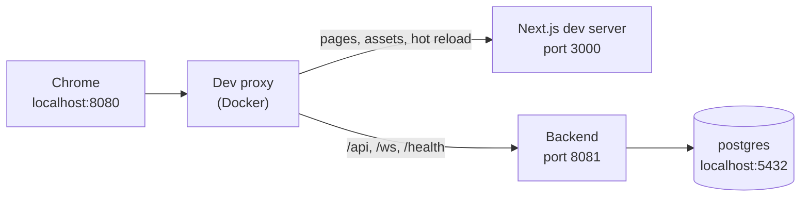

# Delivery Hero — Setup Guide

> Document 18 of 18 · Version 1.0 (approved)

## Document control

| Field | Value |
|---|---|
| Project | Delivery Hero |
| Document | 18 — Technical Documentation: the README and this Setup Guide |
| Version | 1.0 |
| Status | Approved on 24 September 2026 |
| Owner and approver | [Owner name] |
| Date | 24 September 2026 |
| Drafting note | Written before the code scaffold exists. The local stack's Nginx and Compose files were tested as described in section 13; every command is checked against the scaffold in Sprint 0 (OPS-20) and again before release |
| Depends on | 04 — User Stories (EN-01) · 08 — LLD v1.3 · 09 — Software Architecture v1.2 · 11 — API Specification · 13 — Coding Standards and Git Strategy v1.2 · 14 — Test Plan v1.1 · 15 — Test Cases v1.1 · 16 — Deployment Guide v1.0 |
| Feeds into | Onboarding · checks OPS-20 and OPS-22 |

### Revision history

| Version | Date | Author | Summary of changes |
|---|---|---|---|
| 0.1 | 2026-09-24 | [Owner name] | First draft |
| 1.0 | 2026-09-24 | [Owner name] | Approved, with the README. SG-01 to SG-05 recorded as DEC-207 to DEC-211 (Charter v1.14); SG-01 applied to document 13's CI outline (v1.2) |

---

## 1. Purpose

The [README](../README.md) takes someone from a fresh clone to a running game in a few minutes. This guide covers everything after that:

- the tools to install;
- the two ways to run Delivery Hero on your computer;
- working on the backend and the frontend;
- running every kind of test;
- working with the task pool;
- the Git workflow;
- fixing common problems.

## 2. Audience and scope

This guide is for developers joining the project, and for the owner setting up a new computer. It doesn't repeat other documents:

| Topic | Where |
|---|---|
| Production, events and recovery | 16 — Deployment Guide |
| Design | 07 to 12 |
| Rules and conventions | 13 — Coding Standards and Git Strategy |
| Test strategy and procedures | 14 and 15 |

## 3. Definitions

| Term | Meaning |
|---|---|
| Local stack | The whole app in Docker Compose on your computer, built from source: `deploy/docker-compose.local.yml` |
| Dev proxy | A small Nginx container that puts the backend and the Next.js dev server, both running on your computer, behind one address |
| Profile | A named set of Spring settings: `dev`, `test`, `e2e` or `prod` |
| Seed | The task pool file, `seed/delivery-hero-seed.json` |

## 4. Tools

| Tool | Version | Needed for | Check with |
|---|---|---|---|
| Git | Any recent version | Everything | `git --version` |
| Docker Desktop, or Docker Engine with the Compose plugin | Compose v2 | The local stack, backend integration tests and end-to-end tests | `docker compose version` |
| Java (Eclipse Temurin) | 21 | Running or building the backend outside Docker | `java -version` |
| Node.js with npm | 24 LTS | Running or building the frontend outside Docker | `node --version` |
| Python | 3.9 or later | `tools/validate_seed.py` and `tools/ac_coverage.py` | `python3 --version` |
| Chrome | Current | Trying and testing the app; it's the only supported browser | — |
| gitleaks | Optional | The secret scan in the pre-push hook | `gitleaks version` |
| ShellCheck and actionlint | Optional | Checking scripts and workflows before CI does | `shellcheck --version` |
| k6 | Load test only | Procedure LT-01 in document 15 | `k6 version` |

- **Windows:** use WSL 2, and clone the repository inside the Linux file system (for example `~/code`), not under `/mnt/c`. Builds are much faster there, and the repository's line-ending rules work as intended.
- **Apple silicon Macs:** every image is multi-architecture, so the local stack runs natively on Arm, like production.
- **Editors:**
  - IntelliJ IDEA: install the palantir-java-format plugin, so formatting on save matches Spotless.
  - VS Code: install the ESLint, Prettier, Tailwind CSS IntelliSense and EditorConfig extensions, plus the Java extension pack if you work on the backend.
  - The repository's `.editorconfig` sets indentation and line endings for every editor.

## 5. First-time setup

1. Clone the repository, and enable the versioned Git hooks:

   ```bash
   git clone <repository URL> delivery-hero
   cd delivery-hero
   git config core.hooksPath .githooks
   ```

   The pre-push hook checks formatting and linting for the parts you changed, plus secrets if gitleaks is installed. It takes well under a minute. `git push --no-verify` skips it once (DEC-177).

2. Optionally, to work outside Docker, install the dependencies:

   ```bash
   (cd frontend && npm ci)
   (cd backend && ./mvnw -q -DskipTests package)
   ```

3. A shell alias saves typing in the rest of this guide. Add it to your shell profile:

   ```bash
   alias dhc='docker compose -f deploy/docker-compose.local.yml'
   ```

   Every `dhc` command below must run from the repository root. The guide spells the full command out the first time.

## 6. Run the local stack

This is the documented start command in AC-EN01-01. It needs only Docker.

### 6.1 Start

```bash
docker compose -f deploy/docker-compose.local.yml up --build
```

| Service | What it is | Address |
|---|---|---|
| `postgres` | PostgreSQL 18, set up by the same role script as production | `127.0.0.1:5432` |
| `backend` | The Spring Boot app, built from source in Docker, `dev` profile | Only inside the stack |
| `nginx` | The static frontend built from source, behind production's headers and routes | <http://localhost:8080> |

The first build downloads dependencies and takes a few minutes. Later builds reuse the Maven and npm caches.

### 6.2 Load the task pool

```bash
dhc run --rm backend seed /seed/delivery-hero-seed.json
```

The loader validates the whole file first, then imports everything or nothing. A clean import reports 74 tasks, 4 characters and 2 run plans (AC-US56-01). Running it again updates items by key, without duplicating anything (FR-075).

### 6.3 Play a test game

1. Open <http://localhost:8080/admin/>, and sign in with the local-only password `delivery-hero-local`.
2. Create a test game with a few bots from the Quick 3-minute plan.
3. Open the projector link in a second window.
4. Join with the address shown in the lobby, using Chrome's device toolbar with a phone preset, such as Pixel or iPhone.

Chrome treats `http://localhost` as a secure context. The admin session cookie, which is marked Secure, therefore works without HTTPS on your computer.

### 6.4 Everyday use

| Task | Command |
|---|---|
| Rebuild after code changes | `dhc up --build` |
| Rebuild just the backend | `dhc up -d --build backend` |
| Follow the backend's logs | `dhc logs -f backend` |
| Open a database shell | `dhc exec postgres psql -U dh_app -d deliveryhero` |
| Stop | `dhc down` |
| Stop and wipe the database | `dhc down -v`, then load the task pool again |

### 6.5 Settings and local credentials

| Variable | Default | Changes |
|---|---|---|
| `DH_LOCAL_PORT` | `8080` | The site's port on your computer |
| `DH_LOCAL_DB_PORT` | `5432` | The database's port on your computer, if another PostgreSQL uses 5432 |
| `DH_PROFILE` | `dev` | The backend's profile; the end-to-end tests use `e2e` |

For example, `DH_LOCAL_PORT=8090 dhc up --build` serves the site on port 8090.

The local credentials are public on purpose (SG-02):

| Account | Value |
|---|---|
| Admin password | `delivery-hero-local` |
| Database superuser | `postgres` / `local-superuser` |
| Application database role | `dh_app` / `local-app` |

Every port listens on `127.0.0.1` only, so nothing is reachable from your network. Never reuse these values elsewhere. Production can't start without its own `.env` file (document 16, section 8).

## 7. Live-reload development

Rebuilding the local stack takes a minute or two. For quick iterations, run the backend and the Next.js dev server directly on your computer, behind the dev proxy. The proxy keeps everything on one address, as in production, because the API allows no cross-origin requests (document 11).



### 7.1 Start

1. **Start the database and the proxy.** If the local stack's `nginx` is running, stop it first, because both use port 8080.

   ```bash
   dhc --profile devproxy up -d postgres devproxy
   ```

2. **Start the backend** with the `dev` profile, on port 8081:

   ```bash
   cd backend
   SERVER_PORT=8081 ./mvnw spring-boot:run -Dspring-boot.run.profiles=dev
   ```

3. **Start the frontend** in another terminal:

   ```bash
   cd frontend
   npm run dev
   ```

4. **Open** <http://localhost:8080>. Port 3000 on its own has no API behind it.

### 7.2 How it behaves

- Frontend changes reload in the browser at once.
- Backend changes need a restart of step 2, or your IDE's hot swap.
- The content security policy isn't applied in this mode, because the Next.js dev server relies on inline code. The local stack and the end-to-end tests check it.
- The backend's API documentation is at <http://localhost:8081/swagger-ui.html>. It's on only in the `dev` and `test` profiles, and never through Nginx.
- To stop, press Ctrl+C in both terminals, then run `dhc --profile devproxy down`.

### 7.3 On a real phone

On Android, connect the phone by USB with USB debugging on. Open `chrome://inspect` on the computer, turn on port forwarding from port 8080 to `localhost:8080`, and open `http://localhost:8080` on the phone. The phone then treats the site as secure, exactly as your computer does.

For iPhones, use the trial run on production. A local network address wouldn't work, because the stack only listens on `127.0.0.1`, and Chrome doesn't treat such addresses as secure.

## 8. Backend

### 8.1 Where things are

The code is under `backend/src/main/java/app/deliveryhero`, in the packages listed in LLD section 5.1. The heart of the game is `engine`, with `scoring` beside it. Architecture tests enforce the dependency rules between packages (document 13, section 6.4).

### 8.2 Profiles (SG-04)

| Profile | Used by | Notes |
|---|---|---|
| `dev` | The local stack by default, and the backend run from your computer | `application-dev.yml` holds the local-only defaults: the local database, the local admin password hash and `http://localhost:8080` as the public address; API documentation on |
| `test` | Automated tests | Testcontainers provides the database; API documentation on, for the OpenAPI check |
| `e2e` | The local stack in end-to-end tests (`DH_PROFILE=e2e`) | Rounds from 60 seconds, a 10-second freeze and joining window, 10-second practice and a fixed random seed (DEC-197) |
| `prod` | Production | The settings in document 16, section 8.4; secrets only from the environment |

The game settings (`dh.*` keys) are listed in LLD section 5.13. Environment variables override any profile. The local stack, for example, sets the database address with `SPRING_DATASOURCE_URL`.

### 8.3 Database migrations

- **Location and naming:** `backend/src/main/resources/db/migration`, named `V<number>__<description>.sql`. Flyway applies them at startup.
- **Rules:** never edit a migration once it's merged. Each one must work with the previous release's code, so a deploy can roll back safely (document 16, section 10.3).
- **Checks:** every pull request runs all migrations in the integration tests (document 13, section 8.1).
- **Local resets:** if Flyway reports a checksum mismatch because you edited an unmerged migration, reset with `dhc down -v`.

### 8.4 The seed loader

`dhc run --rm backend seed /seed/delivery-hero-seed.json` starts the backend without its web server and imports the file. It refuses to run while a game is in progress, and never cancels one (LLD section 5.10).

### 8.5 Changing the API

A change to any request, response or real-time message updates four things in the same pull request:

1. Document 11.
2. The frontend types in `frontend/src/types`.
3. The fixtures in `contracts/`, which the backend's contract test rewrites and checks.
4. `docs/openapi.json`. The OpenAPI test fails when the generated document differs from the committed one, and writes the generated version to `backend/target/openapi.json`, so you can review the difference and copy it over (SG-05).

### 8.6 Checks that may surprise you

- `./mvnw verify` fails on unformatted code; run `./mvnw spotless:apply` first.
- Error Prone and NullAway (in `engine` and `scoring`) run as part of compiling, so their findings are compile errors.
- Line coverage in `engine` and `scoring` must stay at 80% or more.
- Logs must never contain player names, answers, tokens, keys or the admin password (DEC-104).

## 9. Frontend

### 9.1 Where things are

Pages are in `frontend/app`, and everything else is in `frontend/src` (LLD section 6.1). The main folders:

| Folder | Contents |
|---|---|
| `src/player` | The phone app |
| `src/screen` | The projector |
| `src/admin` | The admin panel |
| `src/ui` | The shared arcade-style components |
| `src/realtime` and `src/time` | The STOMP connection and server-synchronized time |
| `src/copy.ts` | Every string users see |

### 9.2 Commands

| Task | Command |
|---|---|
| Dev server (behind the dev proxy, section 7) | `npm run dev` |
| Production build: `out/` plus `nginx/csp.conf` | `npm run build` |
| Format | `npm run format` (check only: `npm run format:check`) |
| Lint | `npm run lint` |
| Type check | `npm run typecheck` |
| Unit tests | `npm test`, or `npm test -- --coverage` |

### 9.3 Rules that catch people out

Document 13, section 7, has the full list. These catch people most often:

- **Text:** every user-facing string goes in `src/copy.ts`, worded as in document 12's copy deck.
- **Time and network:** `Date.now()` is allowed only in `src/time`, and `fetch` only in `src/api`. The STOMP connection goes through `src/realtime`. Lint enforces all three.
- **Styling:** no `style` prop and no `dangerouslySetInnerHTML`; either would break the content security policy.
- **Colors:** only the color tokens; CI rejects raw hex colors in components.
- **Routes:** use query parameters, such as `/join/?code=K7PQ2M`, because the site is a static export with no dynamic segments.
- **Fonts:** the pixel font is for display text of 16 pixels or larger only.

### 9.4 The content security policy

`npm run build` exports the site to `out/`. A post-build script then writes `nginx/csp.conf`, with a hash of every inline script (LLD section 6.6). The hashes are regenerated on every build, so nothing needs updating by hand. The end-to-end tests fail on any policy violation.

## 10. Tests

### 10.1 Overview

| Level | Command | Needs |
|---|---|---|
| Backend unit and architecture | `cd backend && ./mvnw test` | Java |
| Everything in the backend, including integration, contract, OpenAPI and coverage | `cd backend && ./mvnw verify` | Java and Docker |
| Frontend unit and store tests | `cd frontend && npm test` | Node.js |
| End-to-end and accessibility | Section 10.4 | Docker and Node.js |
| Load | Procedure LT-01 in document 15 | k6, against production |
| Task pool | `python3 tools/validate_seed.py seed/delivery-hero-seed.json` | Python |
| Acceptance criteria coverage | The command in document 15, section 8.3 | Python and the test reports |

### 10.2 Naming

A test for an acceptance criterion starts its display name with the criterion's ID, for example `AC-US28-01 speed bonus: 140 points at 4.0 s` (DEC-195). The coverage report depends on these names.

### 10.3 Integration tests and Docker

The backend's integration tests start PostgreSQL through Testcontainers, so Docker must be running. Docker Desktop works out of the box. With other runtimes, Testcontainers may need `DOCKER_HOST` set (section 12).

### 10.4 End-to-end tests locally

These are the same steps CI runs (document 13, Appendix F).

1. Start the local stack with the `e2e` profile, and load the task pool:

   ```bash
   DH_PROFILE=e2e docker compose -f deploy/docker-compose.local.yml up -d --build --wait
   dhc run --rm backend seed /seed/delivery-hero-seed.json
   ```

2. Run the tests:

   ```bash
   cd frontend
   npx playwright install chromium
   npx playwright test
   ```

   Use `npx playwright test --ui` to watch and debug them.

3. Switch back to the `dev` profile afterward with `dhc up -d backend`.

**How the tests run:**

- Playwright reads `E2E_BASE_URL` (default `http://localhost:8080`) and `E2E_ADMIN_PASSWORD` (default the local password) (SG-05).
- Specs run one at a time, because only one game can be open at a time (DEC-101). Each spec creates the `e2e-mini` plan through the admin API.
- The HTML report is in `frontend/playwright-report`.

### 10.5 Failures that come and go

CI retries a failed end-to-end test once and reports that it needed the retry. Such a test is fixed or quarantined with an issue within one working day (TP-08). When writing real-time tests, wait for messages; never sleep.

### 10.6 Manual and production checks

The manual, accessibility, production and trial-run procedures are in document 15: MAN-01 to MAN-09, A11Y-01 to A11Y-09, OPS-01 to OPS-22 and TRIAL-01 to TRIAL-07.

## 11. The task pool

- **What it is:** the seed file holds the 74 tasks, the four characters and the two run plans. It's the starting content for any empty database.
- **Checking it:** CI runs `tools/validate_seed.py` on every change, and you can run it yourself (section 10.1).
- **Reviewing it:** the content review uses `seed/task-review-sheet.md`, and finishes before the content freeze on Friday 16 October. After the freeze, edits only fix errors.
- **Where to make changes:** once production has its content, change tasks in one place only.
  - Edit in the admin panel for production-only changes.
  - Or edit the seed file through a pull request, then re-import it.
  - Re-importing overwrites panel edits to the same keys.

## 12. Troubleshooting

| Symptom | Likely cause | What to do |
|---|---|---|
| "Port is already allocated" when starting | Something else uses 8080 or 5432, or the dev proxy and local `nginx` are both running | Stop the other process or service, or set `DH_LOCAL_PORT` or `DH_LOCAL_DB_PORT` (section 6.5) |
| The backend never becomes healthy | Startup error, often a failed migration | `dhc logs backend`; for a local-only migration problem, `dhc down -v` |
| Admin sign-in doesn't stick | Opened through an address other than `localhost` | Use `http://localhost:8080`, where Chrome accepts the Secure cookie |
| CSP violations in the console on the local stack | The frontend image is stale | `dhc up -d --build nginx` |
| Integration tests can't find Docker | Docker isn't running, or your runtime needs `DOCKER_HOST` | Start Docker; for Colima, Podman or remote Docker, set `DOCKER_HOST` as its documentation says |
| `./mvnw: Permission denied` | The executable bit was lost | `chmod +x backend/mvnw` |
| Scripts fail with `$'\r': command not found` | Windows line endings from a checkout outside WSL | Clone again inside WSL (section 4) |
| The seed loader refuses to run | A game is between Lobby and Reveal | Finish or cancel it in the admin panel, then run the loader again |
| An end-to-end spec can't create a game | A game from an earlier run is still open | Close or cancel it in the admin panel, or restart the stack |
| The Next.js dev server warns about cross-origin requests | The dev proxy isn't passing the original host | Check that you opened port 8080, not 3000; if the warning stays, add `allowedDevOrigins: ["localhost"]` to `next.config` |

## 13. How the local stack was tested

| File | Test | Result |
|---|---|---|
| `deploy/docker-compose.local.yml` | Validated against the Compose Specification schema; the admin hash checked after Compose's interpolation; profile and port defaults checked | Valid; the hash matches the local password |
| `deploy/local/nginx-local.conf` with the shared routes | Ran Nginx against a stand-in backend and the static export's real layout. Checked pages with and without a trailing slash, nested admin routes, 404s, `/health`, blocked `/api/ops/`, API and WebSocket proxying, headers on every response and the access log | All as intended; production's site was re-tested with the same routes |
| `deploy/local/nginx-devproxy.conf` | Ran Nginx against a stand-in Next.js dev server and backend | Pages and hot-reload WebSocket reach port 3000 with the original host; the API and `/ws` reach port 8081; `/api/ops/` stays blocked |
| Dockerfiles | Reviewed only: Docker isn't available where these were drafted | Built for the first time in Sprint 0 (OPS-20) |

## 14. Traceability

| Source | Where it's met |
|---|---|
| EN-01, AC-EN01-01, OPS-20 | README quick start; section 6; every CI end-to-end run starts the same stack (TC-EN01-01) |
| AC-EN01-02 | Section 8.3; tested by `MigrationIT` (TC-EN01-02) |
| AC-EN01-03, DEC-67 | Section 9.4; the local image serves only static files, and CI's frontend build checks the export (TC-EN01-03) |
| NFR-33, OPS-22 | README accessibility statement |
| DEC-168, R-11 | README credits and licenses |
| DEC-177 | Section 5 |
| DEC-180 | Section 8.5 |
| DEC-195, DEC-196 | Sections 10.2 and 10.1 |
| DEC-197 | Sections 8.2 and 10.4 |
| NFR-24 | README privacy section |

## 15. Decisions proposed in this document

These were approved with this document and are recorded as DEC-207 to DEC-211 in the Charter's decision log.

| ID | Decision | Why |
|---|---|---|
| SG-01 | One local Compose stack, `deploy/docker-compose.local.yml`, builds everything from source. It's both the documented start command and the CI end-to-end stack, which selects the `e2e` profile with `DH_PROFILE=e2e`. It replaces the planned `docker-compose.ci.yml` | One stack to maintain, and end-to-end tests run exactly what developers run |
| SG-02 | Local-only credentials are fixed and public, and every local port listens on `127.0.0.1` only | Zero setup for newcomers, with nothing exposed on the network and no path into production |
| SG-03 | Live-reload development runs the backend (port 8081) and the Next.js dev server (port 3000) on the host, behind an Nginx dev proxy at `http://localhost:8080` | Keeps one origin, as in production, with no CORS and no development-only code |
| SG-04 | Four profiles: `dev` (with public local defaults in `application-dev.yml`), `test`, `e2e` and `prod`. The local stack forces port 8080 with `SERVER_PORT` | A clear home for every setting, and production secrets never in files |
| SG-05 | Test tooling conventions: Playwright reads `E2E_BASE_URL` and `E2E_ADMIN_PASSWORD`, defaulting to the local stack; the OpenAPI test writes the generated document to `backend/target/openapi.json` when it differs | The same tests run locally, in CI and against other environments; API changes are easy to review |

Approval applied SG-01 to document 13's CI outline (v1.2, Appendix F): the end-to-end job sets `DH_PROFILE: e2e`, starts `deploy/docker-compose.local.yml`, and loads the task pool before running Playwright.

## 16. Future considerations

- A development container definition, so a new computer needs only Docker and an editor.
- Generating the frontend's REST types from `docs/openapi.json`, as document 13 suggests if more developers join.
- Refresh this guide and the README at the release (E−2), once the scaffold's commands have been proven.

## 17. Approval

| Role | Name | Decision | Date |
|---|---|---|---|
| Owner and approver | [Owner name] | ☑ Approved | 2026-09-24 |

## Appendix A. Local stack files

| File | Purpose |
|---|---|
| `deploy/docker-compose.local.yml` | The local stack and the optional dev proxy |
| `deploy/local/backend.Dockerfile` | Builds the backend from source, then runs it like production |
| `deploy/local/nginx.Dockerfile` | Builds the static frontend from source, then serves it with production's Nginx settings |
| `deploy/local/nginx-local.conf` | The local site: plain HTTP, with production's headers and shared routes |
| `deploy/local/nginx-devproxy.conf` | The dev proxy's routing to the host's backend and Next.js dev server |
| `deploy/nginx/snippets/routes.conf` | The routes shared by production and the local stack |
| `.dockerignore` | Keeps the build context small, since the local images build from the repository root |

## Appendix B. `deploy/docker-compose.local.yml`

This is a copy of the repository file at this version; if they ever differ, the repository wins.

```yaml
# Local stack for development and the CI end-to-end tests (document 18). Needs only Docker:
#   docker compose -f deploy/docker-compose.local.yml up --build
# The credentials here are local-only and public on purpose (SG-02); production reads its own
# secrets from /opt/delivery-hero/.env (document 16). Ports listen on 127.0.0.1 only.
name: delivery-hero-local

services:
  postgres:
    image: postgres:18
    environment:
      POSTGRES_PASSWORD: local-superuser
      APP_DB_USER: dh_app
      APP_DB_PASSWORD: local-app
    volumes:
      - pgdata:/var/lib/postgresql
      - ./postgres/init:/docker-entrypoint-initdb.d:ro
    ports:
      - "127.0.0.1:${DH_LOCAL_DB_PORT:-5432}:5432"
    healthcheck:
      test: ["CMD-SHELL", "pg_isready -U postgres -d postgres"]
      interval: 5s
      timeout: 5s
      retries: 12

  backend:
    build:
      context: ..
      dockerfile: deploy/local/backend.Dockerfile
    image: delivery-hero-local/backend
    depends_on:
      postgres:
        condition: service_healthy
    environment:
      # dev by default; the CI end-to-end job sets DH_PROFILE=e2e (SG-01, SG-04)
      SPRING_PROFILES_ACTIVE: ${DH_PROFILE:-dev}
      SERVER_PORT: "8080"
      SPRING_DATASOURCE_URL: jdbc:postgresql://postgres:5432/deliveryhero
      SPRING_DATASOURCE_USERNAME: dh_app
      SPRING_DATASOURCE_PASSWORD: local-app
      # bcrypt (cost 12) of the local-only admin password "delivery-hero-local"; $$ is a literal $
      DH_ADMIN_PASSWORD_HASH: "$$2y$$12$$Eo5ChSlpilyNFuM0BzBTLuT9pOLCOz8Ip5APefpdVjfAJpj0PzkCm"
      DH_PUBLIC_BASE_URL: http://localhost:${DH_LOCAL_PORT:-8080}
    volumes:
      - ../seed:/seed:ro
    healthcheck:
      test: ["CMD", "curl", "-fsS", "--max-time", "3", "http://localhost:8080/actuator/health"]
      interval: 5s
      timeout: 5s
      retries: 24
      start_period: 30s

  nginx:
    build:
      context: ..
      dockerfile: deploy/local/nginx.Dockerfile
    image: delivery-hero-local/nginx
    depends_on:
      backend:
        condition: service_healthy
    ports:
      - "127.0.0.1:${DH_LOCAL_PORT:-8080}:80"

  # Live-reload development only (SG-03): start with
  #   docker compose -f deploy/docker-compose.local.yml --profile devproxy up -d postgres devproxy
  devproxy:
    image: nginx:stable
    profiles: ["devproxy"]
    extra_hosts:
      - "host.docker.internal:host-gateway"
    volumes:
      - ./nginx/nginx.conf:/etc/nginx/nginx.conf:ro
      - ./nginx/snippets/proxy.conf:/etc/nginx/snippets/proxy.conf:ro
      - ./local/nginx-devproxy.conf:/etc/nginx/conf.d/default.conf:ro
    ports:
      - "127.0.0.1:${DH_LOCAL_PORT:-8080}:80"

volumes:
  pgdata:
```
