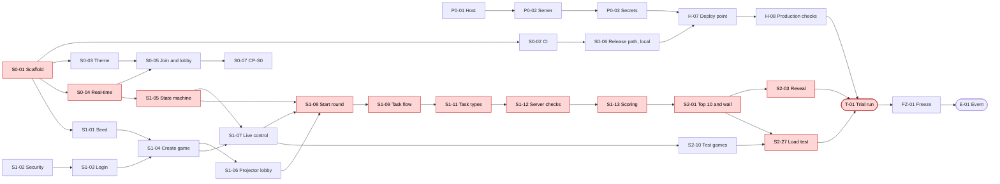

# Master plan

Status: approved by the owner on 2026-09-25 (outline), expanded in step 3 of `/plan-implementation`.

Sources: document 04, sections 7 to 9 (backlog, sprints, checkpoints, build order, dependencies); Charter sections 12 and 16; document 14, sections 10, 11 and 13; document 15, sections 9 to 14; document 16, sections 5 to 11; `research/traceability.md`. Phase IDs and windows follow `CONVENTIONS.md`, section 4.2.

## Timeline

The dates match `CONVENTIONS.md`, section 4.2, so the plan has no phase-date override.

| Phase | Dates | Goal | Points |
|---|---|---|---|
| P0 Owner setup | Thu 24 Sep – Thu 15 Oct (DEC-213), with later owner actions in their own phases | A production host (Q-01 by Mon 12 Oct), the server prepared, secrets and pins in place by Thu 15 Oct | — |
| S0 Walking skeleton | Thu 24 – Tue 29 Sep | A phone joins a game on the local stack and sees the lobby update live (DEC-213) | 18 (18 Must; EN-02 and EN-03 wait for H-07) |
| S1 Core game loop | Wed 30 Sep – Tue 6 Oct | A full round end to end with multiple-choice and yes/no tasks, scoring and host controls, on the seed content | 80 (80 Must) |
| S2 Projector, reveal, admin, operations | Wed 7 – Wed 14 Oct; load test on the local stack Tue 13 Oct (DEC-213) | Must feature complete by Mon 12 Oct; Should stories in build order; load test passed | 114 (49 Must, 65 Should) |
| T Trial run | Mon 19 Oct (E−2, DEC-213) | Trial on production; go/no-go (CP-T); a no-go moves the event (A-01) | — |
| H Hardening | Thu 15 – Mon 19 Oct; content freeze Fri 16 Oct | The deploy point H-07 (Thu 15 – Fri 16 Oct) and the production checks H-08 (Fri 16 – Sun 18 Oct) before the trial; trial fixes; Could stories only if time allows; document 17 | 18 (8 Must, 10 Could) |
| FZ Deployment freeze | Tue 20 Oct | Final regression; `v1.0.0` tag; day-before checklist | — |
| E Event | Wed 21 Oct | Runbook mode; no code changes | — |
| AE After the event | From Thu 22 Oct | Close, privacy check, survey, retrospective (Tue 27 Oct) | — |

## Subplans in build order

`*` marks an ordering not in document 04's section 9 graph (DI-08). Points come from document 04.

### P0 Owner setup

| ID | Title | Stories | Points | Depends on | Target |
|---|---|---|---|---|---|
| P0-01 | Production host and account | none (owner) | — | Q-01; OA-03, OA-04 | Mon 12 Oct |
| P0-02 | Server preparation: instance, firewall, subdomain, Docker, deploy user, logs, jobs, backup storage | none (owner) | — | P0-01; OA-05 to OA-13 | Tue 13 – Wed 14 Oct |
| P0-03 | Secrets and pins: `.env`, admin password hash, image pins, GitHub secrets | none (owner) | — | P0-02, S0-01; OA-14 to OA-17 | Wed 14 Oct |

### S0 Walking skeleton (26 points)

EN-02 and EN-03 sit in H-07, the deploy point, because EN-02 and two of EN-03's three criteria (AC-EN03-02, AC-EN03-03) need a production deploy; S0-06 keeps the local release-path check and OPS-21, and S0-02 builds the CI checks themselves (DEC-213, PC-04).

| ID | Title | Stories | Points | Depends on | Target |
|---|---|---|---|---|---|
| S0-01 | Repository scaffold (`/scaffold-en01`) | EN-01 | 3 | none | Fri 25 Sep |
| S0-02 | CI merge checks and the deploy workflow; actions pinned by SHA; actionlint (DI-22) | none (infrastructure) | — | S0-01; OA-02 | Sat 26 Sep |
| S0-03 | Arcade theme and screen shells | EN-08 | 3 | S0-01 | Sat 26 Sep |
| S0-04 | Real-time channel | EN-04 | 5 | S0-01 | Sat 26 – Sun 27 Sep |
| S0-05 | Join and lobby, with the walking-skeleton end-to-end test | US-01, US-02, US-04 | 7 | S0-03, S0-04 | Mon 28 Sep |
| S0-06 | Release path and merge-gate proof (local): the release-path check, the `.previous` folder proposal (DI-05), OPS-21 | none | — | S0-02 | Tue 29 Sep |
| S0-07 | CP-S0 capacity check, with numbers | none | — | S0-05; Q-03 | Tue 29 Sep |

### S1 Core game loop (80 points)

Ordered so a real game exists early: seed, login and game creation come first, which also completes the walking-skeleton demonstration on the local stack (DEC-213; H-07 repeats it on production).

| ID | Title | Stories | Points | Depends on | Target |
|---|---|---|---|---|---|
| S1-01 | Seed loader and round-length rules | US-56, US-19 | 4 | S0-01 | Wed 30 Sep |
| S1-02 | Security basics: headers, CSP, CSRF, rate limits | EN-06 | 3 | S0-01 | Wed 30 Sep |
| S1-03 | Admin login and attempt limit | US-49, US-50 | 4 | S1-02 | Thu 1 Oct |
| S1-04 | Create a game with its own snapshot | US-59, US-54 | 6 | S1-01, S1-03* | Thu 1 Oct |
| S1-05 | Game state machine and timing | EN-05 | 5 | S0-04; Q-02 | Wed 30 Sep – Thu 1 Oct |
| S1-06 | Projector link and projector lobby | US-37, US-38 | 4 | S1-04 | Fri 2 Oct |
| S1-07 | Live control screen | US-60 | 5 | S1-04, S1-05 | Fri 2 Oct |
| S1-08 | Start the round: countdown, clock sync, projector clock and phase bar | US-13, US-14, US-21 | 8 | S1-05, S1-06, S1-07 | Sat 3 Oct |
| S1-09 | Task flow and task timers | US-15, US-16 | 8 | S1-08 | Sat 3 – Sun 4 Oct |
| S1-10 | Done screen and time's up | US-17, US-18 | 3 | S1-09 | Sun 4 Oct |
| S1-11 | Multiple choice and yes/no swipe | US-22, US-23 | 6 | S1-09 | Sun 4 Oct |
| S1-12 | Answers checked on the server | US-27 | 5 | S1-11 | Mon 5 Oct |
| S1-13 | Points, speed bonus, penalties and lockout | US-28 | 5 | S1-12 | Mon 5 Oct |
| S1-14 | Feedback with reactions, and the total | US-31, US-32 | 4 | S1-13 | Mon 5 Oct |
| S1-15 | Join messages | US-03 | 2 | S1-05 | Tue 6 Oct |
| S1-16 | Rejoin from the same phone | US-05 | 5 | S1-09 | Tue 6 Oct |
| S1-17 | Health check, uptime alert and privacy-safe logs (the production steps in H-08) | US-69, US-70 | 3 | S0-06 | Tue 6 Oct |
| S1-18 | CP-S1 checkpoint | none | — | S1-01 to S1-17 | Tue 6 Oct |

### S2 Projector, reveal, admin and operations (114 points)

Must stories first (49 points), then Should stories in document 04's build order (65 points). One change to that order: US-63 test games moves ahead of the load test, because LT-01, OPS-08 and OPS-09 need a test game (DI-08).

| ID | Title | Stories | Points | Depends on | Target |
|---|---|---|---|---|---|
| S2-01 | Live top 10 and participant wall | US-39, US-40 | 8 | S1-13, S1-06* | Wed 7 Oct |
| S2-02 | Projector reconnects | US-42 | 2 | S2-01 | Wed 7 Oct |
| S2-03 | Reveal and personal result | US-43, US-45, US-46 | 8 | S2-01, S1-07 | Thu 8 Oct |
| S2-04 | Close the event, past games, restart cleanup | US-65, US-64, US-67 | 6 | S1-07 | Thu 8 Oct |
| S2-05 | Deploy lock | US-68 | 2 | S1-04, S0-02; Q-04 | Fri 9 Oct |
| S2-06 | Off-machine backups and restore rehearsal (the production runs in H-08) | US-71 | 3 | S0-06 | Fri 9 Oct |
| S2-07 | Task editor with preview | US-51 | 8 | S1-03 | Fri 9 – Sat 10 Oct |
| S2-08 | Task search and edit conflicts | US-52, US-53 | 4 | S2-07 | Sat 10 Oct |
| S2-09 | Run plan editor | US-57 | 5 | S1-03, S1-01 | Sat 10 Oct |
| S2-10 | Test games with simulated players (moved up) | US-63 | 5 | S1-07 | Sun 11 Oct |
| S2-11 | Code snippets | US-26 | 2 | S1-11 | Sun 11 Oct |
| S2-12 | Tap to order | US-24 | 5 | S1-09 | Sun 11 Oct |
| S2-13 | Tap the problem words | US-25 | 5 | S1-09 | Mon 12 Oct |
| S2-14 | Partial credit | US-29 | 3 | S2-12, S2-13 | Mon 12 Oct |
| S2-15 | Practice round | US-10, US-11 | 4 | S1-07 | Mon 12 Oct |
| S2-16 | Leaderboard freeze | US-36 | 2 | S2-01 | Mon 12 Oct |
| S2-17 | Sev-1 incident | US-33 | 8 | S1-09; Q-02 | Mon 12 Oct |
| S2-18 | Incident on the wall | US-34 | 3 | S2-17, S2-01 | Mon 12 Oct |
| S2-19 | Review screen | US-47 | 3 | S2-03 | Tue 13 Oct |
| S2-20 | Most-missed question | US-44 | 3 | S2-03 | Tue 13 Oct |
| S2-21 | Streak bonus | US-30 | 2 | S1-13; Q-05 | Tue 13 Oct |
| S2-22 | Safari notice, late joining, screen wake lock | US-06, US-08, US-20 | 6 | S1-08 | Tue 13 Oct |
| S2-23 | Readiness check, void and cancel | US-58, US-61, US-62 | 8 | S1-07, S2-09; Q-07 | Tue 13 Oct |
| S2-24 | Character editing, privacy note, auto-close, accessibility checks | US-55, US-07, US-66, EN-09 | 6 | S1-03, S2-04; Q-06 | Tue 13 Oct |
| S2-25 | Content review before the freeze (owner and admins) | none | — | S1-01; OA-23 | Wed 7 Oct |
| S2-26 | Local checks before the trial: an on-demand E2E-06 run (DI-17), the Appendix B accessibility pass, OPS-16 at E−7; the production checks moved to H-08 | none | — | S0-06, S2-06, S2-10 | Thu 8 – Wed 14 Oct |
| S2-27 | Load test day on the local stack: LT-01 (DEC-214; OPS-14, OPS-15 and a production repeat in H-08) | EN-07 | 3 | S2-01, S2-10; OA-25 | Tue 13 Oct |

### T, H, FZ, E and AE

| ID | Title | Stories | Points | Depends on | Target |
|---|---|---|---|---|---|
| T-01 | Trial run and go/no-go: TRIAL-01 to TRIAL-07, test summary report, CP-T | none | — | S2-27, S2-26, S2-25, H-07, H-08; OA-24 | Mon 19 Oct |
| H-01 | Trial-run fixes (split into defect subplans at CP-T) | none | — | T-01 | Mon 19 Oct |
| H-02 | Rename or remove a player; practice progress | US-09, US-12 | 3 | T-01, S2-15 | Thu 15 Oct |
| H-03 | Final-stretch visuals and live feed | US-35, US-41 | 4 | T-01, S2-01 | Fri 16 Oct |
| H-04 | Hero card | US-48 | 3 | T-01, S2-03 | Fri 16 Oct |
| H-05 | Content freeze, document 17 and player instructions (owner approval needed: changes docs/) | none | — | OA-26 | Fri 16 – Mon 19 Oct |
| H-06 | No-go: move the event (A-01); no re-check (DEC-215) | none | — | T-01 | Mon 19 Oct |
| H-07 | Deploy point: first production deploy, certificate, seed, OPS-01 to OPS-05, OPS-17, OPS-18, the walking skeleton on production (DEC-213) | EN-02, EN-03 | 8 | S0-06, P0-02, P0-03; Q-01; OA-18 to OA-21 | Thu 15 – Fri 16 Oct |
| H-08 | Production checks: OPS-06 to OPS-15, OPS-19, MAN and A11Y on production, the production regression, a 100-player load-test repeat (DEC-213) | none | — | H-07, S2-06, S2-26, S2-27; Q-01; OA-11 to OA-13, OA-22 | Fri 16 – Sun 18 Oct |
| FZ-01 | Final regression, OPS-16, OPS-19, OPS-20, OPS-22, `v1.0.0` tag, day-before checklist | none | — | H-01, H-05 | Tue 20 Oct |
| E-01 | Event-day runbook | none | — | FZ-01 | Wed 21 Oct |
| AE-01 | Close the event, OPS-13, backup check, survey (OA-27), retrospective, final ledger | none | — | E-01 | Thu 22 – Tue 27 Oct |

## Totals

- 65 subplans: 3 P0, 7 S0, 18 S1, 27 S2, 1 T, 6 H, 1 FZ, 1 E, 1 AE (checked by script).
- Every story in document 04 appears once: 80 stories, 230 points.

## Capacity note

S0 has three working days left (Fri 25, Mon 28, Tue 29 Sep) plus the weekend, for 26 points. S1 plans 80 points in five working days. The end-of-S0 check (DI-07, Q-03) will almost certainly call for cutting Should and Could stories. The cut order is document 04, section 8: Could first, then Should from the bottom of the build order.

## Dependency graph and critical path

The critical path follows document 04, section 9: scaffold, real-time channel, state machine, task flow, task types, scoring, projector and reveal, and the load test, to the trial run. Its subplans are highlighted. Game creation (S1-01, S1-03, S1-04, S1-07) joins it at the start of the round (S1-08).

## Capacity and checkpoints

The rules come from document 04, section 8; the evaluations go into `checkpoints.md`.

| Checkpoint | When | Rule | Subplan |
|---|---|---|---|
| CP-S0 | Tue 29 Sep | Points finished in S0, divided by its working days, times the working days left before the trial (13, to Mon 19 Oct; DEC-213). If that's below the open Must points, cut every Should and Could story and review the event date (A-01@01). How velocity is counted is Q-03 (DI-07) | S0-07 |
| CP-S1 | Tue 6 Oct | If any S1 Must story is unfinished, drop every Could story, work down the cut order, and consider moving the event date | S1-18 |
| CP-T | Mon 19 Oct | Go/no-go on the nine criteria of document 14, section 11 (DEC-191); a no-go moves the event (A-01, PC-06) | T-01 |

## Cut order

From document 04, section 8. Could stories go first (H-02, H-03, H-04), then Should stories from the bottom of this list:

| Order | Stories | Subplan |
|---|---|---|
| 1 | US-26 | S2-11 |
| 2 | US-24, US-25, US-29 (if cut, remove those tasks from the run plans) | S2-12, S2-13, S2-14 |
| 3 | US-10, US-11 | S2-15 |
| 4 | US-36 | S2-16 |
| 5 | US-33, US-34 | S2-17, S2-18 |
| 6 | US-47 | S2-19 |
| 7 | US-44 | S2-20 |
| 8 | US-30 | S2-21 |
| 9 | US-63 (built ahead of the load test, but cut in this position; without it, LT-01, OPS-08 and OPS-09 need another way to create a test game) | S2-10 |
| 10 | US-06, US-08, US-20 | S2-22 |
| 11 | US-58, US-61, US-62 | S2-23 |
| 12 | US-55, US-07, US-66, EN-09 | S2-24 |

## Parallel work

Subplans marked parallel-safe can run in separate sessions, each in its own Git worktree, on its own branch. `STATUS.md` conflicts are fixed by rerunning `/progress`.

| Window | Can run side by side |
|---|---|
| S0 after S0-01 | S0-02 (CI), S0-03 (theme), S0-04 (real-time) |
| S1 start | S1-01 (seed), S1-02 (security), S1-05 (state machine) |
| S1 middle | S1-06 (projector lobby) and S1-07 (live control); S1-15 (join messages) beside the task flow |
| S2 | the admin track (S2-07, S2-08, S2-09) beside the projector track (S2-01, S2-02, S2-03); S2-06 (backups) and S2-25 (content review) beside anything |

## Quality gates

From document 14, sections 10 and 13, and document 13, section 10.

| Phase | Gate |
|---|---|
| Every story | The Definition of Done (document 13, section 10): merge checks green, every criterion passing, deployed and smoke-checked, documents updated |
| S0 | CI checks live; first unit tests; the walking-skeleton end-to-end test on the local stack; OPS-01 to OPS-05 at H-07 (DEC-213) |
| S1 | Engine, scoring, content and security tests; contract fixtures; the golden path for multiple choice and yes/no |
| S2 | Projector, reveal and admin end-to-end tests; accessibility scans and the manual checklist; full regression on the local stack Mon 12 Oct; the load test on the local stack Tue 13 Oct; restore, security and the production load repeat in H-08 (DEC-213) |
| Load test entry (Tue 13 Oct) | Must stories complete (Mon 12 Oct); deployed; no open Sev-1 |
| Trial run entry (Mon 19 Oct) | H-07 and H-08 done; load test passed; production checks done; task review complete; manual accessibility checklist done; no open Sev-1 |
| Release (Tue 20 Oct) | A go decision; every change since the trial passed CI and a production smoke test; final regression passed; no open Sev-1 or Sev-2; `v1.0.0` tagged |

## Risks and the subplans that mitigate them

| Risk | Mitigation in the plan |
|---|---|
| R-01 Schedule | CP-S0 (S0-07) and CP-S1 (S1-18) with the cut order; Must stories first in every phase |
| R-02 Oracle machine and sign-up | P0-01 (Q-01: no host yet, DI-04); uptime alert (S1-17, H-08); backups off the machine (S2-06) |
| R-03 Crash mid-round | Load test (S2-27); trial (T-01); deploy lock (S2-05); health checks (S1-17) |
| R-04 Copying answers | Host reminder at the start (E-01) |
| R-05 Shared admin password | Rate-limited login over HTTPS, bcrypt hash (S1-03, P0-03) |
| R-06 iPhone players in Safari | Chrome notice with copy link (S2-22); player instructions (H-05, OA-26) |
| R-07 Company network blocks the subdomain | Checked in the trial (T-01); phone hotspot fallback |
| R-08 Weak mobile signal | Reconnection (S1-16); checked in the trial (T-01) |
| R-09 No staging, production late (DEC-213, High) | Local stack mirrors production (S0-01); every test runs there until H-07; the deploy point H-07 and the production checks H-08 before the trial |
| R-10 Debatable task answers | Content review (S2-25); readiness check and void (S2-23) |
| R-11 Pixel-art license | License checked and credited in the README (S0-03) |

## Owner actions by date

From `owner-actions.md`; each row names the subplans it unblocks.

| Due | Owner actions | For |
|---|---|---|
| Fri 25 Sep | OA-01, OA-02 (done) | P0-01 |
| Sun 27 Sep | OA-28 Deploy workflow disabled (done) | DEC-213 |
| Mon 12 Oct | OA-03, OA-04 (Blocked: Q-01) | P0-01 |
| Tue 13 Oct | OA-05 to OA-12 | P0-02 |
| Wed 14 Oct | OA-13 to OA-17 | P0-02, P0-03 |
| Thu 15 Oct | OA-18 to OA-20 | H-07 |
| Fri 16 Oct | OA-21; OA-22 uptime monitor | H-07, H-08 |
| Wed 7 Oct | OA-23 content review | S2-25 |
| Sun 11 Oct | OA-24 trial invitations | T-01 |
| Tue 13 Oct | OA-25 load generator | S2-27 |
| Mon 19 Oct | OA-26 player instructions | H-05 |
| Thu 22 Oct | OA-27 survey | AE-01 |

The owner decisions Q-01 to Q-07 (`open-questions.md`) come due between Tue 29 Sep and Mon 12 Oct (Q-01, the host, by Mon 12 Oct: DEC-213); `/dh` raises each before the subplan that waits on it.

## Working with Claude Code

`planning/README.md` describes the `/dh` loop; this plan adds:

- **Session loop.** Start every session with `/dh`. It picks the next eligible subplan (`next.py`), loads only that subplan's "Context to load" sections and proposes a session plan for approval. It then works task by task with `/story`'s conventions (failing tests first, named with criterion IDs; `/check`; the reviewers), and finishes with `/pr` and `/progress`.
- **Context hygiene.** One subplan per session, with `/clear` between subplans. Anything worth keeping goes into the subplan's progress log, not the conversation.
- **Parallel sessions** in separate worktrees for the windows above.
- **Plan mode** for subplans that touch the engine, scoring, security or deployment: S0-04, S0-06, S1-02, S1-03, S1-05, S1-08, S1-09, S1-12, S1-13, S2-03, S2-05, S2-06, S2-17.
- **Owner actions early.** `/dh` lists the owner actions for the coming phase before it starts, so nothing waits on the owner.
- **Doc issues.** Where a doc issue or open question would block a subplan, `/dh` brings it to the owner with a proposed fix before that subplan starts.
