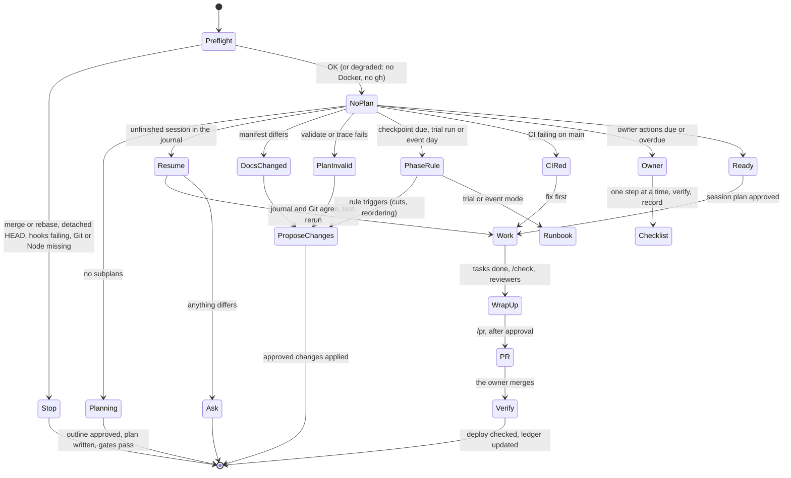

# The Delivery Hero workflow

From today to the event and beyond, one command drives the project: **`/dh`**. This page explains what it does and when. Formats live in [`CONVENTIONS.md`](CONVENTIONS.md), and `phase.py` holds the same phase model as the table below.

## 1. What `/dh` does each time

`state.py` checks nine states in order. The first that applies decides what happens.

In words:

1. Preflight problem.
2. No plan.
3. Unfinished session.
4. Documents changed.
5. Plan invalid or with gaps.
6. Phase rule or checkpoint applies.
7. CI red on `main`.
8. Owner actions due.
9. Ready.

`/dh status` only reports; `/dh plan`, `resume`, `test`, `coverage`, `owner`, `release`, `event`, `retro` or a subplan ID go straight to that part.

## 2. Phases

| Phase | Dates | What `/dh` does | Exit gate |
|---|---|---|---|
| P0 Owner setup | From Thu 24 Sep, due before the Sprint 0 deploy (Tue 29 Sep) | Owner-checklist mode for document 16, sections 5 to 9: Oracle account, Pay As You Go and the budget, instance and firewall, DuckDNS, server preparation, backups, `.env`, the admin password hash, image pinning, GitHub secrets. One step at a time; checks DNS, `/health` and the certificate from here; records results in `owner-actions.md` | Every Sprint 0 owner action Done |
| S0 Walking skeleton | Thu 24 – Tue 29 Sep | `/scaffold-en01`, then the S0 subplans (EN-02, EN-03, EN-04, EN-08, US-01, US-02, US-04), the first deploy, the certificate, loading the seed, OPS-01 to OPS-05 | The walking skeleton demonstrated; CP-S0 capacity check evaluated with numbers |
| S1 Build | Wed 30 Sep – Tue 6 Oct | The story loop (section 3) | CP-S1: every S1 Must story Done |
| S2 Build | Wed 7 – Tue 13 Oct (the load test on its last day) | The story loop; task review by Wed 7 Oct; restore rehearsal and Must feature complete by Mon 12 Oct; A11Y and MAN checks | The sprint's Must points Done; the load test's entry criteria met |
| Load test | Tue 13 Oct | LT-01 from the temporary second Arm instance (owner-assisted); OPS-14, OPS-15 | Two 100-player runs meet every threshold; memory returns to baseline (document 14, section 10) |
| T Trial run | Wed 14 Oct | The trial script and TRIAL-01 to TRIAL-07 as an owner checklist; defects triaged by severity into fix subplans | A go/no-go draft (CP-T) |
| H Hardening | Thu 15 – Mon 19 Oct | Defect fixes only; content freeze from Fri 16 Oct; MAN and A11Y checks; document 17 with owner approval; the go/no-go re-check on Mon 19 Oct after a no-go | Every go/no-go criterion met, or the owner's explicit decision |
| FZ Deployment freeze | Tue 20 Oct | Only event-stopping fixes through a pull request with green CI; final regression; `v1.0.0` tag (push only with approval); the day-before checklist (document 16, section 11.1) | The checklist complete |
| E Event | Wed 21 Oct | Runbook mode: on-the-day checklist, timings, troubleshooting and recovery (document 16, sections 11 to 14). No code changes | The game completed |
| AE After the event | From Thu 22 Oct | Close the game, OPS-13, backup check, survey, `retrospective.md`, the ledger's final statuses, `after-v1.md` | The plan archived |

Freezes: content from Fri 16 Oct (task edits only fix errors); deployment from Tue 20 Oct (merges only for event-stopping problems). Checkpoints: CP-S0 (Tue 29 Sep), CP-S1 (Tue 6 Oct), CP-T (Wed 14 Oct), CP-H (Mon 19 Oct, only after a no-go). Try any date: `DH_TODAY=2026-10-20 node planning/scripts/run.mjs phase`.

## 3. The story loop

1. **Claim:** `/dh` picks the next eligible subplan (`next.py`), claims it and opens the journal.
2. **Approve:** you approve the session plan: tasks, tests, branch and checks.
3. **Work, task by task,** without asking per task:
   - failing tests first, named with criterion IDs;
   - the smallest implementation;
   - `/check`;
   - a commit.

   After 3 failed attempts on one test, the task is marked Blocked with evidence, and `/dh` asks you.
4. **Wrap up:**
   - `/e2e` when due, then the reviewers;
   - the subplan and ledger statuses, and `status.py`;
   - the journal history, and a commit;
   - an offer to run `/pr`, which asks before pushing.
5. **Verify the deploy.** You merge. Then `/dh` reads the deploy run (0 deployed, 1 rolled back, 75 blocked by a game in progress), checks `/health` on your domain, and marks the work Verified in production.

## 4. Approval points

`/dh` always stops for you before:

- the plan outline;
- each session plan;
- plan changes, ledger classifications and cuts;
- any change to `docs/`;
- discarding work;
- pushes, tag pushes, creating pull requests, and anything destructive.

Merging is always yours, because a merge deploys.

## 5. After an interruption

A crash, a closed terminal, a rate limit, `/clear` or compaction loses at most the task in progress:

1. The session-start hook prints the unfinished session: subplan, task and next action.
2. `/dh` compares the journal with Git (branch, last commit, uncommitted files), reruns the last or failing test, and continues. If anything differs, it asks. It never discards work without your approval.

## 6. If you're unavailable

Nothing merges, deploys or changes `docs/` without you, so the project simply waits. When you're back, `/dh` shows what's overdue (owner actions, checkpoints, milestones) with the numbers, and proposes how to catch up, including cuts from document 04's cut order.

## 7. Where everything lives

| What | Where |
|---|---|
| This workflow, the formats | `WORKFLOW.md`, `CONVENTIONS.md` |
| The plan and progress | `00-master-plan.md`, `subplans/`, `STATUS.md` |
| Is anything missing? | `COVERAGE.md`, `coverage-overrides.md` |
| Your checklist | `owner-actions.md` (`/dh owner`) |
| Production details and tools | `environment.md` |
| Check results, checkpoints, plan changes | `check-results.md`, `checkpoints.md`, `plan-changes.md` |
| The journal | `journal/CURRENT.md`, `journal/history.md` |
| After the event | `retrospective.md`, `after-v1.md` |
| Scripts | `scripts/` (`node planning/scripts/run.mjs <script>`) |
| Claude Code machinery | `.claude/` (skills, subagents, rules, hooks, settings) |
